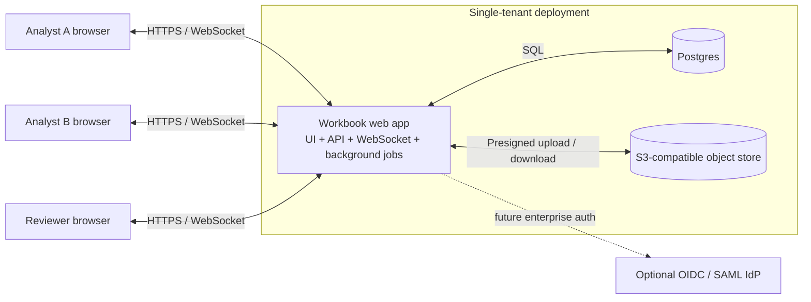
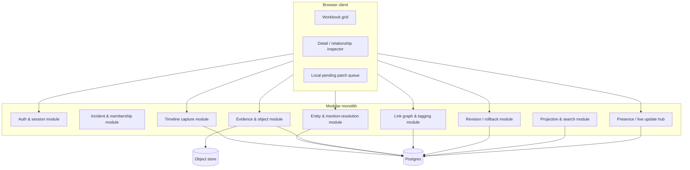
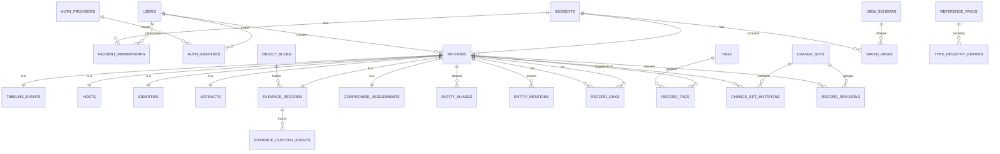
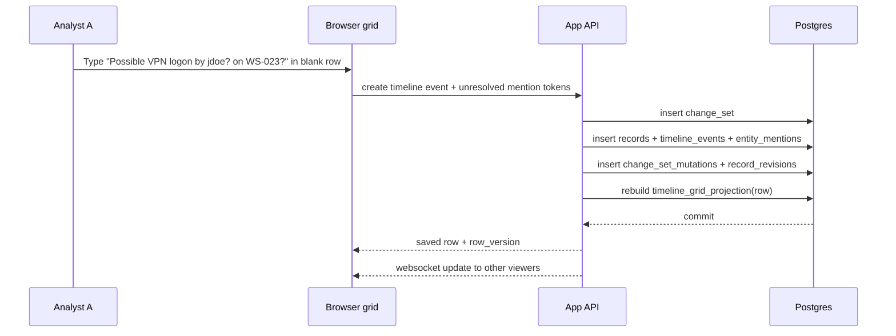
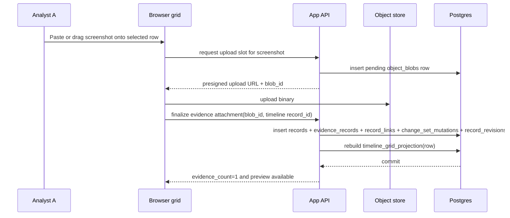
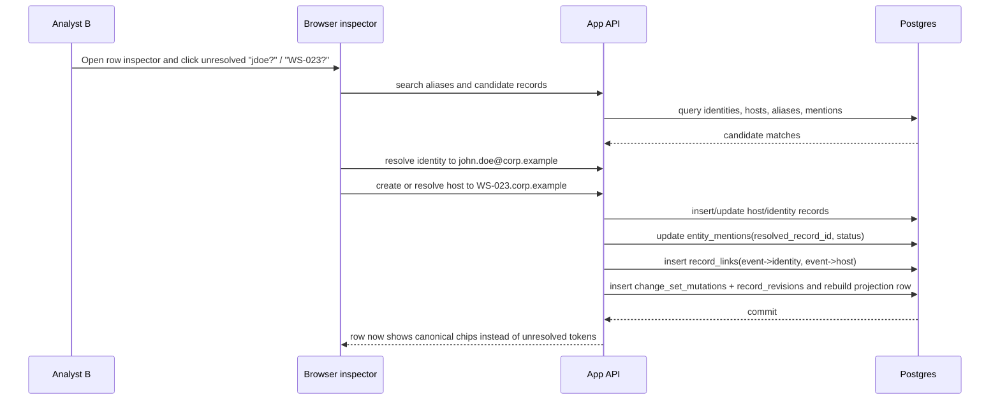
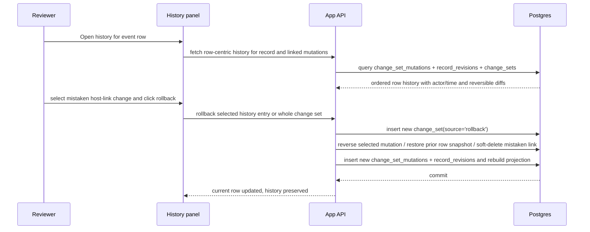

# Exploratory Design Document: Replacing the Incident-Response “Spreadsheet of Doom” (SOD)

This is an exploratory design artifact. Refinements should be incorporated cleanly without hardening the document until the design is locked in.

## 1. Executive summary

I recommend a **modular monolith**: a browser-based workbook UI backed by **Postgres as the source of truth** and **S3-compatible object storage** for binary evidence, packaged for three-container deployment in the smallest useful form. The core design thesis is that the spreadsheet metaphor should survive **at the view layer**, not at the storage layer: analysts work in sheet-like grids, while the system stores normalized records, typed relationships, revisions, versioned reference packs, and evidence metadata underneath. Built-in sheets should remain intentionally few, with additional tabs expressed as saved or system views over the same projections rather than new storage silos. The key mechanism is **capture first, structure later**: a timeline row can be created with partial facts and unresolved host/account strings, and those rough tokens are preserved as first-class records until another analyst resolves them into canonical hosts and identities. That preserves the low-friction spreadsheet feel without collapsing into an uncontrolled spreadsheet. The system justifies replacing Excel by adding capabilities spreadsheets handle badly: **explicit links across events/entities/evidence, reliable search/correlation, attributed edits, revision history, rollback, binary evidence attachment, and self-contained report/export snapshots**. Reports and presentation artifacts should be generated from immutable incident snapshots using the same canonical derivation layer as operator-facing views, so UI and export do not drift. If the product cannot get within one interaction of Excel for creating and editing rows, it will fail regardless of how good the schema is.

## 2. Problem framing

The SOD exists because it is operationally honest. Excel does four things extremely well in an M365 incident response workflow: it is familiar, it is instantly shareable, it tolerates incomplete information, and it lets analysts type directly into cells with almost no ceremony. That is not a cosmetic advantage; during active IR, it is the difference between capturing a fact now and intending to capture it later.

Replacing it is hard because most purpose-built systems optimize for structure before speed. They assume records should be created through forms, validation should happen up front, and relationships should be explicit at entry time. That is exactly backwards for live investigations, where the first useful version of a fact is often messy: “probably jdoe on WS-023 via VPN; screenshot attached; time maybe 09:14.” A good replacement must preserve that immediacy while adding structure later.

The primary jobs-to-be-done are different by role:

- **Front-line analysts** need to capture observations fast, paste blocks of data, attach screenshots/files, and keep working when facts are incomplete or uncertain.
- **Incident commanders / leads** need shared visibility, common views, rapid filtering, a trustworthy timeline, and awareness of what has or has not been normalized.
- **Reviewers / report writers** need lineage, edit attribution, stable references, evidence retrieval, and the ability to inspect or revert mistaken changes.

Low-friction capture is the make-or-break requirement because IR work is lossy under stress. If an analyst has to leave the grid, open a form, satisfy validation, or decide where a fact “belongs” before typing it, the system is already worse than the workbook it is trying to replace.

## 3. Design principles and assumptions

### Assumptions

- A single incident workspace usually has **2–8 active users**, occasionally up to **25**.
- A serious incident may accumulate **1k–20k timeline rows**, **hundreds to low thousands** of host/identity records, and **tens of GB** of evidence.
- Deployments are **single-tenant** initially.
- “Disconnected” means the deployment can run in an isolated environment; it does **not** imply fully offline browser sync or multi-master replication.
- The default client is a **browser UI**, not a desktop app.
- The system must support **rough capture first** and **progressive normalization** without losing original user-entered text.
- Binary evidence may be large; it should not be stored inline in Postgres.
- Optional reference packs such as framework mappings, type registries, and enrichment datasets may be present or absent by deployment; the core workbook must remain usable without them.
- Report and presentation exports may need to run in disconnected environments and therefore cannot require remote runtime assets.

### Design principles

1. **Grid first, forms second.**\
   The primary interaction model is a workbook-like grid with inline editing, keyboard navigation, and paste. Forms belong in a side inspector for enrichment, not as the default path.

1. **Capture first, structure later.**\
   Rough rows, unresolved host/account strings, uncertain timestamps, and ad hoc notes are valid first-class records. The system must preserve raw input and support later normalization.

1. **Collaborative editing with attribution by default.**\
   Every mutation must be tied to an authenticated user and written with revision history. Collaboration cannot assume single-user ownership of a row.

1. **Preserve context during live investigations.**\
   Common actions—create row, attach screenshot, link host, inspect history—must happen without forcing the analyst into full-page navigation or modal-heavy flows.

1. **Operational simplicity beats architectural purity.**\
   Put the complexity in the data model and UI behavior, not in distributed infrastructure. Prefer a modular monolith over microservices.

1. **Views may be denormalized; source data may not be sloppy.**\
   Spreadsheet-style sheets should be projections over disciplined source tables, not the source of truth themselves.

1. **Few first-class sheets, many saved/system views.**
   The workbook should expose a small set of core tabs and treat indicator, assessment, and framework overlays as contract-backed views until usage justifies promotion.

1. **Reference packs and enrichment are optional overlays.**
   Framework mappings, type registries, and other enrichment datasets must be versioned separately from incident data and cannot sit on the hot capture path.

1. **Behavior follows explicit contracts, not labels.**
   View semantics, computed columns, and write-back rules must be keyed by stable identifiers such as `view_schema_id`, not by visible tab names, column headers, or UI control names.

1. **One canonical derivation layer feeds every derived surface.**
   Visualizations, report sections, framework rollups, and exports should reuse the same extraction/query logic so filters and counts do not drift between UI and output.

## 4. Recommended architecture

### Primary recommendation

Use a **single web application container** (UI + API + WebSocket hub + background jobs) with **Postgres** and **S3-compatible object storage** as separate services. This is a modular monolith, not a distributed platform.

### System context diagram



### Container/component diagram



### Major components

| Component                   | Concrete responsibility                                                                                |
| --------------------------- | ------------------------------------------------------------------------------------------------------ |
| Browser client              | Virtualized grid, keyboard navigation, paste handling, inspector, evidence preview, presence UI        |
| Auth module                 | Local accounts, sessions, MFA, provider mapping for future OIDC/SAML                                   |
| Timeline module             | Rapid row creation, inline edits, rough capture storage                                                |
| Entity module               | Host/identity records, aliases, unresolved mentions, resolution workflows                              |
| Evidence module             | Evidence lifecycle, upload finalization, object metadata, previews, linking evidence to records        |
| Link graph & tagging        | Typed relationships and lightweight labels                                                             |
| Revision module             | Change sets, mutation-entry history, row-centric revisions, rollback                                   |
| Projection & search         | Build `*_grid_projection` tables and search vectors for sheet-like views                               |
| Reference data module       | Reference-pack manifests, type/icon registries, framework mappings, integrity verification             |
| Reporting & snapshot module | Immutable incident snapshots, canonical export-model generation, self-contained report/render pipeline |
| Collaboration hub           | WebSocket presence and live row updates                                                                |

### Preferred architecture pattern

A **modular monolith** is the right fit. This problem’s complexity is in mutation semantics, projections, and UX; microservices would add operational and debugging cost without helping the hardest problem. A single codebase with clear module boundaries is easier to deploy in a flyaway kit, easier to reason about during incident work, and easier to ship with deterministic versions.

### Module boundaries

I would define internal module boundaries as:

- `auth`
- `incidents`
- `timeline`
- `entities`
- `evidence`
- `links`
- `revisions`
- `projections`
- `reference_data`
- `reporting`
- `collaboration`

These are internal packages/modules with explicit service interfaces, not separate deployables.

### Storage choices

- **Postgres** stores all structured records, metadata, links, revisions, tags, saved views, projections, reference-pack manifests, and snapshot metadata.
- **S3-compatible object storage** stores binary evidence and optional rendered export artifacts. In flyaway/on-prem, use **MinIO**. In cloud, use native S3/GCS/Azure Blob behind the same abstraction.
- **Reference packs** such as ATT&CK/D3FEND/VERIS mappings, host/evidence type registries, and other optional vocabularies version separately from incident records. Their manifests and integrity metadata belong in Postgres; pack payloads may live on local disk or object storage behind the same abstraction.
- Do **not** store large binary evidence in Postgres. It bloats backups, complicates restore times, and makes portability worse.

### Reference packs, type registries, and view contracts

- Incident records, evidence envelopes, revisions, saved views, and report snapshots are **incident data**.
- Framework mappings, type/icon registries, evidence vocabularies, and optional enrichment datasets are **reference packs** that version independently of incidents.
- Each built-in sheet or system view is declared by a **`view_schema`** contract that names the source record types, computed columns, required reference packs, default sort key, filter semantics, and write-back rules.
- The core workbook must remain usable when optional reference packs are absent. Missing packs may disable overlays or show degraded labels, but they must not block capture or editing.
- Pack activation and updates must verify checksum and, when available, signature or trusted-source metadata before use.

### Backup, restore, portability, failure modes

- **Backups**: Postgres base backup + WAL archiving; object-store bucket snapshot/versioning.
- **Restore**: restore Postgres, restore blob store, then rebuild projection tables. Projection tables are disposable caches.
- **Portability**: export/import of a whole incident should be possible as a manifest + NDJSON/CSV + referenced blobs archive.
- **Failure modes**:
  - App container down: sessions drop, no data loss.
  - Postgres down: system unavailable.
  - Object store down: rows remain editable, but evidence upload/download fails.
  - Projection corruption: rebuild from source tables; source of truth remains intact.

### Projections for grid-like views

Do **not** use Postgres materialized views for hot workbook screens. Their refresh semantics are too coarse for row-by-row collaborative editing. Use **projection tables** such as:

- `timeline_grid_projection`
- `host_grid_projection`
- `identity_grid_projection`
- `artifact_grid_projection`
- `evidence_grid_projection`
- `indicator_grid_projection` (artifact-backed in MVP, dedicated source later if promoted)

Each projection table is **one row per primary record**, denormalized for sheet use. The app updates affected projection rows in the same transaction as the source write. Every projection row exposed to the client must carry the stable `record_id` and `row_version` used for optimistic writes; the client must not infer identity from row position or displayed values. If needed, a rebuild command can regenerate the projections.

### Report and presentation export direction

Reports and presentation artifacts should be treated as a **subsystem**, not as direct ad hoc reads from live workbook tables. The system should capture a `snapshot_at`, materialize a canonical export model such as `incident_report_model.json`, and render derivative outputs like Markdown reports, Mermaid diagram sources, Slidev decks, and HTML reports from that immutable view.

UI visualizations, report sections, framework rollups, and future exports should consume the same canonical derivation/query layer or an explicitly versioned snapshot of it. That keeps filtering, counts, and inclusion semantics consistent across interactive and exported surfaces, provides stable exported identifiers and ordering, and creates a clean place to apply redaction rules. It also leaves room for operator-facing reenactment surfaces, such as Asciinema-style terminal walkthroughs generated from selected command-line evidence, while maintaining a clear distinction between source evidence and generated presentation material.

Generated report artifacts must be **self-contained**: they cannot depend on remote JS, CSS, or font assets at render time. Report builds, snapshot generation, and heavy presentation rendering should run as background jobs so live grid editing remains responsive.

### Long-running operations and background jobs

Lookups, imports, reference-pack refreshes, snapshot generation, report builds, and evidence processing should run as background jobs with progress, cancellation, retry-safe status, and non-blocking UI behavior. Grid editing and row creation must remain responsive while those jobs run.

## 5. Collaboration and consistency model

The right model is **field-level optimistic concurrency on top of row versioning**, with **presence indicators** and **no hard locks for routine editing**.

### Specific strategy

- Every visible grid row is bound to the `record_id` and `row_version` emitted by its projection row.
- The client never addresses a row by visible index, sort position, or displayed cell values.
- Every mutable record has a `row_version`.
- Every grid write includes `record_id`, the client’s `base_row_version`, and changed fields only.
- If the current row version matches, the patch applies normally.
- If another user changed the row:
  - **different field**: the server auto-rebases and accepts;
  - **same field**: the server rejects with a conflict payload that preserves the field key, the client-submitted value, the persisted server value, the client `base_row_version`, and the current `row_version`; the field MUST remain unresolved until the analyst explicitly chooses a resolution.

### What users experience

- **Autosave** on Enter, Tab, blur, or paste completion. No explicit Save button.
- **Unsaved state** shown in a small status area: `Syncing`, `Saved`, or `Conflict`.
- **Presence indicators**:
  - avatars in the workbook header for users on the same sheet;
  - row-gutter badges when someone is focused on a row;
  - cell-level indicator when another analyst is actively editing the same field.
- **Recovery**: pending patches are held in a small local queue so a transient network interruption does not lose a typed row.

### Where record locks are used

Routine inline edits should not lock anything. Short-lived server-side record locks are appropriate only for rare destructive operations such as:

- merge two host or identity records,
- rollback an existing change,
- restore a soft-deleted record.

### How this differs from spreadsheets and CRUD apps

- Unlike spreadsheets, same-cell collisions do **not** silently overwrite without attribution.
- Unlike form CRUD apps, there is no “open form / edit mode / save form” sequence for normal work.
- The system is collaborative like a spreadsheet, but mutation semantics are record-aware and auditable.

### What is easy, eventual, and conflict-prone

- **Easy and immediate**: append rows, edit scalar fields, add tags, attach evidence, create unresolved mentions, link existing entities.
- **Eventual but acceptable**: duplicate suggestions, merge recommendations, and heavier derived analytics.
- **Where conflicts occur**: same field edited concurrently, same unresolved mention resolved differently, or simultaneous merge/rollback operations.

## 6. Domain model and schema strategy

The domain model should separate **raw capture** from **canonical entities**, and it should also separate **incident data** from optional **reference packs** and derived overlays. Incident records, evidence envelopes, links, revisions, and snapshots travel with the case; view schemas, type/icon registries, and framework mappings version independently. The model should still leave room to promote indicators, compromise assessments, and analyst-work tracking into more explicit record types if those workflows prove central.

### Core objects

- **Incident**: the workspace boundary.
- **Record envelope**: common identity, version, attribution, delete state.
- **Timeline event**: the primary capture unit.
- **Host**: a canonical or stub device/host record.
- **Identity**: a canonical or stub account/persona record.
- **Artifact**: structured text object such as note, query, excerpt, export, and possibly simple indicator/IOC capture in an MVP.
- **Evidence record**: user-facing evidence envelope that may later link to a blob.
- **Object blob**: storage metadata for binary content.
- **Entity mention**: rough textual reference captured before canonical resolution.
- **Compromise assessment**: incident-scoped assessment record about a host or identity.
- **Record link**: typed relationship between two records.
- **Tag**: lightweight label.
- **Reference pack**: versioned optional vocabulary, framework, or enrichment dataset.
- **View schema**: contract describing a built-in sheet or system view.
- **Saved view**: workbook tab configuration over a projection or view schema.

### What is normalized vs flexible

**Normalized:**

- incidents, users, memberships
- primary records
- typed links
- tags
- revisions
- blob metadata
- canonical host/identity fields
- compromise assessments
- reference-pack manifests and type registries
- view schemas and saved views

**Flexible/extensible:**

- `raw_capture` on timeline events for imported remnants or parser output
- `custom_attrs` JSONB on major record types
- free-text details and notes
- incident-specific low-frequency metadata

### Partial and uncertain data

This is where many replacements fail. I would not force analysts to create a canonical host or identity when they only know a rough string. Instead:

- the timeline row is created immediately;
- rough values in Host(s) or Identity(s) cells become **`entity_mentions`**;
- those mentions can remain unresolved indefinitely;
- later, an analyst resolves a mention to an existing canonical record or creates a new stub/canonical one.

This preserves the original observed string and avoids polluting canonical entity tables with junk.

### Mention, stub, and entity-origin contract

This decision should be explicit: an unresolved mention is **not** a low-quality entity. A mention is an observation tied to a source record and field; a stub is an entity record with a stable `record_id` and lifecycle of its own. The system MUST keep those object types separate.

Each entity-bearing field in a view schema, API endpoint, or import mapping MUST declare an `entity_binding_mode` with one of these values:

- **`mention_origin`**: the field captures an observed reference inside another record. The write path MUST create `entity_mentions`; it MUST NOT create host or identity records implicitly.
- **`entity_origin`**: the field creates or updates a host or identity record directly. The write path MUST create or upsert a host or identity record; it MUST NOT synthesize `entity_mentions` unless the action is explicitly anchored to an existing mention.

The binding mode belongs to the contract, not to the visible label. A column labeled `Host` on the Timeline sheet is still `mention_origin`; a column labeled `Host` on the Hosts sheet is `entity_origin`.

| Context                                                                               | Binding mode                          | Required behavior                                                                                                                                                                  |
| ------------------------------------------------------------------------------------- | ------------------------------------- | ---------------------------------------------------------------------------------------------------------------------------------------------------------------------------------- |
| Timeline, Notes, and other non-entity record cells that reference hosts or identities | `mention_origin`                      | MUST persist a raw `entity_mention`; MUST NOT auto-create a stub entity; MAY return candidate matches                                                                              |
| Clipboard paste into non-entity sheets                                                | `mention_origin`                      | MUST create one mention per observed cell value and source row; MUST NOT coalesce repeated mentions or auto-create stubs                                                           |
| XLSX/CSV/API import mapped into non-entity records                                    | `mention_origin`                      | MUST preserve mentions as mentions; MUST attach import provenance; MUST NOT auto-create stubs during ingest                                                                        |
| Inspector action `Resolve` to existing entity                                         | `mention_origin`                      | MUST resolve the selected mention to an existing entity; MUST keep the raw mention unchanged                                                                                       |
| Inspector action `Create host` / `Create identity` from a mention                     | `mention_origin` plus explicit create | MUST create a stub if no unique exact-match entity exists; MUST keep the mention; MUST resolve that mention to the created stub                                                    |
| Direct row creation or paste on Hosts / Identities sheets                             | `entity_origin`                       | MUST create or upsert a host/identity record; if identifiers are incomplete or unverified, the new record MUST start in `stub` state                                               |
| Entity-primary imports such as Systems/Hosts or Accounts/Identities mappings          | `entity_origin`                       | MUST upsert an existing entity on a unique exact match; otherwise MUST create a stub; MUST preserve source values as provenance and aliases; MUST NOT auto-merge existing entities |

Automatic background matching MAY suggest candidates or pre-fill resolution UI, but it MUST NOT create stubs or merge entities without an explicit `entity_origin` contract or explicit analyst action. Creating a stub from one mention MUST resolve only that selected mention by default; bulk resolution of sibling mentions MUST be a separate explicit action.

#### Required provenance

For every `entity_mention`, the system MUST persist:

- `source_record_id`
- `entity_type`
- `source_field_key`
- `origin_kind` with a closed vocabulary such as `manual_entry`, `clipboard_paste`, `xlsx_import`, `api_import`, `extraction`, or `system`
- `origin_locator` with enough detail to identify the source position deterministically, such as sheet/row/column for import or view/field for interactive entry
- `raw_text` and `normalized_text`
- creator or ingest actor, plus timestamp
- when resolved: `resolved_record_id`, `resolved_by_user_id`, `resolved_at`, and `resolution_method`

For every host or identity record created outside direct entity sheets, the system MUST persist:

- `entity_origin` with a closed vocabulary such as `entity_sheet`, `entity_import`, `created_from_mention`, or `system_upsert`
- the seed mention id when the entity was created from a mention
- seed identifier values as aliases or equivalent structured provenance
- full `change_set` and revision lineage

#### Deduplication and auto-upsert rules

Repeated mentions with identical `normalized_text` MUST remain separate mention rows. They may be grouped for review, but they MUST NOT be merged or coalesced, because each mention represents a distinct observation with its own source provenance.

Entity deduplication is incident-scoped and applies only to active entities, meaning not soft-deleted and not merged. Exact-match selection MUST follow a stable precedence:

- hosts: `aad_device_id`, then `fqdn`, then `hostname`
- identities: `aad_object_id`, then `sid`, then `upn`, then `email`, then `sam_account_name`

A unique exact match on one of those keys MUST reuse the existing entity. Exact alias matches and fuzzy/trigram matches MAY be surfaced as suggestions, but they MUST NOT auto-resolve mentions, auto-create stubs, or auto-merge entities. If a create or update would assign one of those keys to more than one active entity, the operation MUST fail as a merge/conflict case rather than silently rekeying or merging entities.

#### Merge behavior

Entity merges MUST be explicit reviewer or admin actions. The system MUST NOT auto-merge entities based on alias similarity, repeated mention text, or fuzzy matching alone.

When two entities are merged:

- the survivor `record_id` MUST remain unchanged
- the losing entity MUST remain as a historical row with state `merged` and `merged_into_record_id` set
- active `entity_mentions.resolved_record_id`, `record_links`, assessments, and tags pointing at the losing entity MUST be repointed to the survivor in the same `change_set`, or otherwise tombstoned and recreated deterministically
- duplicate links or tags created by that repointing MUST be deduplicated without losing revision history
- non-conflicting alias values and seed identifiers from the losing entity SHOULD be copied to the survivor
- raw mention text MUST NOT be rewritten or deleted

### Notes and artifacts

Ad hoc notes should be modeled as **artifacts** with `artifact_type='note'`. That gives notes the same benefits as other records: links, tags, history, search, and sheet projections.

### Indicator, assessment, and analyst-work refinements

The base model above is sufficient for an exploratory starting point, but several workflows deserve stronger contracts now even if their storage remains lightweight in the first implementation.

- **Indicators / IOCs** may remain artifact-backed in an MVP, but the product should expose a stable indicator projection/API contract with fields such as `indicator_type`, `indicator_value`, `normalized_value`, `defanged_value`, optional hash algorithm/value, `stix_pattern`, and supporting link counts. That keeps import, export, reporting, and future promotion to a dedicated indicator record type stable.
- **Compromise state** should be modeled as an incident-scoped assessment history attached to a host or identity, not as a static property on the entity. Each assessment should carry state, timestamp, assessor, confidence, rationale, and optional supporting record links.
- **Analyst tracking** may still start with tags and notes, but a mature workflow may need explicit objects for tasks, hypotheses, decisions, and follow-up ownership.

Saved views and additional workbook tabs can expose these refinements without abandoning the grid-first interaction model. Only the most central domains should become first-class sheets; indicator, assessment, and framework overlays can start as contract-backed system views.

### Type registries and sheet/view contracts

Type and icon choices should not be hard-coded into column headers or UI object names. Host types, evidence types, and similar display taxonomies should come from versioned registries keyed by stable IDs, with display labels, categories, icon keys, and optional local overrides. Built-in sheets and system views should resolve behavior through a `view_schema_id`, not through the visible tab name or header text. Entity-bearing columns and import mappings must also carry stable `field_key` values and an `entity_binding_mode` so mention-vs-entity behavior never depends on a visible header such as `Host`, `User`, or `Account`.

### Custom fields / incident-specific metadata

Use `custom_attrs JSONB` on timeline events, hosts, identities, and artifacts for low-frequency incident-specific metadata. Saved views may expose selected JSON paths as optional columns. Do not treat JSONB as a substitute for core columns that drive sorting, filtering, or joins.

### Typed relationships

Use a generic **`record_links`** table with typed edges such as:

- `observed_on_host`
- `observed_as_identity`
- `attached_evidence`
- `references_artifact`
- `derived_from`
- `merged_into`

The vocabulary is controlled in application code, not free-text in the UI.

### Timeline relationships

A timeline event can relate to:

- hosts and identities via `record_links`
- unresolved host/account strings via `entity_mentions`
- notes and other artifacts via `record_links`
- evidence via `record_links` to evidence records

That means an event can start rough and become richly linked without changing the basic row metaphor.

### Object metadata in Postgres

Store object metadata in Postgres:

- blob id
- storage backend
- bucket/key
- filename
- content type
- size
- hash
- upload state

The binary lives in object storage; Postgres keeps the authoritative pointer and metadata.

### JSONB: where it helps and where it hurts

Use JSONB for:

- raw import remnants
- optional enrichment metadata
- low-frequency custom fields
- saved view layout configuration

Do **not** use JSONB for:

- timestamps used for sorting
- canonical names/identifiers
- relationships
- evidence metadata needed for retrieval
- any field that needs reliable filtering or indexing at scale

## 7. Postgres schema proposal

### ER diagram



### Key tables

The central modeling decision is a **`records` envelope table**. Every user-visible object gets one row there. That costs an extra join but buys strong generic linking, tagging, revisions, and consistent UI routing. Built-in view behavior should live in `view_schemas` and reference-pack tables, not in visible headers or tab names.

### Additional schema requirements for mention/stub provenance

The schema sketch needs a few explicit contract fields beyond the high-level tables named above:

- `entity_mentions` MUST store `source_field_key`, `origin_kind`, and `origin_locator`, plus resolution metadata such as `resolved_at`, `resolved_by_user_id`, and `resolution_method`.
- Host and identity records MUST store `entity_origin` and structured provenance, including an optional seed mention reference when the entity was created from a mention.
- `view_schemas.writeback_contract` and import mappings MUST declare `entity_binding_mode` per entity-bearing field.
- Repeated mentions MUST remain separate rows; repeated entity-origin inputs MAY upsert the same entity when exact-match rules select a unique active target.

### Additional schema requirements for rollback granularity

A conformant history schema needs a mutation log in addition to row-snapshot revisions.

- `change_sets` remain the attribution unit for actor, source, reason, and transaction grouping.
- A `change_set_mutations`-style table or equivalent MUST record reversible entries at mutation-target granularity and order them deterministically within the parent `change_set`.
- Mutation targets MUST include row-field edits, `record_links`, `record_tags`, `entity_mentions`, evidence associations, and merge/repoint fan-out.
- Stable mutation target identities MUST use a canonical target-kind-specific serialization. Composite targets MUST serialize deterministically, for example `record_tag:<record_id>:<tag_id>`.
- `record_revisions` MAY retain `before_json` / `after_json` row snapshots for audit and whole-row restore, but they MUST NOT be the sole rollback substrate.

```sql
CREATE EXTENSION IF NOT EXISTS pgcrypto;
CREATE EXTENSION IF NOT EXISTS citext;
CREATE EXTENSION IF NOT EXISTS pg_trgm;

CREATE TABLE users (
    id uuid PRIMARY KEY DEFAULT gen_random_uuid(),
    email citext NOT NULL UNIQUE,
    display_name text NOT NULL,
    password_hash text NOT NULL,
    mfa_required boolean NOT NULL DEFAULT true,
    totp_secret_enc bytea,
    webauthn_credentials jsonb NOT NULL DEFAULT '[]'::jsonb,
    is_active boolean NOT NULL DEFAULT true,
    created_at timestamptz NOT NULL DEFAULT now(),
    last_login_at timestamptz
);

CREATE TABLE auth_providers (
    id uuid PRIMARY KEY DEFAULT gen_random_uuid(),
    provider_key text NOT NULL UNIQUE,
    provider_type text NOT NULL CHECK (provider_type IN ('local','oidc','saml')),
    display_name text NOT NULL,
    config_json jsonb NOT NULL DEFAULT '{}'::jsonb,
    is_enabled boolean NOT NULL DEFAULT true
);

CREATE TABLE auth_identities (
    id uuid PRIMARY KEY DEFAULT gen_random_uuid(),
    user_id uuid NOT NULL REFERENCES users(id) ON DELETE CASCADE,
    provider_id uuid NOT NULL REFERENCES auth_providers(id),
    provider_subject text NOT NULL,
    username citext,
    created_at timestamptz NOT NULL DEFAULT now(),
    last_auth_at timestamptz,
    UNIQUE (provider_id, provider_subject)
);

CREATE TABLE incidents (
    id uuid PRIMARY KEY DEFAULT gen_random_uuid(),
    incident_key text NOT NULL UNIQUE,
    title text NOT NULL,
    description text,
    status text NOT NULL DEFAULT 'active',
    severity text,
    created_by_user_id uuid NOT NULL REFERENCES users(id),
    created_at timestamptz NOT NULL DEFAULT now(),
    closed_at timestamptz
);

CREATE TABLE incident_memberships (
    incident_id uuid NOT NULL REFERENCES incidents(id) ON DELETE CASCADE,
    user_id uuid NOT NULL REFERENCES users(id) ON DELETE CASCADE,
    role text NOT NULL CHECK (role IN ('viewer','editor','reviewer','admin')),
    joined_at timestamptz NOT NULL DEFAULT now(),
    PRIMARY KEY (incident_id, user_id)
);

CREATE TABLE reference_packs (
    pack_key text NOT NULL,
    version text NOT NULL,
    pack_kind text NOT NULL CHECK (
        pack_kind IN ('framework','type_registry','enrichment','view_contract')
    ),
    source_uri text,
    integrity_sha256 text,
    signature_json jsonb NOT NULL DEFAULT '{}'::jsonb,
    status text NOT NULL DEFAULT 'available' CHECK (
        status IN ('available','disabled','failed','missing')
    ),
    installed_at timestamptz NOT NULL DEFAULT now(),
    metadata jsonb NOT NULL DEFAULT '{}'::jsonb,
    PRIMARY KEY (pack_key, version)
);

CREATE TABLE type_registry_entries (
    registry_key text NOT NULL,
    type_key text NOT NULL,
    display_label text NOT NULL,
    category text,
    icon_key text,
    sort_order integer NOT NULL DEFAULT 0,
    pack_key text,
    pack_version text,
    is_local_override boolean NOT NULL DEFAULT false,
    config_json jsonb NOT NULL DEFAULT '{}'::jsonb,
    PRIMARY KEY (registry_key, type_key),
    FOREIGN KEY (pack_key, pack_version)
        REFERENCES reference_packs(pack_key, version)
);

CREATE TABLE view_schemas (
    id text PRIMARY KEY,
    sheet_type text NOT NULL,
    source_record_types text[] NOT NULL,
    base_projection text NOT NULL,
    computed_columns jsonb NOT NULL DEFAULT '[]'::jsonb,
    required_reference_pack_keys text[] NOT NULL DEFAULT '{}'::text[],
    default_sort_key text NOT NULL,
    default_sort_direction text NOT NULL DEFAULT 'asc' CHECK (
        default_sort_direction IN ('asc','desc')
    ),
    filter_contract jsonb NOT NULL DEFAULT '{}'::jsonb,
    writeback_contract jsonb NOT NULL DEFAULT '{}'::jsonb,
    metadata jsonb NOT NULL DEFAULT '{}'::jsonb
);

CREATE TABLE records (
    id uuid PRIMARY KEY DEFAULT gen_random_uuid(),
    incident_id uuid NOT NULL REFERENCES incidents(id) ON DELETE CASCADE,
    record_type text NOT NULL CHECK (
        record_type IN ('timeline_event','host','identity','artifact','evidence','assessment')
    ),
    created_at timestamptz NOT NULL DEFAULT now(),
    created_by_user_id uuid NOT NULL REFERENCES users(id),
    updated_at timestamptz NOT NULL DEFAULT now(),
    updated_by_user_id uuid NOT NULL REFERENCES users(id),
    row_version bigint NOT NULL DEFAULT 1,
    deleted_at timestamptz,
    deleted_by_user_id uuid REFERENCES users(id)
);

CREATE INDEX idx_records_incident_type
    ON records (incident_id, record_type)
    WHERE deleted_at IS NULL;
```

```sql
CREATE TABLE timeline_events (
    record_id uuid PRIMARY KEY REFERENCES records(id) ON DELETE CASCADE,
    incident_id uuid NOT NULL REFERENCES incidents(id) ON DELETE CASCADE,
    event_seq bigint GENERATED ALWAYS AS IDENTITY,
    occurred_at timestamptz,
    recorded_at timestamptz NOT NULL DEFAULT now(),
    summary text,
    details text,
    source_text text,
    capture_state text NOT NULL DEFAULT 'rough' CHECK (
        capture_state IN ('rough','enriched','reviewed','superseded')
    ),
    confidence smallint CHECK (confidence BETWEEN 0 AND 100),
    raw_capture jsonb NOT NULL DEFAULT '{}'::jsonb,
    custom_attrs jsonb NOT NULL DEFAULT '{}'::jsonb
);

CREATE INDEX idx_timeline_events_incident_occurred
    ON timeline_events (incident_id, occurred_at NULLS LAST, event_seq);
CREATE INDEX idx_timeline_events_incident_recorded
    ON timeline_events (incident_id, recorded_at DESC);

CREATE TABLE hosts (
    record_id uuid PRIMARY KEY REFERENCES records(id) ON DELETE CASCADE,
    incident_id uuid NOT NULL REFERENCES incidents(id) ON DELETE CASCADE,
    display_name text NOT NULL,
    hostname citext,
    fqdn citext,
    asset_id text,
    host_type_key text NOT NULL DEFAULT 'host',
    aad_device_id uuid,
    os_platform text,
    host_state text NOT NULL DEFAULT 'stub' CHECK (
        host_state IN ('stub','canonical','merged','retired')
    ),
    merged_into_record_id uuid REFERENCES records(id),
    custom_attrs jsonb NOT NULL DEFAULT '{}'::jsonb
);

CREATE UNIQUE INDEX uq_hosts_incident_hostname
    ON hosts (incident_id, lower(hostname::text))
    WHERE hostname IS NOT NULL AND merged_into_record_id IS NULL;

CREATE TABLE identities (
    record_id uuid PRIMARY KEY REFERENCES records(id) ON DELETE CASCADE,
    incident_id uuid NOT NULL REFERENCES incidents(id) ON DELETE CASCADE,
    display_name text NOT NULL,
    upn citext,
    sam_account_name citext,
    email citext,
    aad_object_id uuid,
    sid text,
    identity_type text NOT NULL DEFAULT 'user' CHECK (
        identity_type IN ('user','service','shared','external')
    ),
    identity_state text NOT NULL DEFAULT 'stub' CHECK (
        identity_state IN ('stub','canonical','merged','disabled')
    ),
    merged_into_record_id uuid REFERENCES records(id),
    custom_attrs jsonb NOT NULL DEFAULT '{}'::jsonb
);

CREATE UNIQUE INDEX uq_identities_incident_upn
    ON identities (incident_id, lower(upn::text))
    WHERE upn IS NOT NULL AND merged_into_record_id IS NULL;

CREATE TABLE entity_aliases (
    id uuid PRIMARY KEY DEFAULT gen_random_uuid(),
    incident_id uuid NOT NULL REFERENCES incidents(id) ON DELETE CASCADE,
    record_id uuid NOT NULL REFERENCES records(id) ON DELETE CASCADE,
    alias_type text NOT NULL,
    alias_text citext NOT NULL,
    created_at timestamptz NOT NULL DEFAULT now(),
    UNIQUE (record_id, alias_text)
);

CREATE INDEX idx_entity_aliases_incident_alias_trgm
    ON entity_aliases USING gin (lower(alias_text::text) gin_trgm_ops);

CREATE TABLE artifacts (
    record_id uuid PRIMARY KEY REFERENCES records(id) ON DELETE CASCADE,
    incident_id uuid NOT NULL REFERENCES incidents(id) ON DELETE CASCADE,
    artifact_type text NOT NULL CHECK (
        artifact_type IN ('note','query','ioc','excerpt','export','other')
    ),
    title text,
    content_text text,
    metadata jsonb NOT NULL DEFAULT '{}'::jsonb,
    content_tsv tsvector GENERATED ALWAYS AS (
        setweight(to_tsvector('simple', coalesce(title,'')), 'A') ||
        setweight(to_tsvector('simple', coalesce(content_text,'')), 'B')
    ) STORED
);

CREATE INDEX idx_artifacts_search
    ON artifacts USING gin (content_tsv);
```

```sql
CREATE TABLE object_blobs (
    id uuid PRIMARY KEY DEFAULT gen_random_uuid(),
    storage_backend text NOT NULL CHECK (storage_backend IN ('s3','filesystem')),
    bucket_name text NOT NULL,
    object_key text NOT NULL UNIQUE,
    original_filename text NOT NULL,
    content_type text NOT NULL,
    size_bytes bigint NOT NULL,
    sha256 text,
    upload_state text NOT NULL DEFAULT 'pending' CHECK (
        upload_state IN ('pending','available','failed','quarantined')
    ),
    created_at timestamptz NOT NULL DEFAULT now(),
    created_by_user_id uuid NOT NULL REFERENCES users(id)
);

CREATE TABLE evidence_records (
    record_id uuid PRIMARY KEY REFERENCES records(id) ON DELETE CASCADE,
    incident_id uuid NOT NULL REFERENCES incidents(id) ON DELETE CASCADE,
    object_blob_id uuid REFERENCES object_blobs(id),
    title text,
    evidence_type_key text NOT NULL DEFAULT 'other',
    description text,
    lifecycle_state text NOT NULL DEFAULT 'requested' CHECK (
        lifecycle_state IN (
            'requested','pending_receipt','received','available','quarantined','released'
        )
    ),
    requester_user_id uuid REFERENCES users(id),
    collector_user_id uuid REFERENCES users(id),
    requested_at timestamptz NOT NULL DEFAULT now(),
    received_at timestamptz,
    available_at timestamptz,
    released_at timestamptz,
    storage_location text,
    metadata jsonb NOT NULL DEFAULT '{}'::jsonb
);

CREATE INDEX idx_evidence_incident_type
    ON evidence_records (incident_id, evidence_type_key);

CREATE TABLE evidence_custody_events (
    id uuid PRIMARY KEY DEFAULT gen_random_uuid(),
    incident_id uuid NOT NULL REFERENCES incidents(id) ON DELETE CASCADE,
    evidence_record_id uuid NOT NULL REFERENCES evidence_records(record_id) ON DELETE CASCADE,
    custody_event_type text NOT NULL CHECK (
        custody_event_type IN (
            'requested','received','made_available','transferred','quarantined','released'
        )
    ),
    actor_user_id uuid REFERENCES users(id),
    occurred_at timestamptz NOT NULL DEFAULT now(),
    location_text text,
    note text,
    metadata jsonb NOT NULL DEFAULT '{}'::jsonb
);

CREATE INDEX idx_evidence_custody_events_record_time
    ON evidence_custody_events (evidence_record_id, occurred_at DESC);

CREATE TABLE compromise_assessments (
    record_id uuid PRIMARY KEY REFERENCES records(id) ON DELETE CASCADE,
    incident_id uuid NOT NULL REFERENCES incidents(id) ON DELETE CASCADE,
    subject_record_id uuid NOT NULL REFERENCES records(id) ON DELETE CASCADE,
    subject_type text NOT NULL CHECK (subject_type IN ('host','identity')),
    assessment_state text NOT NULL CHECK (
        assessment_state IN ('unknown','suspected','confirmed','contained','cleared')
    ),
    confidence smallint CHECK (confidence BETWEEN 0 AND 100),
    rationale text,
    supporting_record_id uuid REFERENCES records(id),
    assessed_at timestamptz NOT NULL DEFAULT now(),
    supersedes_record_id uuid REFERENCES records(id),
    metadata jsonb NOT NULL DEFAULT '{}'::jsonb
);

CREATE INDEX idx_compromise_assessments_subject
    ON compromise_assessments (incident_id, subject_record_id, assessed_at DESC);

CREATE TABLE entity_mentions (
    id uuid PRIMARY KEY DEFAULT gen_random_uuid(),
    incident_id uuid NOT NULL REFERENCES incidents(id) ON DELETE CASCADE,
    source_record_id uuid NOT NULL REFERENCES records(id) ON DELETE CASCADE,
    entity_type text NOT NULL CHECK (entity_type IN ('host','identity','artifact')),
    raw_text text NOT NULL,
    normalized_text text GENERATED ALWAYS AS (
        lower(regexp_replace(raw_text, '\s+', ' ', 'g'))
    ) STORED,
    ordinal int NOT NULL DEFAULT 0,
    resolution_status text NOT NULL DEFAULT 'unresolved' CHECK (
        resolution_status IN ('unresolved','resolved','dismissed')
    ),
    resolved_record_id uuid REFERENCES records(id),
    confidence smallint CHECK (confidence BETWEEN 0 AND 100),
    created_by_user_id uuid NOT NULL REFERENCES users(id),
    updated_by_user_id uuid NOT NULL REFERENCES users(id),
    created_at timestamptz NOT NULL DEFAULT now(),
    updated_at timestamptz NOT NULL DEFAULT now(),
    row_version bigint NOT NULL DEFAULT 1,
    deleted_at timestamptz
);

CREATE INDEX idx_mentions_source
    ON entity_mentions (source_record_id)
    WHERE deleted_at IS NULL;

CREATE INDEX idx_mentions_resolved
    ON entity_mentions (incident_id, entity_type, resolution_status, resolved_record_id)
    WHERE deleted_at IS NULL;

CREATE INDEX idx_mentions_raw_trgm
    ON entity_mentions USING gin (normalized_text gin_trgm_ops)
    WHERE deleted_at IS NULL;
```

```sql
CREATE TABLE record_links (
    id uuid PRIMARY KEY DEFAULT gen_random_uuid(),
    incident_id uuid NOT NULL REFERENCES incidents(id) ON DELETE CASCADE,
    src_record_id uuid NOT NULL REFERENCES records(id) ON DELETE CASCADE,
    dst_record_id uuid NOT NULL REFERENCES records(id) ON DELETE CASCADE,
    link_type text NOT NULL,
    provenance text NOT NULL DEFAULT 'manual' CHECK (
        provenance IN ('manual','auto_match','import','rollback','system')
    ),
    confidence smallint CHECK (confidence BETWEEN 0 AND 100),
    note text,
    created_by_user_id uuid NOT NULL REFERENCES users(id),
    created_at timestamptz NOT NULL DEFAULT now(),
    deleted_at timestamptz,
    deleted_by_user_id uuid REFERENCES users(id),
    CHECK (src_record_id <> dst_record_id)
);

CREATE UNIQUE INDEX uq_active_links
    ON record_links (incident_id, src_record_id, dst_record_id, link_type)
    WHERE deleted_at IS NULL;

CREATE INDEX idx_links_src
    ON record_links (incident_id, src_record_id, link_type)
    WHERE deleted_at IS NULL;

CREATE INDEX idx_links_dst
    ON record_links (incident_id, dst_record_id, link_type)
    WHERE deleted_at IS NULL;

CREATE TABLE tags (
    id uuid PRIMARY KEY DEFAULT gen_random_uuid(),
    incident_id uuid NOT NULL REFERENCES incidents(id) ON DELETE CASCADE,
    name citext NOT NULL,
    created_by_user_id uuid NOT NULL REFERENCES users(id),
    created_at timestamptz NOT NULL DEFAULT now(),
    UNIQUE (incident_id, name)
);

CREATE TABLE record_tags (
    incident_id uuid NOT NULL REFERENCES incidents(id) ON DELETE CASCADE,
    record_id uuid NOT NULL REFERENCES records(id) ON DELETE CASCADE,
    tag_id uuid NOT NULL REFERENCES tags(id) ON DELETE CASCADE,
    created_by_user_id uuid NOT NULL REFERENCES users(id),
    created_at timestamptz NOT NULL DEFAULT now(),
    PRIMARY KEY (record_id, tag_id)
);

CREATE TABLE change_sets (
    id uuid PRIMARY KEY DEFAULT gen_random_uuid(),
    incident_id uuid NOT NULL REFERENCES incidents(id) ON DELETE CASCADE,
    actor_user_id uuid NOT NULL REFERENCES users(id),
    reason text,
    source text NOT NULL DEFAULT 'ui',
    client_txn_id uuid,
    created_at timestamptz NOT NULL DEFAULT now()
);

CREATE TABLE change_set_mutations (
    id bigserial PRIMARY KEY,
    incident_id uuid NOT NULL REFERENCES incidents(id) ON DELETE CASCADE,
    change_set_id uuid NOT NULL REFERENCES change_sets(id) ON DELETE CASCADE,
    sequence_no integer NOT NULL,
    target_kind text NOT NULL CHECK (
        target_kind IN (
            'record_field',
            'record_link',
            'record_tag',
            'entity_mention',
            'evidence_association',
            'merge_repoint'
        )
    ),
    target_id text NOT NULL,
    parent_record_id uuid REFERENCES records(id) ON DELETE CASCADE,
    field_key text,
    operation text NOT NULL CHECK (
        operation IN (
            'insert','update','soft_delete','restore','resolve','dismiss',
            'attach','detach','repoint','rollback'
        )
    ),
    before_version_id text,
    after_version_id text,
    before_json jsonb,
    after_json jsonb,
    patch_json jsonb NOT NULL DEFAULT '{}'::jsonb,
    created_at timestamptz NOT NULL DEFAULT now(),
    UNIQUE (change_set_id, sequence_no)
);

CREATE INDEX idx_change_set_mutations_parent_record
    ON change_set_mutations (parent_record_id, change_set_id, sequence_no);

CREATE INDEX idx_change_set_mutations_change_set
    ON change_set_mutations (change_set_id, sequence_no);

CREATE TABLE record_revisions (
    id bigserial PRIMARY KEY,
    incident_id uuid NOT NULL REFERENCES incidents(id) ON DELETE CASCADE,
    record_id uuid NOT NULL REFERENCES records(id) ON DELETE CASCADE,
    record_type text NOT NULL,
    change_set_id uuid NOT NULL REFERENCES change_sets(id) ON DELETE CASCADE,
    revision_no bigint NOT NULL,
    operation text NOT NULL CHECK (
        operation IN ('insert','update','soft_delete','restore','rollback')
    ),
    before_json jsonb,
    after_json jsonb,
    patch_json jsonb NOT NULL DEFAULT '{}'::jsonb,
    changed_at timestamptz NOT NULL DEFAULT now(),
    UNIQUE (record_id, revision_no)
);

CREATE INDEX idx_record_revisions_record
    ON record_revisions (record_id, revision_no DESC);

CREATE INDEX idx_record_revisions_incident_time
    ON record_revisions (incident_id, changed_at DESC);

CREATE TABLE saved_views (
    id uuid PRIMARY KEY DEFAULT gen_random_uuid(),
    incident_id uuid NOT NULL REFERENCES incidents(id) ON DELETE CASCADE,
    owner_user_id uuid REFERENCES users(id),
    view_scope text NOT NULL CHECK (view_scope IN ('private','shared','system')),
    sheet_type text NOT NULL CHECK (
        sheet_type IN ('timeline','hosts','identities','artifacts','evidence','notes','system')
    ),
    view_schema_id text NOT NULL REFERENCES view_schemas(id),
    name text NOT NULL,
    layout_json jsonb NOT NULL,
    is_default boolean NOT NULL DEFAULT false,
    created_at timestamptz NOT NULL DEFAULT now(),
    updated_at timestamptz NOT NULL DEFAULT now()
);
```

```sql
CREATE TABLE timeline_grid_projection (
    record_id uuid PRIMARY KEY REFERENCES records(id) ON DELETE CASCADE,
    incident_id uuid NOT NULL REFERENCES incidents(id) ON DELETE CASCADE,
    event_seq bigint NOT NULL,
    occurred_at timestamptz,
    recorded_at timestamptz NOT NULL,
    sort_ts timestamptz NOT NULL,
    summary text,
    details_excerpt text,
    capture_state text NOT NULL,
    host_labels text[] NOT NULL DEFAULT '{}'::text[],
    unresolved_host_tokens text[] NOT NULL DEFAULT '{}'::text[],
    identity_labels text[] NOT NULL DEFAULT '{}'::text[],
    unresolved_identity_tokens text[] NOT NULL DEFAULT '{}'::text[],
    artifact_labels text[] NOT NULL DEFAULT '{}'::text[],
    evidence_count integer NOT NULL DEFAULT 0,
    tag_names text[] NOT NULL DEFAULT '{}'::text[],
    author_display text,
    last_editor_display text,
    row_version bigint NOT NULL,
    search_tsv tsvector
);

CREATE INDEX idx_timeline_grid_sort
    ON timeline_grid_projection (incident_id, sort_ts DESC, event_seq DESC);

CREATE INDEX idx_timeline_grid_state
    ON timeline_grid_projection (incident_id, capture_state);

CREATE INDEX idx_timeline_grid_search
    ON timeline_grid_projection USING gin (search_tsv);

CREATE INDEX idx_timeline_grid_tags_gin
    ON timeline_grid_projection USING gin (tag_names);

CREATE TABLE indicator_grid_projection (
    source_record_id uuid PRIMARY KEY REFERENCES records(id) ON DELETE CASCADE,
    incident_id uuid NOT NULL REFERENCES incidents(id) ON DELETE CASCADE,
    indicator_type text NOT NULL,
    indicator_value text NOT NULL,
    normalized_value text,
    defanged_value text,
    hash_algorithm text,
    hash_value text,
    stix_pattern text,
    linked_event_count integer NOT NULL DEFAULT 0,
    linked_evidence_count integer NOT NULL DEFAULT 0,
    row_version bigint NOT NULL,
    search_tsv tsvector
);

CREATE INDEX idx_indicator_grid_lookup
    ON indicator_grid_projection (incident_id, indicator_type, normalized_value);

CREATE INDEX idx_indicator_grid_search
    ON indicator_grid_projection USING gin (search_tsv);
```

### Indexing strategy

- **Filtering / sorting**: b-tree on `(incident_id, occurred_at)`, `(incident_id, recorded_at)`, `(incident_id, capture_state)`, `(incident_id, record_type)`.
- **Full-text search**: GIN on `tsvector` using the **`simple`** text search config, not English, because IR tokens like hostnames, hashes, UPNs, and account names do not stem well.
- **Lookup by linked entities**: composite indexes on `record_links` source and destination columns.
- **Fuzzy matching**: `pg_trgm` on alias text and unresolved mention text.
- **Array containment** on projection tables: GIN for tags and denormalized label arrays when useful.

### Soft delete vs hard delete

- User-facing records are **soft-deleted** via `records.deleted_at`.
- Links are soft-deletable.
- Revisions are append-only and never deleted in normal operation.
- Blobs can be **hard-deleted** only when their owning evidence record is purged by an explicit admin workflow or retention policy.

### Rollback, lineage, revision history

Every mutation creates a `change_set`. Storage MUST be authoritative at `change_set` plus mutation-target granularity, not at row-snapshot granularity alone. `record_revisions` remain useful row-centric snapshot history for audit and fast restore, but they MUST NOT be the sole rollback substrate.

#### Storage history granularity

For each committed action, the system MUST create one immutable `change_set` and one or more reversible mutation entries. Each mutation entry MUST be queryable together with the parent change set's actor, timestamp, source, and reason, and it MUST record:

- target kind and stable target id,
- operation kind,
- deterministic ordering within the `change_set`,
- pre-change and post-change version identifiers,
- either `before_value` / `after_value` or an equivalent reversible patch.

Mutation targets MUST include, at minimum:

- scalar/document fields on first-class records,
- `record_links`,
- `record_tags`,
- `entity_mentions` lifecycle changes, including resolve, dismiss, and restore,
- evidence association changes, including evidence-record linkage,
- merge/repoint fan-out caused by entity merge or restore.

The history model MUST preserve enough detail to reconstruct both the full row snapshot at any revision and the exact field/link/mention/tag/evidence delta introduced by a `change_set`. Row snapshots such as `before_json` / `after_json` SHOULD be retained for audit and fast restore, but they MUST NOT be the only rollback substrate. Projection tables MUST NOT be authoritative history; they remain derived state only.

This yields a deliberate split: attribution unit = `change_set`; rollback unit = mutation entry or whole `change_set`; primary reviewer lens = row.

For entity merges specifically, active mention resolutions and active links should never continue to point at a merged-away record. The merge change set MUST repoint those live references to the survivor, preserve the losing record for audit/history, and emit enough revision detail to reconstruct both the pre-merge graph and the post-merge graph.

### Postgres-native features worth using

- **JSONB** for low-frequency enrichment and view config.
- **GIN + `pg_trgm`** for alias and mention matching.
- **`citext`** for case-insensitive identifiers.
- **`tsvector`** for search over timeline and artifact content.
- **TOASTed JSONB snapshots** in `record_revisions` for fast row restore and audit diffs.

## 8. Record lifecycle and IR workflow model

### Lifecycle

A record typically moves through:

**rough capture → enriched → linked → reviewed → superseded / rolled back**

The important point is that the rough capture remains recoverable. Normalization adds structure; it does not erase the original analyst input.

### 1. Rapid creation of a timeline event



Concrete scenario: Analyst A creates a row with a nullable `occurred_at`, summary text, and raw mention tokens `jdoe?` and `WS-023?`. The system does **not** block on missing canonical identity/host.

### 2. Attachment of a screenshot or other evidence object



Important design choice: upload is **two-step** so incomplete uploads do not leave fake evidence attached. Abandoned pending blobs are cleaned up later. The same evidence model also supports requested-but-not-yet-received evidence: an evidence record can be created in `requested` or `pending_receipt` state with no blob, then later advanced to `received` or `available` as custody events and uploads occur.

### 3. Later linkage of the event to canonical host and identity records



This is the core progressive-structuring workflow. The timeline row stays fast to create, but later becomes relationally useful.

### 4. Review, version inspection, and rollback of a mistaken edit



#### Reviewer UI rollback granularity

The reviewer UI MUST remain row-centric, but it MUST NOT be limited to whole-row restore. In MVP, the history panel MUST show actor, timestamp, operation, and a diff summary expanded to changed field/link/mention/tag/evidence-entry units.

The reviewer UI MUST allow rollback of a single logical history entry when that entry maps to one reversible mutation target, including one scalar field edit, one link add/remove, one tag add/remove, one mention resolve/dismiss/restore, one auto-resolution or auto-match, or one evidence attach/detach association. The UI MUST also expose whole-row restore and whole-change-set rollback as secondary actions for multi-target or destructive changes.

Arbitrary user-selected subsets of fields from historical snapshots are not required in MVP. Rollback remains a new attributed action by the reviewer, not a hidden database revert.

### Bulk paste/import from existing spreadsheet or clipboard

- **Clipboard paste is day-one functionality.**\
  Pasting TSV/CSV into the timeline sheet should create/update multiple rows starting from the selected cell.
- Known columns map directly.
- Unknown columns are stored into `raw_capture.import_columns`.
- Host/identity text from pasted cells follows the same `entity_binding_mode` contract as interactive edits: `mention_origin` fields create unresolved `entity_mentions`; `entity_origin` fields create or upsert host/identity records.
- Repeated identical mention values across different source rows remain separate mention rows with distinct source locators.
- The entire paste is one visible `change_set`, with ordered mutation entries and one row revision per affected record.

For **full XLSX import**, use the same mapping engine. The initial import assistant should prioritize sheets or regions that map to timeline, systems/hosts, accounts/identities, indicators, evidence tracker, and VERIS-like summaries when present. Unknown columns should land in `raw_capture` or `custom_attrs`, not be dropped. Mapping contracts, not sheet labels alone, decide whether a source column is `mention_origin` or `entity_origin`. It can still be a thin import assistant rather than a heavyweight ETL feature. Full XLSX import MUST NOT auto-resolve host/account aliases; imported tokens remain unresolved mentions until an analyst resolves them explicitly.

### Auto-resolution policy for typed host/account strings

This revision resolves the MVP policy for alias auto-resolution.

The system MAY auto-resolve a typed host or identity token to an existing alias only in interactive mention-capture flows, and only when `auto_resolution_confidence = 100`.

`auto_resolution_confidence = 100` applies only when all of the following are true:

- the edited cell determines the expected entity type (`Hosts` => `host`, `Identities` => `identity`) and candidate matching is limited to that type within the same incident;
- the token matches exactly one existing alias after deterministic normalization limited to case-folding plus whitespace collapse;
- the raw token contains no explicit uncertainty marker such as `?`, `~`, `maybe`, or `prob`;
- the target record is not soft-deleted, merged, retired, or disabled;
- no competing candidate record remains after normalization.

Anything below `100` MAY drive ranking or suggestions, but MUST NOT create or update `record_links`, set `entity_mentions.resolved_record_id`, or otherwise mutate resolution state without explicit analyst selection.

To preserve raw analyst input, auto-resolution MUST still insert an `entity_mentions` row for the typed token with `resolution_status='resolved'` and `resolved_record_id` set to the chosen record. The corresponding `record_links` row MUST use `provenance='auto_match'` and `confidence=100`.

Auto-resolution MAY occur only in:

- inline commit of a Timeline `Hosts` or `Identities` cell;
- interactive clipboard paste into those same relationship cells, where the resulting auto-resolutions are part of the same visible `change_set`.

Auto-resolution MUST NOT occur in:

- the inspector's explicit resolve flow;
- Hosts/Identities alias-edit cells;
- merge/dedupe workflows;
- full XLSX import;
- background jobs or async enrichment/cleanup;
- any workflow that would create a new canonical host/identity or edit alias rows without explicit analyst confirmation.

The UI MUST NOT silently auto-resolve. When auto-resolution occurs, the current sheet MUST show an immediate non-modal disclosure on the same surface that includes the raw token, the canonical target, the matched alias text, and direct `Undo` and `Review` actions. For batch paste, the disclosure MUST also include the number of tokens auto-resolved in that visible change set. The resolved chip or cell MUST remain inspectably marked as auto-resolved, and row history MUST preserve the raw token, matched alias text, `confidence=100`, and mutation source.

`Undo` from the immediate disclosure MUST restore the raw unresolved token, remove the auto-created link, and preserve focus and scroll position. After the immediate disclosure expires, the user MUST still be able to choose `Revert to unresolved` from the chip context or row history in no more than two actions. That later correction is a new attributed revision; it MUST NOT rewrite history.

### Unknown or ambiguous fields

Unknown values must remain valid:

- `occurred_at` may be null.
- summary may be null if another field or attachment exists.
- host/account text may remain unresolved.
- confidence can be left unset.
- details may be plain text without structure.

### End-to-end attribution

Every step above writes the actor’s `user_id` into:

- current record envelope,
- `change_sets.actor_user_id`,
- `record_revisions`,
- link and tag creation metadata,
- object blob and evidence metadata.

## 9. UI concepts focused on preserving the spreadsheet feel

The UI should feel like a **workbook**, but the sheets are **saved views over projections**, not separate storage silos. The built-in tabs are intentionally few: Timeline, Hosts, Identities, Evidence, and Notes. Additional surfaces such as Indicators, Assessments, ATT&CK, or VERIS should start as contract-backed system views over those projections or related overlay projections. They only become first-class tabs if usage justifies it.

### UI concept 1: Primary workbook-style timeline view

```text
+------------------------------------------------------------------------------------------------------------------+
| Incident IR-2026-017 | Timeline* | Hosts | Identities | Evidence | Notes | [Search / filter] | A  B  R        |
+------------------------------------------------------------------------------------------------------------------+
| View: [Capture order v]  Sort: [Time v]  Group: [None v]  Filters: [Unresolved] [Has evidence] [Tag: rough]    |
+----+----------+-------------------------------+------------------+------------------+------+-----------+---------+
| #  | Time     | Summary                       | Hosts            | Identities       | Evd. | Tags      | Edited  |
+----+----------+-------------------------------+------------------+------------------+------+-----------+---------+
| 81 | 09:14?   | Possible VPN logon ...        | WS-023?          | jdoe?            | 1    | rough     | B 2m    |
|    |          | screenshot attached           |                  |                  |      |           |         |
| 82 |          | [type here…]                  |                  |                  |      |           |         |
+----+----------+-------------------------------+------------------+------------------+------+-----------+---------+
| Status: Saved | Analyst B is on row 81 | Enter=new row | Tab=next cell | Ctrl+V=paste | Space=preview |
+------------------------------------------------------------------------------------------------------------------+
```

#### Screen regions

- **Top bar**: incident identity, workbook tabs, search, presence avatars.
- **View bar**: saved view selector, sort, group, filter chips.
- **Grid**: primary work surface.
- **Status bar**: save/conflict state and keyboard hints.
- **Inspector drawer**: collapsible on the right, not shown above.

#### Inline editing behavior

- Selecting a cell and typing edits it immediately.
- Enter commits and moves vertically; Tab commits and moves horizontally.
- Typing in the blank row creates a real record as soon as there is one non-empty value.
- Cells with relationship semantics still accept raw typing; they do not force picker-first interaction.

#### Keyboard-first interactions

- Arrow keys move selection.
- Enter/Shift+Enter navigate rows.
- `Ctrl+V` pastes multi-cell blocks.
- `Ctrl+K` opens quick link/resolve for the current cell.
- `Space` previews linked evidence for the selected row.
- `Alt+H` opens history for the selected row.

#### Copy/paste and bulk editing

- Paste TSV/CSV directly from Excel into the visible grid.
- If the paste range exceeds existing rows, new rows are created automatically.
- Fill-down and multi-row tag assignment are supported from the selection model.
- Bulk edits are mutation batches, not hidden macros.

#### Sorting / filtering / grouping

- Column header click sorts.
- Filter chips apply without leaving the sheet.
- Timeline grouping is a presentation-only transform over the current filtered result set. It MUST NOT create, delete, or mutate source records, projection rows, links, or tags.
- Timeline sheets MUST support `Group: None` plus exactly one active grouping key in MVP. The active key MUST be stored as a stable contract value in `saved_views.layout_json.group_by_key`, not as a visible label.
- Allowed grouping keys for timeline sheets are:
  - `timeline.occurred_day` derived from `occurred_at` at day granularity
  - `timeline.recorded_day` derived from `recorded_at` at day granularity
  - `timeline.capture_state`
  - `timeline.has_evidence` where `evidence_count > 0`
  - `timeline.has_unresolved_mentions` where at least one `entity_mentions` row for the source record has `resolution_status='unresolved'`
- Grouping keys MUST be scalar, contract-backed values. Free-text columns and multi-valued relationship cells such as Hosts, Identities, and Tags are not eligible grouping keys in timeline sheets.
- Group order MUST be deterministic:
  - `timeline.occurred_day` and `timeline.recorded_day` sort by bucket value descending, with null buckets last
  - `timeline.capture_state` sorts `rough`, `enriched`, `reviewed`, `superseded`
  - `timeline.has_evidence` and `timeline.has_unresolved_mentions` sort `true` then `false`
  - the current row sort applies unchanged within each group
- The outline affordance for grouped timeline sheets is limited to one derived group-header level with these operations: `expand group`, `collapse group`, `expand all`, `collapse all`, and `ungroup` via `Group: None`.
- Group headers are derived UI rows only. They MUST NOT have a `record_id`, MUST NOT accept inline edits or paste targets, MUST NOT appear in exports or revision history, and MUST NOT become mutation targets.
- Sorting and filtering apply to underlying rows first; grouping is computed second. Edits, conflicts, autosave, and rollback remain row-based and target only underlying records by `record_id` and `base_row_version`.
- A row MAY move between visible groups only when an edit changes the grouped field value. Dragging a row between groups MUST NOT be a write path.
- Transient expand/collapse state SHOULD remain client-local and MUST NOT be broadcast as collaborative state. Saved views MAY persist the default grouping key, but not another user’s live open/closed state.
- Timeline grouping non-goals:
  - manual row-range grouping or ungrouping
  - nested outline depth greater than `1`
  - subtotal, summary, or spacer rows inserted into the grid
  - pivot-style aggregation or chart-like rollups inside the timeline sheet
  - grouping by formulas, ad hoc expressions, or visible labels
  - merged cells, indent-based hierarchy, or parent/child tree rows
- Views are saveable and shareable within the incident.

#### Quick-add patterns

- Blank trailing row.
- Keyboard shortcut for new row.
- Paste image from clipboard onto selected row to create or attach evidence.
- Typing into Hosts/Identities cells creates unresolved mentions if nothing matches.

#### Creating and surfacing links

Linked entities surface as chips in cells:

- **resolved canonical link**: plain chip; auto-resolved links add an inspectable auto-match marker
- **unresolved mention**: dotted/outlined chip with raw text
- **ambiguous**: warning badge on chip

When an inline edit or interactive paste auto-resolves a token, the sheet shows a same-surface non-modal disclosure with `Undo` and `Review`.

That lets the grid display relational state without making the user think about join tables.

#### Evidence access without breaking flow

The Evidence column shows a count and preview affordance. Clicking or pressing Space opens a bottom or side preview, not a separate page. Screenshot attachment is drag/drop or clipboard-paste onto the current row.

#### Authorship and version history with low friction

- Row `Edited` column shows last editor and relative time.
- Cell hover can show “last changed by B at 10:14”.
- Full history lives in the inspector, one keypress away.

#### Multi-user presence

Presence is ambient:

- sheet-level avatars in header,
- row-level badge in gutter,
- same-cell indicator when relevant.

No locking banners for normal work.

#### What should feel like Excel vs intentionally differ

**Should feel like Excel:**

- tabular grid
- direct typing
- paste
- fill-down
- keyboard navigation
- flexible sorting/filtering

**Should intentionally differ:**

- relationship cells render chips, not raw comma-separated strings forever
- evidence is attached objects, not file paths in cells
- history is built-in
- formulas/macros/merged cells are not part of the model

#### How denormalized timeline views are composed

The timeline sheet reads from `timeline_grid_projection`. The grid does not query raw joins on every paint.

| Timeline column | Read from projection                           | Write-back behavior                                                                                                                                                                                      |
| --------------- | ---------------------------------------------- | -------------------------------------------------------------------------------------------------------------------------------------------------------------------------------------------------------- |
| Time            | `occurred_at`                                  | update `timeline_events.occurred_at`                                                                                                                                                                     |
| Summary         | `summary`                                      | update `timeline_events.summary/details`                                                                                                                                                                 |
| Hosts           | `host_labels + unresolved_host_tokens`         | interactive unique exact normalized alias match → insert resolved `entity_mentions` + create `record_links` (`provenance='auto_match'`, `confidence=100`); otherwise insert unresolved `entity_mentions` |
| Identities      | `identity_labels + unresolved_identity_tokens` | interactive unique exact normalized alias match → insert resolved `entity_mentions` + create `record_links` (`provenance='auto_match'`, `confidence=100`); otherwise insert unresolved `entity_mentions` |
| Evidence        | `evidence_count`                               | create `object_blob` + `evidence_record` + `record_link`                                                                                                                                                 |
| Tags            | `tag_names`                                    | upsert `tags` + `record_tags`                                                                                                                                                                            |

That is the critical design mechanism: **denormalized reads, intent-aware writes**. The same rule applies to every system view and export surface: reads may be denormalized, but write-back and derivation semantics come from explicit contracts, not visible labels.

Each visible grid row must stay bound to `record_id` and `row_version` from the projection even when the user sorts, filters, or groups the sheet. The visible row number is presentation only; it is never a mutation target.

### UI concept 2: Entity/evidence workbook view

```text
+------------------------------------------------------------------------------------------------------------------+
| Incident IR-2026-017 | Timeline | Hosts* | Identities | Evidence | Notes                                       |
+------------------------------------------------------------------------------------------------------------------+
| View: [All hosts v]  Filters: [State: stub] [Linked events > 0] [Has unresolved aliases]                       |
+----+------------------------+-------------------------+------------+---------------+----------+----------------+
| #  | Host                   | Aliases                 | State      | Linked Events | Evidence | Last Updated   |
+----+------------------------+-------------------------+------------+---------------+----------+----------------+
| 14 | WS-023.corp.example    | WS-023 ; ws023         | canonical  | 7             | 3        | B 2m           |
| 15 | WS-023?                | observed from row 81   | stub       | 1             | 0        | A 15m          |
+----+------------------------+-------------------------+------------+---------------+----------+----------------+
| Split toggle: [Hosts] [Identities] [Evidence]                                                             [>]   |
+------------------------------------------------------------------------------------------------------------------+
```

#### Screen regions and tab model

This is still workbook-shaped. The “Hosts”, “Identities”, and “Evidence” tabs are peer sheets, each backed by its own projection table.

- Hosts sheet → `host_grid_projection`
- Identities sheet → `identity_grid_projection`
- Evidence sheet → `evidence_grid_projection`
- Notes sheet → `artifact_grid_projection WHERE artifact_type='note'`
- Indicators, Assessments, ATT&CK, or VERIS views → contract-backed system views keyed by `view_schema_id`, reusing these projections or dedicated overlay projections as needed

#### Inline editing behavior

- Canonical fields like `display_name`, `hostname`, `upn`, `title` are inline-editable.
- Alias cells behave like chip editors: type to add alias, Backspace to remove alias.
- Relationship-derived columns such as `Linked Events` are read-only and clickable.

#### Keyboard, paste, and bulk editing

- Paste a column of hostnames directly into Hosts.
- Pasting into the aliases column creates alias rows.
- Multi-row state changes (`stub -> canonical`) can be applied to selection.
- Bulk merge is **not** a grid action in MVP; it belongs in the inspector because it is destructive.

#### Sorting/filtering/grouping

- Sort by linked event count, last updated, or state.
- Filter to stub records needing cleanup.
- Saved views like “Unresolved hosts” or “High-value identities” matter more here than arbitrary sheets.

#### Quick-add patterns

- Create stub host/identity directly from pasted names.
- Convert unresolved mentions into a selected host/identity from within the inspector without leaving the current grid context.
- Evidence sheet allows drag/drop upload directly into the sheet as well as attachment from a row.

#### Links and evidence surfacing

Clicking `Linked Events` filters the Timeline sheet to the related rows rather than taking the user to a separate module. Evidence counts and previews are available inline.

#### Authorship, history, and presence

Same model as Timeline: last editor column, history in inspector, row presence in gutter.

#### Excel-like vs deliberate differences

This should feel like a workbook tab with sortable rows. It should **not** feel like a CMDB or identity management tool. The deliberate difference from Excel is that a host row is a canonical record with aliases and links, not just a text string on a tab.

#### How denormalized entity/evidence views are composed

`host_grid_projection` can aggregate:

- canonical host fields from `hosts`
- aliases from `entity_aliases`
- linked event counts from `record_links`
- evidence counts from `record_links` to evidence records
- tag names and last editor from `records` / `record_tags`

The grid remains denormalized; writes still go back to source tables. Type chips, icons, and evidence labels should resolve through registry keys such as `host_type_key` and `evidence_type_key`, not hard-coded display strings.

### UI concept 3: Detail / relationship inspector

```text
+-------------------------------- Inspector: Timeline row #81 --------------------------------+
| Summary                                                                 [History] [Links]    |
| Possible VPN logon by jdoe? on WS-023?                                                  A   |
|---------------------------------------------------------------------------------------------|
| Tabs: [Details] [Relationships] [Evidence] [History]                                       |
|                                                                                             |
| Relationships                                                                               |
|   Hosts                                                                                     |
|   - WS-023?                    [Resolve] [Create host] [Dismiss]                            |
|   - WS-032.corp.example        linked by B 2m ago                                           |
|                                                                                             |
|   Identities                                                                                |
|   - jdoe?                      [Resolve] [Create identity]                                  |
|   - john.doe@corp.example      linked by B 2m ago                                           |
|                                                                                             |
| Evidence                                                                                    |
|   [signin.png thumbnail]  screenshot  184 KB  uploaded by A 15m ago                         |
|   [Open preview] [Download]                                                                 |
|                                                                                             |
| History                                                                                     |
|   Rev 5  Reviewer 10:22  Rolled back host link WS-032 -> unresolved                         |
|   Rev 4  B        10:18  Linked WS-032.corp.example                                         |
|   Rev 3  B        10:17  Linked john.doe@corp.example                                       |
|   Rev 2  A        10:03  Attached signin.png                                                |
|   Rev 1  A        10:02  Created event                                                      |
+---------------------------------------------------------------------------------------------+
```

#### Screen regions

- Header with current record identity and quick tabs.
- Body tabs for details, relationships, evidence, history.
- Actions stay in-panel; the main grid remains visible.

#### Inline editing and linking

The inspector is where deeper structure happens:

- resolve unresolved mentions,
- create stub/canonical host or identity,
- add notes/artifacts,
- inspect linked evidence,
- run rollback.

This is enrichment, not primary capture.

#### Keyboard-first behavior

- `Ctrl+K` opens relationship resolution anchored to the current chip.
- `Esc` closes the inspector and returns focus to the previous cell.
- Arrow navigation in the grid updates the inspector contents live if pinned.

#### Copy/paste and bulk actions

The inspector is not the main paste target, but it should support copying hashes, filenames, aliases, and structured details. Bulk resolution actions can be launched from selected rows but executed here.

#### How links are created and surfaced

The inspector shows both:

- **raw mention lineage** (“A typed `WS-023?` at row creation”), and
- **current canonical links**.

That distinction is important. It prevents later cleanup from erasing what was actually observed during the incident.

#### Authorship, version history, rollback

The history tab is the reviewer’s primary tool. It shows:

- actor,
- timestamp,
- operation,
- diff summary expanded to changed field/link/mention/tag/evidence-entry units,
- rollback actions for a single logical history entry, whole-row restore, and whole-change-set rollback.

Arbitrary user-selected subsets of fields from historical snapshots are not required in MVP. Rollback should create a new revision; history remains intact.

#### Multi-user presence and modal avoidance

If another analyst is editing the same record, the inspector shows that inline, but does not lock them out. This panel should be a drawer, not a blocking modal.

#### Why this does not become a rigid case-management app

Because the inspector is optional for common work. Analysts can live in the grid for most of the incident and only open the inspector when they need structure, history, or relationship cleanup.

#### Why this does not become an uncontrolled spreadsheet clone

Because structure lives underneath the sheet:

- mentions are first-class,
- links are typed,
- evidence is attached objects,
- history is immutable,
- tabs are views over source records, not independent data islands.

## 10. UX acceptance criteria

1. An analyst can create a new timeline row by typing into a blank grid cell and pressing Enter, with **no modal and no required form**, and the row is saved in **under 150 ms on LAN** for a single-row edit.
1. A timeline row can be persisted with **only one non-empty user-entered value** or **only an attached screenshot**; `recorded_at`, author, and row id are system-generated.
1. Pasting a **20-row x 5-column** block from Excel into the timeline sheet creates rows and maps visible columns in **under 2 seconds** on a reference incident.
1. Pasting an image from the clipboard or dragging a screenshot onto a selected row attaches evidence in **no more than two user actions** and does not navigate away from the grid.
1. Arrow keys, Tab, Enter, Shift+Enter, and Ctrl+V work in the grid without opening side dialogs or breaking selection state.
1. An analyst can resolve an unresolved host/account mention from the inspector and return focus to the original grid cell without losing scroll position or selection.
1. The selected row’s edit history is visible in **one click or one shortcut**, and includes actor, timestamp, operation, changed field/link/mention/tag/evidence entry, and rollback actions.
1. Two analysts on the same sheet can see each other’s presence within **1 second**, including row-level presence and same-cell editing indicators when applicable.
1. Concurrent edits to **different fields on the same row** auto-merge; concurrent edits to the **same field** never silently overwrite without a visible conflict.
1. A reviewer can roll back one mistaken host link, tag assignment, mention resolution, or evidence association from the selected row’s history without reverting later unrelated edits on the same row.
1. Rolling back a mistaken change or restoring a whole row creates a new attributed revision and updates the visible row in **under 2 seconds** on a reference incident.
1. Whole-row restore and whole-change-set rollback are available as explicit secondary actions for multi-target or destructive changes; arbitrary field-picker rollback from historical snapshots is not required in MVP.
1. Re-sorting, re-filtering, or re-grouping a sheet does not cause a pending edit to target a different underlying record; all mutations are sent using `record_id`, `base_row_version`, and changed fields only.
1. Renaming a visible column header or tab label does not change filter semantics, write-back behavior, or export semantics for a built-in or system view; those behaviors are bound to `view_schema_id`.
1. An analyst can create an evidence request record without uploading a blob, later attach or replace the blob, and preserve request, receipt, custody, and storage metadata across the lifecycle.
1. Report generation, snapshot generation, XLSX import, reference-pack refresh, and evidence processing run without blocking grid editing; the UI shows progress and cancellation within **1 second** of job start.
1. A generated HTML report or presentation artifact opens in a disconnected browser without fetching remote JS, CSS, or fonts.
1. Missing optional reference packs degrade only the affected overlay views or labels; timeline capture, entity resolution, and evidence attachment continue to function.
1. Indicator values imported or entered through artifact-backed flows appear in a stable system view/export contract with consistent `indicator_type`, `indicator_value`, normalization, and STIX mapping fields.
1. Recording a new compromised or cleared assessment for a host or identity appends a new attributed assessment record; prior assessments remain visible in history and are not overwritten.
1. Typing or pasting `WS-023?` into a Timeline Hosts cell creates an `entity_mention` and zero host records unless the analyst explicitly resolves or creates an entity.
1. Creating a host or identity from a selected unresolved mention creates exactly one stub entity, preserves the raw mention, resolves only the selected mention by default, and stores the seed value in alias/provenance data.
1. Repeated identical unresolved mentions across different source rows remain separate mention rows with distinct provenance and are never coalesced into a single mention record.
1. Pasting into or importing through an `entity_origin` mapping upserts an existing active entity on a unique exact-match key and otherwise creates a stub; it never auto-merges two pre-existing entities.
1. Merging two entities preserves loser lineage, repoints live mention resolutions and live links to the survivor in one change set, and does not change the survivor `record_id`.
1. In the timeline sheet, the grouping control offers only `None`, `timeline.occurred_day`, `timeline.recorded_day`, `timeline.capture_state`, `timeline.has_evidence`, and `timeline.has_unresolved_mentions` in MVP; it does not offer grouping by Summary, Hosts, Identities, Tags, or arbitrary custom columns.
1. A grouped timeline sheet exposes exactly one derived outline level. `expand group`, `collapse group`, `expand all`, `collapse all`, and `Group: None` work without creating editable rows, paste targets, subtotal rows, or `record_id`-bound mutation targets.
1. While grouped, sorting, filtering, paste, autosave, conflict handling, rollback, and export remain row-based and flatten to underlying records only. Editing a grouped field may move the row to a different visible group, but drag-and-drop reclassification and manual row-range grouping are not available.

## 11. Security, auth, and access control

Start with a pragmatic auth model:

- **Local user accounts** in Postgres
- **Password hashing with Argon2id**
- **TOTP MFA** in MVP
- **Optional WebAuthn** for environments that can support it

This works in disconnected flyaway deployments and avoids depending on enterprise infrastructure on day one.

### Path to enterprise auth

The `auth_providers` / `auth_identities` model gives a clean path to:

- **OIDC first** (preferred)
- **SAML second** if required by the environment

External identities map to the same internal user id used for attribution, so audit semantics do not change when SSO is added.

### Permissions

Keep authorization simple:

- incident-level roles: `viewer`, `editor`, `reviewer`, `admin`
- record access inherits from incident access in MVP
- avoid field-level ACLs and approval workflows

If there is a real need for restricted evidence later, add a narrow **sensitive evidence** model in phase 2, not a general record-level ACL system from the start.

### Edit attribution and audit

Every mutation must come from an authenticated session and write:

- actor user id
- timestamp
- source (`ui`, `import`, `rollback`)
- before/after or patch data

Security choices should not create capture friction. MFA happens at login/session establishment, not during routine row creation or evidence preview.

### Reference-pack and export trust boundaries

- Optional enrichment credentials belong in server-side configuration or secret storage, not in incident records, client-side storage, or imported pack files.
- Reference packs must record version, source, and integrity metadata before activation.
- Pack updates must fail closed on checksum/signature mismatch or incomplete download.
- Generated reports and presentations must embed or package required assets locally rather than pulling them from remote CDNs.

## 12. Deployment model

### Flyaway kit / disconnected environment

Recommended deployment: **3 containers**

- app container
- Postgres container
- MinIO container

Use Docker Compose or Podman Compose with mounted volumes. This is the smallest deployment that still satisfies binary evidence, auth, and collaboration.

### On-prem environment

Same topology, but Postgres and object storage can be centrally managed if the environment already has them. The app still runs as a single container behind an internal reverse proxy if needed.

### Cloud environment

Run the app container on ECS/Kubernetes/VMs; use managed Postgres and native object storage. The architecture stays the same.

### Supporting services

Required:

- Postgres
- object storage
- app container

Optional:

- external reverse proxy / TLS termination
- enterprise IdP
- malware scanning sidecar for evidence uploads

### Runtime paths and storage roots

Deployment config should name explicit roots for persistent database storage, object storage, reference-pack storage, temp work files, and export outputs. The app must not rely on source-tree-relative defaults for icons, markdown templates, reference data, or generated artifacts.

### What can run in one container vs multiple containers

- **One container**: the web UI, API, WebSocket hub, and background jobs should be one deployable.
- **Separate containers**: Postgres and object storage should remain separate.
- A filesystem-backed blob adapter is acceptable for dev or very small labs, but S3-compatible storage should be the default target.

### Operational trade-offs

This is intentionally not the absolute minimum number of containers. It is the minimum that keeps binary evidence handling sane and portable.

## 13. Trade-offs, risks, and rejected alternatives

### Rejected approach 1: strict normalized forms-first application

This is the easiest backend to design and the easiest schema to keep “clean.” It is also the fastest way to lose analyst adoption. Forcing users to decide whether a rough fact is a timeline item, host, identity, or note **before typing it** is exactly the wrong interaction model for live IR.

### Rejected approach 2: single-user local notebook/tool

Single-user notebooks can be fast and flexible. They also fail the collaboration, attribution, shared visibility, and evidence governance requirements. That makes them a poor replacement for an M365-hosted workbook that multiple analysts already use simultaneously.

### Recommended approach: spreadsheet-like grid on top of relational source tables

This is the hardest option to implement well, but it is the only one that attacks the actual problem. It preserves near-spreadsheet entry friction while adding the relational and audit capabilities that justify migration.

### Hardest implementation risks

1. **Write-back correctness from denormalized cells to normalized source tables.**\
   This is where bugs will hide. Relationship cells cannot be implemented as naive string fields.

1. **Concurrency UX.**\
   Field-level optimistic merge is manageable; same-cell conflicts need careful UX to avoid annoyance or silent data loss.

1. **Projection freshness and rebuild discipline.**\
   Projection tables must be treated as disposable caches and consistently rebuilt on change.

1. **Entity resolution UX.**\
   If resolving rough host/account strings feels slow or unclear, analysts will stay in unresolved text forever.

1. **Grid performance at realistic incident sizes.**\
   Virtualization, batched mutations, and projection indexing are not optional.

1. **Allowing view behavior to depend on headers, labels, or duplicated derivation logic.**
   If UI views, framework overlays, and exports each implement their own extraction rules, the product will drift into brittle inconsistencies.

### One more rejected alternative: full CRDT/Google-Sheets-style cell engine

It is possible to build a true collaborative cell engine. It is also the wrong place to spend complexity budget for this product. IR needs auditable records, typed links, and rollback more than it needs character-by-character co-editing of the same cell.

## 14. Comparison table

| Dimension                 | Excel-based SOD              | Proposed system                                                    | Typical single-user IR notebook/tool |
| ------------------------- | ---------------------------- | ------------------------------------------------------------------ | ------------------------------------ |
| Entry friction            | Excellent                    | **Near-Excel by design; must be close enough to be credible**      | Good for one user                    |
| Collaboration             | Good in M365                 | **Strong: shared views, presence, live updates, attributed edits** | Weak                                 |
| Structure / relationships | Weak, implicit               | **Strong: typed links, canonical entities, unresolved mentions**   | Medium                               |
| Auditability              | Weak                         | **Strong: per-user revisions, change sets, rollback**              | Medium                               |
| Evidence handling         | Weak; attachments awkward    | **Strong: object-backed evidence linked to rows/entities**         | Medium                               |
| Search / correlation      | Weak beyond filters          | **Strong: links, aliases, FTS, relation-driven navigation**        | Medium                               |
| Deployment simplicity     | Excellent if already in M365 | Good: 3-container footprint                                        | Good locally, poor for teams         |
| Training burden           | Very low                     | Moderate but workbook-shaped                                       | Moderate                             |
| Rollback / versioning     | Weak and workbook-wide       | **Strong: row-centric history with mutation-entry rollback**        | Variable                             |
| Data discipline           | Low                          | **Balanced: fast capture with progressive structure**              | Medium                               |

The proposed system does **not** need to beat Excel on raw familiarity. It **does** need to clearly beat Excel on **relationships, evidence handling, auditability, rollback, and collaborative visibility**, while staying close enough on entry speed that analysts do not resent it.

## 15. Recommended MVP and phased roadmap

### MVP

The MVP must include the spreadsheet-like UX on day one, or it is not an MVP for this problem.

Must-have on day one:

- browser workbook with Timeline, Hosts, Identities, Evidence, Notes tabs
- contract-backed system views for indicators and compromise assessments, even if indicator storage is artifact-backed initially
- inline grid editing with keyboard navigation
- multi-row clipboard paste
- blank-row quick entry
- unresolved mention capture for hosts and identities
- canonical host/identity records and manual resolution flow
- incident-scoped compromise assessment history for hosts and identities
- screenshot/file attachment to rows and standalone evidence requests
- typed links and tags
- data-driven type registries for host/evidence presentation, with local overrides
- row-centric history, attribution, and rollback with single-entry and whole-change-set restore paths
- multi-user live updates and presence
- local auth with TOTP MFA
- background jobs for imports, report snapshots, evidence processing, and optional reference-pack refresh
- container deployment with Postgres + MinIO

### Phase 2

- OIDC integration
- richer host/identity merge workflows
- shared/private saved views with better defaults
- stronger evidence previews and metadata extraction
- incident import assistant for XLSX files, prioritizing Timeline, Systems/Hosts, Accounts/Identities, Indicators, Evidence Tracker, and VERIS-like sheets when present; preserving unknown columns in `raw_capture` or `custom_attrs`
- immutable incident snapshots and self-contained report exports with stable identifiers
- integrity-checked ATT&CK/D3FEND/VERIS/reference-pack distribution for disconnected deployments
- first-class indicator objects if teams outgrow artifact-backed handling
- sensitive-evidence access controls if truly needed

### Phase 3

- SAML support
- incident export/import bundles with integrity manifest
- duplicate detection and resolution suggestions
- cross-record correlation helpers and graph-oriented exploration
- richer presentation outputs built from immutable snapshots, with a clear boundary between source evidence and generated narrative material
- optional integrations for ingesting external exports

What can safely wait: advanced merge suggestions, enterprise SSO, richer importers, restricted-evidence policies, and cross-incident analytics. What cannot wait: the grid, paste, evidence attach, progressive structuring, history, collaboration, and the contracts that keep workbook views, overlays, and exports aligned.

## 16. Open questions

Resolved in this revision:

- Typed host/account alias auto-resolution is no longer open for MVP. See `### Auto-resolution policy for typed host/account strings`. The system MAY auto-resolve only in interactive mention-capture flows when `auto_resolution_confidence = 100`, with same-surface disclosure, direct undo, and reversible history.
- History granularity is no longer open for MVP. Storage MUST capture history at `change_set` plus mutation-target granularity. The reviewer UI MUST remain row-centric, expose single-entry rollback plus whole-row restore and whole-change-set rollback, and does not require arbitrary field-picker rollback from historical snapshots in MVP.

Remaining open questions:

1. Given the REQUIRED same-field conflict policy, which resolution affordance minimizes analyst error rate, unintended overwrites, and median time to resolution under incident conditions?
1. Is the timeline-sheet grouping-key whitelist (`timeline.occurred_day`, `timeline.recorded_day`, `timeline.capture_state`, `timeline.has_evidence`, `timeline.has_unresolved_mentions`) sufficient for GA, or does analyst testing show a need for one additional scalar grouping key?
1. What is the acceptable performance envelope for very large evidence counts and 10k+ row incidents in the grid?
1. Do analysts want a dedicated Notes tab, or is artifact-backed note capture from the timeline sufficient?
1. How much incident-specific custom metadata is real, and which of those fields become common enough to deserve first-class columns?
1. Is clipboard paste enough to validate adoption before the prioritized XLSX import assistant ships?
1. How often do teams need restricted evidence visibility inside a single incident workspace, and is that worth the UX cost early?
1. At what point do artifact-backed indicators outgrow their storage implementation and warrant promotion to a dedicated source table, given that the indicator projection/API contract is fixed from MVP?
1. Which assessment-state vocabulary and confidence model best match analyst practice for incident-scoped host/identity compromise assessments?
1. When do tags and notes stop being enough, and which analyst-work concepts most need explicit modeling: tasks, hypotheses, decisions, or ownership?
1. What redaction, approval, and template controls should sit on top of immutable incident snapshots once report generation is productized?
1. How far should generated presentation outputs such as Mermaid, Slidev, or Asciinema-style reenactments go before they blur the distinction between evidence and narrative?
1. Which optional reference packs should ship in the smallest disconnected deployment, and what update/attestation flow is acceptable operationally?

## Design sanity check

- **Does the design preserve spreadsheet-like low-friction entry?** Yes — the grid is the primary UI, row creation is inline, and unresolved mentions allow rough entry without forms.
- **Does it support multi-user concurrent editing?** Yes — WebSocket presence plus field-level optimistic concurrency, row versioning, and stable `record_id` binding.
- **Does it support progressive structuring of partial data?** Yes — rough rows and unresolved mentions can later resolve into canonical hosts and identities.
- **Does it support explicit links between events, identities, hosts, artifacts, evidence, and compromise assessments?** Yes — typed `record_links` are first-class, evidence is modeled as a lifecycle-aware envelope, and assessments are incident-scoped records rather than static flags.
- **Does it keep incident data portable while making framework and enrichment overlays optional?** Yes — incident data and reference packs are separated, and missing packs degrade overlays rather than blocking capture.
- **Does it prevent UI/export drift?** Yes — views, overlays, and exports are contract-backed and share a canonical derivation layer or immutable snapshot boundary.
- **Does it provide attribution, version history, and rollback?** Yes — every mutation writes `change_sets`, `change_set_mutations`, and row-centric `record_revisions`, and rollback is an attributed new change.
- **Can it run as a standalone portable deployment?** Yes — the recommended footprint is app + Postgres + MinIO containers with explicit pack and export roots.
- **Does the proposed UI feel closer to Excel than to a ticketing system?** Yes — the main surface is a workbook grid with direct typing, paste, sheet views, and overlays that stay within the workbook mental model.