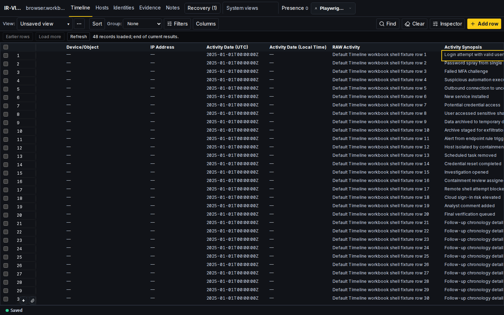

# Cartulary

Cartulary is a spreadsheet-style investigation workspace for digital forensics and incident response teams.

Digital forensics and incident response (DFIR) combines examining digital evidence with investigating and responding to security incidents. Cartulary gives responders a workbook for recording observations, organizing related information, and maintaining a shared understanding as an investigation changes.

[Getting started](#getting-started) · [Documentation](#documentation) · [Contributing](#contributing-and-support)

> **Active development:** Start with synthetic incidents when evaluating Cartulary. The setup below is a local development environment with sample credentials. Review the [MVP deployment guide](deploy/mvp/README.md) before considering an operational deployment.



*The implemented Timeline, captured by the repository's browser tests using synthetic investigation data. This is a test fixture, not a real incident.*

## Why Cartulary?

Many response teams use a **Spreadsheet of Doom**: a multi-tab spreadsheet that holds the investigation's timeline, affected systems, accounts, evidence, notes, and outstanding work. It is familiar and lets people capture a fact before every detail is known.

As the investigation grows, the hard part becomes keeping that information connected. Which observation refers to this host? What supports this timeline entry? What changed since the last review? Cartulary keeps the workbook interaction while giving the investigation records, relationships, and history that can be revisited.

Today, you can:

- **Capture observations as they arrive.** Type into Timeline cells or paste tabular text. Start with an activity description and fill in dates, sources, and other details as you learn more.
- **Keep related information together.** Use Hosts, Identities, Evidence, and Notes alongside the Timeline. Inspect a selected record and review its associated information without losing the workbook context.
- **Focus the workbook for the task.** Sort, filter, choose columns, and save views to return to useful working sets. Saved views organize what you see; they do not restrict access to incident records.
- **Review how a record changed.** Open its history from the inspector to examine earlier changes while reviewing the current investigation.

For example, begin with “Repeated sign-in failures reported for demo-host-01; source review pending.” Add the source and supporting information as they become available, then return to that observation during review. The first useful step is recording what you know.

## Getting started

### Prerequisites

Use a Linux environment with Bash 4.3 or newer, Git, Make, a Go launcher, and a running Docker engine with the Compose plugin. The scripts also use `curl`, `rg` (ripgrep), `tar` with xz support, `flock`, and `setsid`; `ss` enables port diagnostics. Have a TOTP authenticator application ready for first sign-in.

Bootstrap needs network access to download dependencies. It installs the pinned Node.js, pnpm, development tools, and browser-test dependencies. Make selects the pinned Go toolchain. Exact versions live in [the toolchain manifest](tools/toolchain_pins.json); see the [bootstrap guide](docs/guides/cartulary_repository_bootstrap_guide.md) for diagnostics and toolchain recovery.

### Start the development environment

Clone the repository, then run these commands from its root in the same Bash terminal:

```bash
git clone https://github.com/JochiRaider/cartulary.git
cd cartulary
make bootstrap
make doctor
```

The checked-in [development configuration](configs/dev/config.toml) uses filesystem paths under `/var/lib/cartulary`. For a local instance running as your ordinary user, create separate writable directories and override those paths:

```bash
mkdir -p .cartulary/local/{backups,reference-packs,tmp,exports}
export CARTULARY__ROOTS__BACKUP_STORAGE__PATH="$PWD/.cartulary/local/backups"
export CARTULARY__ROOTS__REFERENCE_PACK_STORAGE__PATH="$PWD/.cartulary/local/reference-packs"
export CARTULARY__ROOTS__TEMPORARY_WORK__PATH="$PWD/.cartulary/local/tmp"
export CARTULARY__ROOTS__EXPORT_OUTPUTS__PATH="$PWD/.cartulary/local/exports"

make db-up
make db-migrate
make dev
```

`make db-up` starts PostgreSQL and SeaweedFS object storage and initializes the development bucket. `make db-migrate` applies the database schema. `make dev` starts the backend and browser development server; leave that terminal running.

Open **<http://localhost:5173>**. In another terminal, check backend readiness:

```bash
curl -fsS http://127.0.0.1:8080/readyz
```

HTTP 200 indicates that the active backend dependencies are ready. Startup logs are in `tmp/dev-stack/server.log` and `tmp/dev-stack/web.log`. If a port is occupied or startup fails, inspect the logs and the bootstrap guide before retrying; do not reset existing data to troubleshoot a fresh setup.

**Keep this environment local.** Its database, object-store credentials, and initial account are development examples, and the database port is published beyond loopback by the development Compose file. Do not expose this configuration on an untrusted network or reuse its credentials for deployment.

### Sign in

On a fresh database, the development launcher creates the account from [the bootstrap manifest](configs/dev/bootstrap-admin.json):

- Email: `dev-admin@example.test`
- Password: `DevBootstrap1!`

Sign in, choose **Begin enrollment**, and add the displayed setup key to your authenticator application. Enter its six-digit code to complete setup, then sign in again with the password and an authenticator code. TOTP means time-based one-time password.

### Try an investigation

1. Choose **New incident**. Enter `DEMO-001` as the **Incident key** and `Synthetic sign-in investigation` as the **Title**, then choose **Create and open**.
2. In **Timeline**, find the blank entry row. Scroll horizontally to **Activity Synopsis** and type the synthetic observation above. Press Enter and wait for **Saved**.
3. Add a second observation, such as “Sign-in log review started.” Select a recorded row and open **Inspector** to review its details.
4. Reload the page or reopen the incident. Confirm that your entries remain in the workbook.

To stop, press Ctrl+C in the development terminal, then run `make services-down`. This preserves the development service volumes. Export the same directory overrides again when starting from a new terminal.

## Documentation

- **Using Cartulary:** The [Incident Coordination Playbook](docs/user_guides/incident_coordination_playbook.md) explains working practices, follow-up, handoffs, and review.
- **Operating it:** The [MVP deployment guide](deploy/mvp/README.md) covers the on-prem package, configuration, backup, restore verification, and troubleshooting. It is separate from the development setup above and does not claim disconnected-profile conformance.
- **Contributing:** Start with [repository procedures](AGENTS.md), the [bootstrap guide](docs/guides/cartulary_repository_bootstrap_guide.md), and the [development guide](docs/guides/cartulary-dev-guide.md). Run `make help` to find the maintained command surface.
- **Understanding the design:** Read the [domain vocabulary](docs/domain.md), [design direction](docs/design.md), and [specification entry point](docs/spec/00_document_set_status_and_precedence.md). Specifications describe required behavior and are not a checklist of shipped features.

## Project status

Cartulary is under active implementation. Interfaces and setup continue to evolve. Local evaluation and the MVP on-prem package are the documented starting points; neither this README nor the existence of a specification establishes production readiness.

Follow [existing issues](https://github.com/JochiRaider/cartulary/issues) and the [design backlog](docs/spec/E_roadmap_open_questions_and_decision_backlog.md) for context and direction. The backlog is not a release schedule.

## Contributing and support

Contributions can include documentation improvements, reproducible bug reports, usability feedback, and synthetic examples as well as code. Use [pull requests](https://github.com/JochiRaider/cartulary/pulls) for proposed changes and consult the repository procedures for verification. There is no separate contribution policy in this checkout.

Review the issue tracker for known problems; issue creation may be restricted. When reporting an ordinary bug, include the revision, setup, reproduction steps, and expected versus observed behavior. Remove real case data, personal information, credentials, and tokens from examples and logs.

## Security

A security reporting policy has not yet been published, and no private vulnerability-reporting channel is documented here. Check the project's [security policy page](https://github.com/JochiRaider/cartulary/security/policy) for updates. Do not post sensitive vulnerability details in public issues or pull requests.

## License

Cartulary is licensed under the [Apache License 2.0](LICENSE).

## Acknowledgements

[Aurora Incident Response](https://github.com/cyb3rfox/Aurora-Incident-Response) and [Kanvas](https://github.com/WithSecureLabs/Kanvas) informed the workbook approach. [NLSpec-Spec](https://github.com/TG-Techie/NLSpec-Spec) informed the specification method. These are influences, not claims of shared code or implementation dependencies.
