# Cartulary Operating Model Guide for Incident Coordination

This document is **non-normative**.

It describes recommended operating patterns that fit the current Cartulary core and appendices. It does not change base-profile conformance, the grid-first capture path, incident-scoped live-workspace authorization, or the narrow artifact-scoped release gate already defined for snapshot-derived outputs.[^1][^2][^3][^4][^5]

## 1. Purpose and scope

Cartulary’s current core is strongest on workbook mechanics, progressive structuring, evidence handling, row-centric history, rollback, and collaboration. The thinner area is the operating layer around the workbook: briefing, escalation, handoff, status cadence, workload redistribution, and high-risk review. This guide fills that gap with procedures and lightweight operating artifacts that can be carried by current Cartulary surfaces, especially Notes, Evidence, saved views, typed links, and history, without forcing new ceremony onto routine capture.[^4][^6][^7]

This guide is written for incident leads, analysts, reviewers, stakeholder liaisons, and evidence custodians working inside one incident workspace. It assumes the current base profile and uses the Snapshot and Reporting Extension Profile only where snapshot-derived release controls are already available.[^1][^2][^3][^4][^5]

## 2. Relationship to the current core

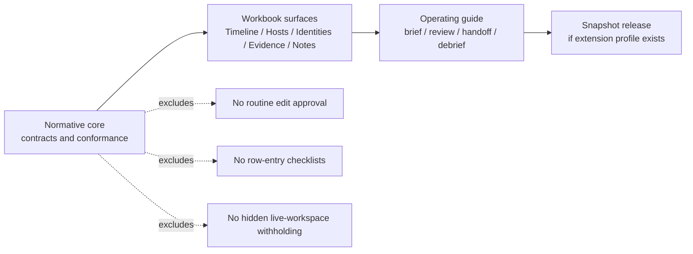

This guide follows five boundary rules.

1. **Protect the capture path.** Do not add mandatory row-level checklists, challenge-response scripts, or modal time-outs to ordinary grid edits.[^4][^6]
2. **Use milestone artifacts, not per-row ritual.** Briefs, reviews, handoffs, and debriefs happen at operating boundaries such as incident open, phase change, ownership transfer, major decision, or release point.[^6][^7]
3. **Keep live workspace visibility incident-scoped.** Recipient-specific withholding belongs at snapshot, render, and release time, not in routine live-workspace hiding.[^5]
4. **Do not turn review into a generalized workflow engine.** Selective second-person review is for high-impact transitions, not ordinary note creation or timeline editing.[^5][^6]
5. **Use current surfaces first.** Until richer analyst-work objects are specified, briefs, escalation notes, decision notes, communications logs, handoff records, and debriefs should be carried by linked note artifacts, evidence records, saved views, tags, and history rather than by ad hoc side channels alone.[^2][^3][^8]

## 3. Operating principles

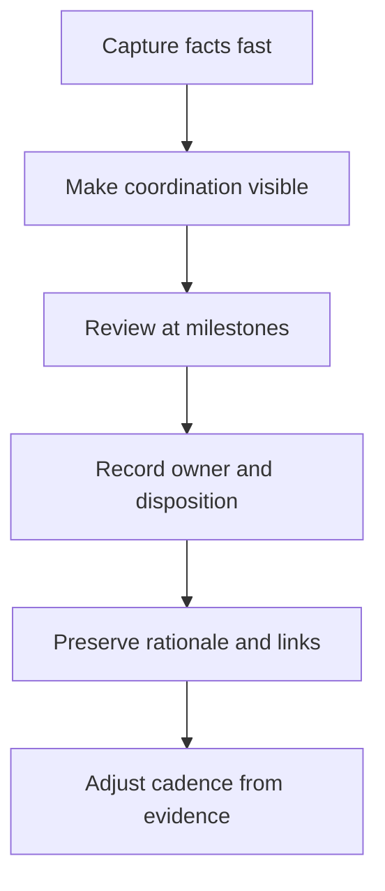

### 3.1 Make the coordination layer explicit

The workbook is the common operating picture for incident facts. The operating layer should make visible:

- what changed since the last review,
- who owns the next action,
- what is blocked,
- which decisions remain open,
- which high-risk actions need a second set of eyes,
- what the next reporting time is.[^6][^7]

### 3.2 Keep procedures adjacent to the grid

Procedures should consume and produce Cartulary artifacts that stay close to the workbook:

- linked notes,
- saved views,
- evidence records and custody state,
- history and rollback,
- system views such as indicators and compromise assessments,
- snapshots and release records where the reporting extension exists.[^2][^3][^4][^5]

### 3.3 Prefer one artifact per boundary crossing

Use one artifact per:

- incident-start brief,
- phase-change brief,
- status review,
- handoff,
- escalation item,
- external stakeholder update,
- debrief milestone.

Do not overwrite a standing note indefinitely. Preserve sequence over time.[^6][^7]

### 3.4 Validate handoffs by outcome

Direct cyber handoff evidence is thinner than the evidence for briefing, escalation, or status review. Treat handoff practice as **validation-oriented**: keep it lightweight, observe where context is still lost, and adjust the handoff shape using missed follow-ups, repeated questions, duplicated work, and delayed re-orientation as the primary signals.[^6]

## 4. Roles and operating overlays

Current Cartulary authorization remains incident-scoped and role-based: `viewer`, `editor`, `reviewer`, and `admin`. This guide adds **operating overlays**, not new authorization classes.[^5]

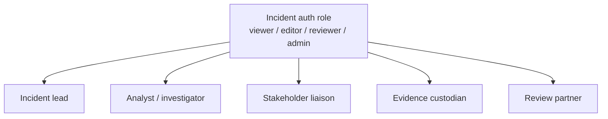

### 4.1 Recommended operating overlays

| Overlay | Primary function | Typical Cartulary surface |
| --- | --- | --- |
| Incident lead | priorities, cadence, phase changes, go/no-go calls | status review, decision notes, saved views |
| Analyst / investigator | capture, pivots, linkage, follow-up execution | timeline, notes, evidence, history |
| Stakeholder liaison | internal and external updates, meeting outputs | communications notes, status reviews, snapshots |
| Evidence custodian | request, receipt, release, preservation checks | evidence records, custody metadata, linked notes |
| Review partner | second-person review on selected high-risk actions | history, linked notes, release gate if present |

Operating owner is a coordination field, not an authorization bypass. A note or evidence item may say `Owner: X` even when the underlying auth role remains the same for multiple participants.[^2][^5][^8]

## 5. Working artifacts on current Cartulary surfaces

The current base profile does not yet require first-class task, decision, handoff, or communications objects. Until those are specified, use the following interim operating artifacts.[^2][^6][^8]

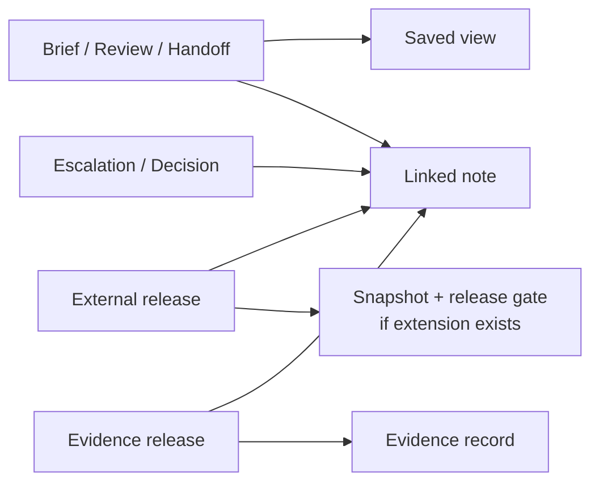

| Operating artifact | Current realization | Minimum structure |
| --- | --- | --- |
| Incident-start brief | linked note + saved view | lead, priorities, open risks, current unknowns, next report time |
| Phase-change brief | linked note + saved view + decision note | prior phase, target phase, exit criteria, open risks, decision summary |
| Escalation item | linked note tagged `escalation` | raised by, owner, concern, required decision time, disposition |
| Status review | linked note tagged `review/status` + saved view | current picture, what changed, blockers, open decisions, next review |
| Handoff | linked note tagged `handoff` + saved view | outgoing, incoming, open tasks, open risks, pending evidence, next checks |
| Communications log entry | note tagged `comms` | audience, summary, commitments, next report time |
| Decision note | note tagged `decision` | owner, decision, rationale, support links, disposition |
| Debrief | note tagged `debrief` | what helped, coordination failures, near misses, follow-up actions |

### 5.1 Suggested title patterns

Use stable, human-scannable titles:

- `BRIEF START <timestamp>`
- `BRIEF PHASE <from> -> <to> <timestamp>`
- `REVIEW STATUS <timestamp>`
- `HANDOFF <from> -> <to> <timestamp>`
- `ESCALATION <subject>`
- `DECISION <subject>`
- `COMMS <audience> <timestamp>`
- `DEBRIEF <milestone>`

### 5.2 Suggested tags

Use a small tag family rather than many one-off labels:

- `brief/start`
- `brief/phase`
- `review/status`
- `handoff`
- `escalation`
- `decision`
- `comms`
- `debrief`
- `followup`

## 6. Operating rhythm

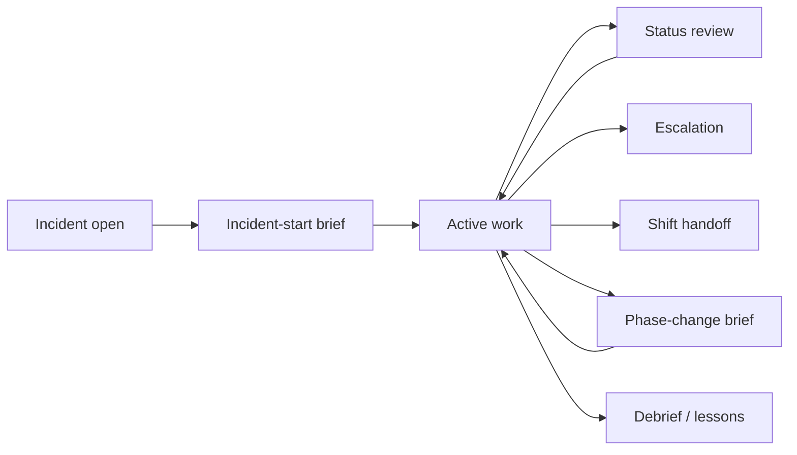

Recommended default:

- trigger a **start brief** when the incident workspace becomes active,
- trigger a **status review** on explicit cadence and on major material change,
- trigger a **phase-change brief** when the response posture changes,
- trigger a **handoff** when operational ownership changes,
- trigger **selective second-person review** for high-risk actions only,
- trigger a **debrief** at closure and at major milestones worth preserving.[^6][^7]

The lead should always set an explicit **next review time**. That keeps cadence visible without forcing a single universal interval across all incidents.[^6]

## 7. Incident-start brief

### Trigger

Use when the workspace moves from ad hoc intake into an active managed incident.

### Participants

Incident lead, active analysts, stakeholder liaison if already known, and any immediately relevant specialists.

### Recommended artifact

One linked note tagged `brief/start`, plus one saved view that captures the initial working set.

### Minimum content

```text
Lead:
Current priorities:
Open risks:
Current unknowns:
Initial task split:
Next review time:
External update posture:
```

### Procedure

1. State who is leading the incident and who is actively working it.
2. State the initial priority order.
3. State the highest-risk unknowns.
4. State the next review time.
5. Link the brief to the initial scope view, key timeline rows, and any already-open evidence records.

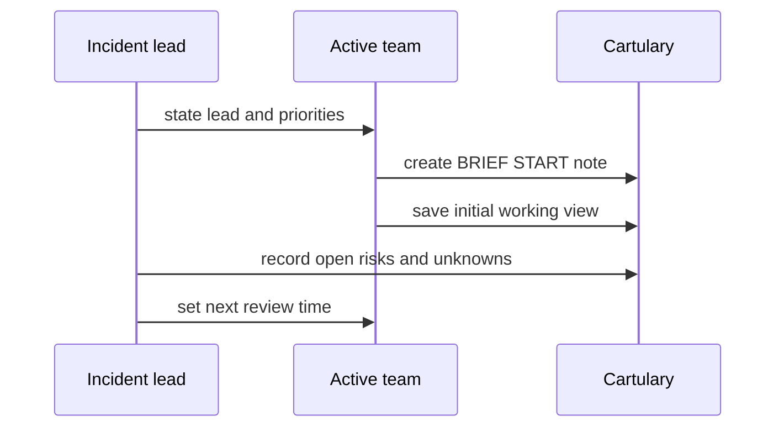

### Exit condition

The team can answer four questions without discussion drift:

- What are we trying to establish first?
- What could go wrong if we move too fast?
- What is still unknown?
- When do we regroup?

## 8. Phase-change brief

### Trigger

Use when the incident shifts materially, for example:

- scoping to containment,
- containment to recovery,
- active response to monitored stabilization,
- investigation to external reporting or formal closure.

### Recommended artifact

One linked note tagged `brief/phase`, linked to the decision note or review note that caused the phase change.

### Minimum content

```text
From phase:
To phase:
Why now:
What changed:
Open risks:
Exit criteria:
Next review time:
```

### Procedure

1. State the old phase and the intended next phase.
2. State the trigger for the change.
3. State the current risks and what is not yet true.
4. State the exit criteria for the new phase.
5. Link the brief to the saved view that supports the move.

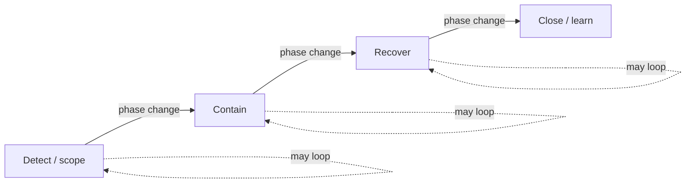

### Exit condition

The team can explain why the phase changed, what conditions still block the next step, and what view or evidence now justifies the move.[^6]

## 9. Escalation and challenge handling

### Intent

Use escalation notes to preserve concerns that need acknowledgement, owner assignment, and disposition. The target is not performative challenge ritual. The target is visible follow-through on high-impact concerns.[^6][^7]

### Trigger

Use when a concern could materially affect:

- containment timing or scope,
- evidence preservation,
- external statements,
- business impact,
- incident classification,
- legal or stakeholder posture.

### Recommended artifact

One linked note tagged `escalation` and, when the matter resolves, one linked decision note or explicit disposition update in the same note.

### Minimum content

```text
Raised by:
Owner:
Concern:
Why it matters now:
Required decision time:
Disposition:
Follow-up:
```

### Recommended dispositions

Use a small closed set for consistency:

- `accepted`
- `changed`
- `deferred`
- `rejected`
- `watching`
- `superseded`

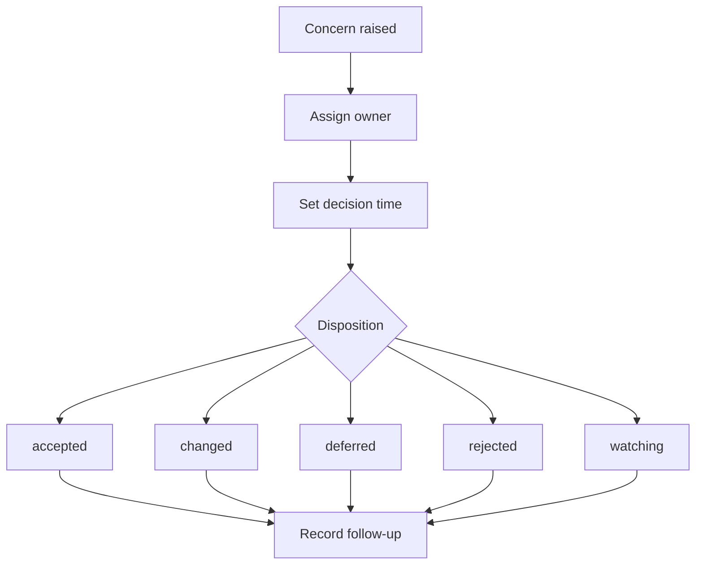

### Practice notes

- The person raising the concern does not need to own the resolution.
- A raised concern is not closed until disposition is visible.
- Do not require an escalation note for ordinary workbook edits or local analytic disagreement that has no operational consequence.[^6]

## 10. Status-review cadence

### Intent

Status review is the main discipline for keeping a shared picture without turning every row edit into a meeting. Use one review artifact per review point rather than editing a single rolling status note forever.[^6][^7]

### Trigger

Use on explicit cadence and at major material change.

### Recommended artifact

One linked note tagged `review/status`, plus one saved view that reflects the review state.

### Minimum content

```text
Lead:
What changed since last review:
Current scope:
Open risks:
Blocked work:
Pending evidence:
Open decisions:
Next external update:
Next review time:
```

### Procedure

1. Start from a saved view rather than from memory.
2. Record only what changed or is newly blocked.
3. Surface pending evidence and unresolved decision points.
4. Confirm next review time and next external update time.
5. Link to decision notes, escalation notes, and affected evidence records.

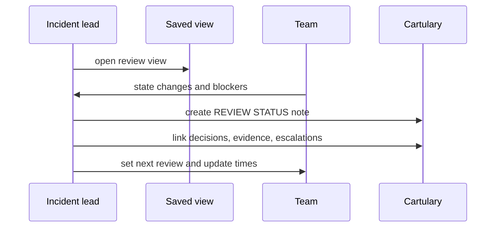

### Suggested review view contents

Build one saved view that emphasizes:

- latest high-confidence timeline items,
- hosts or identities with current compromise assessments,
- pending or newly received evidence,
- notes tagged `escalation`, `decision`, and `followup`,
- unresolved mentions or open scope questions.

## 11. Shift handoff

### Intent

A handoff is a bounded state transfer. It is not just “read the chat.” The incoming owner should be able to restate the current picture, the next checks, and the places where context is fragile.[^6]

### Trigger

Use when operational ownership changes, including shift end, analyst rotation, or specialist turnover.

### Recommended artifact

One linked note tagged `handoff`, linked to the current saved view.

### Minimum content

```text
Outgoing:
Incoming:
Current picture:
Open tasks / follow-ups:
Open decisions:
Pending evidence:
Open risks:
Next checks:
Next review time:
```

### Procedure

1. Outgoing owner prepares the handoff note from the current review view.
2. Incoming owner reads the note and the linked view.
3. Incoming owner restates the current picture and next checks.
4. If restatement fails, fix the artifact before ending the handoff.

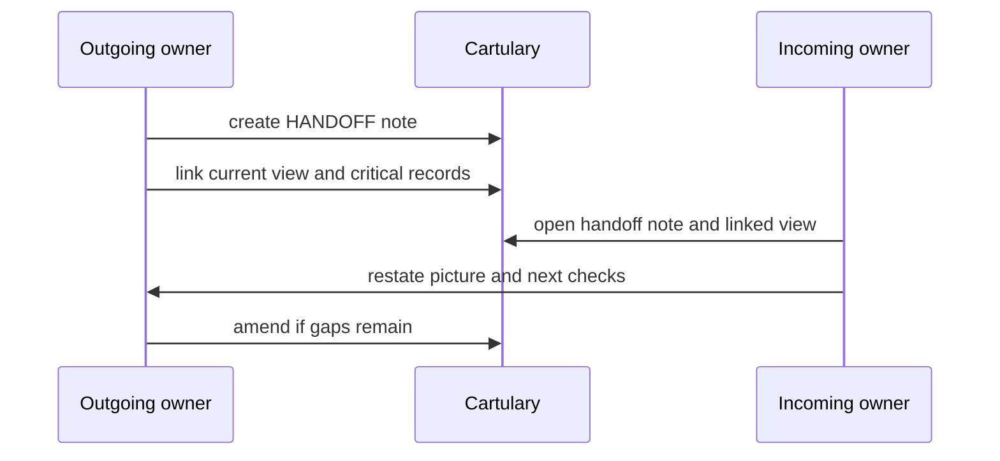

### Validation signals

Track these signals to tune the handoff shape:

- repeated clarification questions after handoff,
- missed follow-ups,
- duplicated work,
- delay before the incoming owner can resume productive action.

If these remain high, shorten the note and strengthen the linked view rather than adding more ceremony.[^6]

## 12. Selective second-person review

### Intent

Use a second set of eyes only where the action is hard to reverse, externally consequential, or likely to damage evidence if executed poorly.[^6][^7]

### Use it for

- destructive containment,
- evidence release,
- external release,
- optionally, risky scoping decisions with high operational consequence.

### Do not use it for

- routine row edits,
- normal note creation,
- ordinary tagging,
- standard evidence preview,
- routine linkage work.[^5][^6]

### Recommended artifact

One linked note tagged `decision` or `review`, with explicit `Driver`, `Checker`, and `Disposition` fields.

### Minimum content

```text
Action:
Driver:
Checker:
Preconditions:
Main risks:
Disposition:
Time:
Follow-up:
```

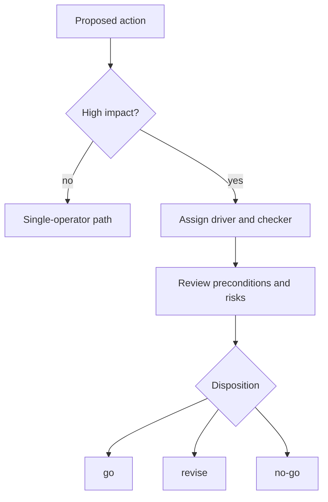

### Driver / checker split

- **Driver** prepares the action and the current rationale.
- **Checker** verifies scope, risks, and prerequisite state.
- **Checker** is not a ceremonial approver for every edit. The checker function exists only on selected transitions.

## 13. High-risk action workflows

### 13.1 Destructive containment

Use second-person review before actions such as isolate, disable, revoke, purge, or otherwise alter live state in a way that may destroy evidence, widen impact, or cause hard-to-reverse service effects.[^6][^9]

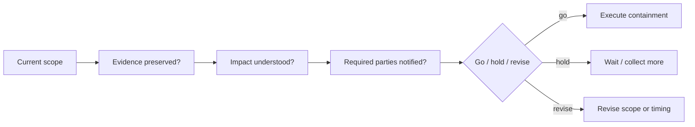

Recommended note fields:

```text
Containment action:
Driver:
Checker:
Scope:
Preservation check:
Impact check:
Rollback path:
Disposition:
Executed at:
```

### 13.2 Evidence release

Use second-person review before releasing evidence outside the active response team or before changing custody posture in a way that matters to integrity, legal posture, or downstream analysis.[^6]

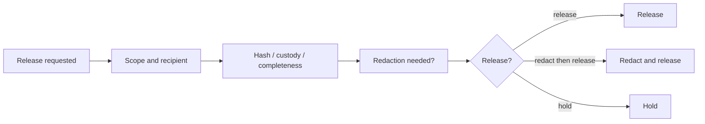

Recommended note fields:

```text
Evidence item:
Recipient:
Driver:
Checker:
Custody check:
Integrity check:
Redaction check:
Disposition:
Released at:
```

### 13.3 External release

Where the Snapshot and Reporting Extension Profile exists, use the existing release gate and keep this guide limited to preparation discipline. Do not invent a separate broad approval workflow for ordinary case work.[^5]

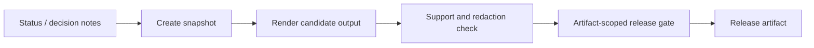

If the reporting extension is present:

- `internal_review` uses one `reviewer` approval,
- `external_release` uses distinct `reviewer` and `admin` approvals bound to the release tuple,
- any change to snapshot, template, redaction profile, output kind, or output bytes invalidates prior approvals.[^5]

If the reporting extension is not present:

- keep the release decision outside the product’s formal gate,
- still record the external release decision and rationale as linked notes,
- still preserve support links to the underlying evidence or findings.

## 14. Communications and stakeholder updates

Communications should come out of status review, not replace it. One communications note per update or meeting is usually enough; do not hide state only in chat or calendar descriptions.[^6][^7]

### Recommended communications note

```text
Audience:
Time:
Summary:
What changed:
What remains open:
Commitments made:
Next update time:
```

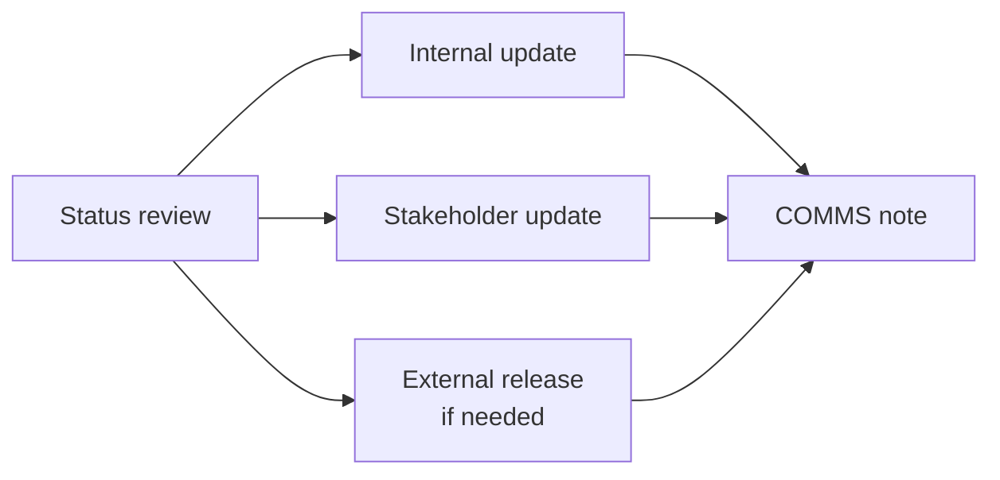

Use one communications note when:

- a stakeholder call changes the incident posture,
- leadership receives a material update,
- the team commits to a next-update time,
- external expectations or constraints change.

## 15. Debrief and follow-through

### Intent

Debrief should preserve more than the final technical storyline. It should also capture coordination failures, near misses, latent conditions, and recovery opportunities, then connect them to follow-up work rather than ending as free text.[^6][^7]

### Trigger

Use at formal closure and at major milestones worth preserving.

### Recommended artifact

One linked note tagged `debrief`, plus linked follow-up notes or decision notes as needed.

### Minimum content

```text
Milestone:
What helped:
Coordination failures:
Near misses:
Latent conditions:
Follow-up actions:
Owners:
Review date:
```

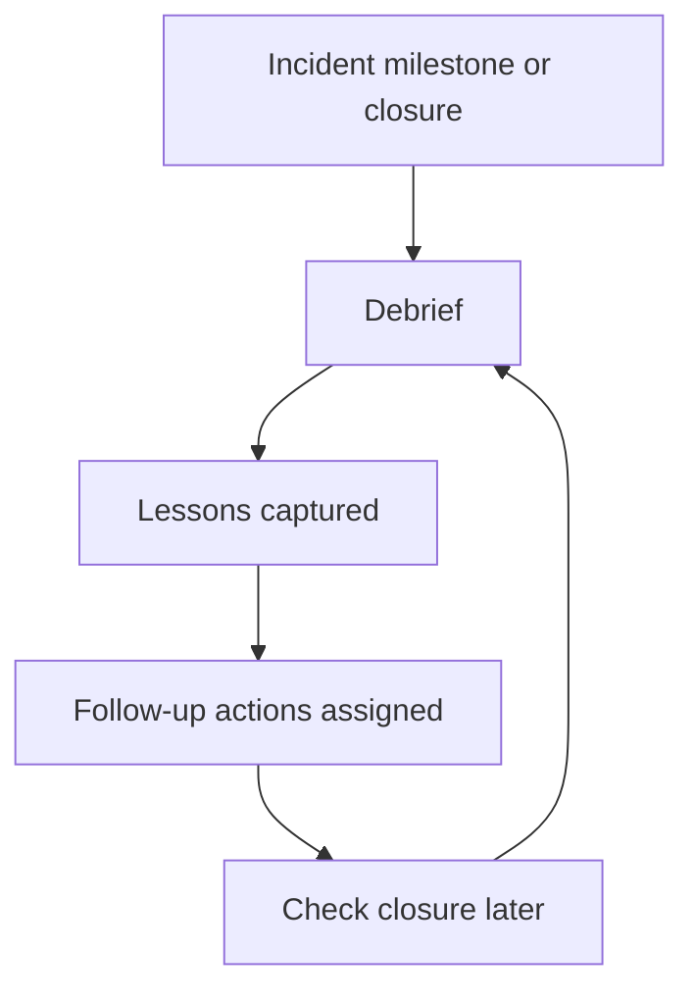

### Practice notes

- Preserve near misses even when no major harm occurred.
- Separate technical root cause from coordination failure.
- Revisit the follow-up set later; do not assume the debrief itself created change.[^6][^7]

## 16. Lightweight validation and adaptation

This guide is intended to be adapted from observed incident behavior rather than defended as ritual.

### 16.1 Signals to watch

Use a small operating check set:

- Are open concerns getting owners and dispositions?
- Does the team know the next review time?
- Do stakeholder updates start from saved views rather than memory?
- Are handoff errors decreasing?
- Are high-risk actions getting targeted cross-check without slowing routine capture?
- Are follow-up actions from debriefs still visible later?

### 16.2 Signals that the guide is over-ritualized

Trim the procedure if you see:

- note creation without useful links or decisions,
- repeated “brief complete” language with no shared picture,
- second-person review spreading into ordinary edits,
- status notes that merely restate the workbook without new decisions,
- handoff artifacts that are longer than the time saved by using them.[^6]

### 16.3 Signals that a surface may deserve promotion later

The following are good candidates for future first-class support if teams use them voluntarily and repeatedly:

- task or request tracking,
- decision capture,
- communications log,
- handoff record,
- status-review artifact,
- lessons-learned surface.[^6][^8]

## 17. Summary operating checklist

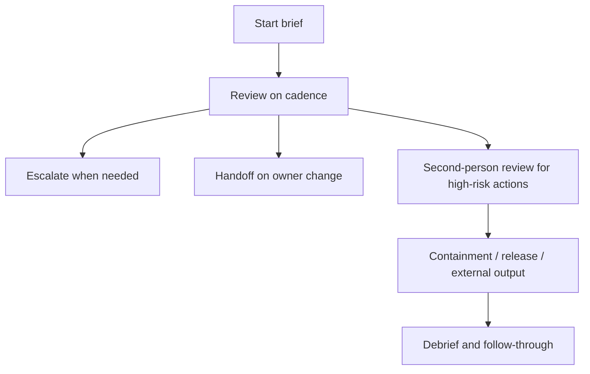

Use this guide to make coordination state visible at operating boundaries while leaving routine workbook capture fast, local, and minimally ceremonial.

## Sources

[^1]: `00_document_set_status_and_precedence.md`.
[^2]: `01_architecture_storage_and_view_contracts.md`.
[^3]: `02_domain_model_schema_and_history.md`.
[^4]: `03_workbook_interaction_collaboration_and_workflows.md`.
[^5]: `04_security_deployment_and_conformance.md`.
[^6]: `cartulary_crm_tem_dfir_research_report.md`.
[^7]: `spreadsheet_of_doom_dfir_research_report.md`.
[^8]: `E_roadmap_open_questions_and_decision_backlog.md`.
[^9]: `D_workflow_and_ui_illustrations_source_extract.md`.
