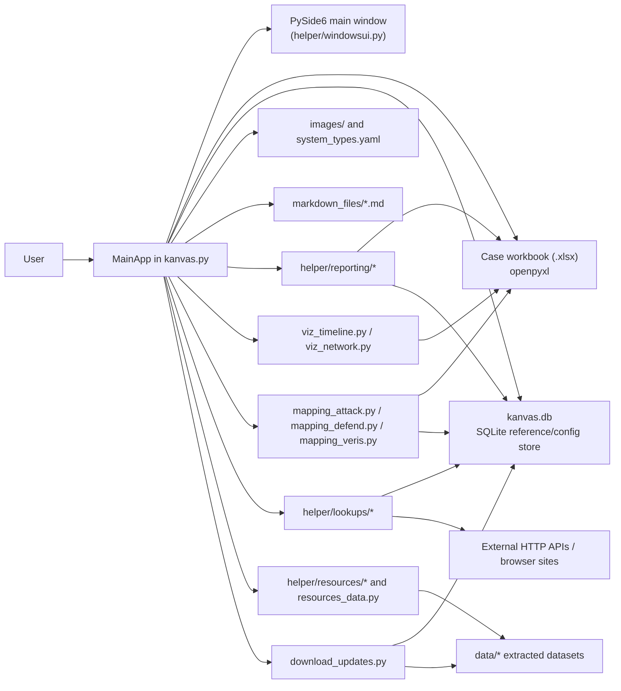

# 1. Executive summary

Kanvas is a desktop incident-response case management application whose center of gravity is an Excel workbook, not a server-side backend. The README describes it as an IR case management tool for investigators working with a SOD workbook, and the code confirms that the main application opens, edits, saves, filters, visualizes, sanitizes, and exports workbook data directly through a PySide6 desktop UI. The persistent architecture is therefore split between a primary case file, which is the workbook itself, and a secondary local SQLite database, which stores reference datasets, lookup caches, customizable system and evidence types, bookmarks, and imported framework mappings.[^readme-overview] [^kanvas-init] [^db-utils] [^config]

The intended user appears to be a hands-on incident responder or investigator who already works with spreadsheet-centric case tracking and wants a single offline-first desktop workspace for timeline construction, lateral movement visualization, ATT&CK and D3FEND mapping, VERIS metadata capture, IOC lookup, defanging, STIX export, and report generation. The application is not organized as a multi-user SaaS product. It is a local GUI shell around files and reference data, with selective optional API-backed enrichments.[^readme-overview] [^windowsui-text] [^lookup-ip] [^lookup-domain] [^lookup-email] [^lookup-file] [^lookup-cve] [^lookup-ransom] [^mapping-attack] [^mapping-defend] [^mapping-veris] [^stix-file] [^defang-file] [^report-builder] [^html-exporter]

Architecturally, the project is best understood as a controller-heavy desktop application. `kanvas.py` owns application bootstrap, UI signal wiring, workbook/session state, file locking, generic grid editing, and child-window launchers. The `helper/` package contains the actual subsystems: workbook schema constants, local DB schema management, system-type and evidence-type management, search/filter UI, visualizations, ATT&CK and D3FEND mapping, VERIS editing, external lookups, downloaded knowledge-base viewers, report generation, STIX conversion, and defanging utilities. The resulting shape is simple to run and easy to distribute, but it also concentrates a great deal of control flow in one file and depends heavily on naming conventions in the workbook schema.[^kanvas-init] [^kanvas-connect] [^kanvas-load] [^kanvas-edit] [^windowsui-layout] [^system-type] [^download-updates] [^report-engine]

### Direct observations

The code directly shows a `QApplication` bootstrap, creation of `kanvas.db`, workbook loading through `openpyxl`, search/filtering through `QSortFilterProxyModel`, visualization windows built with `networkx` and `matplotlib`, reference-data download/update into SQLite and `data/`, and an HTML report pipeline that assembles workbook data and generated visualizations into a single file.[^kanvas-init] [^kanvas-load] [^viz-network] [^viz-timeline] [^download-updates] [^report-engine] [^html-exporter]

### Reasonable inferences

The design is optimized for portability, investigator familiarity, and low deployment complexity. A workbook can be emailed or placed on a share, the app can open it locally, and most intelligence datasets can be pulled down into local storage. That is a practical fit for IR teams that do not want or cannot deploy a centralized case platform.[^readme-overview] [^kanvas-lock] [^download-updates]

### Unresolved ambiguities

I did not find a dedicated domain model layer or schema migration system beyond the workbook template and `CREATE TABLE IF NOT EXISTS` calls. I also found API-key support for OpenAI and Anthropic in configuration, but I did not find any inspected feature module that actually invokes those SDKs. That suggests either planned-but-not-implemented integration or code outside the inspected paths.[^db-utils] [^requirements] [^api-config] [^api-yaml]

# 2. Repository overview

The repository root is small and product-oriented. `kanvas.py` is the executable entry point and effectively the application controller. `README.md` explains the tool’s workflow assumptions and required workbook column names. `requirements.txt` establishes the desktop, spreadsheet, visualization, HTTP, Markdown, YAML, and locking stack. `sod.xlsx` is the case template that drives the app’s domain model. The root also contains `assets/`, `images/`, and `markdown_files/`, which are package content rather than Python code: the demo GIF lives under `assets/`, the system and branding icons live under `images/`, and user-facing markdown notes or playbooks live under `markdown_files/`.[^repo-listing] [^readme-overview] [^requirements] [^sod-template] [^markdown-editor] [^markdown-playbook]

The `helper/` directory is where nearly all substantive functionality lives. It is not just miscellaneous helpers. It contains schema constants in `config.py`, DB table creation in `database_utils.py`, the generated Qt UI definition in `windowsui.py`, styling constants in `styles.py`, search UI in `search_bar.py`, system-type and evidence-type management in `system_type.py`, API-key management in `api_config.py`, threat-model and taxonomy mapping in `mapping_attack.py`, `mapping_defend.py`, and `mapping_veris.py`, browser-embedded MITRE Flow handling in `mitre_attack_flow.py`, report generation in `helper/reporting/`, local dataset viewers in `helper/resources/`, ad hoc lookup windows in `helper/lookups/`, and utility modules for defanging, STIX export, bookmarks, markdown editing, and update ingestion.[^config] [^db-utils] [^windowsui-layout] [^styles] [^search-bar] [^system-type] [^api-config] [^mapping-attack] [^mapping-defend] [^mapping-veris] [^mitre-flow] [^report-builder] [^resources-data] [^bookmarks] [^markdown-editor] [^defang-file] [^stix-file] [^download-updates]

The `helper/reporting/` package is a distinct subsystem rather than a few convenience functions. `report_builder.py` builds the report configuration dialog, `report_engine.py` turns selected workbook sheets into a structured in-memory report payload, `visualization_generator.py` produces report-safe timeline and network renderings plus interactive network data, and `html_exporter.py` assembles the final HTML document, embeds images, converts markdown, injects style and JavaScript, and renders sheet-specific sections.[^report-builder] [^report-engine] [^viz-generator] [^html-exporter]

The `helper/lookups/` package groups small single-purpose investigation windows. Each lookup module follows roughly the same pattern: create a small Qt window, accept user input, optionally retrieve an API key through `api_config.py`, perform a synchronous HTTP request or local DB query, render a text result area, and provide quick-link buttons out to external analyst tools.[^lookup-ip] [^lookup-domain] [^lookup-email] [^lookup-file] [^lookup-entraid] [^lookup-cve] [^lookup-ransom]

The `helper/resources/` package is separate from `helper/lookups/` because it is built around locally downloaded datasets rather than live API calls. Those modules parse YAML, JSON, or Markdown files staged under `data/` by the update subsystem and render searchable knowledge-base views for LOLBAS, LOLDrivers, LOLESXi, forensic artifacts, HijackLibs, and Windows SIDs.[^download-updates] [^artifacts-resource] [^hijacklibs-resource] [^lolbas-resource] [^loldrivers-resource] [^lolesxi-resource] [^sid-resource]

# 3. Technology stack and dependencies

## GUI framework

The GUI stack is PySide6 with the generated UI class in `helper/windowsui.py`, plus `shiboken6` in the dependency list. `kanvas.py` creates a `QApplication`, builds a `QMainWindow`, mounts the generated `Ui_KanvasMainWindow`, and then programmatically connects button objects such as `left_button_7`, `left_button_8`, `left_button_23`, `down_button_6`, and `down_button_7` to controller methods. Child windows across the codebase are plain Qt widgets or dialogs, not a separate routing framework.[^requirements] [^kanvas-init] [^kanvas-connect] [^windowsui-layout] [^windowsui-text]

The MITRE Flow Builder uses `QWebEngineView` from PySide6’s web stack. That is not an internal flow editor rendered with canvas primitives; it is an embedded browser window aimed at the public MITRE Attack Flow UI. The module includes platform-specific configuration, timeout handling, fallback behavior, and download interception for exported flow files.[^mitre-flow] [^readme-overview]

## Spreadsheet and data-processing libraries

`openpyxl` is the primary case-data access layer. It is used in `kanvas.py` to create new cases by copying `sod.xlsx`, to load workbooks, to read sheet headers and rows into the main table view, and to persist edits, additions, deletions, and duplicated rows back to disk. `openpyxl` is also used in `defang.py` to rewrite workbook cells and in `download_updates.py` only indirectly through workbook use elsewhere.[^requirements] [^kanvas-newcase] [^kanvas-load] [^kanvas-edit] [^kanvas-add] [^kanvas-delete] [^kanvas-duplicate] [^defang-file]

`pandas` appears where the code wants easier row/column transformation than `openpyxl` provides. The D3FEND mapping window loads the timeline into a DataFrame, the VERIS window loads the VERIS sheet into a DataFrame before reconstructing the sheet on save, the report engine converts workbook sheets into DataFrames for export, `visualization_generator.py` uses DataFrame-style processing for report sections, and the update subsystem uses pandas heavily for CSV import.[^requirements] [^mapping-defend] [^mapping-veris] [^report-engine] [^viz-generator] [^download-updates]

`numpy` is listed as a dependency, but in the inspected modules it is supporting infrastructure rather than a visible architectural pillar. The operationally significant data stack is `openpyxl` plus `pandas`.[^requirements]

## Graph and visualization libraries

`networkx` and `matplotlib` are the visualization foundation. The GUI lateral-movement view uses a `DiGraph`, custom layouting, icon overlays, and a `FigureCanvas` embedded in a Qt dialog. The report path uses a second implementation that builds either a static PNG or an interactive `vis-network` payload for HTML. Timeline visualization is custom-painted in the GUI, but the report still uses `matplotlib` to emit a static timeline image.[^requirements] [^viz-network] [^viz-timeline] [^viz-generator]

A notable architectural implication is that the project has two separate visualization implementations for the same workbook data: one in the interactive GUI modules and another in the report generator. That separation helps the report subsystem remain independent of the GUI canvas widgets, but it also creates drift risk, which is visible in the different filtering behavior for timeline rows.[^viz-timeline] [^viz-generator]

## Reporting, markdown, and export tooling

The report stack is built around the standard library plus `Markdown` and `pygments`. `markdown_editor.py` renders notes with fenced code blocks, tables, syntax highlighting, and relative image-path rewriting. `html_exporter.py` converts markdown to HTML, base64-embeds referenced local images, builds a full HTML document, and can also load a Diamond Model image from `images/diamond.jpg`. `report_engine.py` includes a Markdown exporter too, although the current UI only exposes HTML generation.[^requirements] [^markdown-editor] [^report-builder] [^report-engine] [^html-exporter]

The STIX export path does not use a dedicated STIX library. `helper/stix.py` constructs STIX 2.1 indicator JSON directly, including indicator type detection, STIX pattern generation, UUID-based IDs, and timestamp formatting. That keeps dependencies smaller, but it also means the project owns the STIX mapping logic itself.[^stix-file]

## HTTP and API libraries

`requests` underpins almost all online integrations: VirusTotal, Shodan’s HTTP-adjacent workflows, IP geolocation, CVE lookup, ransomware.live, Have I Been Pwned, and update downloads. `python-whois` is used for domain lookups, and the `shodan` SDK is used for Shodan enrichment. Several modules also open analyst sites in the system browser using URL templates rather than API calls.[^requirements] [^lookup-ip] [^lookup-domain] [^lookup-email] [^lookup-file] [^lookup-cve] [^lookup-ransom] [^download-updates]

## File locking and concurrency helpers

`filelock` is the only explicit concurrency helper in `requirements.txt`, and `kanvas.py` uses it to create a sidecar lock file `<case>.lock`. If acquisition fails within one second, the application offers to open the workbook in read-only mode instead. Long-running update downloads are delegated to a `QThread`-hosted worker with progress signals. Most other network activity, including lookups, is synchronous inside UI button handlers.[^requirements] [^kanvas-lock] [^download-updates] [^lookup-ip] [^lookup-domain] [^lookup-email] [^lookup-file] [^lookup-cve] [^lookup-ransom]

## AI-related SDKs and optional integrations

`openai` and `anthropic` are in `requirements.txt`, and `helper/api.yaml` plus `helper/api_config.py` define configurable keys for both. In the inspected Python modules, however, I did not observe a concrete feature that imports those SDKs and performs model calls. The current practical implication is that the project ships AI-related dependency and configuration scaffolding, but AI does not appear to be on the critical path for the features implemented in the inspected code.[^requirements] [^api-config] [^api-yaml]

# 4. High-level architecture

Kanvas is a local desktop controller layered over three persistent stores:

1. a workbook that holds case data,
2. a SQLite database that holds reference/configuration data, and
3. a `data/` and `images/` content tree that holds icons and downloaded knowledge-base artifacts.[^kanvas-init] [^kanvas-load] [^db-utils] [^system-type] [^download-updates] [^repo-listing]

The high-level runtime model is:

- `kanvas.py` starts the app, creates `kanvas.db` tables, loads the main Qt window, and owns session state such as the current workbook path, current sheet, proxy model, lock state, and child windows.[^kanvas-init] [^kanvas-lock]
- The main grid is generic. It reads whatever sheet the user selects, treats row 1 as headers, turns remaining rows into a `QStandardItemModel`, and filters through a `QSortFilterProxyModel`.[^kanvas-load]
- Specialized subsystems then operate against the loaded workbook or local DB. Visualizers read the `Timeline` and `Systems` sheets, mapping windows read `Timeline` or `VERIS`, report generation reads selected workbook sheets and optional markdown files, and lookups/resource viewers talk to SQLite, local `data/`, or external services.[^viz-network] [^viz-timeline] [^mapping-attack] [^mapping-defend] [^mapping-veris] [^report-engine] [^resources-data] [^artifacts-resource] [^lookup-ip]

The component interaction map is controller-centric rather than event-bus-centric. The main window does not expose a typed application service layer. Instead, child windows reach directly into the main window for `current_workbook` and `current_file_path`, or they are passed `db_path` and parent references. That keeps feature modules simple, but it couples them to application-global state and UI lifecycle details.[^kanvas-init] [^kanvas-connect] [^mapping-veris] [^report-builder]

A practical dependency map looks like this:

- `kanvas.py` depends on almost everything.
- `helper/config.py` is imported broadly as the workbook schema contract.
- `helper/database_utils.py`, `helper/system_type.py`, and `helper/api_config.py` underpin multiple other modules.
- `helper/reporting/*` depends on workbook data plus `config.py`, `defang.py`, and the icon/resource paths.
- `helper/resources/*` depends on `download_updates.py` having already populated `data/`.
- `helper/lookups/*` depends on `api_config.py` and, in some cases, the local DB.[^config] [^db-utils] [^system-type] [^api-config] [^report-builder] [^viz-generator] [^download-updates]

### Direct observations

The code directly shows a workbook-first architecture and a secondary local reference database. `kanvas.py` creates `kanvas.db`, `SystemTypeManager` seeds system types into SQLite, `EvidenceTypeManager` reads evidence types from SQLite, and the report pipeline passes both workbook and `db_path` into exporters and visualization generators.[^kanvas-init] [^system-type] [^report-engine]

### Reasonable inferences

This architecture was likely chosen so that case data remains portable and organization-specific reference data can evolve independently from each case file. The workbook is the exchange artifact; SQLite and `data/` are the workstation-local accelerators.[^readme-overview] [^download-updates]

### Unresolved ambiguities

I did not find an explicit contract for where `kanvas.db` and the downloaded `data/` directory are expected to live in a packaged or frozen build. Several modules rely on relative paths or application-directory assumptions, which may behave differently across packaging strategies.[^kanvas-init] [^download-updates] [^markdown-editor]

# 5. Application lifecycle and startup path

## Bootstrap path

Execution begins at the bottom of `kanvas.py` with `main_app = MainApp()`. The `MainApp.__init__` constructor immediately creates the `QApplication`, sets file-based logging to `kanvas.log`, resolves `images/logo.png` for the app icon and splash screen, sets `self.db_path = "kanvas.db"`, initializes lock and read-only state, creates all SQLite tables, instantiates `SystemTypeManager`, loads the UI, instantiates `EvidenceTypeManager` and `ReportEngine`, initializes workbook/session fields, and wires the UI before calling `finish_loading()` via a single-shot timer.[^kanvas-init] [^db-utils] [^system-type] [^windowsui-layout]

That startup sequence means the application is structurally usable before any case workbook is opened. The main window, side buttons, reference-data-dependent dialogs, and type-management dialogs can all exist even when `current_workbook` is `None`. Features that require a case use `check_excel_loaded()` as a guard.[^kanvas-init] [^kanvas-connect]

## UI creation and main-window wiring

`load_ui()` constructs a `QMainWindow`, instantiates `Ui_KanvasMainWindow`, runs `setupUi(window)`, and then stores the generated UI object on `window.ui`. `connect_ui_elements()` then becomes the real startup heart of the app: it configures the main tree view, injects the search bar, binds sidebar buttons to controller methods, binds footer buttons to editing/export utilities, builds the “Quick Reference” menu, and hides the delete/refresh footer buttons by default.[^kanvas-init] [^kanvas-connect] [^windowsui-layout] [^windowsui-text] [^search-bar]

The generated `windowsui.py` layout is straightforward: a dark left sidebar with grouped buttons for case actions, sheet selection, live lookups, knowledge-base utilities, and settings; a right-side `treeViewMain` for sheet data; and a footer row with editing/export utility buttons plus a file-status label.[^windowsui-layout] [^windowsui-text]

## Database and local state initialization

The local DB lifecycle starts extremely early. `create_all_tables(self.db_path)` creates every known table unconditionally if absent. `SystemTypeManager(self.db_path)` then ensures default system types from `helper/system_types.yaml` are inserted into the `system_types` table if it is empty. `EvidenceTypeManager` later reads evidence types from the `EvidenceType` table, which is typically populated by the update subsystem. This means the app can start with an empty DB, but richer dropdowns and knowledge-base windows depend on later downloads.[^kanvas-init] [^db-utils] [^system-type] [^download-updates] [^resources-data]

## Workbook session handling and file locks

The workbook is not opened at startup. Instead, a session begins when the user clicks “New Case” or “Open Case”. Both workflows call into `acquire_file_lock()`, which creates a `FileLock` against `<excel_path>.lock`. If the lock is unavailable, the user is asked whether to open read-only; if they agree, `self.read_only_mode` becomes `True` and workbook loading proceeds in read-only mode. `closeEvent()` and `application_cleanup()` release locks and close child windows on shutdown.[^kanvas-lock] [^kanvas-newcase] [^kanvas-load]

This locking model is cooperative, lightweight, and per-file. It is not a server-coordinated collaboration layer. It relies on all participants honoring the same `.lock` convention and on the underlying shared filesystem behaving sanely with sidecar lock files.[^kanvas-lock] [^readme-overview]

## Reaching a usable main window

The application reaches a usable state in two phases:

1. the Qt shell becomes visible when `finish_loading()` shows the window maximized, and
2. the main data grid becomes meaningful once `load_data_into_treeview()` has opened a workbook and loaded the selected sheet into a model.[^kanvas-init] [^kanvas-load]

For a new case, `open_new_case_window()` prompts for a target path, acquires the lock for that path, copies `sod.xlsx`, loads the new workbook through `openpyxl`, updates `labelFileStatus`, and finally delegates to `load_data_into_treeview()` so the user immediately lands in the sheet view.[^kanvas-newcase] [^sod-template]

For an existing case, `load_data_into_treeview()` shows a file picker, optionally shows a progress bar, acquires the lock, loads the workbook with `openpyxl.load_workbook(file_path, read_only=self.read_only_mode)`, updates the file status label, populates the sheet dropdown, connects the dropdown change handler, and renders the first sheet into a `QStandardItemModel` wrapped by a `QSortFilterProxyModel`.[^kanvas-load]

## Responsibility clusters inside the monolith

Although `kanvas.py` is one large class, its responsibilities fall into recognizable clusters:

- bootstrap and lifecycle: constructor, splash, `load_ui()`, `finish_loading()`, cleanup, child-window tracking;[^kanvas-init]
- file/session control: lock acquisition/release, open/new case, sheet loading, read-only behavior;[^kanvas-lock] [^kanvas-newcase] [^kanvas-load]
- generic grid operations: edit/add/delete/duplicate/copy/export rows, search/filter, context menu;[^kanvas-context] [^kanvas-edit] [^kanvas-add] [^kanvas-delete] [^kanvas-duplicate] [^search-bar]
- domain utilities: defang, STIX export, system-type management, evidence-type management;[^kanvas-defang] [^kanvas-stix] [^system-type]
- child-window launchers: lookups, mappings, report builder, knowledge-base windows, MITRE Flow wrapper.[^kanvas-connect] [^mapping-attack] [^mapping-defend] [^mapping-veris] [^report-builder] [^resources-data] [^mitre-flow]

A reimplementation should almost certainly preserve those capabilities but separate them into narrower controllers or service objects.

# 6. Data model and persistence

## Primary persistence: workbook-backed case data

The workbook is the canonical case store. `sod.xlsx` contains the template sheets and header names that the application expects. In the inspected workbook, the sheets are `Case Info`, `Timeline`, `Systems`, `Accounts`, `Indicators`, `Containment -Isolation`, `Recommendations`, `Investigation Streams`, `Evidence Tracker`, and `VERIS`. The generic sheet loader in `kanvas.py` treats row 1 as headers and rows 2 onward as data for any selected sheet.[^sod-template] [^kanvas-load]

The workbook model is mostly schema-by-convention. `helper/config.py` centralizes the specific sheet names and column headers that specialized modules care about: timeline timestamps, activity text, ATT&CK fields, visualization flags, event/remote systems, suspect accounts, system type, indicator type, location, priority, evidence type, and other columns. The generic loader can display any sheet, but specialized behavior only appears when those canonical names exist.[^config] [^readme-overview]

### Workbook sheet semantics

`Case Info` is a metadata sheet with `meta` and `meta-value` columns. The template includes keys such as `CollectionID:`, `Confidence:`, `CaseName:`, `TLP:`, `IncidentSeverity:`, `TargetCountry:`, `TargetSector:`, `IntrusionSet:`, `ThreatActor Name:`, and `CaseID:`. I did not observe a dedicated `Case Info` editor beyond the generic table view, but the sheet clearly acts as top-level incident metadata storage.[^sod-template]

`Timeline` is the most behaviorally important sheet. The observed headers are `Timestamp_UTC_0`, `EvidenceType`, `Event System`, `<->`, `Remote System`, `Suspect Account`, `MITRE Tactic`, `MITRE Techniques`, `Visualize`, `Activity`, and `Notes`. The timeline drives the incident timeline view, lateral-movement graph, ATT&CK summary, D3FEND mapping, and parts of the report pipeline.[^sod-template] [^viz-network] [^viz-timeline] [^mapping-attack] [^mapping-defend] [^viz-generator]

`Systems` holds asset inventory rows. The observed headers are `Date Added`, `HostName`, `IPAddress`, `Location`, `SystemType`, `OS`, `EntryPoint`, `Reason for Listing `, `EvidenceCollected`, and `Notes`. This sheet is especially important for network visualization because it maps hostnames or IPs to `SystemType`, which then drives icon selection and grouping.[^sod-template] [^viz-network] [^viz-generator] [^system-type]

`Accounts` stores account-centric evidence. The observed headers are `AccountName`, `UserName`, `SID`, `AccountType`, `AccountPrivileges`, `First known compromised use`, `Last known compromised use`, and `Notes`. The report pipeline later narrows this to a smaller display subset when generating the HTML report.[^sod-template] [^html-exporter]

`Indicators` stores IOC data. The observed headers are `Source`, `TLP`, `IndicatorType`, `Indicator`, `SHA256`, `SHA1`, `MD5`, and `Notes`. `helper/stix.py` converts this sheet into STIX, and the report exporter reformats it by merging hashes into one field and defanging selected indicator types.[^sod-template] [^stix-file] [^html-exporter]

`Evidence Tracker` tracks evidence requests and custody. The observed headers are `Evidence ID`, `EvidenceType`, `EvidenceFormat`, `EvidenceSource`, `Date Requested`, `Date Received`, `Collected By`, `Evidence Hash (If applicible)`, `Storage Location`, `Chain of Custory Notes`, `Evidence Description`, and `Notes`. The UI has special behavior for `Date Received`, allowing a “Date not yet received” toggle. The report exporter also treats blank `Date Received` as `Pending`.[^sod-template] [^kanvas-edit] [^kanvas-add] [^html-exporter]

`VERIS` is another `meta` / `meta-value` sheet, but unlike `Case Info`, it is deeply integrated. The template includes incident metadata and taxonomy fields such as `incident.id`, `security.incident`, `summary`, `timeline.incident.discovery`, and `timeline.incident.compromise`. `mapping_veris.py` groups those rows by prefix into tabs such as Timeline, Victim, Actors, Action, Asset, Attribute, and Other.[^sod-template] [^mapping-veris]

The remaining sheets, `Containment -Isolation`, `Recommendations`, and `Investigation Streams`, are loaded and editable via the generic sheet grid, but I did not find dedicated feature modules that consume them in the same way the visualizations, mappings, and report pipeline consume `Timeline`, `Systems`, `Accounts`, `Indicators`, `Evidence Tracker`, and `VERIS`. That is an important behavioral distinction: not every sheet in the template has equal architectural weight.[^sod-template] [^kanvas-load] [^report-builder]

## Secondary persistence: local SQLite database

`helper/database_utils.py` defines the structured local DB schema. The key tables are:

- `mitre_techniques` and `mitre_tactics` for ATT&CK-related dropdowns and mappings;[^db-utils]
- `defend` for ATT&CK-to-D3FEND mapping results;[^db-utils]
- `system_types` and `icon_mappings` for user-extensible node/icon metadata;[^db-utils] [^system-type]
- `EvidenceType` for evidence-type dropdown values;[^db-utils] [^system-type]
- `tor_list`, `entra_appid`, `cisa_ran_exploit`, `evtx_id`, `ms_portals`, and `bookmarks` for investigation lookups and local knowledge-base features.[^db-utils] [^resources-data] [^bookmarks] [^lookup-entraid] [^lookup-cve] [^lookup-ip]

This database is not a shadow copy of case data. It is a workstation-local reference and configuration store. Case rows remain in the workbook, while SQLite supplies enrichment context, dropdown vocabularies, and downloaded knowledge bases.[^db-utils] [^kanvas-edit] [^kanvas-add] [^download-updates]

## Configuration and static content

`helper/config.py` is the workbook-schema contract. It is effectively a compile-time configuration file for sheet names and columns used by the code. `helper/system_types.yaml` is a runtime seed file for default system types, display labels, categories, colors, descriptions, and icon filenames. `helper/api.yaml` stores plaintext API keys. `helper/download_links.yaml` lists external feeds that refresh SQLite and populate `data/` directories. `helper/styles.py` centralizes Qt stylesheet constants used across windows.[^config] [^system-yaml] [^api-yaml] [^download-links] [^styles]

## Images, icons, and markdown content

The `images/` directory provides branding and node/icon assets. `kanvas.py` uses `images/logo.png` for the app icon and splash. `system_types.yaml` names icon files such as `attacker_logo.png`, `dc.png`, `database_icon.png`, `firewall_icon.png`, `computer_icon.png`, and `unknown.png`. The report subsystem also references `images/diamond.jpg` for the Diamond Model section.[^kanvas-init] [^system-yaml] [^html-exporter] [^repo-listing]

`markdown_files/` is treated as a user-managed note repository. `markdown_editor.py` resolves that folder relative to the application path, loads the first `.md` file by default, can create new files there, and rewrites relative image references to absolute `file://` paths for preview rendering. The repository includes at least one sample markdown file, `Investigating Palo Alto Networks Firewall Devices.md`, which demonstrates the intended use as analyst notes or playbook content rather than source code.[^markdown-editor] [^markdown-playbook] [^repo-listing]

### Direct observations

The workbook is the primary domain store, and the local DB is a reference/config store. The code paths that mutate case content write to `self.current_workbook.save(self.current_file_path)`, while the DB is queried for dropdown options, ATT&CK techniques, evidence types, system types, bookmarks, and lookup data.[^kanvas-edit] [^kanvas-add] [^kanvas-delete] [^system-type] [^db-utils]

### Reasonable inferences

This split persistence model keeps case files portable and human-shareable while avoiding repeated embedding of bulky reference datasets into every workbook. It also lets an organization customize system types and bookmark collections independently of any single case.[^readme-overview] [^system-type] [^bookmarks]

### Unresolved ambiguities

I did not observe any workbook schema versioning or migration path. If a future release changes expected sheet names or column headers, compatibility appears to rely on templates and documentation rather than a formal migration layer.[^config] [^readme-overview]

# 7. UI architecture and interaction model

## Main window layout

The generated UI defines a classic two-pane desktop application. The left pane is a narrow sidebar with grouped buttons:

- **Case**: New Case, Open Case, Timeline, Lateral Movement, ATTACK Summary, D3FEND Mapping, VERIS Reporting, Flow Builder, Generate Report.
- **Lookups**: IP Insights, Domain Insights, Email Insights, File Insights, App-ID Insights, CVE Insights, Ransomware Victims.
- **KBase**: Markdowns, Bookmarks, and a hidden Event ID button.
- **Settings**: API Settings and Download Updates.

Below those groups is a version label. The right pane contains `treeViewMain`, and the footer contains Add New Entry, Delete Entry, Refresh Table, Defang, STIX Export, Add EvidenceType, Add System Type, Quick Reference, and the file status label.[^windowsui-layout] [^windowsui-text]

`kanvas.py` deliberately hides the Delete Entry and Refresh Table footer buttons after startup, but it still exposes those actions through the context menu and programmatic handlers. That is a UI-polish detail rather than a removal of capability.[^kanvas-connect]

## Main grid and sheet navigation

The main data browser is sheet-centric. When a workbook is loaded, `comboBoxSheet` is filled with `workbook.sheetnames`, and a nested `load_selected_sheet()` handler creates a fresh `QStandardItemModel` whose headers come from the first row of the selected sheet. Each subsequent row becomes a list of `QStandardItem`s, which are then wrapped in `QSortFilterProxyModel` for filtering across all columns.[^kanvas-load]

This means the grid is generic rather than bespoke. It does not have separate models for systems, indicators, and accounts. The same view infrastructure can show any workbook sheet as long as it has a header row.[^kanvas-load]

## Search and filter behavior

The search UI is not baked into `windowsui.py`; `kanvas.py` inserts a `SearchBarWidget` programmatically above the tree view inside `mainPanelLayout`. `SearchBarWidget` emits `search_requested(search_term, case_sensitive)`, and `handle_quick_search()` escapes the term, sets a regular-expression filter on the proxy model, and optionally toggles case sensitivity. The filter key column is `-1`, so every column participates.[^search-bar] [^kanvas-connect] [^kanvas-load]

The result is a simple but effective global row filter. There is no column-specific filter builder, faceted filtering, or hidden query language.[^search-bar] [^kanvas-load]

## Editing model

The editing model is row-dialog-based, not in-grid editing. Double-clicking a row calls `edit_row()`. The tree view’s edit triggers are enabled only when the workbook is writable, but the practical edit experience is a generated dialog containing field widgets chosen by column name. Text-heavy fields like `Notes` and `Activity` become `QTextEdit`, date columns become `QDateEdit`, enumerated fields become `QComboBox`, and ATT&CK tactic/technique columns get dependent dropdown behavior backed by the SQLite `mitre_techniques` table.[^kanvas-connect] [^kanvas-load] [^kanvas-edit]

`add_new_row()` uses the same pattern in reverse: it inspects the sheet headers, constructs widgets based on known column names, collects values, appends a row to the active worksheet, and saves the workbook. `delete_row()` and `duplicate_row()` work from the current selection and persist directly to the workbook.[^kanvas-add] [^kanvas-delete] [^kanvas-duplicate]

## Context menu and action wiring

The right-click context menu on the tree view is controller-built in `show_context_menu()`. It offers edit, add, duplicate, copy, delete, refresh, and an analysis submenu with Network Visualization, Timeline Analysis, MITRE Mapping, and Generate Report. Enablement depends on whether rows are selected and whether the file is read-only.[^kanvas-context]

Sidebar buttons are connected by object name in `connect_ui_elements()`. This is simple but brittle: button identity is implicit in names like `left_button_14` rather than semantically named UI members. A maintainer must therefore keep `windowsui.py` object names and `kanvas.py` bindings in sync.[^kanvas-connect] [^windowsui-layout]

## Dialogs and child windows

Most features open separate top-level windows or dialogs. `kanvas.py` tracks them in `self.child_windows`, sets parentage when possible, and overrides close behavior to remove closed windows from tracking. Some modules also implement singleton-like globals of their own, such as the VERIS window, markdown editor, and several lookup/resource windows, to prevent duplicate windows of the same type.[^kanvas-init] [^mapping-veris] [^markdown-editor] [^lookup-file]

### Direct observations

The GUI is wired directly to business logic methods. Buttons call controller methods, those methods either mutate the workbook, open a helper window, or call into a specialized module, and results are shown immediately in the same process. There is no separate command bus, REST layer, or background job queue.[^kanvas-connect] [^kanvas-edit] [^kanvas-add] [^kanvas-delete]

### Reasonable inferences

This interaction model lowers complexity for a small desktop team but makes UI and business logic harder to test independently. Any reimplementation that needs stronger testability would benefit from separating workbook actions into service classes beneath the Qt layer.

# 8. Detailed component walkthrough

## `kanvas.py`: application shell and controller

**Responsibility.** `kanvas.py` owns startup, session state, workbook lifecycle, lock handling, main-grid loading, search/filter, row CRUD, export utilities, and the launch points for almost every subsystem.[^kanvas-init] [^kanvas-connect] [^kanvas-load]

**Key symbols.** `MainApp`, `get_lock_path()`, `acquire_file_lock()`, `release_file_lock()`, `open_new_case_window()`, `load_data_into_treeview()`, `edit_row()`, `add_new_row()`, `delete_row()`, `duplicate_row()`, `defang()`, `handle_stix_export()`, `handle_report_builder()`, and the various `handle_*` and `display_*` child-window wrappers.[^kanvas-init] [^kanvas-lock] [^kanvas-newcase] [^kanvas-load] [^kanvas-edit] [^kanvas-add] [^kanvas-delete] [^kanvas-duplicate] [^kanvas-defang] [^kanvas-stix]

**Inputs and outputs.** Inputs are user events from Qt widgets and the active workbook path. Outputs are workbook mutations, exported files, child windows, or delegated calls into other modules.[^kanvas-connect] [^kanvas-edit] [^kanvas-defang]

**Notable implementation details.** The file uses full-row value matching to map visible rows back to actual Excel rows for edit, delete, and duplicate operations. That avoids storing hidden row IDs, but it also means duplicate rows are ambiguous.[^kanvas-edit] [^kanvas-delete] [^kanvas-duplicate]

**Extension points.** New workflow buttons can be wired in `connect_ui_elements()`, new footer actions can be added via `windowsui.py` plus matching handlers, and new utility windows can be attached either to the sidebar or the “Quick Reference” menu.[^kanvas-connect] [^kanvas-context]

## `helper/windowsui.py`: static UI definition

**Responsibility.** This is the generated Qt widget tree for the main window. It defines structure and visible labels, but almost no behavior.[^windowsui-layout] [^windowsui-text]

**Key symbols.** `Ui_KanvasMainWindow.setupUi()` and `retranslateUi()`.[^windowsui-layout] [^windowsui-text]

**Implementation pattern.** Object names such as `left_button_7` and `down_button_6` are the integration contract with `kanvas.py`. That makes refactoring the UI file dangerous if object names change unexpectedly.[^windowsui-layout] [^kanvas-connect]

## `helper/config.py`: workbook schema contract

**Responsibility.** Centralizes canonical sheet names and column headers used across the app, especially for timeline, systems, indicators, accounts, evidence tracker, and visualization behavior.[^config]

**Why it matters.** It reduces string drift across modules and makes the specialized features implicitly depend on a shared workbook vocabulary. If you change a header in the workbook template without updating `config.py`, specialized behavior will break even though the generic grid will still show the sheet.[^config] [^readme-overview]

## `helper/database_utils.py`: SQLite schema bootstrap

**Responsibility.** Defines every SQLite table and creates them on startup.[^db-utils]

**Inputs and outputs.** Input is `db_path`. Output is a prepared SQLite file containing tables for lookups, mappings, bookmarks, system types, and evidence types.[^db-utils]

**Extension points.** New reference datasets generally start here with a new table schema, then continue into `download_updates.py` and an appropriate viewer or lookup module.[^db-utils] [^download-updates]

## `helper/system_type.py` and `helper/system_types.yaml`: type and icon system

**Responsibility.** Seed default system types from YAML, let the user add or update custom system types in SQLite, resolve type metadata, cache icons, and manage evidence-type vocabulary from SQLite.[^system-type] [^system-yaml]

**Key symbols.** `_load_system_types_from_yaml()`, `SystemTypeManager`, `IconManager`, and `EvidenceTypeManager`.[^system-type]

**Inputs and outputs.** Inputs include `system_types.yaml`, SQLite tables, and the top-level `images/` directory. Outputs are dropdown options, icon lookup behavior, and UI dialogs for type management.[^system-type] [^system-yaml]

**Notable implementation details.** Defaults are only inserted if the `system_types` table is empty. That preserves local customization after the first run. User-added system types are stored in SQLite, while their chosen icon files are copied into `images/`.[^system-type] [^kanvas-add-system-type]

## `helper/api_config.py` and `helper/api.yaml`: integration settings

**Responsibility.** Read and write API keys from YAML and provide the “API Settings” dialog.[^api-config] [^api-yaml]

**Key symbols.** `API_KEY_FIELDS`, `API_SETTINGS_DISPLAY_FIELDS`, `get_api_key()`, `save_api_keys()`, `open_api_settings()`.[^api-config]

**Trust boundary.** Keys are stored as plaintext YAML beside the application code, not in the OS credential store.[^api-config] [^api-yaml]

## `helper/search_bar.py`: reusable search widget

**Responsibility.** Provide a compact search UI that emits a search term plus case-sensitivity state.[^search-bar]

**Key symbols.** `SearchBarWidget`, `search_requested` signal.[^search-bar]

**Invocation.** Inserted programmatically by `kanvas.py` and wired to `handle_quick_search()`.[^kanvas-connect] [^search-bar]

## Visualization modules

### `helper/viz_network.py`

**Responsibility.** Build and render the interactive lateral-movement graph shown in the GUI.[^viz-network]

**Key symbols.** `SystemTypeLoader`, `NetworkGraphBuilder`, `NetworkRenderer`, `NetworkVisualizationDialog`, `NetworkVisualizer`, `visualize_network()`.[^viz-network]

**Inputs and outputs.** Input is the currently loaded workbook plus system-type/icon metadata. Output is a Qt dialog containing a `matplotlib` canvas and toolbar.[^viz-network]

**Notable details.** Only `Timeline` rows whose `Visualize` value equals `yes` are turned into graph relationships. Edge direction is derived from `<->`. Node types come from the `Systems` sheet via `HostName` or `IPAddress` to `SystemType` mapping. Layout can be regrouped by node type using several algorithms.[^viz-network] [^config]

### `helper/viz_timeline.py`

**Responsibility.** Render the incident timeline shown in the GUI.[^viz-timeline]

**Key symbols.** `open_timeline_window()` and the nested `TimelineCanvas` class.[^viz-timeline]

**Inputs and outputs.** Input is the loaded workbook. Output is a modeless Qt window with a custom-painted scrollable canvas and PNG/CSV export buttons.[^viz-timeline]

**Notable details.** It requires `Timestamp_UTC_0`, `Activity`, and `MITRE Tactic`, optionally includes `Event System`, and only includes rows where `Visualize == yes`.[^viz-timeline]

## Mapping modules

### `helper/mapping_attack.py`

**Responsibility.** Summarize ATT&CK tactics and techniques from the timeline into a readable UI view.[^mapping-attack]

**Key symbols.** `extract_tactics_techniques()` and `mitre_mapping()`.[^mapping-attack]

**Behavior.** Techniques are grouped under tactics, de-duplicated per tactic, and displayed as tactic cards with counts and coloring.[^mapping-attack]

### `helper/mapping_defend.py`

**Responsibility.** Map ATT&CK techniques from the workbook timeline to D3FEND entries stored in the local `defend` table.[^mapping-defend]

**Key symbols.** `search_off_tech_ids()` and `open_defend_window()`.[^mapping-defend]

**Behavior.** The window reads the timeline sheet with pandas, extracts unique ATT&CK technique strings, lets the user select one, splits out the ATT&CK ID, and queries `defend` for matching rows.[^mapping-defend] [^download-updates]

### `helper/mapping_veris.py`

**Responsibility.** Provide a structured VERIS editor over the workbook’s `VERIS` sheet.[^mapping-veris]

**Key symbols.** `VerisWindow`, `save_changes()`, `export_csv()`, `export_txt()`, `open_veris_window()`.[^mapping-veris]

**Behavior.** Rows are grouped by `meta` prefix into tabs. Free-text notes and summaries get `QTextEdit`; other fields get `QLineEdit`. A read-only “Dwell Time (days)” value is inserted when both compromise and discovery timestamps exist.[^mapping-veris]

## Reporting subsystem

### `helper/reporting/report_builder.py`

**Responsibility.** Build the report-configuration dialog and collect user choices.[^report-builder]

**Key symbols.** `REPORT_SECTIONS`, markdown-heading helpers, `ReportBuilderDialog`, `generate_report()`.[^report-builder]

**Behavior.** The dialog lets the user choose report title, author, color, font, header/footer options, included report sections, a recommendations markdown file with selectable `##` sections, an investigation-summary markdown file, and an output path. The current UI always produces HTML, even though the engine supports Markdown too.[^report-builder] [^report-engine]

### `helper/reporting/report_engine.py`

**Responsibility.** Translate workbook sheets and report options into a structured `report_data` dictionary and dispatch to the right exporter.[^report-engine]

**Key symbols.** `ReportEngine.generate_report()`, `ReportEngine.get_sheet_data()`, `MarkdownExporter`.[^report-engine]

**Behavior.** It loads selected sheets into DataFrames, adds workbook and DB handles, passes through markdown file paths and selected content, and toggles visualization generation based on whether sheets are selected.[^report-engine]

### `helper/reporting/visualization_generator.py`

**Responsibility.** Generate report-safe visualizations and interactive network data without depending on the GUI canvas classes.[^viz-generator]

**Key symbols.** `VisualizationGenerator.generate_timeline_image()`, `get_timeline_data()`, `generate_network_image()`, `get_network_data()`, `generate_mitre_statistics()`.[^viz-generator]

**Behavior.** It emits base64 PNGs for timeline and network, base64 icon-backed node/edge JSON for `vis-network`, and ATT&CK tactic/technique summary counts. Its filtering logic is similar to the GUI network view but not identical to the GUI timeline view.[^viz-generator] [^viz-timeline]

### `helper/reporting/html_exporter.py`

**Responsibility.** Assemble the final HTML document.[^html-exporter]

**Key symbols.** `HTMLExporter`, `convert_markdown_to_html()`, `parse_diamond_model_section()`, `build_diamond_model_html()`, `build_detailed_html()`.[^html-exporter]

**Behavior.** It converts markdown to HTML, embeds referenced images as base64, optionally generates timeline/network/MITRE visualizations, injects an interactive `vis-network` graph when data is available, transforms workbook sheets into report sections, defangs selected IOCs, and writes the finished HTML file.[^html-exporter] [^viz-generator]

## Lookup subsystem

The lookup modules all follow the same architectural pattern: small window, user input, one or more synchronous fetch functions, result rendering in a text widget, and optional quick-link buttons.

- `lookup_ip.py`: combines local `tor_list`, `ip-api.com`, Shodan, and VirusTotal; also exposes browser links to analyst sites.[^lookup-ip]
- `lookup_domain.py`: normalizes domains/URLs, runs `python-whois`, optionally calls VirusTotal, and offers quick links.[^lookup-domain]
- `lookup_email.py`: queries Have I Been Pwned and formats breach data.[^lookup-email]
- `lookup_file.py`: calls the VirusTotal file API by hash and links out to multiple malware-analysis portals.[^lookup-file]
- `lookup_entraid.py`: performs a local DB lookup against `entra_appid`.[^lookup-entraid]
- `lookup_cve.py`: calls the CIRCL CVE API and correlates local `cisa_ran_exploit` rows.[^lookup-cve]
- `lookup_ransomware.py`: queries ransomware.live by victim name.[^lookup-ransom]

## Downloaded resource viewers

These modules render local datasets staged under `data/`:

- `resources_data.py`: Microsoft/Azure portal listings and Windows Event ID knowledge base from SQLite.[^resources-data]
- `bookmarks.py`: curated bookmarks and user-maintained personal bookmarks from SQLite.[^bookmarks]
- `resources/artifacts.py`: forensic artifact knowledge base from downloaded YAML files.[^artifacts-resource]
- `resources/hijacklibs.py`: DLL hijacking dataset from YAML files.[^hijacklibs-resource]
- `resources/lolbas.py`: LOLBAS knowledge base from YAML files.[^lolbas-resource]
- `resources/loldrivers.py`: LOLDrivers knowledge base from downloaded JSON.[^loldrivers-resource]
- `resources/lolesxi.py`: LOLESXi knowledge base from downloaded Markdown files with front matter.[^lolesxi-resource]
- `resources/windows_sid.py`: Windows SID reference from downloaded YAML.[^sid-resource]

## Miscellaneous utilities

`helper/download_updates.py` is the reference-data ingestion pipeline. `helper/defang.py` sanitizes workbook content. `helper/stix.py` builds STIX 2.1 bundles from the `Indicators` sheet. `helper/markdown_editor.py` provides a note editor and viewer over `markdown_files/`. `helper/mitre_attack_flow.py` embeds the external MITRE Attack Flow web UI. `helper/styles.py` is the shared visual style registry.[^download-updates] [^defang-file] [^stix-file] [^markdown-editor] [^mitre-flow] [^styles]

# 9. End-to-end workflows

## Creating a new case from the template

**Initiating UI action.** Click **New Case** in the Case sidebar.[^windowsui-text] [^kanvas-connect]

**Main code path.**
1. `MainApp.open_new_case_window()` opens a save dialog.
2. It acquires a `.lock` file for the destination workbook path.
3. It copies `sod.xlsx` to the selected destination.
4. It loads the new workbook with `openpyxl`.
5. It updates `current_file_path`, `current_workbook`, `read_only_mode`, and the file-status label.
6. It calls `load_data_into_treeview()` so the first sheet is immediately displayed.[^kanvas-newcase]

**Data read or written.** Reads `sod.xlsx`; writes a new workbook file; writes a sidecar `.lock` file; updates in-memory session state.[^kanvas-newcase] [^kanvas-lock] [^sod-template]

**Resulting artifact.** A new case workbook on disk, locked for editing by the current process and displayed in the UI.

## Opening an existing case

**Initiating UI action.** Click **Open Case**.[^windowsui-text] [^kanvas-connect]

**Main code path.**
1. `load_data_into_treeview()` opens a file picker.
2. It optionally shows a progress bar.
3. It tries to acquire the lock; if unavailable, it offers read-only mode.
4. It loads the workbook through `openpyxl.load_workbook()`.
5. It updates the sheet dropdown, file-status label, and tree view.
6. It binds sheet changes to a loader closure and renders the first sheet.[^kanvas-load] [^kanvas-lock]

**Data read or written.** Reads the selected workbook and `.lock` state. No workbook writes occur until the user edits or saves rows.[^kanvas-load]

**Resulting artifact.** An active workbook session, possibly in read-only mode.

## Loading workbook data into the UI

**Initiating action.** Implicit during case open/create, or whenever the selected sheet changes.[^kanvas-load]

**Main code path.**
1. Determine selected sheet from `comboBoxSheet`.
2. Read header row 1.
3. Iterate sheet rows from row 2 onward.
4. Append `QStandardItem` rows to a `QStandardItemModel`.
5. Attach the model to a `QSortFilterProxyModel`.
6. Set the proxy on `treeViewMain`.
7. Enable or disable edit triggers depending on `read_only_mode`.[^kanvas-load]

**Data read or written.** Reads workbook cells only. No file writes.

**Resulting output.** A sortable, filterable table view of the sheet.

## Editing and saving rows or cells

**Initiating UI action.** Double-click a row or choose **Edit Row** from the context menu.[^kanvas-connect] [^kanvas-context]

**Main code path.**
1. `edit_row()` maps the visible row back to the worksheet row by comparing cell values.
2. It loads ATT&CK tactics and techniques from SQLite and evidence types from SQLite.
3. It builds widgets per column type.
4. On save, it writes each widget value back to the workbook row and mirrors the change into the Qt model.
5. It calls `workbook.save(current_file_path)`.[^kanvas-edit] [^system-type]

**Data read or written.** Reads active sheet row values plus local SQLite dropdown data; writes modified worksheet cells to the workbook file.[^kanvas-edit]

**Resulting artifact.** The workbook on disk is updated immediately.

## Switching sheets

**Initiating UI action.** Change the **Select Sheet** dropdown.[^windowsui-text] [^kanvas-load]

**Main code path.** The dropdown’s `currentIndexChanged` signal calls the nested `load_selected_sheet()` function created in `load_data_into_treeview()`, which rebuilds the model from the selected worksheet.[^kanvas-load]

**Data read or written.** Reads the new sheet. No writes.

**Resulting output.** The grid shows the newly selected sheet.

## Searching and filtering data

**Initiating UI action.** Use the search bar above the grid and press Enter or click **Search**.[^search-bar] [^kanvas-connect]

**Main code path.**
1. `SearchBarWidget` emits `search_requested(search_term, case_sensitive)`.
2. `handle_quick_search()` escapes the term and sets it as a regular-expression filter on the proxy model.
3. The proxy filters rows across all columns.[^search-bar] [^kanvas-load]

**Data read or written.** In-memory model only.

**Resulting output.** The visible row set shrinks or expands without touching the workbook.

## Running enrichment and lookups

**Initiating UI action.** Click one of the lookup sidebar buttons.[^windowsui-text] [^kanvas-connect]

**Main code path.** Each button calls a specific `handle_*` or `open_*_window` function, which opens a Qt window, accepts user input, optionally reads an API key from `api.yaml`, and then performs either a live HTTP request or a local DB query before rendering results. Quick-link buttons frequently open third-party sites in the system browser.[^kanvas-connect] [^api-config] [^lookup-ip] [^lookup-domain] [^lookup-email] [^lookup-file] [^lookup-entraid] [^lookup-cve] [^lookup-ransom]

**Data read or written.** Reads `kanvas.db`, `api.yaml`, and/or sends the user’s query value to external services. Lookup modules generally do not write back into the workbook automatically.[^api-config] [^lookup-ip] [^lookup-domain] [^lookup-email] [^lookup-file] [^lookup-entraid] [^lookup-cve] [^lookup-ransom]

**Resulting output.** A transient enrichment window plus possible browser launches.

## Generating network and timeline views

**Initiating UI action.** Click **Lateral Movement** or **Timeline**, or use the Analysis submenu from the context menu.[^windowsui-text] [^kanvas-context] [^kanvas-connect]

**Main code path.**
- **Network**: `handle_visualize_network()` -> `visualize_network()` -> `NetworkVisualizer.visualize_network()` -> `SystemTypeLoader.load_system_types()` + `NetworkGraphBuilder.build_graph()` + `NetworkRenderer.draw_network()` -> dialog with redraw controls.[^kanvas-connect] [^viz-network]
- **Timeline**: `handle_timeline_window()` -> `open_timeline_window()` -> parse/filter timeline rows -> construct `TimelineCanvas` -> optional PNG/CSV export.[^kanvas-connect] [^viz-timeline]

**Data read or written.** Reads `Timeline`, and for the network view also `Systems`. Exports optional PNG/CSV files when requested.[^viz-network] [^viz-timeline]

**Resulting output.** Visual analysis windows.

## Using ATT&CK, D3FEND, and VERIS features

**Initiating UI action.** Click **ATTACK Summary**, **D3FEND Mapping**, or **VERIS Reporting**.[^windowsui-text] [^kanvas-connect]

**Main code path.**
- **ATT&CK Summary**: `handle_mitre_mapping()` -> `mitre_mapping()` -> `extract_tactics_techniques()` reads the timeline.[^kanvas-connect] [^mapping-attack]
- **D3FEND Mapping**: `handle_defend_mapping()` -> `open_defend_window()` -> parse timeline techniques -> query `defend` table.[^kanvas-connect] [^mapping-defend]
- **VERIS Reporting**: `handle_veris_window()` -> `open_veris_window()` -> `VerisWindow` loads the workbook `VERIS` sheet into a tabbed form -> save/export.[^kanvas-connect] [^mapping-veris]

**Data read or written.** ATT&CK and D3FEND read the timeline and SQLite mappings. VERIS reads and writes the workbook `VERIS` sheet.[^mapping-attack] [^mapping-defend] [^mapping-veris]

**Resulting output.** Mapped framework views or an editable VERIS form.

## Generating reports

**Initiating UI action.** Click **Generate Report** or choose it from the context menu analysis menu.[^windowsui-text] [^kanvas-context] [^kanvas-connect]

**Main code path.**
1. `handle_report_builder()` opens `ReportBuilderDialog`.
2. The dialog collects title, author, color, font, sections, markdown files, and output path.
3. `ReportBuilderDialog.generate_report()` extracts selected markdown headings and a `Case Summary` snippet.
4. It calls `ReportEngine.generate_report()`.
5. The engine loads workbook sheets into DataFrames and passes them to `HTMLExporter.export()`.
6. `HTMLExporter` generates visualizations, converts markdown, base64-embeds images, and writes the final HTML file.[^kanvas-connect] [^report-builder] [^report-engine] [^viz-generator] [^html-exporter]

**Data read or written.** Reads workbook sheets, optional markdown files, icons, and local DB metadata; writes one HTML file.[^report-builder] [^report-engine] [^html-exporter]

**Resulting artifact.** A self-contained HTML investigation report.

## Exporting STIX

**Initiating UI action.** Click **STIX Export**.[^windowsui-text] [^kanvas-connect]

**Main code path.**
1. `handle_stix_export()` checks that an `Indicators` sheet exists.
2. It calls `convert_indicators_to_stix()`.
3. It shows the JSON bundle in a separate window with copy/save affordances.[^kanvas-stix] [^stix-file]

**Data read or written.** Reads the workbook `Indicators` sheet; writes no file until the user explicitly saves from the JSON window.[^kanvas-stix] [^stix-file]

**Resulting artifact.** A STIX 2.1 JSON bundle, optionally saved by the user.

## Defanging data

**Initiating UI action.** Click **Defang**.[^windowsui-text] [^kanvas-connect]

**Main code path.**
1. `defang()` prompts for an output workbook path.
2. It acquires a lock for the output file.
3. It shows progress and calls `defang_excel_file()`.
4. `defang_excel_file()` loads the input workbook, walks every string cell in every sheet, applies regex-based defanging, and saves a new workbook.
5. The user can optionally load the defanged workbook immediately.[^kanvas-defang] [^defang-file]

**Data read or written.** Reads the current workbook and writes a new workbook, typically `<original>_defanged.xlsx`.[^kanvas-defang]

**Resulting artifact.** A sanitized copy of the workbook.

## Downloading or refreshing reference data

**Initiating UI action.** Click **Download Updates**.[^windowsui-text] [^kanvas-connect]

**Main code path.**
1. `handle_download_updates()` opens the update dialog.
2. `download_updates.py` loads URLs from `helper/download_links.yaml`.
3. `DownloadWorker.run()` downloads each file, updates progress, and then calls `update_database()`.
4. It imports CSV/JSON/TXT feeds into SQLite and extracts ZIP/YAML/Markdown/JSON resources into `data/`.
5. It clears some module caches and cleans up temporary files.[^kanvas-connect] [^download-links] [^download-updates]

**Data read or written.** Reads remote HTTP feeds; writes into `kanvas.db`, `data/`, and temporary working files.[^download-updates]

**Resulting artifact.** Refreshed reference datasets for lookups, mappings, and KB windows.

# 10. Workbook-driven domain model

The workbook encodes the incident case as a collection of linked investigative tables rather than as a normalized relational schema. That design is visible both in the sheet headers and in the specialized modules that mine those headers for behavior.[^sod-template] [^config]

## Timelines and events

The `Timeline` sheet is the operational backbone. Each row is an event-like record with a timestamp, evidence type, source and remote systems, an optional suspect account, ATT&CK tactic and technique, a `Visualize` flag, free-form activity text, and notes. This one sheet simultaneously feeds chronology, lateral movement, ATT&CK summary, D3FEND correlation, and parts of report generation.[^sod-template] [^viz-network] [^viz-timeline] [^mapping-attack] [^mapping-defend] [^viz-generator]

The controlling columns are:

- `Timestamp_UTC_0` for chronology;
- `Event System`, `Remote System`, and `<->` for graph edges;
- `MITRE Tactic` and `MITRE Techniques` for ATT&CK/D3FEND features;
- `Visualize` as the inclusion flag for the GUI timeline and network views;
- `Activity` and `Notes` for human-readable event description.[^config] [^viz-network] [^viz-timeline] [^mapping-attack] [^mapping-defend]

## Systems and assets

The `Systems` sheet represents the asset inventory relevant to the case. `HostName`, `IPAddress`, and `SystemType` are the most structurally important fields because they allow graph nodes from the timeline to be assigned semantic type and iconography. `Location`, `OS`, `EntryPoint`, and `EvidenceCollected` then enrich reporting and triage.[^sod-template] [^config] [^viz-network] [^html-exporter]

A particularly important domain convention is that systems whose `SystemType` is `Attacker-Machine` are intentionally excluded from the report’s “Compromised Systems” section, and systems whose `Location` is `3rd Party Applications - Cloud` are filtered out there as well.[^system-yaml] [^html-exporter]

## Accounts and identities

The `Accounts` sheet models compromised or relevant identities. `AccountType` is especially important because the row editor offers a fixed set of values such as local user, on-prem AD, Azure account, service account, domain admin, global admin, and computer account. That is a fairly explicit IR-facing identity taxonomy.[^sod-template] [^kanvas-edit] [^kanvas-add]

The `Suspect Account` column in the `Timeline` sheet bridges event data and identity context, although the current code uses that mostly for listing unique users rather than for a deeper relationship model.[^config] [^kanvas-list-users]

## Indicators

The `Indicators` sheet models IOCs with both an explicit `IndicatorType` and several hash columns. The STIX exporter uses either the declared type or auto-detection from the value, and the report exporter merges hash columns into a single rendered field while defanging indicator values for selected IOC types.[^sod-template] [^stix-file] [^html-exporter]

This domain model is flexible but loosely typed. A row can describe a URL, domain, IP, file hash, username, mutex, registry path, JA3 fingerprint, or miscellaneous string, depending on `IndicatorType` and value content.[^kanvas-edit] [^kanvas-add] [^stix-file]

## Evidence

The `Evidence Tracker` sheet models evidence logistics rather than threat artifacts. It stores request/receipt timestamps, evidence format/source, collector, hash, storage location, and chain-of-custody notes. The UI’s special handling of empty `Date Received` makes the domain assumption explicit: evidence can be requested but still pending.[^sod-template] [^kanvas-edit] [^kanvas-add] [^html-exporter]

`EvidenceType` is not hard-coded into the workbook alone. It is a locally managed vocabulary loaded from SQLite and extensible through the Add EvidenceType UI. That gives the workbook a hybrid schema where some domains are open lists backed by local reference data.[^system-type] [^kanvas-connect]

## ATT&CK, D3FEND, and VERIS fields

ATT&CK is workbook-driven via timeline columns, not via separate objects. D3FEND is derived from ATT&CK technique IDs selected in the timeline and looked up in a local DB table. VERIS is stored as a dedicated `meta` / `meta-value` sheet and edited in a specialized form grouped by prefix.[^mapping-attack] [^mapping-defend] [^mapping-veris]

## Notes, summaries, and report sections

Analyst narrative exists in multiple places:

- `Notes` columns across workbook sheets;
- free-form `Activity` text in the timeline;
- `Case Info` metadata values;
- optional external markdown files for recommendations and investigation summary; and
- the markdown repository under `markdown_files/` for ad hoc notes or playbooks.[^sod-template] [^markdown-editor] [^report-builder]

A subtle but important distinction is that the workbook sheet named `Recommendations` is not the same thing as the report builder’s optional recommendations markdown file. The report builder’s section list does not include the workbook `Recommendations` sheet; instead, recommendations are expected as an external markdown input with selectable headings.[^sod-template] [^report-builder]

### Unresolved ambiguities

The workbook contains `Case Info`, `Containment -Isolation`, `Recommendations`, and `Investigation Streams`, but the specialized modules inspected give most of their attention to `Timeline`, `Systems`, `Indicators`, `Accounts`, `Evidence Tracker`, and `VERIS`. Some of those other sheets may be important organizationally, but their deep behavioral role is limited in the current code paths I observed.[^sod-template] [^report-builder] [^kanvas-load]

# 11. Visualization subsystem

## GUI network visualization pipeline

The GUI lateral-movement visualization is implemented in `helper/viz_network.py` as a classic extract-build-render pipeline.[^viz-network]

1. `SystemTypeLoader.load_system_types()` scans the `Systems` sheet and builds a dictionary mapping both `HostName` and `IPAddress` to `SystemType`.[^viz-network]
2. `NetworkGraphBuilder.build_graph()` walks the `Timeline` sheet, requires `Event System`, `Remote System`, `<->`, and `Visualize`, and skips any row whose `Visualize` cell is not `yes`.[^viz-network] [^config]
3. For each qualifying row, it adds directed or bidirectional edges based on `->`, `<-`, or `<->`, and stamps nodes with their resolved `node_type` from the systems mapping or the fallback `"unknown"`.[^viz-network]
4. `NetworkRenderer.draw_network()` lays the graph out with `networkx`, overlays icons loaded from `images/`, draws arrows and labels, and paints into a `matplotlib` figure. A wrapper dialog then embeds that figure into Qt with a toolbar and redraw controls.[^viz-network] [^system-yaml]

The dialog supports grouping by node type through modes such as circular, grid, and constrained spring layouts. That grouped-layout logic matters because it is the only place in the code where the semantic type system directly influences visualization geometry, not just icon choice.[^viz-network]

### Data representation for reimplementation

A faithful reimplementation only needs three workbook-derived fields per row plus a separate node-type mapping:

- source node: `Event System`,
- destination node: `Remote System`,
- direction: `<->`,
- inclusion flag: `Visualize`,
- optional type metadata from `Systems.HostName/IPAddress -> Systems.SystemType`.[^viz-network] [^sod-template]

Everything else is presentational.

## GUI timeline visualization pipeline

The GUI timeline pipeline is implemented in `helper/viz_timeline.py`.[^viz-timeline]

1. `open_timeline_window()` validates that the workbook has a `Timeline` sheet and the required columns `Timestamp_UTC_0`, `Activity`, and `MITRE Tactic`.[^viz-timeline]
2. It optionally reads `Event System` and `Visualize`.
3. It iterates rows, strips and parses dates in either `%Y-%m-%d %H:%M:%S` or `%Y-%m-%d` format, skips rows with missing required data, and only keeps rows where `Visualize == yes`.[^viz-timeline]
4. It sorts the collected events chronologically.
5. The nested `TimelineCanvas` custom-paints a vertical timeline with timestamp labels on the left, orange MITRE tactic boxes on the right, optional green system labels, and wrapped activity text below each marker.[^viz-timeline]

The GUI view can be toggled into day-wise grouping and can export either a full rendered PNG or a CSV containing `Timestamp_UTC_0`, `MITRE Tactic`, `Event System`, and `Activity`.[^viz-timeline]

### Data representation for reimplementation

The minimum event tuple is:

- parsed timestamp,
- activity text,
- MITRE tactic text,
- optional event-system text.[^viz-timeline]

The rendering is not timeline-scale-based in the sense of proportional spacing by timestamp deltas. It is more like chronologically ordered cards placed down a vertical line with consistent spacing. A reimplementation can therefore focus on ordering and annotation rather than exact temporal spacing.[^viz-timeline]

## Report visualization pipeline

The report path intentionally does **not** reuse the GUI widgets. Instead, `helper/reporting/visualization_generator.py` constructs its own static and interactive assets.[^viz-generator]

### Timeline in reports

`generate_timeline_image()` reads up to 1000 timeline rows, requires timestamp, activity, and MITRE tactic, parses dates, sorts events, and renders a static matplotlib timeline PNG as a base64 data URL. `get_timeline_data()` emits a compact JSON-friendly list with `timestamp`, `timestamp_display`, `activity`, and `mitre_tactic` for potential HTML interactivity.[^viz-generator]

Important implementation note: unlike the GUI timeline module, the report timeline generator does **not** check the `Visualize` column. It includes all rows with the required fields. That is a real behavior difference between the in-app visualization and the report visualization path.[^viz-timeline] [^viz-generator]

### Network in reports

`generate_network_image()` reads up to 500 timeline rows, requires the same network columns as the GUI network module, filters by `Visualize == yes`, and emits a static PNG using a simple spring layout without icon overlays. `get_network_data()` then does a richer pass that also reads the `Systems` sheet, resolves system types to icon filenames via DB/YAML mapping and heuristics, base64-encodes the icons, and emits `vis-network`-friendly node/edge JSON.[^viz-generator] [^system-type] [^system-yaml]

So the report has two network representations:

- a static fallback image, and
- an interactive browser-rendered network when the HTML page can load `vis-network` from the CDN.[^viz-generator] [^html-exporter]

### MITRE statistics in reports

`generate_mitre_statistics()` counts tactics and techniques directly from the timeline sheet and builds a `tactics_techniques` map that the HTML exporter later turns into tactic cards.[^viz-generator] [^html-exporter]

## GUI versus report display paths

The GUI and report subsystems are similar in purpose but materially different in implementation:

- GUI network: Qt dialog + matplotlib canvas + icons + user-controlled regrouping.[^viz-network]
- Report network: static PNG plus optional `vis-network` JSON in HTML.[^viz-generator] [^html-exporter]
- GUI timeline: custom Qt paint widget with `Visualize` filtering and export buttons.[^viz-timeline]
- Report timeline: matplotlib-generated PNG and event JSON without `Visualize` filtering.[^viz-generator]

This dual implementation is a key architectural fact. Anyone reimplementing the project should decide whether to preserve both paths or unify them through a shared data-extraction layer to avoid drift.

### Unresolved ambiguities

The report exporter generates `timeline_data_json`, but in the inspected HTML generator I saw the network’s interactive path called out explicitly while the timeline was more obviously embedded as a static image. The code suggests room for richer timeline interactivity, but the dominant, clearly supported output path is the static image.[^html-exporter] [^viz-generator]

# 12. Reporting subsystem

## Report builder UI

`ReportBuilderDialog` is the front door to reporting. It collects:

- report title and author,
- template color and font,
- header and footer options,
- selected report sections,
- an optional recommendations markdown file with selected `##` sections,
- an optional investigation-summary markdown file,
- an HTML output path.[^report-builder]

`REPORT_SECTIONS` maps human labels to workbook sheets. Three labels, Incident Timeline, Lateral Movement, and MITRE ATT&CK Tactics & Techniques Mapping, all map back to the same `Timeline` sheet, while others map to `Systems`, `Accounts`, `Indicators`, `Evidence Tracker`, and `VERIS`. `get_selected_sheets()` deduplicates those sheet names before calling the engine, which is why one timeline sheet can feed multiple report sections without being loaded three times.[^report-builder]

The UI text is explicit that the output is HTML, images are base64 embedded, timeline and lateral-movement visuals are generated automatically from the SOD file, and the report may depend on `fonts.googleapis.com`, `fonts.gstatic.com`, and `unpkg.com/vis-network/...` for correct display. That is an important deployment/trust-boundary detail, not just a cosmetic note.[^report-builder]

## Report engine orchestration

`ReportEngine.generate_report()` builds a single `report_data` dictionary containing workbook, DB path, selected sheets as DataFrames, title, author, summary, markdown-file paths, selected markdown content, formatting options, and a flag indicating whether visualizations should be generated. It then dispatches either to `HTMLExporter` or `MarkdownExporter` depending on `report_type`.[^report-engine]

In the currently exposed UI, `ReportBuilderDialog.generate_report()` always sets `report_type = "HTML"` and `html_template = "detailed"`. The Markdown exporter exists and works at the engine layer, but it is currently unexposed in the main UI flow.[^report-builder] [^report-engine]

## Markdown inputs and templating behavior

There are two optional markdown inputs:

- **Recommendations markdown**: the user can browse for a file and then select specific second-level headings to include. `filter_markdown_by_headings()` extracts only those sections for the final report.[^report-builder]
- **Investigation summary markdown**: the user can browse for a file, and the builder extracts the section under `## Case Summary` as the report summary. The HTML exporter also looks for a `## Diamond Model` section and then breaks it into level-3 facets for a custom Diamond Model layout.[^report-builder] [^html-exporter]

`html_exporter.py` then runs `convert_markdown_to_html()`, which uses the `Markdown` library with fenced code, tables, code highlighting, and newline conversion, and base64-embeds images referenced either through markdown image syntax or raw HTML `` tags if the files are local and readable.[^html-exporter]

## Visualization and data injection

When visualizations are enabled, `HTMLExporter.build_detailed_html()` instantiates `VisualizationGenerator`, obtains timeline and network images, interactive network data, timeline event data, and MITRE statistics, and injects them into the final HTML structure. If interactive network data exists, the exporter also injects the CDN script tag for `vis-network`.[^html-exporter] [^viz-generator]

This means the report pipeline is not just table export. It is a composition engine that merges workbook data, derived visual summaries, and external markdown narrative into a styled HTML document.[^report-engine] [^html-exporter]

## HTML section rendering

The HTML exporter special-cases several sheet types:

- `Timeline` is not emitted as a normal table. It is represented through the timeline, lateral-movement, and MITRE sections instead.[^html-exporter]
- `Systems` is reduced to a display subset and excludes attacker machines and certain cloud third-party rows.[^html-exporter]
- `Accounts` is reduced to core identity fields.[^html-exporter]
- `Indicators` merges hash columns, orders `IndicatorType`, `Indicator`, and `Hash`, defangs selected IOC values, and can attach notes as inline tag pills.[^html-exporter]
- `Evidence Tracker` gets a display subset and turns blank `Date Received` into `Pending`.[^html-exporter]
- `VERIS` drops rows where `meta-value` is `unknown` and renames the displayed columns to `Attributes` and `Values`.[^html-exporter]

The report can also inject a Diamond Model section before the Evidence Tracker section, or later if the Evidence Tracker section is absent. MITRE summary cards are injected once, before the sheet-table loop reaches Evidence Tracker, as long as the relevant report section is enabled and statistics exist.[^html-exporter]

## Base64 embedding and packaging model

The exporter aims for a mostly self-contained HTML file:

- generated visualization images are base64 data URLs;
- local images in markdown are converted to base64 inlined `` tags;
- node icons for interactive network visualization are base64 data URLs;
- the HTML file itself is the only output artifact.[^readme-overview] [^html-exporter] [^viz-generator]

However, the document is not fully isolated from the network if the chosen font is `Inter` or if the interactive network graph is used, because those rely on remote font and JavaScript CDNs.[^report-builder] [^html-exporter]

## HTML versus Markdown output

The engine supports two exporters:

- `HTMLExporter`, which is feature-rich and aligned with the current UI; and
- `MarkdownExporter`, which emits a plain markdown report with title, metadata, summary, and markdown tables per selected sheet.[^report-engine]

Because the UI hard-codes HTML, Markdown output is currently more of a latent extension point than an end-user feature.[^report-builder] [^report-engine]

### Direct observations

The report system is a serious subsystem, not a trivial “export table to HTML” utility. It merges workbook data, markdown inputs, generated figures, framework summaries, style options, and some light interactivity into a single document.[^report-builder] [^report-engine] [^viz-generator] [^html-exporter]

### Reasonable inferences

The report stack is intended for final investigator deliverables, not just analyst notes. The amount of custom section ordering, markdown selection, and visualization work suggests reporting is one of the product’s flagship features.[^readme-overview] [^report-builder]

### Unresolved ambiguities and likely issues

I observed a likely schema mismatch in `html_exporter.py`: the Evidence Tracker display column list uses `"EvidenceName"`, but the inspected workbook template uses `"EvidenceType"` and `"EvidenceSource"`. Because the exporter takes only available columns, this is unlikely to crash, but it may silently omit the evidence-name/type field from reports unless the workbook schema differs from the inspected template.[^html-exporter] [^sod-template]

# 13. External integrations, APIs, and trust boundaries

## Core offline functionality versus optional online functionality

Kanvas can do substantial work offline once the local DB and `data/` directories have been populated: open/edit workbook sheets, visualize timeline and lateral movement, map ATT&CK and D3FEND from local tables, edit VERIS, browse bookmarks and downloaded KB data, generate reports, defang workbooks, and export STIX.[^kanvas-load] [^viz-network] [^viz-timeline] [^mapping-defend] [^mapping-veris] [^resources-data] [^artifacts-resource] [^report-engine] [^defang-file] [^stix-file]

Online functionality is optional and feature-specific: IOC lookups, CVE lookups, breach lookups, ransomware-victim search, update downloads, and the embedded MITRE Flow web UI.[^lookup-ip] [^lookup-domain] [^lookup-email] [^lookup-file] [^lookup-cve] [^lookup-ransom] [^download-updates] [^mitre-flow]

## Credential storage

API credentials are stored in `helper/api.yaml`. `helper/api_config.py` reads and writes them directly, and the settings dialog shows fields for VirusTotal, Shodan, OTX, MISP, OpenCTI, IPQS, OpenAI, Anthropic, and HIBP. The YAML file also contains additional key slots such as URLhaus, urlscan, malpedia, vulners, and others. I did not observe encryption or operating-system keychain integration.[^api-config] [^api-yaml]

From a trust-boundary perspective, that means the local filesystem user account is the main protection boundary for API secrets.

## External services visibly used in code

The inspected code calls or embeds the following external services directly:

- `ip-api.com` for IP geolocation and network metadata.[^lookup-ip]
- Shodan for host enrichment.[^lookup-ip]
- VirusTotal for IP, domain, and file-hash enrichment.[^lookup-ip] [^lookup-domain] [^lookup-file]
- Have I Been Pwned for breach lookups by email address.[^lookup-email]
- `cve.circl.lu` for CVE details.[^lookup-cve]
- `api.ransomware.live` for public victim data.[^lookup-ransom]
- the public MITRE Attack Flow UI in a `QWebEngineView`.[^mitre-flow]
- browser quick links to OTX, Talos, DShield, Spamhaus, Joe Sandbox, Any.Run, and many others.[^lookup-ip] [^lookup-domain] [^lookup-file] [^lookup-cve]

In addition, the HTML report may fetch Google Fonts and the `vis-network` library from CDNs when rendered.[^report-builder] [^html-exporter]

## Update feeds and downloaded datasets

`helper/download_links.yaml` defines the reference-data feeds ingested by the app. These include Tor IP lists, CISA known-exploited vulnerabilities, ATT&CK techniques, Azure/Microsoft portal JSON, Windows event ID CSV, Entra App ID CSVs, D3FEND mappings, evidence types, and ZIP or structured data for LOLBAS, artifacts, HijackLibs, SIDs, LOLESXi, and drivers.[^download-links]

`DownloadWorker.run()` downloads those files with `requests.get(..., stream=True)`, writes them to the current working directory, imports or extracts them, and then deletes the temporary download files. There is no observed signature verification, checksum verification, or pinned-content validation in the inspected code.[^download-updates]

## What data can leave the machine

The workbook itself generally stays local. However, user-entered query values can leave the machine through optional features:

- IP addresses entered in the IP lookup;
- domains or URLs entered in the domain lookup;
- email addresses entered in the HIBP lookup;
- file hashes entered in the file lookup;
- CVE IDs entered in the CVE lookup;
- victim names entered in the ransomware lookup;
- any content the user manually enters or saves in the MITRE Flow web UI;
- report-viewing requests to external font/JS CDNs once the HTML report is opened in a browser.[^lookup-ip] [^lookup-domain] [^lookup-email] [^lookup-file] [^lookup-cve] [^lookup-ransom] [^mitre-flow] [^report-builder]

Browser quick-link buttons can also send those indicators to third-party websites via query-string URLs or analyst portals.[^lookup-ip] [^lookup-domain] [^lookup-file] [^lookup-cve]

## What is cached or stored locally

The following local artifacts are clearly persisted:

- `kanvas.db` with tables described earlier;[^kanvas-init] [^db-utils]
- downloaded knowledge-base content under `data/`;[^download-updates]
- `helper/api.yaml` with plaintext credentials;[^api-config] [^api-yaml]
- `kanvas.log`;[^kanvas-init] [^mitre-flow]
- workbook case files and their `.lock` sidecars;[^kanvas-lock]
- generated HTML reports, exported PNG/CSV files, STIX JSON saved by the user, and defanged workbooks.[^kanvas-defang] [^kanvas-stix] [^viz-timeline] [^report-builder]

## Error and failure modes

The online modules mostly fail locally and visibly: missing API keys raise a dialog warning, HTTP errors are rendered into result panes, and missing local KB data causes a “Please click Download Updates” message. The Flow Builder wrapper also has platform-specific fallback behavior, including opening the URL in the system browser on Linux or on certain failures.[^api-config] [^lookup-file] [^lookup-email] [^resources-data] [^mitre-flow]

### Optional integrations versus core dependencies

The most optional integrations are the live lookups, AI key scaffolding, and MITRE Flow browser wrapper. The least optional external content is the reference-data update process, because many local KB and mapping features are much less useful until the update feeds have populated SQLite and `data/`.[^readme-overview] [^download-updates] [^resources-data]

# 14. Operational behavior

## File locking and read-only mode

Kanvas prevents simultaneous editing by creating a sidecar `.lock` file via `filelock`. If a lock cannot be acquired quickly, the user can choose read-only mode. In read-only mode, `load_data_into_treeview()` opens the workbook with `read_only=True`, edit triggers are disabled on the main grid, and the row editor, add, delete, and duplicate flows explicitly block writes with informational messages.[^kanvas-lock] [^kanvas-load] [^kanvas-edit] [^kanvas-add] [^kanvas-delete] [^kanvas-duplicate]

This is a pragmatic anti-corruption measure, but it is advisory and workstation-centric rather than transactional. There is no merge model, no workbook version history, and no server arbitration.[^kanvas-lock]

## Workbook save behavior

Edits, additions, deletions, and row duplication all save the workbook immediately through `openpyxl`. There is no autosave queue, undo stack, journal, or checkpoint system in the inspected code. A save failure generally surfaces as a modal error dialog.[^kanvas-edit] [^kanvas-add] [^kanvas-delete] [^kanvas-duplicate]

That means the main corruption-prevention strategy is “single writer via lock file plus direct save”, not “transaction log plus recovery”.

## Long-running work

The application treats different kinds of long-running work differently:

- opening large workbooks shows a progress bar on most platforms;[^kanvas-load]
- defanging shows a progress bar and yields via `QApplication.processEvents()`;[^kanvas-defang]
- update downloads run in a `QThread` with a `DownloadWorker` that emits progress and status signals;[^download-updates]
- most live lookups run synchronously on the UI thread and can therefore block the window while waiting for HTTP responses;[^lookup-ip] [^lookup-domain] [^lookup-email] [^lookup-file] [^lookup-cve] [^lookup-ransom]
- report generation appears synchronous from the dialog’s perspective; I did not observe a background report worker.[^report-builder] [^report-engine]

## Background update and refresh behavior

There is no persistent background updater. The user explicitly launches the update job from the Settings sidebar. The update pipeline downloads to the current working directory, then imports or extracts into SQLite and `data/`, and finally deletes temporary files.[^windowsui-text] [^download-updates]

## Operational fragility points

Several fragility points are directly visible:

- the update subsystem writes to relative paths like `dan.txt`, `data/lolbas`, and `data/microsoft`, so runtime working-directory assumptions matter;[^download-updates]
- workbook row identity is value-based rather than row-ID-based, so duplicate rows are risky;[^kanvas-edit] [^kanvas-delete] [^kanvas-duplicate]
- specialized features depend on exact workbook headers;[^config] [^readme-overview]
- many knowledge-base features do nothing useful until the update job has been run;[^resources-data] [^download-updates]
- some web-dependent features rely on external services remaining reachable.[^lookup-ip] [^lookup-domain] [^mitre-flow] [^report-builder]

### Unresolved ambiguities

I did not find explicit stale-lock cleanup logic beyond normal release on close. If a process crashes and leaves behind a confusing lock state on a shared drive, the behavior will depend on how `filelock` and the filesystem reconcile that scenario.[^kanvas-lock]

# 15. Engineering assessment

## Architectural strengths

The project has a clear operational center: the workbook. That makes the tool easy to reason about for investigators, easy to distribute, and resilient to the absence of a central server. The code also has meaningful subsystem separation under `helper/`, especially for reporting, downloaded knowledge bases, mappings, and lookups. A contributor can usually find the right feature cluster by directory rather than hunting through every file.[^readme-overview] [^kanvas-init] [^report-builder] [^download-updates] [^artifacts-resource]

The type/icon subsystem is also well chosen. `system_types.yaml` gives a data-driven default taxonomy, `SystemTypeManager` persists customization in SQLite, and the visualizers/report generator can then resolve icons without hard-coding every node style. That is one of the cleaner extension mechanisms in the codebase.[^system-yaml] [^system-type] [^viz-network] [^viz-generator]

The reporting subsystem is stronger than many small desktop tools. It has a dedicated builder, an engine, a visualization generator, and an exporter, and it supports markdown content selection and embedded assets rather than just dumping tables.[^report-builder] [^report-engine] [^viz-generator] [^html-exporter]

## Maintainability concerns

The biggest maintainability issue is the size and centrality of `kanvas.py`. Startup, UI wiring, workbook loading, row editing, CRUD, exports, context menus, child-window launchers, and miscellaneous utilities all live in one class. That makes it harder to change one behavior without understanding unrelated ones, and it makes unit-style testing awkward.[^kanvas-init] [^kanvas-connect] [^kanvas-edit] [^kanvas-add] [^kanvas-delete]

A second concern is heavy reliance on string conventions and object names. Workbook behavior depends on exact header text, and the main-window signal wiring depends on opaque object names like `left_button_21`. Both are functional, but both increase the risk of accidental breakage during UI or template changes.[^config] [^windowsui-layout] [^kanvas-connect]

## Coupling hotspots

There are several coupling hotspots:

- helper windows often reach into `parent_window.current_workbook` or `current_file_path` directly;[^mapping-veris] [^mitre-flow]
- the report pipeline depends on both workbook structure and filesystem resource layout;[^report-engine] [^viz-generator] [^html-exporter]
- the update subsystem must know SQLite schema details, remote feed formats, and local resource layout all at once;[^download-updates] [^db-utils]
- the visualization/reporting layers share concepts but not implementation, increasing semantic drift risk.[^viz-network] [^viz-timeline] [^viz-generator]

## Performance concerns

The main sheet loader reads every row into a `QStandardItemModel` and resizes every column to contents. That is acceptable for modest workbook sizes but may become slow for very large incident workbooks, especially because it is repeated on sheet reload and search filtering still operates on the full proxy source model.[^kanvas-load]

Several live lookups run network requests synchronously on the GUI thread. On slow networks, that can freeze the lookup window and possibly the wider UI until the request completes or times out.[^lookup-ip] [^lookup-domain] [^lookup-email] [^lookup-file] [^lookup-cve] [^lookup-ransom]

## Portability issues

The MITRE Flow Builder is explicitly unsupported on Linux in the inspected code and may fall back to the system browser. The codebase also uses many path assumptions relative to the source tree or current working directory, which can complicate frozen-app packaging or nonstandard launch contexts.[^mitre-flow] [^download-updates] [^markdown-editor]

## Data-integrity risks

The largest data-integrity risk is row identity. `edit_row()`, `delete_row()`, and `duplicate_row()` all find the backing Excel row by comparing the full visible row values against worksheet values. If two rows are identical, the first match wins. That means editing or deleting one of several duplicate rows can target the wrong physical row.[^kanvas-edit] [^kanvas-delete] [^kanvas-duplicate]

A second risk is the lack of workbook backup/versioning before save. Every change writes straight back to the source workbook.[^kanvas-edit] [^kanvas-add] [^kanvas-delete]

## Security and privacy concerns

Storing plaintext API keys in `helper/api.yaml` is the most obvious local-secret risk.[^api-config] [^api-yaml]

Ingesting many third-party datasets without signature or checksum validation is the most obvious supply-chain risk.[^download-updates] [^download-links]

Embedding the public MITRE Flow site and using external CDNs in reports broadens the trust boundary in ways that should be clearly documented for sensitive environments.[^mitre-flow] [^report-builder] [^html-exporter]

## UX and technical-debt areas

The UI mixes polished workflows with raw seams:

- the row editor is practical, but generic and string-driven;[^kanvas-edit]
- hidden footer buttons plus context-menu duplication hint at evolving UX rather than a settled design;[^kanvas-connect] [^kanvas-context]
- some strings contain typos such as `SHODEN_API_KEY`, `Clous-GCP`, `Lateral Movemnt`, `Chain of Custory`, and `Evidence Hash (If applicible)`, which suggests limited cleanup and raises the odds of small schema/report mismatches;[^api-config] [^kanvas-add] [^viz-network] [^sod-template] [^html-exporter]
- the report exporter and GUI visualizers are not fully aligned on timeline filtering.[^viz-timeline] [^viz-generator]

## Likely testing gaps

I did not observe a `tests/` directory, test harness, or CI-oriented structure in the inspected repository layout. Combined with the controller-heavy architecture and workbook/file I/O dependence, that suggests manual testing is probably carrying a large share of quality assurance.[^repo-listing] [^kanvas-init]

# 16. Reimplementation and extension guide

## Adding a new lookup module

The existing pattern is:

1. create `helper/lookups/lookup_<name>.py`;
2. expose an `open_<name>_window(parent, db_path)` or similar factory;
3. build a small QWidget-based window with an input field, result area, and buttons;
4. optionally fetch API keys via `get_api_key()` from `helper/api_config.py`;
5. optionally query SQLite via `db_path`;
6. add a sidebar button in `windowsui.py` or a menu action in `kanvas.py`;
7. wire it in `connect_ui_elements()`.[^lookup-ip] [^lookup-domain] [^lookup-email] [^lookup-file] [^lookup-entraid] [^lookup-cve] [^lookup-ransom] [^api-config] [^kanvas-connect]

A safer modernization would move the HTTP work off the UI thread, but the repository’s current style is synchronous button-handler logic.

## Adding a new workbook-backed feature

The generic grid already reads any sheet with a header row, so the minimal path is:

1. add the sheet and headers to `sod.xlsx`;
2. add canonical names to `helper/config.py` if specialized logic needs them;
3. extend `edit_row()` and `add_new_row()` if the new columns need dropdowns, date widgets, or special save semantics;
4. add any new visualization, mapping, export, or report logic that consumes those columns.[^sod-template] [^config] [^kanvas-load] [^kanvas-edit] [^kanvas-add]

If you want robust row identity for that new feature, consider introducing hidden row IDs rather than following the project’s existing full-row-value matching.

## Adding a new report section

There are two common paths.

**Workbook-backed section.**
1. Add a label/sheet mapping to `REPORT_SECTIONS`.
2. Ensure the sheet exists in the workbook.
3. Extend `HTMLExporter.build_detailed_html()` if the section needs custom formatting beyond a generic table.[^report-builder] [^report-engine] [^html-exporter]

**Markdown-backed section.**
1. Extend the report builder dialog to accept another markdown file or selection mode.
2. Add parsing helpers similar to `filter_markdown_by_headings()` or `extract_markdown_section_by_heading()`.
3. Render the resulting HTML in `HTMLExporter`.[^report-builder] [^html-exporter]

## Adding a new visualization

Follow the existing split-model pattern:

1. create a GUI visualization module under `helper/` with a single launcher function such as `open_<viz>_window()` or `visualize_<viz>()`;
2. validate workbook sheets and columns using `helper/config.py`;
3. implement an extraction phase that converts workbook rows into a minimal intermediate structure;
4. render into Qt via matplotlib or custom painting;
5. if the report should also support the visualization, add a corresponding method in `helper/reporting/visualization_generator.py` and inject it from `HTMLExporter`.[^viz-network] [^viz-timeline] [^viz-generator] [^html-exporter]

The strongest reusable pattern already present is “small extractor + independent renderer”. Reusing the extractor across GUI and report paths would be an especially good improvement.

## Adding a new update/reference-data feed

The repository’s existing pattern is:

1. add the remote URL to `helper/download_links.yaml`;
2. add a SQLite table in `helper/database_utils.py` if structured storage is needed;
3. extend `DownloadWorker.update_database()` or one of the file-processor methods to import/extract the feed;
4. add a viewer under `helper/resources/` or a lookup module under `helper/lookups/`;
5. optionally clear caches after update, as the existing resource processors do.[^download-links] [^db-utils] [^download-updates]

A safer variant would also add content verification and move working files into an application-specific data directory rather than the launch CWD.

## Modifying the UI safely

The critical integration contract is object naming. `windowsui.py` is likely generated, so either regenerate it from the designer source while preserving object names, or change both the UI file and `kanvas.py` bindings together. Avoid renaming `treeViewMain`, `comboBoxSheet`, `labelFileStatus`, or the sidebar/footer button object names without updating `connect_ui_elements()`.[^windowsui-layout] [^kanvas-connect]

It is also safer to add new optional widgets programmatically, as the project already does with the search bar and “Quick Reference” menu.[^kanvas-connect] [^search-bar]

## Adding a new system type or resource-configured feature

The current project already supports two levels of extension:

- edit `helper/system_types.yaml` to change default seeded system types for fresh DBs;
- use the Add System Type UI to persist user-defined system types into SQLite and copy icon files into `images/`.[^system-yaml] [^system-type] [^kanvas-add-system-type]

A new config-driven feature should follow that pattern: a human-editable YAML or CSV seed file, an SQLite persistence layer if user customization must survive updates, and a small manager class that hides fallback logic.

## If you were partially reimplementing the project

A pragmatic reimplementation roadmap would be:

1. keep the workbook as the canonical case file for compatibility;
2. extract a `WorkbookRepository` that provides stable row IDs, sheet validation, and typed row access;
3. keep SQLite as the local reference-data store;
4. preserve the existing feature modules but refactor them behind service interfaces;
5. unify visualization data extraction so GUI and report paths cannot drift on filtering rules.[^kanvas-edit] [^kanvas-delete] [^viz-network] [^viz-timeline] [^viz-generator]

# 17. File-by-file appendix

## Top level

- `README.md`: product positioning, expected workbook columns, installation, and usage notes.[^readme-overview]
- `requirements.txt`: Python dependency contract for UI, data, HTTP, markdown, locking, and optional AI SDKs.[^requirements]
- `kanvas.py`: executable controller and primary application shell.[^kanvas-init]
- `sod.xlsx`: template workbook and the de facto case-data schema.[^sod-template]
- `assets/`: package demo media, including `kanvas_demo.gif` according to the repository listing.[^repo-listing]
- `images/`: branding, node icons, and report illustration assets such as `logo.png`, `diamond.jpg`, and system-type images.[^repo-listing] [^system-yaml] [^html-exporter]
- `markdown_files/`: user notes/playbooks consumed by the markdown editor and potentially report authoring workflows.[^repo-listing] [^markdown-editor] [^markdown-playbook]

## Core helpers

- `helper/windowsui.py`: auto-generated main-window widget tree and visible labels.[^windowsui-layout] [^windowsui-text]
- `helper/styles.py`: shared QSS/color constants across the application.[^styles]
- `helper/config.py`: workbook sheet and column constants.[^config]
- `helper/database_utils.py`: SQLite table schemas and bootstrap creation.[^db-utils]
- `helper/system_types.yaml`: default type/icon/color taxonomy.[^system-yaml]
- `helper/system_type.py`: `SystemTypeManager`, `IconManager`, and `EvidenceTypeManager`.[^system-type]
- `helper/api.yaml`: local API-key store.[^api-yaml]
- `helper/api_config.py`: API-key read/write helpers and settings dialog.[^api-config]
- `helper/search_bar.py`: `SearchBarWidget` and search signal.[^search-bar]
- `helper/bookmarks.py`: SQLite-backed bookmark browser/editor with personal-bookmark mutation paths.[^bookmarks]
- `helper/markdown_editor.py`: markdown viewer/editor over `markdown_files/`.[^markdown-editor]
- `helper/mitre_attack_flow.py`: embedded MITRE Attack Flow browser wrapper with platform-specific fallbacks.[^mitre-flow]
- `helper/download_links.yaml`: external dataset feed manifest.[^download-links]
- `helper/download_updates.py`: download/import/extract worker and progress dialog.[^download-updates]
- `helper/defang.py`: text and workbook defanging utilities.[^defang-file]
- `helper/stix.py`: workbook `Indicators` to STIX 2.1 converter.[^stix-file]

## Visualization and mapping

- `helper/viz_network.py`: lateral-movement graph extraction, layouting, rendering, and Qt dialog.[^viz-network]
- `helper/viz_timeline.py`: incident timeline extraction, painting, and export.[^viz-timeline]
- `helper/mapping_attack.py`: ATT&CK tactic/technique summary window.[^mapping-attack]
- `helper/mapping_defend.py`: ATT&CK-to-D3FEND correlation UI.[^mapping-defend]
- `helper/mapping_veris.py`: VERIS tabbed editor, dwell-time calculation, and export/save logic.[^mapping-veris]

## Reporting

- `helper/reporting/report_builder.py`: report configuration dialog and markdown-section selection logic.[^report-builder]
- `helper/reporting/report_engine.py`: report payload assembly and exporter dispatch.[^report-engine]
- `helper/reporting/visualization_generator.py`: report-side timeline/network/MITRE generation.[^viz-generator]
- `helper/reporting/html_exporter.py`: final HTML document builder and markdown/image processing.[^html-exporter]

## Live lookups

- `helper/lookups/lookup_ip.py`: IP enrichment via local Tor list plus external services.[^lookup-ip]
- `helper/lookups/lookup_domain.py`: domain/URL enrichment via WHOIS and VirusTotal.[^lookup-domain]
- `helper/lookups/lookup_email.py`: HIBP breach lookup.[^lookup-email]
- `helper/lookups/lookup_file.py`: VirusTotal file-hash lookup.[^lookup-file]
- `helper/lookups/lookup_entraid.py`: local Entra AppID lookup in SQLite.[^lookup-entraid]
- `helper/lookups/lookup_cve.py`: CVE lookup plus local CISA ransomware exploit correlation.[^lookup-cve]
- `helper/lookups/lookup_ransomware.py`: ransomware.live victim search.[^lookup-ransom]

## Downloaded knowledge-base viewers

- `helper/resources_data.py`: Microsoft/Azure portals and Windows Event ID views from SQLite.[^resources-data]
- `helper/resources/artifacts.py`: forensic artifacts viewer backed by downloaded YAMLs.[^artifacts-resource]
- `helper/resources/hijacklibs.py`: HijackLibs YAML viewer.[^hijacklibs-resource]
- `helper/resources/lolbas.py`: LOLBAS YAML viewer.[^lolbas-resource]
- `helper/resources/loldrivers.py`: LOLDrivers JSON viewer.[^loldrivers-resource]
- `helper/resources/lolesxi.py`: LOLESXi markdown viewer.[^lolesxi-resource]
- `helper/resources/windows_sid.py`: SID YAML viewer.[^sid-resource]

## Developer mental model

Think of Kanvas as a Qt desktop shell wrapped around a workbook. The workbook is the case. The main grid is a generic sheet viewer/editor. Specialized features wake up only when certain sheet names and column headers are present. SQLite is the local support brain that stores reference datasets, icon/type metadata, ATT&CK and D3FEND mappings, Entra IDs, event IDs, Tor data, and bookmarks. The update subsystem refreshes that brain. Visualizers and report generators mine the workbook, not SQLite, for case facts. Lookups and knowledge-base modules enrich or contextualize those facts from SQLite, local `data/`, or remote services.[^kanvas-load] [^db-utils] [^download-updates] [^viz-network] [^viz-timeline] [^report-engine]

If you keep that model in your head, the codebase becomes coherent: `kanvas.py` is the conductor, the workbook is the score, SQLite is the reference library, and the helper modules are feature-specific instruments. Most maintenance work reduces to one question: “Is this behavior driven by workbook data, local reference data, or an external integration?” Once that is clear, the relevant subsystem is usually obvious.[^kanvas-init] [^config] [^db-utils] [^download-updates]

## Sources

[^repo-listing]: GitHub repository directory listings for `WithSecureLabs/Kanvas`, accessed 2026-03-20. Used to confirm the presence of `assets/`, `images/`, `markdown_files/`, `sod.xlsx`, and helper subdirectories.
[^readme-overview]: `README.md`, lines 9-17, 22-27, 30-47, 49-70, 76-87, 119-126.
[^requirements]: `requirements.txt`, lines 1-16.
[^kanvas-init]: `kanvas.py`, lines 101-145, 242-247, 207-240, 2200-2225.
[^kanvas-lock]: `kanvas.py`, lines 172-206.
[^kanvas-connect]: `kanvas.py`, lines 248-290.
[^kanvas-context]: `kanvas.py`, lines 378-425.
[^kanvas-newcase]: `kanvas.py`, lines 504-540.
[^kanvas-load]: `kanvas.py`, lines 542-701.
[^kanvas-edit]: `kanvas.py`, lines 718-997.
[^kanvas-stix]: `kanvas.py`, lines 1043-1167.
[^kanvas-add]: `kanvas.py`, lines 1241-1453.
[^kanvas-delete]: `kanvas.py`, lines 1455-1510.
[^kanvas-list-users]: `kanvas.py`, lines 1678-1736.
[^kanvas-defang]: `kanvas.py`, lines 1743-1784.
[^kanvas-duplicate]: `kanvas.py`, lines 1791-1842.
[^kanvas-add-system-type]: `kanvas.py`, lines 1932-2061.
[^windowsui-layout]: `helper/windowsui.py`, lines 24-269.
[^windowsui-text]: `helper/windowsui.py`, lines 320-360.
[^styles]: `helper/styles.py`, lines 1-220.
[^config]: `helper/config.py`, lines 1-51.
[^db-utils]: `helper/database_utils.py`, lines 10-202.
[^sod-template]: `sod.xlsx`, inspected via `openpyxl` on 2026-03-20. Observed sheet names `Case Info`, `Timeline`, `Systems`, `Accounts`, `Indicators`, `Containment -Isolation`, `Recommendations`, `Investigation Streams`, `Evidence Tracker`, and `VERIS`, along with the header rows cited in this report.
[^system-yaml]: `helper/system_types.yaml`, lines 1-143.
[^system-type]: `helper/system_type.py`, lines 34-66, 69-171, 208-290, 319-525.
[^api-yaml]: `helper/api.yaml`, inspected directly. Observed `api_keys` entries including `VT_API_KEY`, `SHODEN_API_KEY`, `OTX_API_KEY`, `HIBP_API_KEY`, `openAI_API_KEY`, and `ANTHROPIC_API_KEY`.
[^api-config]: `helper/api_config.py`, lines 26-57, 70-104, 115-232.
[^search-bar]: `helper/search_bar.py`, lines 25-73.
[^viz-network]: `helper/viz_network.py`, lines 23-138, 140-321, 323-472.
[^viz-timeline]: `helper/viz_timeline.py`, lines 18-363.
[^mapping-attack]: `helper/mapping_attack.py`, lines 26-73, 76-279.
[^mapping-defend]: `helper/mapping_defend.py`, lines 32-49, 81-384.
[^mapping-veris]: `helper/mapping_veris.py`, lines 32-45, 89-560.
[^defang-file]: `helper/defang.py`, lines 12-64.
[^stix-file]: `helper/stix.py`, lines 18-37, 57-113, 127-216.
[^resources-data]: `helper/resources_data.py`, lines 44-79, 82-225, 250-403.
[^bookmarks]: `helper/bookmarks.py`, lines 29-30, 89-489.
[^markdown-editor]: `helper/markdown_editor.py`, lines 35-49, 83-684.
[^markdown-playbook]: `markdown_files/Investigating Palo Alto Networks Firewall Devices.md`, inspected directly on 2026-03-20 as an example markdown knowledge file.
[^mitre-flow]: `helper/mitre_attack_flow.py`, lines 25-178, 296-576, 652-778, 902-1171.
[^download-links]: `helper/download_links.yaml`, inspected directly on 2026-03-20. Observed feeds for Tor, KEV, Microsoft portal JSON, ATT&CK techniques, D3FEND mappings, Entra AppID CSVs, event IDs, evidence types, LOLBAS, artifacts, HijackLibs, SID, LOLESXi, and drivers.
[^download-updates]: `helper/download_updates.py`, lines 36-50, 77-149, 153-350, 351-758, 767-826.
[^report-builder]: `helper/reporting/report_builder.py`, lines 38-118, 510-897.
[^report-engine]: `helper/reporting/report_engine.py`, lines 18-21, 31-114, 117-209.
[^viz-generator]: `helper/reporting/visualization_generator.py`, lines 43-109, 112-499.
[^html-exporter]: `helper/reporting/html_exporter.py`, lines 34-34, 54-359, 360-383, 388-620, 1833-2085.
[^artifacts-resource]: `helper/resources/artifacts.py`, lines 34-83, 229-500.
[^hijacklibs-resource]: `helper/resources/hijacklibs.py`, lines 34-87, 274-556.
[^lolbas-resource]: `helper/resources/lolbas.py`, lines 32-84, 211-428.
[^loldrivers-resource]: `helper/resources/loldrivers.py`, lines 32-96, 253-588.
[^lolesxi-resource]: `helper/resources/lolesxi.py`, lines 32-100, 248-520.
[^sid-resource]: `helper/resources/windows_sid.py`, lines 34-144, 147-295.
[^lookup-ip]: `helper/lookups/lookup_ip.py`, lines 84-437 and 438 onward in the inspected file. Functions include `fetch_tor_data()`, `fetch_ip_api_data()`, `fetch_shodan_data()`, `fetch_vt_data()`, and `open_ip_lookup_window()`.
[^lookup-domain]: `helper/lookups/lookup_domain.py`, lines 66-237 and 238 onward in the inspected file. Functions include `extract_domain()`, `fetch_virustotal_data()`, `fetch_whois_data()`, and `open_domain_lookup_window()`.
[^lookup-email]: `helper/lookups/lookup_email.py`, lines 41-236 and 237 onward in the inspected file. Functions include `process_breach_data()`, `fetch_hibp_data_synchronous()`, and `open_email_lookup_window()`.
[^lookup-file]: `helper/lookups/lookup_file.py`, lines 27-49, 54-238.
[^lookup-entraid]: `helper/lookups/lookup_entraid.py`, lines 74-160, especially the local DB query at lines 140-143.
[^lookup-cve]: `helper/lookups/lookup_cve.py`, lines 64-82, 85-263.
[^lookup-ransom]: `helper/lookups/lookup_ransomware.py`, lines 24-25, 45-189.
