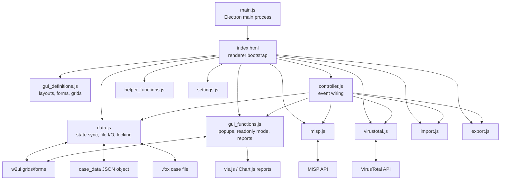

# Aurora Incident Response: Architecture and Reverse-Engineering Report

## 1. Executive Summary

Aurora Incident Response is a desktop DFIR case notebook built as a single-window Electron application whose real application root lives under `src/`. The repository is not organized as a modern modular frontend or service-backed desktop app. Instead, it is a classic Electron renderer-heavy application: `main.js` creates the shell window, and almost all business logic, persistence, integrations, and reporting behavior run in one browser context through globally loaded scripts. The core UI is a set of `w2ui` grids representing incident-response artifact classes, backed by one global JSON object named `case_data`. That object is serialized to a single `.fox` file on disk. The user-visible application is versioned as 0.6.6, and the latest release published in the repository is also 0.6.6 from March 29, 2021.[^repo] [^srcdir] [^pkg] [^index]

Aurora is best understood as a codified “Spreadsheet of Doom” for incident response. It is not generic CRUD with arbitrary tables. The data model, grid structure, and cross-view actions are all IR-specific: timeline events carry kill-chain and source/destination host semantics, malware rows can be promoted into investigated hosts or sent to VirusTotal or MISP, network indicators can be sent to MISP, exfiltration rows can be converted into timeline entries, and the reporting views derive visual timeline, lateral movement, and activity histograms from timeline and system inventory data.[^readme] [^defs] [^controller] [^gui]

Architecturally, the codebase is tightly coupled and global-state driven. `gui_definitions.js` declares layouts, toolbar items, sidebars, forms, and grids. `controller.js` wires user events to function calls. `data.js` is the state-transfer and persistence hub: it copies data from `w2ui` grids into `case_data`, writes JSON files, reopens them, applies rudimentary migrations, manages the advisory lock bit, and starts/stops autosave and autoupdate timers. `gui_functions.js` contains popup helpers, readonly/editable toggles, and the three reporting transformations. There is no explicit model layer, no IPC contract beyond the shutdown `cleanup()` call, no test suite, and no build step beyond running Electron from the `src` directory.[^index] [^defs] [^controller] [^data] [^gui]

The locking model is simple but fragile. Aurora stores a boolean `locked` flag inside the same case file it is trying to protect. Opening an unlocked file causes Aurora to claim the lock, switch the UI into editable mode, and autosave every five minutes. Opening a locked file causes Aurora to enter readonly mode and poll the file every minute for updates. There is no lock owner identity, no lease, no timestamp, no atomic compare-and-set, and no merge strategy. It is advisory locking implemented by cooperative overwrite of shared JSON.[^data] [^gui]

Several important implementation defects materially affect maintainability. The OSINT grid is accidentally saved from and, in one refresh path, reloaded from the Systems grid. New-case creation aliases `case_data` directly to `data_template` instead of cloning it, which makes template mutation and state carry-over plausible. The force-unlock path contains toolbar method typos (`ensable`) that likely break the workflow before the save occurs. Migration code contains a `casedata.killchain` typo and broken “newer version” detection. CSV import includes the header row as data and uses a naive parser for records. CSV export does not quote or escape values. The Action Items toolbar is not re-enabled when leaving readonly mode.[^data] [^gui] [^import] [^export] [^helpers] [^template]

From a security and upgrade standpoint, Aurora is risky by current Electron standards. The main process globally trusts invalid TLS certificates, always opens DevTools, and does not configure modern `BrowserWindow` isolation settings. The renderer code assumes direct Node access and `electron.remote`, which matches old Electron behavior but conflicts with the checked-in `package.json` dependency on Electron `^16.0.6`. Electron’s documented defaults and breaking changes indicate that Aurora’s checked-in runtime assumptions align more closely with the README and lockfile’s Electron 4-era world than with the current `package.json`.[^main] [^pkg] [^pkglock] [^electron-webprefs] [^electron-14] [^electron-security]

The codebase is still maintainable, but only if a developer first accepts its actual operating model: a global-script Electron app, with `w2ui` grids as the working UI state, `case_data` as the serialized state, and explicit copy/sync boundaries between them. Once that model is clear, the repo becomes much easier to reason about. The rest of this report reconstructs that model in detail.[^index] [^defs] [^controller] [^data]

## 2. What the Application Is For

Aurora is designed to help incident responders capture, manage, and report the heterogeneous artifacts that accumulate during an investigation: host events, malware samples, compromised accounts, network indicators, exfiltration evidence, OSINT references, investigator roster, evidence inventory, action items, and free-form case notes. The README explicitly frames it as an evolution of the FOR508 “Spreadsheet of Doom,” and the code confirms that the application is built around the operational needs of a live IR engagement rather than generic recordkeeping.[^readme] [^defs] [^controller]

The intended users are analysts conducting or coordinating incident-response engagements, especially teams that need one shared case file passed among analysts. That explains Aurora’s prominent file-lock workflow, readonly/editable mode switch, investigator ownership fields, evidence tracking, and report-oriented derived views. A generic desktop CRUD tool would not have concepts such as `first_compromise`, kill-chain tagging, `direction` arrows between systems, `visual` timeline inclusion flags, “To Timeline” conversion actions, or malware/network rows that can be pushed to MISP.[^defs] [^controller] [^data] [^gui]

What makes Aurora different from a generic CRUD desktop app is its domain-specific graph of relationships and derived workflows. The Systems grid is the canonical inventory of hosts and actor infrastructure. Timeline rows reference those systems as event host and source host. Investigated Systems summarize host triage and can be pushed into the timeline. Malware rows are tied to systems and can produce timeline events, investigated hosts, VirusTotal lookups, and MISP attributes. Network indicators carry domain/IP/port/context and can produce MISP attributes. Exfiltration rows model staging system, original system, and exfiltration destination, then optionally become timeline events. Reporting views are generated from those investigation artifacts rather than stored as first-class records.[^defs] [^controller] [^gui]

The investigative workflows Aurora appears designed to support include:

- maintaining a master incident timeline with analyst attribution and follow-up flags,
- tracking which systems have been investigated and their current verdict/report status,
- tracking malware or tooling found on disk and linking it to hosts,
- recording compromised accounts and network indicators,
- documenting exfiltration artifacts and staging paths,
- keeping a system inventory with type, IP, owner, and description,
- assigning work to investigators,
- tracking evidence and chain-of-custody-style acquisition metadata,
- maintaining case notes and action items,
- producing presentation-ready timeline, lateral movement, and hourly activity views,
- pushing selected observables to MISP and querying malware hashes in VirusTotal.[^defs] [^controller] [^gui] [^misp] [^vt]

## 3. High-Level Architecture

Aurora has a two-process Electron runtime in form, but functionally it behaves like a renderer-centric monolith. The Electron main process in `src/main.js` only creates the browser window, configures a minimal native menu, intercepts external navigation, bypasses certificate errors, and mediates shutdown through a renderer call to `cleanup()`. The renderer, bootstrapped by `src/index.html`, loads all libraries and first-party scripts globally and owns nearly all application behavior.[^main] [^index]

Within the renderer, the architecture is split by concern rather than by encapsulated module system:

- `gui_definitions.js` defines static UI configuration objects for layouts, toolbar, sidebar, forms, and all grids.
- `controller.js` attaches event handlers to those `w2ui` objects.
- `data.js` handles synchronization between grid state and persisted JSON, file I/O, locking, timers, and some cross-grid propagation.
- `gui_functions.js` implements readonly/editable UI mode switching, popup construction, and the three reporting transformations.
- `misp.js`, `virustotal.js`, `import.js`, and `export.js` are integration/utility modules invoked by the controller.
- `helper_functions.js` contains small helpers such as CSV parsing and external-browser launch.[^defs] [^controller] [^data] [^gui] [^misp] [^vt] [^import] [^export] [^helpers]

Aurora’s real state model is also split in two. While the user is editing, authoritative live UI state mostly lives inside `w2ui.<grid>.records` and form records. `case_data` is the serialization object and secondary runtime store. Before saving, before switching many views, and before generating reports, Aurora calls `syncAllChanges()` to push grid state into `case_data`. Opening or refreshing a case performs the inverse transfer by copying arrays from `case_data` back into the relevant grids. This explicit copy boundary is central to understanding the app.[^data] [^gui]

The application does not use a database, backend service, or local IPC model for normal operations. Persistence is a single pretty-printed JSON case file with extension `.fox`. Network integrations are direct AJAX calls from the renderer to MISP or VirusTotal. The WebDAV path exists only as scaffolding and is not operational in the checked-in code.[^data] [^misp] [^vt] [^webdav] [^index] [^defs]

### Module interaction diagram



Aurora is therefore easiest to maintain if you treat it as a script-driven UI framework application with manual serialization, not as a componentized MVC/MVVM project. The names “controller” and “data” are directionally accurate, but they do not imply clean separation. The code freely shares globals, assumes script load order, and mutates shared structures in place.[^index] [^defs] [^controller] [^data] [^gui]

## 4. Runtime / Startup / Shutdown Model

`src/package.json` declares `main.js` as the Electron entrypoint, and the README instructs contributors to `cd Aurora-Incident-Response/src` before running Electron. That makes `src/` the actual app root. When Electron starts, `main.js` handles the `ready` event by creating a `BrowserWindow` sized 1600x900 with `icon: 'icon/aurora.ico'`, loading `index.html`, setting a small application menu, opening DevTools, and installing a `will-navigate` handler that routes `http:` and `https:` navigations to the external browser instead of allowing in-window navigation.[^pkg] [^readme] [^main]

`main.js` also installs an `app.on('certificate-error', ...)` handler that unconditionally calls `callback(true)`, which means Aurora trusts invalid TLS certificates globally for the application session. This affects all renderer-originated HTTPS requests and any remote resources the renderer loads. That is especially relevant because `index.html` loads Font Awesome from a CDN and the renderer issues direct AJAX requests to MISP and VirusTotal.[^main] [^index] [^misp] [^vt] [^electron-security]

On the renderer side, `index.html` first performs a CommonJS/DOM compatibility shim by temporarily undefining `module`, then loads vendored browser libraries (`vis.js`, `jQuery`, `w2ui`, `Chart.js`), external Font Awesome CSS, and all first-party scripts in a fixed order. Only after all scripts are loaded does the jQuery `$(function () { ... })` startup block run. That block creates the main `w2layout`, renders the toolbar and sidebar, renders the Timeline grid into the main panel, instantiates all other grids/forms/layouts off-screen, switches the UI to editable mode, registers controller handlers, starts autosave, and disables the WebDAV open button.[^index] [^defs] [^controller] [^data] [^gui]

### Startup sequence

```mermaid
flowchart TD
    A[Electron launches app] --> B[main.js createWindow()]
    B --> C[Create BrowserWindow]
    B --> D[loadFile('index.html')]
    B --> E[Set native app menu]
    B --> F[Install will-navigate external-link handler]
    B --> G[Install certificate-error bypass]
    B --> H[openDevTools()]

    D --> I[index.html loads JS/CSS]
    I --> J[data_template.js exposes storage_format_version and data_template]
    I --> K[Controller/data/gui modules define globals]
    K --> L[jQuery DOM ready]

    L --> M[Render main_layout]
    L --> N[Render toolbar, sidebar, timeline grid]
    L --> O[Instantiate remaining grids/forms/layouts in memory]
    L --> P[deactivateReadOnly()]
    L --> Q[registerComponents()]
    L --> R[startAutoSave()]
    L --> S[Disable File > Open Engagement (WebDav)]
```

The first rendered screen is the Timeline grid in editable mode. Importantly, editable mode is a UI state, not the same thing as “no lock exists.” The sidebar status text says “Case unlocked (edits allowed),” but `data_template.locked` is initialized to `true`, `lockedByMe` starts as `true`, and `case_data` initially aliases `data_template`. So Aurora boots as a local editable draft that, once first saved, will be written with the advisory lock bit already set. This is one of several places where “locked” and “editable” are conflated.[^template] [^data] [^gui] [^defs]

The shutdown sequence is mediated through a global “dirty” object, but it does not track unsaved changes in the conventional sense. `main.js` initializes `global.Dirty = { is_dirty: 'true' }` and intercepts window close. If that value is truthy, the main process cancels close and runs `cleanup()` inside the renderer. The renderer’s `cleanup()` function checks whether the case is currently locked by the current user. If yes, it sets `case_data.locked = false`, calls `saveSOD()`, then flips `global.Dirty.is_dirty` to `false` and closes the window. If not, it simply flips the dirty flag and closes. The main process then allows the second close to proceed because the global flag is no longer truthy.[^main] [^data]

That cleanup model has a few non-obvious consequences. Close interception happens every time, not only when there are unsaved changes. Unlocking on exit is “best effort”; `cleanup()` does not verify that `saveSOD()` succeeded before closing. If save fails during close, the file may remain locked on disk or the user may lose unsaved work. On macOS, `window-all-closed` quits unconditionally, so Aurora does not implement the more persistent native macOS app lifecycle even though `activate` can recreate a window if the app is still alive.[^main] [^data]

### Pseudocode for startup and close

```text
main.js:
  on app ready:
    create BrowserWindow
    load index.html
    set native menu
    open devtools
    on will-navigate(http/https): openExternal(url), preventDefault
    on certificate-error: accept certificate
    on window close:
      if global.Dirty.is_dirty:
        preventDefault
        renderer.executeJavaScript("cleanup()")

index.html:
  on DOM ready:
    build layout
    render toolbar + sidebar + timeline grid
    instantiate all hidden grids/forms
    set editable mode
    register event handlers
    start autosave
    disable WebDAV open button

renderer cleanup():
  if case_data.locked && lockedByMe:
    case_data.locked = false
    saveSOD()
  global.Dirty.is_dirty = false
  close window
```

## 5. Repository Map

The repository root is small. It contains a top-level `images/` folder used by the README, legal/metadata files, and a `src/` folder that contains the actual application. Inside `src/`, the code splits into first-party scripts, vendored frontend libraries, templates, stylesheets, and static assets.[^repo] [^srcdir] [^readme]

Aurora’s main execution path is concentrated in a small number of files: `main.js`, `index.html`, `gui_definitions.js`, `controller.js`, `data.js`, and `gui_functions.js`. Everything else either feeds those files or hangs off their dispatch paths.[^main] [^index] [^defs] [^controller] [^data] [^gui]

### Important directories

| Path | Responsibility |
|---|---|
| `README.md` | User/developer overview, build instructions, source navigator, but partially stale |
| `images/` | Screenshots used in repository documentation |
| `src/` | Actual Electron application root |
| `src/css/` | First-party Aurora styling plus vendored CSS for `vis.js` and `w2ui` |
| `src/js/` | Vendored browser libraries and one first-party WebDAV helper |
| `src/icon/` | Application icons referenced by Electron packaging/runtime |
| `src/img/` | Toolbar/logo assets and small status icons such as VirusTotal result icons |
| `src/templates/` | W2UI form template HTML |
| `src/*.js` | First-party application logic modules |
| `src/package.json` | Electron runtime/package metadata for app root |

### Feature-to-file matrix

| Feature | Main files | State touched | External dependency |
|---|---|---|---|
| App bootstrap and shutdown | `src/main.js`, `src/index.html`, `src/data.js` | `global.Dirty`, `lockedByMe`, `case_data.locked` | Electron |
| Layout, navigation, grids | `src/gui_definitions.js`, `src/controller.js`, `src/index.html` | `w2ui` widgets, sidebar selection | jQuery, w2ui, Font Awesome |
| Case file persistence and locking | `src/data.js`, `src/data_template.js`, `src/gui_functions.js` | `case_data`, `currentfile`, timers, lock status | Electron dialog/fs |
| Case configuration popup | `src/gui_definitions.js`, `src/controller.js`, `src/templates/case_details_form.html` | case metadata, MISP/VT settings | w2ui form |
| CSV import/export | `src/import.js`, `src/export.js`, `src/helper_functions.js` | selected grid records, import globals | Electron dialog/fs |
| MISP push workflow | `src/misp.js`, `src/gui_functions.js`, `src/controller.js` | `case_data.misp*`, `grd_add_misp.records` | jQuery AJAX |
| VirusTotal lookup | `src/virustotal.js`, `src/controller.js`, `src/gui_definitions.js` | `case_data.vtapikey`, `malware[].vt` | jQuery AJAX |
| Visual timeline | `src/gui_functions.js`, `src/css/aurora.css` | `case_data.timeline` | vis.js |
| Lateral movement graph | `src/gui_functions.js`, `src/css/aurora.css` | `timeline`, `systems` | vis.js, Font Awesome |
| Activity plot | `src/gui_functions.js` | `timeline` | Chart.js |
| Remote storage scaffold | `src/js/webdav_lib.js`, `src/data.js`, `src/gui_definitions.js`, `src/controller.js` | intended `currentmethod`, WebDAV form | raw XHR / WebDAV |

The map above is the practical dependency structure a maintainer will actually touch. The `src/fonts` and `src/webfonts` directories appear to support vendored CSS/icon libraries rather than Aurora-specific behavior.[^srcdir] [^index] [^defs]

## 6. Module-by-Module Analysis

### `src/main.js`

Role: Electron main-process shell. It creates the window, sets the native application menu, intercepts close, handles external navigation, and globally disables TLS certificate validation. It does not contain domain logic.[^main]

Who depends on it: the whole app depends on it as the entrypoint, but only the renderer `cleanup()` function is directly invoked from it through `executeJavaScript('cleanup()')`.[^main] [^data]

State touched: `global.Dirty.is_dirty` in the main process, window lifecycle, and Electron session certificate behavior. It also indirectly depends on the renderer exposing a global `cleanup()` function.[^main] [^data]

Logic type: shell/hosting code, with security-relevant configuration. Notably, it always opens DevTools and trusts all certificates.[^main]

### `src/index.html`

Role: renderer bootstrapper and application composition root. It is not “just HTML.” It loads all scripts and styles, applies the CommonJS shim, creates every `w2ui` widget, selects the initial view, calls `deactivateReadOnly()`, registers all event handlers, starts autosave, and disables WebDAV UI.[^index]

Who depends on it: every first-party module depends on the load order it establishes. No module loader exists beyond script tags.[^index]

State touched: it creates the `w2ui` widget registry and therefore the runtime UI state containers used by almost every other file.[^index] [^defs] [^controller]

Logic type: bootstrap/orchestration.

### `src/gui_definitions.js`

Role: declarative UI registry plus some embedded render logic. It defines layouts, the toolbar, sidebar, case form, WebDAV form, all investigation grids, the MISP popup grid, the import mapping grid, and about-popup content. It also seeds `var case_data = data_template` and defines a `renderSafe` helper applied to many editable text/list columns.[^defs] [^template]

Who depends on it: `index.html` instantiates its configs; `controller.js` assumes the named `w2ui` objects exist; `gui_functions.js` and `data.js` rely on the grid names and columns declared here.[^index] [^controller] [^data] [^gui]

State touched: UI state definitions, editable options seeded from `case_data` enumerations and arrays, sidebar lock-status HTML, and popup form schemas. It does not persist data itself, but it defines the shape of almost every persisted row.[^defs] [^template]

Logic type: mostly configuration, with some core UI logic mixed in. The OSINT URL renderer and generic safe-text renderer are important examples.[^defs]

### `src/controller.js`

Role: event dispatcher. `registerComponents()` wires toolbar clicks, sidebar navigation, grid toolbar buttons, grid context-menu actions, and case form actions to concrete functions in `data.js`, `gui_functions.js`, `misp.js`, `virustotal.js`, `import.js`, and `export.js`.[^controller]

Who depends on it: `index.html` calls `registerComponents()` at startup; almost every user interaction flows through it.[^index] [^controller]

State touched: it reads and mutates `w2ui` grid records directly, frequently creates new rows, and sometimes mutates globals via undeclared assignments. It also depends on `lockedByMe` and `case_data` when repopulating dropdown choices.[^controller] [^data]

Logic type: glue code with significant embedded domain logic. Examples include “malware row to investigated host,” “exfiltration row to timeline event,” and “investigated system to timeline.”[^controller]

### `src/data.js`

Role: central state-transfer and persistence layer. It owns `currentfile`, `currentmethod`, `lockedByMe`, `case_data`, timers, sync/save/open/update flows, migration routines, lock management, host-name propagation, and the renderer-side `cleanup()` invoked during shutdown.[^data]

Who depends on it: `controller.js` calls most of its entrypoints; `gui_functions.js` relies on its globals; `index.html` starts autosave through it.[^controller] [^gui] [^index]

State touched: essentially all persisted state plus critical runtime state. It copies grid `records` arrays into `case_data`, writes/reads JSON, and controls UI mode changes via calls into `gui_functions.js`.[^data] [^gui]

Logic type: core logic, but also the most bug-prone file in the repo. This is the file that most directly determines how Aurora really behaves.[^data]

### `src/data_template.js`

Role: schema seed. It defines `storage_format_version = 7`, the base `data_template` object, and lookup arrays such as `event_types`, `system_types`, `verdicts`, `status`, `task_types`, `direction`, `killchain`, `evidence_types`, and `misp_attribute_types`.[^template]

Who depends on it: almost everything. `gui_definitions.js` uses the enumerations to populate list editors and searches. `data.js` uses `storage_format_version` and seeds `case_data`.[^template] [^defs] [^data]

State touched: persisted schema defaults, but not a full declaration of all persisted keys. MISP and VirusTotal settings are added dynamically elsewhere.[^template] [^controller]

Logic type: configuration/schema template.

### `src/gui_functions.js`

Role: UI behavior helpers and reporting engine. It toggles readonly/editable mode, opens popups, prepares MISP attribute candidates, transforms the timeline into vis.js items, builds the lateral movement graph, generates the activity histogram, and provides helper functions for system lookup and context-menu enable/disable.[^gui]

Who depends on it: `controller.js` calls it for popup actions and report navigation; `data.js` uses it to switch UI mode.[^controller] [^data]

State touched: toolbar enable/disable state, grid column `editable` definitions, sidebar lock HTML, popup contents, and derived report datasets based on `case_data` and grid records.[^gui] [^data]

Logic type: UI logic plus derived-view logic. This is where several important security and correctness issues live because report HTML is assembled from raw case data.[^gui]

### `src/import.js`

Role: CSV import workflow. It opens a CSV file, derives mappable field names from the target grid, launches the import mapping popup, and then appends imported rows to the selected grid.[^import]

Who depends on it: `controller.js` invokes `show_import_dialog()` from multiple grid toolbars; `gui_functions.js` provides the popup rendering helper.[^controller] [^gui] [^import]

State touched: implicit globals `import_lines`, `import_fieldset`, `import_grid`, `firstline`, and the target grid’s `records`.[^import]

Logic type: utility/integration code with data mutation.

### `src/export.js`

Role: CSV export workflow. It serializes a grid to comma-separated text and writes it to disk.[^export]

Who depends on it: `controller.js` invokes it from many grid toolbars.[^controller] [^export]

State touched: reads a grid’s `columns` and `records`; writes a file through Electron/Node.[^export]

Logic type: utility code.

### `src/misp.js`

Role: MISP integration. It can test connectivity to an existing MISP event and send selected attributes to that event.[^misp]

Who depends on it: `controller.js` triggers connectivity tests via the case form and sending via the MISP popup grid. `gui_functions.js` prepares the popup grid’s candidate attribute rows from malware or network records.[^controller] [^gui] [^misp]

State touched: form record values for test, persisted `case_data.mispserver`, `case_data.mispapikey`, `case_data.mispeventid` for actual sending, and the popup grid selection.[^controller] [^misp]

Logic type: external integration.

### `src/virustotal.js`

Role: VirusTotal integration. It tests an API key using a fixed sample MD5 and checks a malware record’s `md5` against VirusTotal, then writes one of three coarse status values back into the malware row’s `vt` field.[^vt]

Who depends on it: `controller.js` triggers the test from the case form and the lookup from Malware grid context menu.[^controller] [^vt]

State touched: form `vtapikey` for test, `case_data.vtapikey` for actual lookup, and individual malware records through `grid.set(recid, { vt: ... })`.[^controller] [^vt]

Logic type: external integration.

### `src/helper_functions.js`

Role: small utilities. It wraps `shell.openExternal` in `browser_open()`, provides a regex-based CSV parser (`CSVtoArray`), and a naive split-based parser (`CSVtoArrayEasy`).[^helpers]

Who depends on it: toolbar/help/logo actions, import popup setup, and import parsing all depend on these helpers.[^controller] [^gui] [^import] [^helpers]

State touched: none significant beyond input/output values.[^helpers]

Logic type: utility code.

### `src/settings.js`

Role: global library configuration. It sets `w2utils.settings.timeFormat` and `dateFormat`.[^settings]

Who depends on it: the renderer at startup; indirectly all date/time editing/rendering in `w2ui`.[^index] [^settings]

State touched: global `w2ui` formatting settings.

Logic type: configuration.

### `src/templates/case_details_form.html`

Role: the HTML template for the case configuration form. It defines three pages matching the General, MISP, and VirusTotal tabs, plus test buttons and the save button.[^caseform] [^defs]

Who depends on it: `gui_definitions.js` references it through `formURL`, and `controller.js` wires its actions.[^defs] [^controller] [^caseform]

State touched: indirectly affects the form record fields written to `case_data`.

Logic type: template.

### `src/js/*`

Role: mixed directory.

- Vendored/minified third-party libraries: `jquery.min.js`, `w2ui-1.5.rc1.min.js`, `vis.js`, `chart.js`.
- First-party code: `webdav_lib.js`, a tiny global `WebDAV` helper with `dir()`, `read()`, and an empty `write()` stub.[^index] [^webdav] [^srcdir]

Who depends on it: the whole renderer depends on the vendored libraries; the WebDAV helper is barely used and not successfully integrated.[^index] [^webdav]

State touched: library globals, and for WebDAV, none persistent.

Logic type: third-party dependencies plus an abandoned/scaffolded helper.

### `src/css/*`

Role: styling.

- `aurora.css` is first-party and styles the report views, especially vis.js timeline item classes and graph container sizing.
- `vis.css` and `w2ui-1.5.rc1.min.css` are vendored third-party CSS.[^index] [^css]

Who depends on it: the whole renderer, especially report screens and `w2ui`.[^index] [^css]

State touched: presentation only.

Logic type: styling.

### `src/package.json`

Role: Electron app package metadata. It declares the main file, start script, and packaging script. It also reveals naming drift: package name `sod`, packaging output name `yeti-desktop`, and an icon path that does not match the runtime icon path used in `main.js`.[^pkg] [^main]

Who depends on it: npm/Electron runtime when launching from `src/`.

State touched: none at runtime beyond choosing `main.js`.

Logic type: build/runtime metadata.

### `README.md`

Role: human documentation. It correctly communicates Aurora’s IR purpose and high-level file roles, but several implementation details are stale compared with current code and metadata.[^readme]

Who depends on it: developers and users, but not runtime.

State touched: none.

Logic type: documentation.

## 7. UI Architecture and View Model

Aurora’s UI is built around a three-panel `w2layout`: top toolbar, left sidebar, and main content area. The main area shows either one `w2ui` grid or a generated report container. The top toolbar exposes file and case-management actions. The sidebar is the true workspace navigator and groups views into Investigation, Reporting, and Case Management.[^defs] [^index] [^controller]

The popup model is also `w2ui`-driven. `popup_layout` hosts the case form or MISP popup grid; `webdav_popup_layout` exists but is not meaningfully used; `about_popup_layout` hosts static HTML. There is no router, component hierarchy, or stateful view model beyond “the currently displayed grid/report in the main panel.”[^defs] [^gui]

### Main layout

- Top: `config.toolbar`, a `w2toolbar` with File, Case Configuration, Help, and a logo HTML item.
- Left: `config.sidebar`, a `w2sidebar` with grouped nodes and a bottom lock-status strip.
- Main: initially `grd_timeline`; later swapped to other grids or report HTML.[^defs] [^index]

### Toolbar

The File menu offers New Engagement, Open Engagement (File), Open Engagement (WebDav), Save Engagement, Release Lock for Others, Claim Lock to Edit, and Force Unlock to Edit. Case Configuration opens the case details popup. Help offers Online Help and About. The logo opens the project author’s website in an external browser. The WebDAV entry exists in the toolbar definition but is disabled during startup.[^defs] [^index] [^controller] [^helpers]

### Sidebar

The sidebar is the main workspace switcher:

- Investigation: Timeline, Investigated Systems, Malware/Tools, Compromised Accounts, Network Indicators, Exfiltration, OSInt, Systems
- Reporting: Visual Timeline, Lateral Movement, Activity Plot
- Case Management: Investigators, Evidence, Action Items, Case Notes[^defs]

Sidebar clicks usually call `syncAllChanges()` first, then repopulate dropdown editors if editing is allowed, and then swap the main panel to the chosen grid. The reporting nodes call specialized generator functions instead of simply switching grids.[^controller] [^data] [^gui]

### Popups and forms

The main editable popup is the case form loaded from `templates/case_details_form.html`. It uses three tabs:

- General: case ID, client, engagement start, summary
- MISP: server, API key, event ID/UUID, connection test
- VirusTotal: API key, connection test[^defs] [^caseform] [^controller]

The MISP popup is not a free-form form. It is actually a dedicated grid, `grd_add_misp`, populated from the selected malware or network row with Aurora field type, chosen MISP type, value, and comment, then sent via a toolbar action.[^defs] [^gui] [^controller] [^misp]

### Grids and user-facing workspaces

#### Timeline

Why it exists: the master event chronology for the investigation. This is Aurora’s central artifact list and the source for all three reporting views.[^defs] [^gui]

Data it owns: `case_data.timeline`. Important fields include `date_time`, `event_type`, `event_host`, `direction`, `event_source_host`, `killchain`, `event_data`, `notes`, `visual`, `followup`, `attribution`, and `owner`.[^defs] [^template]

Modules and handlers: defined in `gui_definitions.js`, displayed through sidebar handling in `controller.js`, persisted by `data.js`, and consumed by `showTimelineView()`, `getLateralMovements()`, and `getActivity()` in `gui_functions.js`. Toolbar supports add/remove/import/export. Context menu supports duplicate.[^defs] [^controller] [^data] [^gui]

Interaction model: this grid is where other views often push summarized findings. Investigated Systems, Malware, and Exfiltration have “To Timeline” actions that create rows here. The `visual` checkbox determines whether a row appears in the Visual Timeline and Lateral Movement views.[^controller] [^gui]

#### Investigated Systems

Why it exists: to track host triage status during an engagement, separate from the broader Systems inventory. It captures investigation-specific judgment rather than just static asset metadata.[^defs]

Data it owns: `case_data.investigated_systems` with fields such as `date_added`, `date_updated`, `first_compromise`, `hostname`, `verdict`, `summary`, `analysis_required`, `analysis_status`, `analyst`, and `report_status`.[^defs]

Modules and handlers: defined in `gui_definitions.js`; `controller.js` handles add/remove/import/export, auto-updates `date_updated` on any change, allows duplication, and can convert a row to a Timeline entry. `data.js` persists it.[^defs] [^controller] [^data]

Interaction model: `hostname` is chosen from Systems inventory; `analyst` is chosen from Investigators. This grid is one of the clearest examples of Aurora’s string-based foreign-key pattern.[^controller] [^data]

#### Malware / Tools

Why it exists: to capture file-based malware or tooling artifacts and tie them to hosts, hashes, timestamps, and analyst notes.[^defs]

Data it owns: `case_data.malware` with fields including `date_added`, `text` (filename), `path_on_disk`, `creation_date`, `modification_date`, `hostname`, `md5`, `vt`, `attribution`, and `notes`.[^defs]

Modules and handlers: defined in `gui_definitions.js`; `controller.js` handles add/remove/import/export, duplicate, “To hosts,” “To Timeline,” “Send to MISP,” and “Check VT.” `virustotal.js` writes the `vt` status. `gui_functions.js` builds the MISP attribute popup from a malware row.[^defs] [^controller] [^vt] [^gui] [^misp]

Interaction model: this is one of Aurora’s richest workspaces. It can promote a malware row into an Investigated Systems row, summarize it into a Timeline event, query VirusTotal, and generate MISP attributes. Its `vt` column is rendered using icons from `src/img/`.[^controller] [^gui] [^vt]

#### Compromised Accounts

Why it exists: to track identity artifacts separately from host or malware artifacts.[^defs]

Data it owns: `case_data.compromised_accounts` with fields such as `date_added`, `account_name`, `domain`, `sid`, `context`, `last_activity`, `privileges`, and `attribution`.[^defs]

Modules and handlers: defined in `gui_definitions.js`; `controller.js` gives it add/remove/import/export and duplicate behavior; `data.js` persists it.[^defs] [^controller] [^data]

Interaction model: mostly standalone. It does not currently feed reports or external integrations.[^controller]

#### Network Indicators

Why it exists: to track IOC-like network artifacts such as IPs, domains, ports, and contextual malware linkage.[^defs]

Data it owns: `case_data.network_indicators` with fields including `date_added`, `ip`, `domainname`, `port`, `context`, `last_activity`, `malware`, `whois`, and `attribution`.[^defs]

Modules and handlers: defined in `gui_definitions.js`; `controller.js` supports add/remove/import/export, duplicate, and “Send to MISP.” `gui_functions.js` builds the MISP popup candidates from a selected network row.[^defs] [^controller] [^gui] [^misp]

Interaction model: the `malware` field is populated from Malware records, again using string/list semantics. MISP conversion logic can produce `domain`, `ip-dst`, `domain|ip`, and `ip-dst|port` attributes depending on which fields are populated.[^controller] [^gui] [^misp]

#### Exfiltration

Why it exists: to model staged and exfiltrated content as a first-class investigative artifact rather than burying it in generic notes.[^defs]

Data it owns: `case_data.exfiltration` with fields such as `created`, `exfiltime`, `stagingsystem`, `original`, `exfil_to`, `filename`, `size`, `contents`, `notes` (captioned “Context”), and `attribution`.[^defs]

Modules and handlers: defined in `gui_definitions.js`; `controller.js` supports add/remove/import/export, duplicate, and “To Timeline.” `data.js` persists it.[^defs] [^controller] [^data]

Interaction model: systems are selected from Systems inventory, and the “To Timeline” action is intended to summarize an exfiltration into a timeline event. That implementation contains variable-clobbering bugs, so the generated summary text is not reliable.[^controller]

#### OSInt

Why it exists: to store investigation-relevant links and references.[^defs]

Data it owns: `case_data.osint`, intended to hold rows with `text` (short name), `url`, and `desc`.[^defs] [^data]

Modules and handlers: defined in `gui_definitions.js`; `controller.js` supports add/remove/import/export; `data.js` is supposed to persist it.[^defs] [^controller] [^data]

Interaction model: this is the only major grid with explicit URL validation and HTML escaping in its renderer. Valid `http`/`https` links become clickable anchors; invalid URLs render in red. However, `data.js` contains save/load path bugs that can overwrite or repopulate OSINT using Systems records in some code paths.[^defs] [^data]

#### Systems

Why it exists: to serve as the canonical host/system inventory used by other views. This is one of the most important base entities in Aurora.[^defs]

Data it owns: `case_data.systems` with fields `text` (hostname), `ip`, `system_type`, `os`, `owner`, `description`, and `pin`.[^defs] [^template]

Modules and handlers: defined in `gui_definitions.js`; `controller.js` supports add/remove/import/export and binds `onChange = updateSystems`; `data.js` persists it and propagates renamed systems into Timeline, Investigated Systems, Malware, and Exfiltration records.[^defs] [^controller] [^data]

Interaction model: most other grids treat Systems as the authoritative list of selectable hosts. String-based references are propagated by rename instead of through numeric IDs. The grid toolbar definition accidentally duplicates import/export items.[^defs] [^data]

#### Investigators

Why it exists: to represent people working the case so ownership fields elsewhere can be selected from a controlled list.[^defs]

Data it owns: `case_data.investigators` with `text` (short name), `full_name`, `affiliation`, `role`, `contact_email`, `contact_phone`, and `contact_other`.[^defs]

Modules and handlers: defined in `gui_definitions.js`; `controller.js` supports add/remove/import/export; `data.js` persists it.[^defs] [^controller] [^data]

Interaction model: Timeline `owner`, Investigated Systems `analyst`, Action Items `owner`, and Case Notes `owner` all draw from this list.[^controller] [^gui]

#### Evidence

Why it exists: to inventory collected evidence and acquisition metadata.[^defs]

Data it owns: `case_data.evidence` with fields such as `date_acquired`, `type`, `name`, `description`, `size`, `hash`, `provider`, and `location`.[^defs]

Modules and handlers: defined in `gui_definitions.js`; `controller.js` supports add/remove/import/export and duplicate; `data.js` persists it.[^defs] [^controller] [^data]

Interaction model: mostly standalone, but clearly intended for case management and reporting.[^defs]

#### Action Items

Why it exists: to track tasks associated with the investigation.[^defs]

Data it owns: `case_data.actions` with `date_added`, `date_due`, `task_type`, `task`, `status`, and `owner`.[^defs]

Modules and handlers: defined in `gui_definitions.js`; `controller.js` supports add/remove/import/export; `data.js` persists it; `gui_functions.js` toggles its editability in readonly mode.[^defs] [^controller] [^data] [^gui]

Interaction model: the owner comes from Investigators and status/type come from lookup enumerations. The toolbar is disabled in readonly mode, but `deactivateReadOnly()` forgets to re-enable that toolbar even though the column editability is restored.[^gui]

#### Case Notes

Why it exists: to hold free-form running notes attached to an owner and a date.[^defs]

Data it owns: `case_data.casenotes` with `date_added`, `note`, and `owner`.[^defs]

Modules and handlers: defined in `gui_definitions.js`; `controller.js` supports add/remove/import/export; `data.js` persists it.[^defs] [^controller] [^data]

Interaction model: simple but useful as a lightweight logbook complement to the more structured Timeline.[^defs]

#### Visual Timeline

Why it exists: to turn the structured Timeline grid into a presentation-friendly chronological visual.[^gui] [^css]

Data it owns: none persisted. It is derived from `case_data.timeline` rows whose `visual` flag is truthy and `date_time` is present.[^gui]

Modules and handlers: triggered by sidebar node `vis_timeline` in `controller.js`, generated by `showTimelineView()` and `timeline2vis()` in `gui_functions.js`, and styled by `aurora.css`.[^controller] [^gui] [^css]

Interaction model: event type determines CSS class and therefore appearance. Direction arrows influence content text. Raw event strings are interpolated into HTML.[^gui] [^css]

#### Lateral Movement

Why it exists: to derive a host-to-host graph from the Timeline.[^gui]

Data it owns: none persisted. It is derived from `case_data.timeline` and enriched by `case_data.systems` lookups for host type and IP.[^gui] [^data]

Modules and handlers: triggered by sidebar node `lateral`; generated by `getLateralMovements()` and `showLateralMovement()` in `gui_functions.js`; rendered by vis.js using Font Awesome icon groups.[^controller] [^gui] [^index]

Interaction model: only timeline rows with `visual` set and both host fields present are considered. Edge direction is inferred from `direction`. System type drives node icon/group.[^gui]

#### Activity Plot

Why it exists: to show analyst-observed activity density by hour of day.[^gui]

Data it owns: none persisted. It is derived from the timeline timestamps.[^gui]

Modules and handlers: triggered by sidebar node `activity`; generated by `getActivity()` and `showActivityPlot()` in `gui_functions.js`; rendered using Chart.js.[^controller] [^gui] [^index]

Interaction model: rows are bucketed by `new Date(date_time).getHours()`. The implementation attempts to exclude “Engagement Management” rows, but the actual event enumeration uses “Engagement,” so those rows are not excluded.[^template] [^gui]

## 8. Data Model and Persistence

Aurora’s data model is not hidden behind classes or schemas. It is an ad hoc JSON object plus a set of grid record arrays. Understanding exactly where each piece of state lives is essential to maintaining the app.[^data] [^template]

### Global runtime state

The important runtime globals are:

- `case_data`: current case storage object.
- `currentfile`: path of currently opened/saved `.fox` file.
- `currentmethod`: intended storage backend selector, effectively always `"file"`.
- `lockedByMe`: whether the current Aurora instance believes it owns the advisory lock.
- `storage_format_version`: current schema version, defined in `data_template.js`.
- `autosave_interval` and `autoupdate_interval`: timer handles.
- `lockstate`: UI text/HTML string shown at bottom of sidebar.
- `global.Dirty.is_dirty`: main-process flag controlling close interception.
- Import globals: `import_lines`, `import_fieldset`, `import_grid`, `firstline`.[^main] [^data] [^template] [^import] [^gui]

In addition, the code frequently creates accidental globals through undeclared assignments such as `mispserver`, `url`, `event_type`, `system1`, and `records`. Those values leak onto `window` because the renderer scripts are loaded into one shared global scope.[^controller] [^data] [^gui] [^misp] [^vt]

### Persisted case object

The base persisted object seeded by `data_template.js` is structurally:

```text
{
  storage_format_version: 7,
  locked: true,
  case_id: "XXX",
  client: "",
  start_date: "",
  summary: "",

  timeline: [],
  investigated_systems: [],
  malware: [],
  compromised_accounts: [],
  network_indicators: [],
  exfiltration: [],
  hosts: [],          // legacy/unused
  systems: [],
  osint: [],
  investigators: [],
  evidence: [],
  actions: [],
  casenotes: [],

  event_types: [...],
  system_types: [...],
  verdicts: [...],
  status: [...],
  task_types: [...],
  direction: [...],
  killchain: [...],
  evidence_types: [...]
}
```

This is not the full runtime schema. The case configuration popup writes additional keys directly into `case_data`: `mispserver`, `mispapikey`, `mispeventid`, and `vtapikey`. Those fields are persisted when the case is saved even though they are not declared in the template. The case form also uses `caseid` in the UI and maps it manually to persisted `case_id`.[^template] [^controller] [^defs]

### Lookup lists and enumerations

Aurora stores lookup lists inside the case file itself, not only in code. That means each case file carries its own `event_types`, `system_types`, `verdicts`, `status`, `task_types`, `direction`, `killchain`, and `evidence_types`. Grid editors and searches bind directly to those arrays.[^template] [^defs]

This design has two consequences:

1. schema migrations must update both structural arrays and lookup arrays;
2. changing an enumeration definition in code does not automatically fix older files unless `updateVersion()` patches them.[^data] [^template]

There are also correctness issues in the shipped enumerations. `verdicts` contains duplicate `id: 3` entries for `"Commodity"` and `"Clean"`. The 4→5 migration defines `"Other"` and `"Attacker Infra"` with the same `id: 8`.[^template] [^data]

### Relationships between entities

Aurora does not use stable foreign keys across tables. Relationships are string-based and human-readable:

- `timeline.owner`, `actions.owner`, `casenotes.owner`, and `investigated_systems.analyst` refer to `investigators[].text`.
- `timeline.event_host`, `timeline.event_source_host`, `investigated_systems.hostname`, `malware.hostname`, and exfiltration system fields refer to `systems[].text`.
- `network.malware` is selected from Malware rows.
- report generators join Timeline to Systems by hostname string, not ID.[^defs] [^controller] [^data] [^gui]

Because of that design, renaming a system is a cascading string-rewrite operation implemented by `updateSystems(event)` instead of an ID-preserving relationship. There is no equivalent cascade for investigator short names, malware names, or other relationships.[^data]

### Where UI state lives vs where persisted state lives

UI state lives primarily in:

- `w2ui.<grid>.records`
- `w2ui.case_form.record`
- toolbar enabled/disabled state
- grid column `editable` metadata
- sidebar selection and bottomHTML lock indicator
- timer handles and current main-panel content[^index] [^defs] [^gui] [^data]

Persisted state lives in:

- `case_data`
- the `.fox` JSON file on disk[^data]

The two are synchronized manually, not reactively.

### UI → storage and storage → UI boundaries

The primary UI → storage boundary is `syncAllChanges()`. It calls `save()` on each grid and then copies `records` arrays into `case_data`. The case form is different: its save action writes directly to `case_data`, so `syncAllChanges()` intentionally ignores case metadata.[^data] [^controller]

The primary storage → UI boundary is `openSODFile()` or `updateSODFile()`, which parse the case JSON and then assign arrays back into the relevant grids, refresh the grids, and repopulate some list editor items.[^data]

That means a maintainer should think of Aurora as having manual synchronization checkpoints rather than a unified live model.

### Record IDs

Each grid row carries a `recid` because `w2ui` requires it. `getNextRECID(grid)` scans the target grid for the highest current `recid` and returns max+1. These IDs are local to a grid, persisted into JSON, and not globally unique across the case. No UUIDs or durable relational keys exist.[^data]

### Save/open/refresh/sync boundaries

- Switching most sidebar views calls `syncAllChanges()` first.
- Saving a case calls `syncAllChanges()` before writing JSON.
- Generating reports calls `syncAllChanges()` before deriving datasets.
- Opening a case loads arrays into grids.
- Readonly autoupdate reopens the file every minute and reloads grids.
- Editing case details bypasses grids and writes directly to `case_data`.[^controller] [^data] [^gui]

One important bug sits exactly on this boundary: `syncAllChanges()` sets `case_data.osint = w2ui.grd_systems.records` instead of `w2ui.grd_osint.records`, and `updateSODFile()` similarly loads `grd_osint.records = case_data.systems`. So OSINT can be corrupted by state transfer even if the OSINT grid definition itself is correct.[^data]

### Versioning and migration

Versioning is controlled by `storage_format_version`, currently `7`. Opening an older file calls `updateVersion(current_version)`. The intended migration chain is:

- `<3`: add `direction` and `killchain`
- `<4`: add `evidence`
- `<5`: add `system_types` and event type `C2`
- `<6`: add `osint`
- then mark version 6 and version 7[^template] [^data]

The implementation is shaky. The “newer file version” guard checks `case_data.hasOwnProperty(storage_format_version)` instead of `hasOwnProperty('storage_format_version')`, so the guard is effectively broken. The `<3` migration writes `casedata.killchain` instead of `case_data.killchain`. There is no real 6→7 structural patch, only a version bump. So schema evolution exists as an idea and partially as code, but it is not robust.[^data]

### File locking metadata/state

Locking is a single persisted boolean, `case_data.locked`. There is no lock owner, no analyst identity, no host, no PID, no lease timeout, and no separate lock file. Readonly/editable UI mode is tracked separately by `lockedByMe` and UI toggles.[^data] [^gui]

This means the system tracks at least three distinct notions of state:

1. persisted advisory lock on disk: `case_data.locked`
2. current instance’s belief about ownership: `lockedByMe`
3. UI editability state: readonly vs editable toolbars/columns[^data] [^gui]

Those notions are not perfectly aligned, and the labels shown to the user (“Case unlocked”) actually mean “UI unlocked for editing,” not “no advisory lock exists on disk.”[^defs] [^data] [^gui]

### State/data-flow diagram

```mermaid
flowchart LR
    U[User edits grids/forms] --> G[w2ui grid.records<br/>w2ui.case_form.record]
    G -->|syncAllChanges()| C[case_data]
    F[Case form Save action] --> C
    C -->|saveSODFile()| J[.fox JSON file]
    J -->|openSODFile()/updateSODFile()| C
    C -->|assign arrays to records| G
    C -->|timeline2vis/getLateralMovements/getActivity| R[Derived report datasets]
    R --> V[vis Timeline / vis Network / Chart.js]
```

### Pseudocode for the actual persistence model

```text
syncAllChanges():
  for each grid:
    grid.save()
    case_data.<matching_array> = grid.records
  // except case form values, which are written directly elsewhere

saveSODFile():
  if case_data.locked && !lockedByMe:
    alert and abort
  syncAllChanges()
  if no currentfile:
    prompt for save path
  write JSON.stringify(case_data, pretty) to currentfile

openSODFile():
  prompt for path
  parse file JSON into case_data
  if older version:
    updateVersion()
  load case_data arrays into each grid
  if case_data.locked:
    switch readonly + startAutoUpdate()
  else:
    requestLock()
```

## 9. Workflow Reconstruction

### 9.1 Application startup

Trigger: launching Electron from `src/`.[^pkg] [^readme]

Main functions involved: `main.js:createWindow()`, then `index.html` DOM-ready block, then `deactivateReadOnly()`, `registerComponents()`, and `startAutoSave()`.[^main] [^index] [^gui] [^controller] [^data]

State transitions: `case_data` starts as `data_template`; `lockedByMe` starts true; autosave timer starts immediately; WebDAV menu entry is disabled.[^data] [^index]

UI transitions: Timeline grid appears in main panel; toolbar/sidebar become available; UI is editable.[^index] [^gui]

File/network operations: no case file is opened automatically; Font Awesome CSS is fetched remotely; later autosave may prompt for a file path if the user has not saved yet.[^index] [^data]

Edge cases: because autosave starts before any case file exists, an unsaved fresh session can get a save dialog after five minutes.[^index] [^data]

### 9.2 Creating a new engagement / new case

Trigger: toolbar `File > New Engagement`.[^defs] [^controller]

Main functions involved: `newSOD()` in `data.js`.[^data]

State transitions: `case_data = data_template`, all grids are cleared, `currentfile = ""`, autoupdate is stopped, autosave is started, `lockedByMe = true`, and UI mode is set editable.[^data] [^gui]

UI transitions: main panel returns to Timeline; lock status becomes “Case unlocked (edits allowed).”[^data] [^gui]

File/network operations: none until later save/autosave.[^data]

Edge cases: `case_data` is assigned the template object by reference, not deep-cloned. Since the case form and migrations mutate `case_data`, a “new” case may inherit mutated template state from prior use in the same session.[^data] [^template]

### 9.3 Opening an existing case file

Trigger: toolbar `File > Open Engagement (File)`.[^defs] [^controller]

Main functions involved: `openSOD() -> openSODFile()` in `data.js`.[^data]

State transitions: after confirmation, Aurora opens a file picker, reads JSON into `case_data`, optionally runs `updateVersion()`, copies arrays into grids, and then branches on `case_data.locked`.[^data]

UI transitions: Timeline grid is selected and shown. If the file is already locked, Aurora alerts the user, sets `lockedByMe = false`, activates readonly mode, stops autosave, and starts autoupdate. If not locked, it calls `requestLock()`, which claims the lock and puts the UI into editable mode.[^data] [^gui]

File/network operations: synchronous file dialog and synchronous file read.[^data]

Edge cases: newer-version detection is broken; requestLock is called with an ignored argument; opening a case that is “locked by you” in another instance is indistinguishable from “locked by another analyst.”[^data]

### 9.4 Saving a case

Trigger: toolbar save, autosave timer, release/lock operations, or cleanup on close.[^controller] [^data]

Main functions involved: `saveSOD() -> saveSODFile()`, which calls `syncAllChanges()`.[^data]

State transitions: all grid edits are flushed into `case_data`; `storage_format_version` is set to current version; if no file path exists yet, Aurora prompts for one.[^data]

UI transitions: a temporary “Saving file...” lock overlay is shown on `#main`; sidebar is refreshed.[^data]

File/network operations: synchronous save dialog if needed, then synchronous JSON write.[^data]

Edge cases: save is blocked if the file is locked and `lockedByMe` is false. CSV/HTML/report states are not separately saved because everything eventually collapses into `case_data`. OSINT data may be saved incorrectly due to the sync bug.[^data]

### 9.5 Read-only mode vs editable mode

Trigger: opening a locked case, releasing a lock, requesting/forcing a lock, or startup/new case.[^data] [^gui]

Main functions involved: `activateReadOnly()` and `deactivateReadOnly()`.[^gui]

State transitions: readonly mode disables save/release-lock, enables request-lock/force-unlock, disables grid toolbar add/remove/import/export buttons, deactivates context-menu items, nulls out `editable` column metadata, and starts autoupdate when entered through lock workflows. Editable mode reverses those choices and repopulates dropdown lists from `case_data`.[^gui] [^data]

UI transitions: sidebar lock label changes; grid editing becomes or ceases to be possible.[^gui]

File/network operations: readonly mode typically pairs with autoupdate; editable mode with autosave.[^data]

Edge cases: `deactivateReadOnly()` forgets to re-enable the Action Items toolbar, so that grid can remain partially disabled after switching back to edit mode.[^gui]

### 9.6 Requesting a lock

Trigger: toolbar `Claim Lock to Edit`, or opening an unlocked file.[^defs] [^controller] [^data]

Main functions involved: `requestLock()` in `data.js`.[^data]

State transitions: Aurora first calls `updateSOD()` to refresh from disk, then aborts if the file still appears locked. Otherwise it stops autoupdate, starts autosave, activates editable mode, sets `lockedByMe = true`, sets `case_data.locked = true`, and saves the file.[^data] [^gui]

UI transitions: readonly restrictions are removed; sidebar lock text changes to editable.[^gui]

File/network operations: synchronous reread of the case file, followed by a save/write.[^data]

Edge cases: there is no atomic claim. Two analysts can both read “unlocked” and then race to save `locked: true`. Last writer wins.[^data]

### 9.7 Releasing a lock

Trigger: toolbar `Release Lock for Others`.[^defs] [^controller]

Main functions involved: `releaseLock()` in `data.js`.[^data]

State transitions: `case_data.locked = false`; Aurora saves the case, sets `lockedByMe = false`, activates readonly mode, stops autosave, and starts autoupdate.[^data] [^gui]

UI transitions: UI becomes readonly immediately after release.[^gui]

File/network operations: synchronous JSON write, then periodic rereads once autoupdate is active.[^data]

Edge cases: no ownership check beyond local `lockedByMe` semantics. If save fails, the UI can flip readonly even though the lock bit may not have changed on disk.[^data]

### 9.8 Force-unlocking / force-acquiring

Trigger: toolbar `Force Unlock to Edit`.[^defs] [^controller]

Main functions involved: `forceUnLock()` in `data.js`.[^data]

State transitions: after confirmation, Aurora refreshes from disk, stops autoupdate, starts autosave, activates editable mode, sets `lockedByMe = true`, sets `case_data.locked = true`, and intends to save.[^data] [^gui]

UI transitions: supposed to become editable and update toolbar lock controls.[^gui]

File/network operations: reread current case file, then save.[^data]

Edge cases: the implementation contains `w2ui['toolbar'].ensable(...)` typos. Those method calls likely throw before the final `saveSOD()` executes, which means the force-acquire path is probably broken in practice.[^data]

### 9.9 Autosave behavior

Trigger: startup, new case, request lock, force lock.[^index] [^data]

Main functions involved: `startAutoSave()`, `stopAutoSave()`, `saveSOD()`.[^data]

State transitions: `autosave_interval = setInterval(saveSOD, 5 * 60 * 1000)`.[^data]

UI transitions: none beyond save overlay when the timer fires.[^data]

File/network operations: every five minutes Aurora attempts a normal save.[^data]

Edge cases: autosave starts even in fresh unsaved sessions, so the first timer fire can prompt for a save path. Multiple calls to `startAutoSave()` overwrite the interval handle without first clearing any existing interval, which could allow duplicate timers if the state transitions are not balanced.[^data]

### 9.10 Auto-update behavior

Trigger: opening a locked case or releasing a lock.[^data]

Main functions involved: `startAutoUpdate()`, `stopAutoUpdate()`, `updateSOD() -> updateSODFile()`.[^data]

State transitions: `autoupdate_interval = setInterval(updateSOD, 60 * 1000)`.[^data]

UI transitions: every minute the readonly UI is refreshed from disk.[^data]

File/network operations: synchronous reread of the current file.[^data]

Edge cases: because reload overwrites grid records wholesale, there is no notion of local unsaved readonly annotations or merge. The OSINT-refresh bug also affects this path.[^data]

### 9.11 Editing case details

Trigger: toolbar `Case Configuration`.[^defs] [^controller]

Main functions involved: `openCasePopup()` in `gui_functions.js`, case form actions in `controller.js`.[^gui] [^controller]

State transitions: popup opens with values copied from `case_data` into `w2ui.case_form.record`. On save, Aurora writes `case_id`, `client`, `start_date`, `summary`, `mispserver`, `mispapikey`, `mispeventid`, and `vtapikey` directly into `case_data`.[^gui] [^controller]

UI transitions: popup opens and closes; no grid rerender is required.[^gui]

File/network operations: none unless the user clicks test buttons.[^controller]

Edge cases: if the case is locked by someone else, popup opening is blocked. Connectivity test buttons use form-record values, so a user can test new credentials before saving them; actual MISP/VT workflows use persisted `case_data` values, so save is still required before operational use.[^gui] [^controller] [^misp] [^vt]

### 9.12 CSV import workflow

Trigger: a grid toolbar Import CSV button.[^controller] [^import]

Main functions involved: `show_import_dialog(grid)` in `import.js`, `openImportPopup()` in `gui_functions.js`, and `import_data()` in `import.js`.[^import] [^gui]

State transitions: Aurora records the target grid in `import_grid`, reads the CSV into `import_lines`, derives mappable field names from the grid’s column captions, and opens the mapping popup. On import, it saves the mapping grid, computes header-to-field mappings, then appends imported rows to the target grid with new `recid` values and `date_added` timestamps.[^import] [^gui] [^data]

UI transitions: import mapping popup opens, then closes after import. Target grid refreshes.[^import]

File/network operations: synchronous file chooser and file read.[^import]

Edge cases: the header row is imported as data because the loop starts at row 0. Record parsing uses `CSVtoArrayEasy()` for data rows, which is just `split(",")`, so quoted commas and complex CSV are not handled correctly.[^import] [^helpers]

### 9.13 CSV export workflow

Trigger: a grid toolbar Export CSV button.[^controller] [^export]

Main functions involved: `export_csv(grid)` in `export.js`.[^export]

State transitions: none persistent. Aurora iterates grid columns to create a header row from captions, then iterates grid records to append comma-joined field values.[^export]

UI transitions: save dialog, then temporary export overlay.[^export]

File/network operations: synchronous save dialog and file write.[^export]

Edge cases: values are not quoted or escaped, so commas, quotes, or newlines in data will corrupt the CSV structure. Missing values are replaced with a single space, not an empty string.[^export]

### 9.14 MISP connectivity test and sending attributes

Trigger: case form test button or MISP popup Send button.[^caseform] [^controller]

Main functions involved: `misp_connection_test()` and `add_attributes_misp()` in `misp.js`; popup builders `openMispAddMalwarePopup()` and `openMispAddNetworkPopup()` in `gui_functions.js`.[^misp] [^gui]

State transitions: connectivity test reads credentials from the live form record and performs a GET on `/events/<eventid>`. Sending reads credentials from persisted `case_data`, collects selected popup rows into `{ value, type, comment }` objects, and POSTs them to `/attributes/add/<eventid>`.[^misp] [^controller]

UI transitions: popup grid opens from a Malware or Network context-menu action; success closes popup and alerts the user.[^gui] [^misp]

File/network operations: AJAX to MISP server with `Authorization`, `Accept`, and `Content-Type` headers.[^misp]

Edge cases: sending alerts about missing credentials but does not `return`, so it can still attempt a request with empty values. MISP integration only pushes attributes into an existing event; it does not create events, set categories/distribution, or sync data back into Aurora.[^misp]

### 9.15 VirusTotal connectivity test and lookup flow

Trigger: case form test button or Malware grid “Check VT” action.[^caseform] [^controller]

Main functions involved: `vt_connection_test()` and `check_vt()` in `virustotal.js`.[^vt]

State transitions: connectivity test uses the form record API key and a fixed sample MD5. Lookup uses persisted `case_data.vtapikey` and the malware row’s `md5`, then writes `vt = "infected" | "clean" | "noresult"` back into that row.[^vt]

UI transitions: success or failure is communicated by alert; malware grid VT icon changes after lookup.[^vt] [^defs]

File/network operations: AJAX GET to the VirusTotal file-report endpoint.[^vt]

Edge cases: only file/hash lookups are implemented. No detailed scan results are stored. Error handling interprets 403 as rate-limit exhaustion and 204 as invalid key.[^vt]

### 9.16 Visual timeline generation

Trigger: sidebar `Visual Timeline`.[^defs] [^controller]

Main functions involved: `showTimelineView()` and `timeline2vis()` in `gui_functions.js`.[^gui]

State transitions: Aurora first `syncAllChanges()`, then builds a vis.js dataset from timeline rows where `visual` is true and `date_time` is present. Each row becomes an item with HTML content and an event-type CSS class.[^gui] [^data]

UI transitions: main panel is replaced with a `#graph` container and populated by vis.js Timeline.[^gui] [^css]

File/network operations: none.

Edge cases: `C2` exists as an event type in the data model but has no explicit visual CSS class in `aurora.css`, so it falls back to default vis styling. Item content is assembled from raw case strings without escaping.[^template] [^gui] [^css]

### 9.17 Lateral movement graph generation

Trigger: sidebar `Lateral Movement`.[^defs] [^controller]

Main functions involved: `showLateralMovement()`, `getLateralMovements()`, `getHostIP()`, and `getHostType()` in `gui_functions.js`.[^gui]

State transitions: Aurora syncs data, scans timeline rows with both host fields present and `visual` true, creates unique nodes from hostnames, enriches them with IP and system type from Systems inventory, and creates directed edges colored by event type.[^gui] [^data]

UI transitions: main panel becomes a vis.js Network graph.[^gui]

File/network operations: none.

Edge cases: edge direction handling is asymmetric. `"->"` is interpreted one way, while all other values, including blank and `"<-"`, are treated the opposite way. Edge titles are raw HTML. Nodes for systems not present in Systems inventory still exist but may lack IP/type enrichment.[^gui]

### 9.18 Activity plot generation

Trigger: sidebar `Activity Plot`.[^defs] [^controller]

Main functions involved: `showActivityPlot()` and `getActivity()` in `gui_functions.js`.[^gui]

State transitions: Aurora syncs data, counts events per hour bucket, and feeds those counts into a Chart.js bar chart.[^gui] [^data]

UI transitions: main panel becomes a canvas-based chart.[^gui]

File/network operations: none.

Edge cases: the intended skip condition checks for event type `"Engagement Management"`, but the actual enum is `"Engagement"`, so those rows are still counted. One label is mistyped as `"16:00-017:00"`.[^template] [^gui]

### 9.19 Application close / cleanup

Trigger: user closes the window or quits the app.[^main]

Main functions involved: `main.js` close handler and renderer `cleanup()` in `data.js`.[^main] [^data]

State transitions: if `global.Dirty.is_dirty` is truthy, close is prevented and cleanup runs. If Aurora owns the lock, cleanup clears `case_data.locked`, saves, sets dirty false, and closes. Otherwise it only sets dirty false and closes.[^main] [^data]

UI transitions: usually none visible except possible save dialogs/alerts during close.[^data]

File/network operations: possible save/write during cleanup.[^data]

Edge cases: cleanup closes even if save failed. On an unsaved new case, close can trigger a save dialog from cleanup because `case_data.locked` is true and `currentfile` is empty. Canceling that dialog still allows close to continue.[^data]

## 10. Integrations

### MISP integration

Observed behavior: fully implemented in a narrow sense. Aurora can test connectivity to an existing MISP event and can push selected attributes into that event. Malware and Network rows are the two source workspaces for MISP submission. Malware popup generation maps filename, path, hash, and notes into candidate MISP attributes; Network popup generation maps domain, IP, domain|ip, and ip|port forms where applicable. Users can edit the destination MISP attribute type per row before sending.[^misp] [^gui] [^controller] [^defs]

What is implemented:

- case-level storage for `mispserver`, `mispapikey`, `mispeventid`
- connection test against `/events/<id>`
- popup grid for choosing/translating Aurora fields into MISP types
- POST of selected attributes to `/attributes/add/<eventid>`[^misp] [^controller]

What is not implemented:

- creating MISP events
- pulling attributes or events from MISP into Aurora
- category, distribution, IDS flags, tags, galaxy, or object support
- robust TLS handling
- retry/backoff or richer error surfacing
- any notion of server profiles beyond one set of case-level values[^misp] [^controller]

Assessment: MISP support is operational but intentionally minimal. It is an outbound convenience feature, not a full bidirectional integration layer.[^misp]

### VirusTotal integration

Observed behavior: partially implemented. Aurora stores one API key at case level, can test it using a hard-coded sample hash, and can check a malware row’s MD5 against VirusTotal’s file-report API. The only persisted result is the malware row’s `vt` status string, later rendered as one of three icons.[^vt] [^defs]

What is implemented:

- case-level `vtapikey`
- connectivity test
- malware hash lookup
- iconized coarse state: infected / clean / no result[^vt] [^defs]

What is not implemented:

- URL/domain/IP lookups
- saving scan report details
- batch checking
- attribution or score extraction
- report popup/details drilldown[^vt]

Assessment: this is a lightweight enrichment button, not a threat-intel subsystem.[^vt]

### WebDAV / remote storage support

Observed behavior: scaffolded, disabled, and incomplete. `index.html` disables the toolbar’s WebDAV open action on startup. `controller.js` routes the menu item to `test_webdav()`, which does not exist. `gui_definitions.js` defines a WebDAV form whose action calls `openWebDav()`, which also does not exist. `data.js` has `saveSODWebdav()` and `openSODWebdav()` functions, but both only alert “Not implemented yet.” `src/js/webdav_lib.js` defines a tiny `WebDAV` object with sync `dir()`, `read()`, and an empty `write()` stub.[^index] [^controller] [^defs] [^data] [^webdav]

Reasonable inference: WebDAV was prototyped as a future remote-storage backend, but the checked-in repository does not contain a functioning implementation.[^readme] [^data] [^webdav]

Open question: whether a historical branch or unpublished local version had a complete WebDAV backend is not answerable from this repository alone.[^repo] [^data]

### Other external connectivity

Aurora opens its help page and author/logo links in the system browser, not inside the app. It also loads Font Awesome 4.7 CSS from a CDN at renderer startup. That makes the runtime partially network-dependent even before MISP or VirusTotal features are used.[^index] [^helpers] [^main]

## 11. Reporting / Visualization Pipeline

Aurora’s reporting layer is not a separate reporting module or export system. It is a small family of on-demand visual transforms inside `gui_functions.js`, each derived from current investigation data and rendered into the main panel.[^gui]

### Visual timeline pipeline

Input: `case_data.timeline`.[^gui] [^data]

Selection logic: include only rows where `visual` is truthy and `date_time` is populated.[^gui]

Transformation logic:

1. map Aurora event types to vis.js CSS classes,
2. build display content from event type, event host, source host, and event text,
3. create vis.js item objects with `start`, `content`, and `className`,
4. render vis.js Timeline into `#graph`.[^gui] [^css]

Consequences:

- the Timeline grid is the source of truth,
- the `visual` checkbox is effectively the report-publication flag,
- event-type coverage is incomplete because `C2` lacks explicit styling,
- HTML content is assembled from raw strings without a safe-escaping path equivalent to the grid renderers.[^gui] [^css] [^template]

### Lateral movement pipeline

Input: `case_data.timeline` plus `case_data.systems`.[^gui] [^data]

Selection logic: include only timeline rows with both `event_host` and `event_source_host` set and `visual` true.[^gui]

Transformation logic:

1. gather unique hosts from eligible timeline rows,
2. enrich node labels with IP via `getHostIP()` and groups via `getHostType()`,
3. interpret `direction` to choose edge source/target,
4. color edges by event type,
5. render vis.js Network with fixed physics and Font Awesome-based node groups.[^gui] [^index]

Consequences:

- Systems inventory determines node typing and iconography,
- timeline completeness determines graph completeness,
- bad or inconsistent host naming breaks joins,
- raw timeline text is embedded into edge tooltips.[^gui] [^data]

### Activity plot pipeline

Input: `case_data.timeline`.[^gui] [^data]

Transformation logic:

1. initialize 24 hourly buckets,
2. parse each timeline row’s `date_time` with JavaScript `Date`,
3. increment the appropriate hour bucket,
4. render a Chart.js bar chart.[^gui]

Consequences:

- this is a purely temporal summary with no host/entity dimension,
- timestamp parsing depends on browser `Date` behavior and the stored string format,
- the intended exclusion of internal engagement-management rows does not work because the compared label does not exist in the enum.[^template] [^gui]

### Reporting/control-flow diagram

```mermaid
flowchart TD
    A[Sidebar click] --> B{Which report?}
    B -->|Visual Timeline| C[syncAllChanges()]
    B -->|Lateral Movement| C
    B -->|Activity Plot| C

    C --> D[Read case_data arrays]
    D --> E1[timeline2vis()]
    D --> E2[getLateralMovements()]
    D --> E3[getActivity()]

    E1 --> F1[vis.Timeline in #graph]
    E2 --> F2[vis.Network in #graph]
    E3 --> F3[Chart.js bar chart in canvas]
```

Aurora’s reports are therefore live derived views, not cached report artifacts. A developer adding a new report should follow this same pattern: sync current grid state, transform `case_data`, then replace the main panel content with a dedicated container.[^controller] [^data] [^gui]

## 12. Concurrency, Locking, and State Synchronization

Aurora’s concurrency model is simple enough to understand fully and weak enough to deserve careful scrutiny. It is based on cooperative editing of a shared JSON file, not on file-system locking primitives or a server-side coordinator.[^data]

### Lock model

The persisted lock is `case_data.locked`. When Aurora believes it holds the lock, it writes the file with `locked: true`, keeps the UI editable, and autosaves periodically. When the lock is released, Aurora writes `locked: false`, flips itself into readonly mode, and begins polling for changes.[^data] [^gui]

There is no lock owner metadata. That means these situations all look identical on disk:

- another analyst owns the lock,
- you own the lock in another Aurora instance,
- Aurora crashed and left the lock bit set,
- the file was manually edited and the lock bit changed.[^data]

### State synchronization model

Aurora’s sync model is two-phase:

1. user edits mutate live `w2ui` grid records,
2. `syncAllChanges()` copies those records into `case_data`,
3. `saveSODFile()` serializes `case_data` to disk.[^data]

Readonly refresh does the reverse:

1. `updateSODFile()` rereads JSON from disk,
2. assigns arrays back into grid `records`,
3. refreshes the grids,
4. updates dropdown item lists when editing is allowed.[^data]

The design is workable, but it creates sharp boundaries where bugs matter a lot. The OSINT corruption issue is exactly such a boundary defect.[^data]

### Race characteristics

Aurora’s request-lock flow is not atomic:

- reread file
- inspect `case_data.locked`
- if false, locally set `case_data.locked = true`
- save file[^data]

Two clients can interleave that sequence and both believe they successfully claimed the lock. There is no compare-and-swap, no separate lock file, no rename-based atomicity pattern, and no lock owner verification.[^data]

Force unlock makes the last-writer-wins semantics explicit. It simply overwrites the lock bit after warning the user that data loss may occur.[^data]

### Readonly/editable transitions

Readonly mode is more than just “do not save.” Aurora removes editability from grid column definitions, disables toolbar actions, disables context menus, and changes lock-status text. Editable mode restores column definitions from `config.*` templates and repopulates list items from current case arrays.[^gui]

That restoration strategy means `config.*` is effectively the canonical editable-schema definition, while live grid objects are mutable working copies. If you add a new editable column and forget to add it to `config` or to the readonly/writeenable helpers, the UI can drift into a broken state after a lock transition.[^defs] [^gui]

### Practical risks

- Lost updates due to advisory non-atomic lock acquisition.[^data]
- Stale locks after crash or failed cleanup save.[^main] [^data]
- Confusing terminology because “Case unlocked” in the UI corresponds to “this instance may edit,” not “disk lock bit is false.”[^defs] [^data]
- No merge/conflict resolution, only overwrite.[^data]
- Poll-based readonly refresh can clobber local transient UI state.[^data]
- Force-acquire appears broken due to toolbar method typos.[^data]

## 13. Security, Reliability, and Technical Debt

### Security-relevant behavior

`main.js` unconditionally accepts invalid TLS certificates by handling `certificate-error` and calling `callback(true)`. That eliminates transport authenticity for MISP, VirusTotal, CDN-loaded assets, and any other HTTPS content the app touches. In a security tool, that is a particularly consequential trust choice.[^main] [^electron-security]

The renderer assumes direct Node access and uses `require('electron').remote` from UI scripts, while `main.js` does not specify modern `webPreferences`. Electron’s official docs say `nodeIntegration` defaults to `false`, and Electron 14 removed the built-in `remote` module from core. That makes the checked-in `package.json` dependency on Electron `^16.0.6` inconsistent with the actual code’s runtime assumptions and creates a real upgrade hazard.[^pkg] [^index] [^data] [^import] [^export] [^electron-webprefs] [^electron-14]

Aurora also always opens DevTools in `createWindow()`. This is not just a cosmetic issue. In a renderer with broad Node/Electron access, DevTools materially increases the ability to inspect and manipulate privileged state at runtime.[^main]

### Input handling and sanitization

The application has mixed sanitization quality.

Good:

- many text/list grid cells are passed through `renderSafe` using `w2utils.encodeTags`,
- the OSINT URL renderer encodes display text and validates protocol before creating an anchor.[^defs]

Weak or unsafe:

- Visual Timeline item HTML is built from raw timeline fields,
- Lateral Movement edge titles are built from raw timeline fields,
- some other renderers inject HTML directly, such as the VT icon column,
- import/export paths do no schema validation or strong type handling.[^gui] [^defs] [^import] [^export]

Because Aurora runs inside Electron and the renderer appears to rely on Node-style privileges, malicious case data embedded in report views is a more serious concern than ordinary in-browser XSS. Even if vis.js or the browser restricts execution in some contexts, the trust boundary is not clearly defended.[^gui] [^electron-security]

### Network trust assumptions

Aurora assumes:

- outbound access to MISP and VirusTotal directly from the renderer,
- that accepting all TLS certificates is acceptable,
- that loading Font Awesome from a remote CDN is acceptable,
- that opening external URLs through the OS/browser is preferable to in-app navigation.[^main] [^index] [^misp] [^vt]

Those assumptions are understandable for a side project but weak for environments that handle sensitive incident data or operate on isolated networks.

### Reliability and data-loss risks

Several bugs have direct reliability consequences:

- OSINT persistence bug in `syncAllChanges()` and `updateSODFile()`.[^data]
- New-case template aliasing due to `case_data = data_template`.[^data] [^template]
- Broken migration guard and typoed migration logic.[^data]
- Force-unlock flow likely broken by `ensable` typo.[^data]
- CSV import imports header row and mishandles quoted values.[^import] [^helpers]
- CSV export produces invalid CSV for many real-world values.[^export]
- cleanup closes even if save failed, risking stale locks or lost data.[^data] [^main]
- `updateSystems(event)` rewrites dependent host references on any Systems-grid change, not only hostname changes.[^data]
- Exfiltration → Timeline conversion uses clobbered variables, generating incorrect summary text.[^controller]

### Technical debt and incomplete features

The codebase contains multiple signs of unfinished or historical drift:

- unused/abandoned WebDAV stack,
- `hosts` array in template but active code uses `systems`,
- `lateral_layout` declared but not used,
- README still mentions format version 3,
- package/build metadata shows multiple historical names: Aurora, `sod`, and `yeti-desktop`,
- system grid toolbar duplicates import/export items,
- implicit globals are widespread,
- native menu is minimal and largely separate from renderer toolbar UX.[^readme] [^defs] [^data] [^pkg]

### Dependency/version drift

The code, README, and packaging metadata disagree about Electron versioning. README says Electron 4.0.6. `package-lock.json` still resolves Electron `^4.0.6`. `package.json` says Electron `^16.0.6`. The code itself is built around renderer `require` and `electron.remote`, which strongly suggests it was written and likely last run successfully in the Electron 4-era model.[^readme] [^pkg] [^pkglock] [^electron-webprefs] [^electron-14]

`w2ui` is vendored as `w2ui-1.5.rc1.min.js`, which is a release-candidate build, not a stable version pin managed through npm. That makes future library upgrades a manual file-replacement exercise. `vis.js` and `Chart.js` are also vendored directly.[^index] [^srcdir]

### Upgrade hazards

A serious Electron upgrade would require at minimum:

- explicit `webPreferences` decisions,
- replacing `remote` usage with IPC or `@electron/remote`,
- moving file dialogs/fs access out of the renderer or behind preload APIs,
- reworking the module shim and direct renderer `require` assumptions,
- reviewing any HTML injection paths under the current security checklist.[^main] [^index] [^data] [^import] [^export] [^electron-webprefs] [^electron-security] [^electron-14]

## 14. Documentation Drift and Inconsistencies

The README’s description of Aurora’s purpose remains directionally accurate. Its description of the codebase, runtime requirements, and current implementation state does not fully match the repository as checked in.[^readme] [^pkg] [^data]

The most important mismatches are these:

1. **Electron version drift**  
   README says Aurora is configured for Electron 4.0.6. `package-lock.json` also points to Electron `^4.0.6`. But `src/package.json` declares Electron `^16.0.6`. The code relies on renderer `require` and `electron.remote`, so the package manifest is the least trustworthy of the three unless there is missing preload/bootstrap code not present in the repo. The authoritative runtime reality is the code itself, which matches old Electron assumptions.[^readme] [^pkg] [^pkglock] [^data] [^index] [^electron-webprefs] [^electron-14]

2. **DevTools behavior drift**  
   README says you would normally uncomment `win.webContents.openDevTools()` if you want the JavaScript console. In current `main.js`, that call is already active unconditionally.[^readme] [^main]

3. **Storage-format drift**  
   README says current storage format version is 3. `data_template.js` sets version 7, `data.js` migrates through versions 3→7, and release metadata around the repo also references later formats. The authoritative source is the code: current files are written with `storage_format_version = 7`, even though the migration logic for that path is imperfect.[^readme] [^template] [^data] [^repo]

4. **`index.html` role understated**  
   README says `index.html` “has no functionality” other than stringing together scripts and stylesheets. In code, it also constructs the entire initial UI, initializes all grids/forms/layouts, enables editing, starts autosave, and disables WebDAV.[^readme] [^index]

5. **WebDAV state overstated or aspirational**  
   README discusses avoiding Node modules partly to support future mobile/PhoneGap portability and implies WebDAV as a target capability. Current code has only disabled UI, undefined handlers, and stubs. The authoritative conclusion is that WebDAV is not implemented in this revision.[^readme] [^index] [^defs] [^controller] [^data] [^webdav]

6. **Packaging/name drift**  
   README’s packaging examples refer to Aurora and `icon/aurora.ico`. `main.js` also uses `icon/aurora.ico`. But `src/package.json` names the package `sod`, and the packaging script outputs `yeti-desktop` while pointing at `src/images/favicon.ico`, which does not match the runtime icon path described elsewhere. This looks like rename-history residue.[^readme] [^main] [^pkg]

7. **File-name drift**  
   README refers to `exports.js`, but the repository file is `export.js`.[^readme] [^srcdir]

8. **Data model drift**  
   Template still contains a `hosts` array, while active code and UI use `systems`. Some comments and menu item names still use “hosts,” for example Malware’s “To hosts” action. The code is authoritative here: `systems` is the active host inventory.[^template] [^defs] [^controller] [^data]

The pattern across these inconsistencies is clear: Aurora’s code evolved over time, but the documentation and packaging metadata were updated unevenly. For maintenance work, source code should be treated as the primary truth, `package-lock.json` as a clue to the historically working toolchain, and the README as a useful but stale narrative overview.[^readme] [^pkg] [^pkglock] [^data]

## 15. How to Extend or Modify the Codebase

### Add a new grid/view

Touch these files:

- `src/gui_definitions.js`: add `config.grd_<name>` with columns/searches/toolbar/menu; add a sidebar node if it should be navigable.
- `src/index.html`: instantiate the grid in the startup block with `$().w2grid(config.grd_<name>)`.
- `src/controller.js`: add sidebar switch logic and grid toolbar/menu handlers.
- `src/data_template.js`: add a new top-level array for persisted storage if this is not purely derived.
- `src/data.js`: add the grid to `syncAllChanges()`, `openSODFile()`, `updateSODFile()`, `newSOD()`, and any migration logic if needed.
- `src/gui_functions.js`: add readonly/writeenable handling if the grid is editable.[^defs] [^index] [^controller] [^template] [^data] [^gui]

Pattern to follow: Aurora expects every first-class grid to be declared in config, instantiated at startup, wired in the controller, synchronized in `data.js`, and included in readonly/editable toggles.

### Add a new field to the persisted case schema

Touch these files:

- `src/data_template.js`: add the field or array to the template.
- `src/data.js`: update `updateVersion()` to backfill older files; update sync/load paths if the field maps to a grid or form.
- `src/gui_definitions.js`: add grid column/search/editor or form field.
- `src/controller.js`: if the field lives in a popup form, map it in the form save handler.
- `src/templates/case_details_form.html`: if it belongs in the case form UI.[^template] [^data] [^defs] [^controller] [^caseform]

Because Aurora stores lookup lists in the case file, schema changes often require both structural and enumeration updates.

### Add a new toolbar action

Touch these files:

- `src/gui_definitions.js`: add the toolbar item definition.
- `src/controller.js`: handle the new `event.target`.
- whichever module should own the behavior, for example `data.js`, `gui_functions.js`, or a new integration file.[^defs] [^controller]

If the action should be disabled in readonly mode, also update `activateReadOnly()` and `deactivateReadOnly()` in `src/gui_functions.js`.[^gui]

### Add a new sidebar section

Touch these files:

- `src/gui_definitions.js`: add a node under the appropriate group.
- `src/controller.js`: add a `switch` branch for the node ID.
- possibly `src/index.html` if the target view is a new grid that must be instantiated at startup.[^defs] [^controller] [^index]

### Add a new reporting visualization

Touch these files:

- `src/gui_definitions.js`: add a sidebar node under Reporting.
- `src/controller.js`: route the node to a new function.
- `src/gui_functions.js`: implement the transformation and rendering function.
- `src/css/aurora.css`: add styling for containers/items if needed.
- `src/index.html`: add any new library script/style includes if the report needs another vendored dependency.[^defs] [^controller] [^gui] [^css] [^index]

Aurora’s existing reports all follow the same pattern: `syncAllChanges()`, derive from `case_data`, then replace the main panel with a graph/chart container.

### Add a new external integration

Touch these files:

- create a new `src/<integration>.js` module
- `src/index.html`: include the script
- `src/gui_definitions.js`: add case-form fields or popup grid definitions if configuration is needed
- `src/templates/case_details_form.html`: add configuration inputs/test buttons if case-scoped
- `src/controller.js`: wire toolbar/form/context-menu actions
- `src/data_template.js` or form-save handler: decide whether config should be part of template or added dynamically
- `src/gui_functions.js`: if you need popup preparation like the MISP flow[^index] [^defs] [^controller] [^template] [^caseform] [^gui]

Aurora’s MISP integration is the best reference pattern.

### Change file-lock behavior

Touch these files:

- `src/data.js`: `requestLock()`, `releaseLock()`, `forceUnLock()`, `saveSODFile()`, `openSODFile()`, `cleanup()`, autosave/autoupdate timers
- `src/gui_functions.js`: readonly/editable mode transitions and lock-status UI
- `src/gui_definitions.js`: sidebar lock status text if labels should change
- `src/main.js`: close interception if shutdown semantics change[^data] [^gui] [^defs] [^main]

If you want a safer lock model, this is where you would add lock-owner metadata, timestamps, or a separate lock file.

### Change autosave timing

Touch `src/data.js` only: `startAutoSave()` and `startAutoUpdate()`. Then verify the startup/open/new-case/release/request flows that start and stop those timers.[^data] [^index]

### Change import/export behavior

Touch:

- `src/import.js` for file selection, mapping, row creation
- `src/export.js` for serialization
- `src/helper_functions.js` for parser improvements[^import] [^export] [^helpers]

A practical cleanup would be: use the regex-based CSV parser for records too, skip the header row during import, add quoting/escaping during export, and optionally add per-field type coercion.

### Update Electron or packaging

Touch:

- `src/package.json`
- `src/package-lock.json`
- `src/main.js`
- `src/index.html`
- every file using `require('electron').remote`: notably `src/data.js`, `src/import.js`, `src/export.js`[^pkg] [^pkglock] [^main] [^index] [^data] [^import] [^export]

A serious update should replace renderer-side `remote` and direct Node file dialog calls with preload/IPC or another modern Electron pattern.

### Refactor away from globals or improve modularity

Start with these seams:

- centralize all mutable state into one store instead of split `w2ui.records` plus `case_data`
- make `syncAllChanges()` and the inverse load path explicit serialization/deserialization functions
- eliminate implicit globals by adding `let`/`const`
- move file/network I/O behind service modules
- turn report generators into pure functions over explicit inputs
- isolate readonly/editable concerns into a shared view registry rather than many hard-coded grids[^data] [^gui] [^controller] [^defs]

The best refactor starting point is `data.js`, because it sits at the center of persistence, locking, and schema evolution.

## 16. Key Takeaways

Aurora is a useful but messy DFIR notebook application whose true architecture is “one renderer, many globals, one JSON file.” Its strength is domain fit: the grids, cross-artifact conversions, and report generators clearly reflect real IR workflows.[^readme] [^defs] [^controller] [^gui]

A maintainer should internalize four core truths first:

1. `w2ui` grid records are the live editing state.
2. `case_data` is the serialization object and secondary runtime store.
3. `data.js` is the real control center for persistence, locks, and timers.
4. `gui_functions.js` is the reporting and mode-switch engine.[^data] [^gui] [^controller]

The repo’s biggest practical liabilities are not conceptual complexity but correctness and drift: broken OSINT sync, brittle migrations, old Electron assumptions, force-unlock typos, weak CSV handling, and a lock model that is advisory rather than safe.[^data] [^import] [^export] [^pkg] [^pkglock]

If you need to maintain or extend Aurora, treat the code as authoritative over the README, start by stabilizing `data.js` and the Electron runtime assumptions, and only then build new features. Once those foundations are understood, the rest of the application is consistent enough to work with.[^readme] [^data] [^main] [^index]

## Sources

[^repo]: GitHub repository root and release metadata: `https://github.com/cyb3rfox/Aurora-Incident-Response`
[^srcdir]: `src/` directory listing: `https://github.com/cyb3rfox/Aurora-Incident-Response/tree/master/src`
[^readme]: `README.md`: `https://github.com/cyb3rfox/Aurora-Incident-Response/blob/master/README.md`
[^main]: `src/main.js`: `https://github.com/cyb3rfox/Aurora-Incident-Response/blob/master/src/main.js`
[^index]: `src/index.html`: `https://github.com/cyb3rfox/Aurora-Incident-Response/blob/master/src/index.html`
[^defs]: `src/gui_definitions.js`: `https://github.com/cyb3rfox/Aurora-Incident-Response/blob/master/src/gui_definitions.js`
[^controller]: `src/controller.js`: `https://github.com/cyb3rfox/Aurora-Incident-Response/blob/master/src/controller.js`
[^data]: `src/data.js`: `https://github.com/cyb3rfox/Aurora-Incident-Response/blob/master/src/data.js`
[^template]: `src/data_template.js`: `https://github.com/cyb3rfox/Aurora-Incident-Response/blob/master/src/data_template.js`
[^gui]: `src/gui_functions.js`: `https://github.com/cyb3rfox/Aurora-Incident-Response/blob/master/src/gui_functions.js`
[^import]: `src/import.js`: `https://github.com/cyb3rfox/Aurora-Incident-Response/blob/master/src/import.js`
[^export]: `src/export.js`: `https://github.com/cyb3rfox/Aurora-Incident-Response/blob/master/src/export.js`
[^misp]: `src/misp.js`: `https://github.com/cyb3rfox/Aurora-Incident-Response/blob/master/src/misp.js`
[^vt]: `src/virustotal.js`: `https://github.com/cyb3rfox/Aurora-Incident-Response/blob/master/src/virustotal.js`
[^helpers]: `src/helper_functions.js`: `https://github.com/cyb3rfox/Aurora-Incident-Response/blob/master/src/helper_functions.js`
[^settings]: `src/settings.js`: `https://github.com/cyb3rfox/Aurora-Incident-Response/blob/master/src/settings.js`
[^caseform]: `src/templates/case_details_form.html`: `https://github.com/cyb3rfox/Aurora-Incident-Response/blob/master/src/templates/case_details_form.html`
[^css]: `src/css/aurora.css`: `https://github.com/cyb3rfox/Aurora-Incident-Response/blob/master/src/css/aurora.css`
[^webdav]: `src/js/webdav_lib.js`: `https://github.com/cyb3rfox/Aurora-Incident-Response/blob/master/src/js/webdav_lib.js`
[^pkg]: `src/package.json`: `https://github.com/cyb3rfox/Aurora-Incident-Response/blob/master/src/package.json`
[^pkglock]: `src/package-lock.json`: `https://github.com/cyb3rfox/Aurora-Incident-Response/blob/master/src/package-lock.json`
[^electron-webprefs]: Electron WebPreferences docs: `https://electronjs.org/docs/latest/api/structures/web-preferences`
[^electron-security]: Electron security tutorial: `https://electronjs.org/docs/latest/tutorial/security`
[^electron-14]: Electron 14 release notes on `remote` removal: `https://electronjs.org/blog/electron-14-0`
