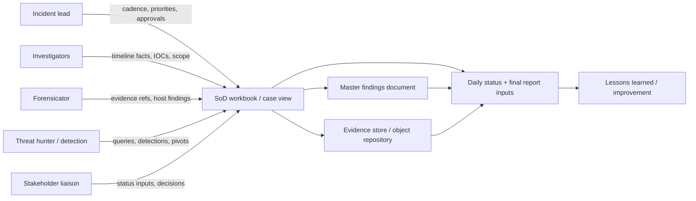
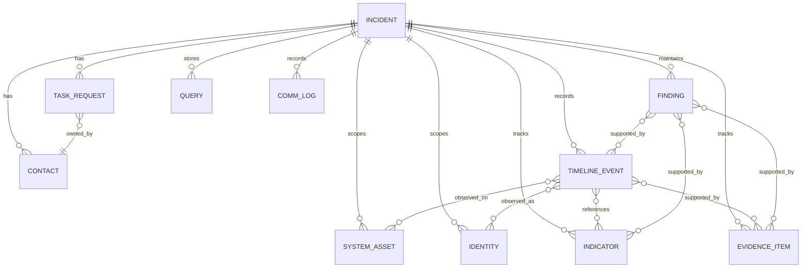
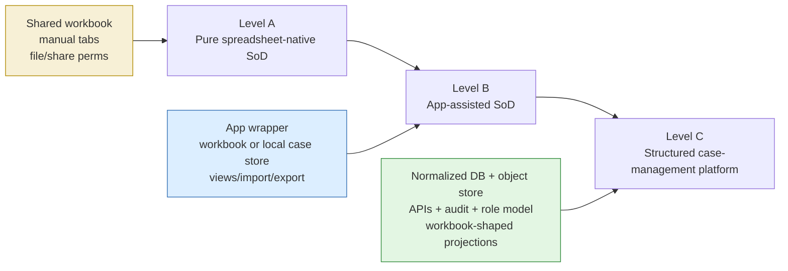
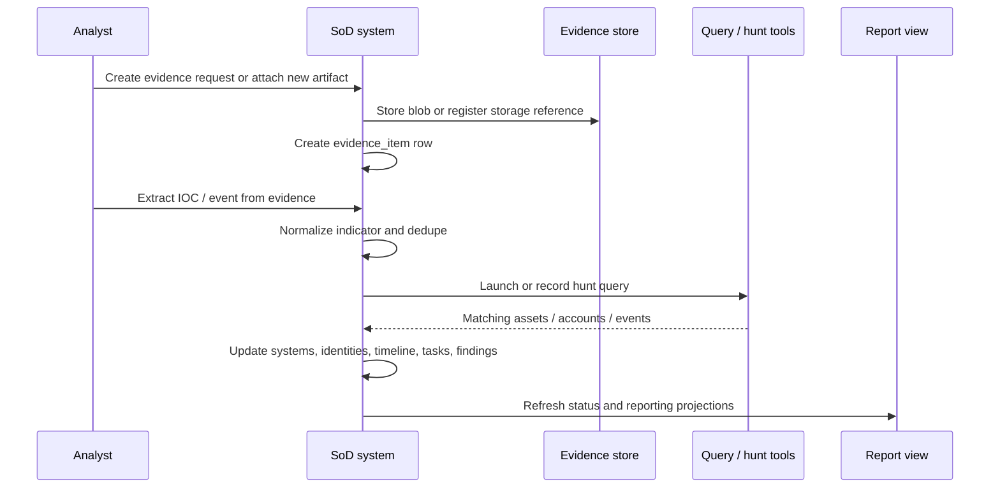

# Spreadsheet of Doom (SoD): Architecture and Operating Model for Spreadsheet-Centric DFIR Case Management

## Method note

The exact phrase **“Spreadsheet of Doom”** is practitioner shorthand, not a term standardized by NIST or the academic literature I reviewed. Standards and papers discuss incident response lifecycles, playbooks, timeline analysis, reporting, and learning from incidents; practitioner sources and implementation exemplars are what expose the SoD label and its concrete workbook shape. Where a point below is directly stated by a source, I treat it as direct evidence. Where it reflects recurring practitioner behavior, I label it as common practice. Where it combines multiple sources into a concrete design choice, I label it as **Synthesis** or **Inference**.[^nist61][^crowdstrike_blog][^trustedsec_triage][^aurora_sans][^aurora_repo]

## 1. Executive Summary

**Synthesis.** A **Spreadsheet of Doom (SoD)** is an incident-scoped DFIR coordination system whose user-facing artifact is usually a workbook or structured set of tabs, and whose real function is to serve as the team’s mutable common operating picture for capture, scoping, tasking, evidence references, status, and reporting inputs. It is not a single vendor product and not merely a spreadsheet file. It is both a data artifact and a socio-technical operating model: people update it continuously, decisions are made from it, and companion artifacts such as findings docs, evidence stores, and final reports are fed from it. A credible SoD-like implementation must therefore preserve the spreadsheet advantages that responders actually rely on—low ceremony, portability, partial-information capture, ad hoc sort/filter/paste, and fast collaboration—while adding the controls spreadsheets handle poorly: stable identifiers, normalized entities, auditability, evidence references, conflict handling, and deterministic export paths.[^crowdstrike_blog][^trustedsec_triage][^nist61]

Direct evidence from practitioner sources shows that structured incident trackers are widely used in real investigations. CrowdStrike describes an incident response tracker spreadsheet with tabs for timeline, systems, accounts, host and network indicators, task tracking, evidence tracking, forensic keywords, and investigative queries, and says its services teams have used this style of tracker in thousands of investigations.[^crowdstrike_blog] TrustedSec similarly treats a “Spreadsheet-of-Doom” and a separate master findings document as foundational during rapid triage, alongside explicit communication cadence and reporting decisions.[^trustedsec_triage] Aurora, a SANS-linked implementation exemplar, explicitly describes itself as taking the SoD used in SANS FOR508 “to the next level,” adding graphing, task tracking, timeline views, import/export, and desktop application behavior without abandoning the spreadsheet-centric case pattern.[^aurora_sans][^aurora_repo]

The SoD persists because it solves a narrow but difficult problem that many dedicated case tools still mishandle: how to capture messy, incomplete, fast-moving investigative facts without slowing responders down. Its limits are equally predictable. Pure spreadsheet-native SoDs drift semantically, duplicate rows, lose provenance, struggle with access control and large evidence sets, and make review and rollback expensive. The design center for a developer should therefore be neither “just keep it in Excel forever” nor “replace Excel with rigid forms.” The right baseline is workbook-first interaction with structured, auditable state underneath.[^crowdstrike_blog][^trustedsec_triage][^nist61][^breitinger2025]

## 2. What the “Spreadsheet of Doom” Is

Direct evidence. CrowdStrike’s IR tracker is organized as multiple tabs for investigation notes, contacts, timeline, systems, accounts, host indicators, network indicators, requests and tasks, evidence, forensic keywords, and investigative queries.[^crowdstrike_blog] TrustedSec’s rapid-triage guidance describes a SoD containing incident summary, tasks, compromised systems, IOCs, compromised accounts, compromised email addresses, incident timeline, and key file/hash information, plus a separate master findings document for lower-level analysis outputs used in daily status and final reporting.[^trustedsec_triage] Taken together, those sources show that “SoD” usually denotes a **family of structured tabs**, not a single flat sheet.[^crowdstrike_blog][^trustedsec_triage]

**Inference.** The term itself is colloquial rather than formal. NIST SP 800-61 Rev. 3 does not define a SoD artifact; instead, it frames incident response as integrated cyber risk management and emphasizes documented procedures, playbooks, incident reporting, roles, and continuous improvement.[^nist61] The label “Spreadsheet of Doom” appears openly in practitioner and implementation-exemplar materials such as TrustedSec and Aurora, which is strong evidence that the pattern is grounded in field practice and training culture rather than in standards terminology.[^trustedsec_triage][^aurora_sans][^aurora_repo]

Common practice. SoD-style coordination emerged because responders needed a tool that was instantly available, easy to share, tolerant of partial facts, and editable by multiple people under time pressure. A spreadsheet is structurally good at free-form capture, quick sort/filter/paste, opportunistic column addition, and low-friction collaboration. That matters in the first hours of an incident, when the team may know only “suspicious login,” “possible lateral movement,” “hash seen on two hosts,” or “waiting on firewall logs.” TrustedSec explicitly targets analysts working with local tools or portable forensic environments rather than a mature centralized collaboration stack, which helps explain why spreadsheet coordination remains attractive in practice.[^trustedsec_triage]

Direct evidence. NIST Rev. 3 also explains why a lightweight shared coordination artifact is still relevant. Modern incident response is no longer an isolated specialist loop completed in a day or two. NIST states that incidents are now frequent, recovery often takes weeks or months, incident response must be integrated across organizational operations, and lessons learned should be shared as soon as identified rather than delayed until recovery ends.[^nist61] NIST’s roles section further emphasizes that successful response depends on many internal and external parties, not just incident handlers, which increases the value of a shared, incident-scoped coordination surface.[^nist61]

**Synthesis.** In lifecycle terms, the SoD sits mostly at the boundary between **Detect**, **Respond**, **Recover**, and **Improve**. It is where observations become scoped entities, where containment tasks are coordinated, where communications inputs are prepared, and where lessons begin to harden into a timeline and set of findings. It is not the SIEM, not the EDR, not the object store, and not the final report. It is the incident’s operational notebook with stronger structure than a free-form document and weaker rigidity than a full case platform.[^nist61][^crowdstrike_blog][^trustedsec_triage]

## 3. Historical / Practitioner Context

Direct evidence. CrowdStrike’s blog is useful because it shows a services firm formalizing the pattern into a reusable template, rather than describing it as an accidental spreadsheet. The tracker is presented as a “single place” for incident timeline, indicators, affected accounts and systems, metadata, evidence items, and tasks, and the authors explicitly position it as a baseline for organizations that need a tracker quickly.[^crowdstrike_blog] TrustedSec’s rapid-triage guidance does something similar from the practitioner side: before deep analysis, create centralized documents, including the SoD and a master findings document, so that multiple teams do not lose or fragment analysis output.[^trustedsec_triage]

Direct evidence. Aurora is especially useful for historical context because it names the SoD directly and shows the next step many teams take after raw spreadsheets start to hurt. The SANS Aurora page describes it as “the spreadsheet of Doom on steroids” with graphing and task tracking, and the GitHub README describes it as incident response documentation for tracking findings and tasks, with visual timeline and lateral movement views.[^aurora_sans][^aurora_repo] That is not a replacement of the pattern; it is an app-assisted continuation of the same pattern.

**Inference.** The SoD therefore sits on a maturity continuum:

1. ad hoc notes, chat, and personal analyst scratchpads;
2. shared spreadsheet with emergent tabs and conventions;
3. disciplined workbook with stable tab purposes, validation, and companion artifacts;
4. app-assisted SoD that preserves workbook semantics but adds views, import/export, validation, and audit features;
5. structured case-management platform that can still project workbook-shaped views.

The practitioner sources do not describe the continuum this explicitly, but they support it strongly when read together.[^crowdstrike_blog][^trustedsec_triage][^aurora_sans][^aurora_repo]

Common practice. Spreadsheet-centric coordination persists in real investigations for reasons that are more operational than ideological:

- **Speed:** no schema migration, no ticket form, no platform rollout.
- **Ubiquity:** every responder can open and edit a workbook.
- **Flexibility:** tabs and columns can change as the incident evolves.
- **Portability:** the case artifact can travel between teams, firms, and disconnected environments.
- **Low infrastructure cost:** no mandatory server, no identity integration, no database administration.
- **Familiarity:** teams already know how to sort, filter, and paste in spreadsheet interfaces.
- **Ease of sharing:** a single file or cloud workbook can bootstrap collaboration quickly.[^crowdstrike_blog][^trustedsec_triage][^aurora_repo]

Direct evidence from standards and research explains why those advantages are still not enough on their own. NIST emphasizes documented roles, policies, procedures, communications, and continuous improvement, while Patterson, Nurse, and Franqueira show that organizations often fail to extract and implement lessons from incidents, with superficial causal investigations and weak evaluation of whether changes reduce future incidents.[^nist61][^patterson2023] The spreadsheet persists because it is useful; it becomes “doom” because it is often the only structured memory the team has.

## 4. System Goals and Non-Goals

**Synthesis.** A SoD-like system is good at five things:

1. **Shared operational memory:** one place to see what is known, unknown, pending, and confirmed.
2. **Rapid capture:** responders can add facts before they are perfectly normalized.
3. **Scoping and pivoting:** systems, identities, indicators, tasks, and timeline events can be cross-referenced.
4. **Coordination:** the artifact supports handoffs, tasking, cadence, and stakeholder updates.
5. **Reporting preparation:** the same structured facts feed daily updates, final reporting, and lessons learned.[^crowdstrike_blog][^trustedsec_triage][^nist61]

It is bad at several other things unless it is augmented or replaced:

- storing raw telemetry at scale;
- storing large binary evidence directly;
- enforcing fine-grained access control;
- performing deep event analytics across large data volumes;
- acting as the source of truth for enterprise assets or identities;
- managing cross-incident knowledge reuse in a disciplined way;
- guaranteeing reversible history when left as a plain workbook.[^nist61][^breitinger2025][^patterson2023]

Direct evidence. NIST Rev. 3 distinguishes incident response activities from broader preparation activities and notes that playbooks, procedures, reporting, and communications are all part of effective incident response capability.[^nist61] CrowdStrike’s tracker description likewise places timeline, systems, accounts, indicators, tasks, evidence, and queries inside the tracker, but not raw telemetry or the underlying forensic data itself.[^crowdstrike_blog] TrustedSec explicitly splits centralized analysis into at least two artifacts: the SoD and a master findings document.[^trustedsec_triage]

**Synthesis.** A mature SoD should therefore own:

- incident metadata and contacts;
- the incident timeline;
- scoped systems/assets and identities/accounts;
- normalized indicators relevant to the case;
- evidence references and custody state, but not the binary payloads themselves;
- requests, tasks, and follow-ups;
- findings, hypotheses, and reporting inputs;
- optional communication and meeting logs.

It should not own:

- EDR/SIEM raw event storage or alert pipelines;
- ticketing system backlogs outside the incident;
- object-store evidence payloads;
- authoritative CMDB or identity provider data;
- organization-wide knowledge-base content;
- long-form polished report drafting as the only narrative artifact.

The cleanest boundary is: the SoD owns the **incident-scoped coordination model**; adjacent systems own telemetry, storage, or enterprise master data.[^nist61][^crowdstrike_blog][^trustedsec_triage]

## 5. Socio-Technical Operating Model

Direct evidence. NIST says modern incident response depends on many internal and external parties, including leadership, incident handlers, technology professionals, legal, media/public affairs, human resources, physical security, asset owners, and third parties, with responsibilities varying by incident and organization.[^nist61] TrustedSec’s rapid-triage guidance adds concrete operational steps: assign an incident lead, establish communication cadence, and decide whether daily status reporting is required before deep analysis proceeds.[^trustedsec_triage]

Common practice. A practical SoD operating model usually includes the following working roles, even when formal titles differ:

- **IR lead / incident commander:** owns priorities, cadence, and containment decisions.
- **Investigator / analyst:** captures facts, pivots, and updates the case tracker.
- **Forensicator:** contributes host, disk, memory, and artifact analysis.
- **Threat hunter / detection engineer:** turns findings into searches and detections.
- **Reporting lead:** shapes status outputs, executive updates, and final narrative.
- **Stakeholder liaison / client contact:** manages communications with the organization or customer.
- **Specialists:** identity, cloud, email, legal, or business owners as needed.[^nist61][^trustedsec_triage]

Direct evidence. CrowdStrike explicitly emphasizes “tracker hygiene,” warning that the value of the tracker depends on disciplined maintenance by all team members, all the time.[^crowdstrike_blog] TrustedSec similarly says centralized analysis documentation must exist before analysis volume becomes too large to aggregate during the incident.[^trustedsec_triage]

**Synthesis.** For a developer, the socio-technical contract is as important as the schema:

- every row should have a recorder and last editor;
- every task/request should have an owner and status;
- every key tab should have a steward, even if multiple people edit it;
- unresolved values should be visible rather than silently normalized away;
- daily or per-shift hygiene should explicitly review duplicates, stale tasks, unresolved entities, and timeline gaps;
- status reporting should read from stable projections, not free-form ad hoc filters.

A useful split is:

- **SoD workbook/app:** current shared state;
- **master findings document:** low-level analyst narrative and excerpts;
- **evidence store:** blobs and chain-of-custody artifacts;
- **investigation notebook/query library:** reusable searches and command lines;
- **report draft:** curated narrative derived from the above.[^trustedsec_triage][^patterson2023]



## 6. Canonical Data Model

Direct evidence. Across the practitioner sources, the most recurrent SoD tabs or content areas are: incident notes/metadata, contacts, timeline, systems, accounts, indicators, tasks/requests, evidence tracking, forensic keywords, investigative queries, and reporting inputs.[^crowdstrike_blog][^trustedsec_triage] The academic and standards sources do not define a canonical workbook schema, so the normalized model below is **Synthesis**: it translates recurring workbook content into an implementable entity model.

### 6.1 Common across most SoD implementations

#### Incident metadata

**Purpose:** define the incident boundary and top-level state.  
**Required fields:** `incident_id`, `title`, `opened_at_utc`, `status`, `severity`, `lead_contact_id`.  
**Optional fields:** `description`, `tlp`, `customer_case_ref`, `external_ticket_refs`, `closure_summary`.  
**Key strategy:** immutable `incident_id`; human-readable case key may be projected separately.  
**Relationships:** parent of all case entities.  
**Validation:** severity/status enums; UTC timestamps; one active lead at a time.  
**Common pivots:** active incidents by severity, open vs. closed, incidents by client/business unit.  
**Downstream consumers:** dashboards, reports, retention, export bundles.

#### Contacts

**Purpose:** hold response participants and key stakeholders.  
**Required fields:** `contact_id`, `display_name`, `role`, `organization`, one of `email` or `phone`.  
**Optional fields:** `timezone`, `notes`, `escalation_order`.  
**Key strategy:** immutable `contact_id`; dedupe on normalized email where present.  
**Relationships:** referenced by incident metadata, tasks, communications, evidence custody, and report ownership.  
**Validation:** role enum or controlled vocabulary; normalized email; no duplicate active contact emails within an incident.  
**Pivots:** all external parties, all business owners, after-hours escalation chain.  
**Consumers:** comms log, task routing, reporting.

#### Tasks / requests

**Purpose:** coordinate asks, tasking, and dependencies.  
**Required fields:** `task_id`, `summary`, `status`, `owner_contact_id`, `created_at_utc`.  
**Optional fields:** `due_at_utc`, `requester_contact_id`, `priority`, `linked_record_ids`, `closure_note`.  
**Key strategy:** immutable `task_id`; never recycle closed IDs.  
**Relationships:** may link to timeline events, evidence items, assets, identities, or findings.  
**Validation:** controlled status and priority enums; due dates cannot precede creation time.  
**Pivots:** overdue tasks, containment tasks, pending customer requests, blocked tasks.  
**Consumers:** standups, status reports, post-incident review.

#### Systems / assets

**Purpose:** track hosts, cloud assets, network devices, applications, or mailboxes within incident scope.  
**Required fields:** `asset_id`, `display_name`, at least one of `hostname`, `fqdn`, `primary_ip`, or external platform ID, plus `asset_type` and `scope_status`.  
**Optional fields:** `business_owner`, `criticality`, `location`, `os_platform`, `containment_status`, `notes`.  
**Key strategy:** immutable `asset_id`; exact-match dedupe by strongest available identifier.  
**Relationships:** linked from timeline events, evidence, tasks, and findings.  
**Validation:** normalized FQDN/hostname/IP formats; controlled type/status enums.  
**Pivots:** all compromised assets, all assets touched by IOC X, all uncontained critical assets.  
**Consumers:** scoping, containment, timeline, reporting, detection engineering.

#### Accounts / identities

**Purpose:** track user, service, shared, or external identities relevant to the incident.  
**Required fields:** `identity_id`, `display_name`, at least one of `upn`, `email`, `sam_account_name`, `sid`, or provider object ID, plus `identity_type` and `scope_status`.  
**Optional fields:** `department`, `manager`, `mfa_state`, `reset_status`, `notes`.  
**Key strategy:** immutable `identity_id`; exact-match dedupe by provider ID, SID, UPN, email, then account name.  
**Relationships:** linked from timeline events, tasks, findings, and communications.  
**Validation:** normalized account strings; controlled type/status enums.  
**Pivots:** all confirmed-compromised accounts, all accounts tied to asset Y, all identities pending reset.  
**Consumers:** scoping, containment, executive reporting.

#### Host indicators tab

**Purpose:** capture file, registry, service, process, mutex, path, and hash indicators with host context.  
**Required fields:** `indicator_id`, `indicator_type`, `indicator_value`, `normalized_value`, `scope='host'`, `source_record_id`.  
**Optional fields:** `hash_algorithm`, `first_seen_utc`, `last_seen_utc`, `confidence`, `defanged_value`, `notes`.  
**Key strategy:** immutable `indicator_id`; dedupe on `(indicator_type, normalized_value, scope, incident_id)`.  
**Relationships:** may link to events, evidence, assets, findings, and queries.  
**Validation:** type-specific normalization; hash length checks; file/path canonicalization rules.  
**Pivots:** search for same hash across assets; group by path prefix; pivot from service name to event set.  
**Consumers:** detection, hunting, evidence collection, reporting.

#### Network indicators tab

**Purpose:** capture IPs, domains, URLs, emails, ports, user agents, JA3/JA4, and related network observables.  
**Required fields:** `indicator_id`, `indicator_type`, `indicator_value`, `normalized_value`, `scope='network'`, `source_record_id`.  
**Optional fields:** `first_seen_utc`, `last_seen_utc`, `asn`, `geo`, `reputation`, `defanged_value`, `notes`.  
**Key strategy:** same conceptual `indicator` entity as host indicators, projected as a separate tab.  
**Relationships:** may link to timeline events, evidence, identities, assets, and findings.  
**Validation:** IP/domain/URL/email normalization; port integer bounds; defang on export by default.  
**Pivots:** all assets that touched IOC X; all URLs on domain Y; all events tied to source IP Z.  
**Consumers:** blocking decisions, intel enrichment, threat hunting, report appendices.

#### Evidence items

**Purpose:** track requested, received, and available evidence, plus storage references and custody state.  
**Required fields:** `evidence_id`, `evidence_type`, `description`, `lifecycle_state`, `requested_at_utc`.  
**Optional fields:** `received_at_utc`, `storage_ref`, `blob_hash`, `collector_contact_id`, `custody_note`, `linked_record_ids`.  
**Key strategy:** immutable `evidence_id`; binary payload stored externally.  
**Relationships:** may support timeline events, assets, identities, indicators, and findings.  
**Validation:** lifecycle transitions are monotonic; blob hash immutable once marked available.  
**Pivots:** pending evidence, evidence by collector, all evidence supporting finding F.  
**Consumers:** forensics, chain-of-custody review, reporting.

#### Timeline events

**Purpose:** provide the chronological reconstruction of the incident and the shared incident narrative.  
**Required fields:** `event_id`, one primary time field `event_time_utc` or `event_time_observed`, `summary`, `event_type`, `source_ref`, and `recorded_at_utc`.  
**Optional fields:** `event_time_precision`, `description`, `confidence`, `status`, `related_asset_ids`, `related_identity_ids`, `related_indicator_ids`, `evidence_ids`, `notes`.  
**Key strategy:** immutable `event_id`; sortable sequence or ULID recommended.  
**Relationships:** central linking hub for assets, identities, indicators, evidence, findings, ATT&CK map.  
**Validation:** UTC normalization plus preservation of original source time; explicit precision when time is approximate.  
**Pivots:** by asset, account, IOC, time range, event type, confidence, evidence support.  
**Consumers:** status updates, containment decisions, final report, lessons learned.

### 6.2 Optional / evolved / advanced tabs

#### Investigative queries

**Purpose:** preserve SIEM/EDR/log search logic used during the case.  
**Required fields:** `query_id`, `platform`, `query_text`, `purpose`, `created_by_contact_id`.  
**Optional fields:** `run_at_utc`, `result_ref`, `linked_record_ids`, `status`.  
**Key strategy:** immutable `query_id`.  
**Validation:** platform enum; store query text exactly as executed.  
**Pivots:** all queries for IOC X, all failed vs. successful hunts.  
**Consumers:** handoff, repeatability, report appendices, detection engineering.

#### Forensic keywords

**Purpose:** store case-specific search terms for triage and artifact review.  
**Required fields:** `keyword_id`, `keyword`, `rationale`.  
**Optional fields:** `source_finding_id`, `status`, `notes`.  
**Validation:** normalized keyword text; dedupe exact duplicates.  
**Pivots:** all keywords derived from actor infrastructure, all keywords not yet searched.  
**Consumers:** host forensics, content search, e-discovery-like reviews.

#### Findings / hypotheses

**Purpose:** separate what is believed from what is proven, and connect both to evidence.  
**Required fields:** `finding_id`, `kind` (`finding` or `hypothesis`), `statement`, `status`, `owner_contact_id`.  
**Optional fields:** `confidence`, `supporting_record_ids`, `contradicting_record_ids`, `closed_at_utc`, `notes`.  
**Validation:** hypothesis and confirmed finding states are distinct; closure requires disposition.  
**Pivots:** open hypotheses, disproven leads, findings lacking evidence.  
**Consumers:** incident leadership, reporting, lessons learned.

#### Optional ATT&CK / TTP mapping

**Purpose:** link timeline events or findings to ATT&CK tactics/techniques/procedures.  
**Required fields:** `ttp_map_id`, `source_record_id`, `framework='attack'`, `tactic_id`, `technique_id`.  
**Optional fields:** `procedure_text`, `confidence`, `detection_gap`, `defense_gap`.  
**Validation:** framework IDs from controlled vocabulary; source record must exist.  
**Pivots:** all events mapped to credential access, all techniques without detections.  
**Consumers:** reporting, purple-team follow-up, detection engineering.  
**Note:** useful, but not mandatory for a baseline SoD.[^crowdstrike_blog][^aurora_repo]

#### Optional communications / meeting log

**Purpose:** preserve incident cadence, decisions, and external-facing updates.  
**Required fields:** `comm_id`, `timestamp_utc`, `comm_type`, `summary`.  
**Optional fields:** `attendee_contact_ids`, `decision_ids`, `action_task_ids`, `audience`.  
**Validation:** decision records should reference follow-up tasks where applicable.  
**Pivots:** all leadership updates, all meetings that changed containment strategy.  
**Consumers:** stakeholder liaison, reporting, post-incident review.

### 6.3 Normalized conceptual schema



### 6.4 Example schema snippets

```yaml
timeline_event:
  event_id: evt_01J9Q2YB7K2N0Q3F5Z7B6P1W2X
  incident_id: inc_acme_2026_017
  event_time_utc: 2026-03-21T09:14:00Z
  event_time_precision: second
  event_type: authentication
  summary: Suspicious VPN login by jdoe from atypical source IP
  description: MFA bypass suspected; login preceded mailbox rule creation by 3 minutes
  source_ref: m365_audit_export:row_8841
  confidence: medium
  related_asset_ids: [asset_ws023]
  related_identity_ids: [ident_jdoe]
  related_indicator_ids: [ioc_ip_203_0_113_24]
  evidence_ids: [evd_audit_export_03]
```

```yaml
indicator:
  indicator_id: ioc_ip_203_0_113_24
  incident_id: inc_acme_2026_017
  indicator_type: ip
  indicator_scope: network
  indicator_value: 203.0.113.24
  normalized_value: 203.0.113.24
  defanged_value: 203[.]0[.]113[.]24
  first_seen_utc: 2026-03-21T09:14:00Z
  source_record_ids: [evt_01J9Q2YB7K2N0Q3F5Z7B6P1W2X]
  status: active
  confidence: medium
```

```yaml
system_asset:
  asset_id: asset_ws023
  incident_id: inc_acme_2026_017
  display_name: WS-023
  hostname: ws-023
  fqdn: ws-023.corp.example
  primary_ip: 10.24.8.23
  asset_type: workstation
  criticality: medium
  business_owner: corp_it
  scope_status: confirmed_compromised
  containment_status: isolated
  notes: User workstation used for initial interactive access
```

## 7. Architecture

Direct evidence. NIST Rev. 3 emphasizes that organizations should use the incident-response lifecycle model that best suits them, but regardless of model, incident response must be integrated across broader cyber risk management and continuous improvement activities.[^nist61] Practitioner sources show that workbook trackers remain valuable for incident coordination, while Aurora demonstrates that teams often wrap the SoD pattern in an application to add graphing, task tracking, import/export, autosave/unlocking, and integrations without abandoning the underlying spreadsheet-centered workflow.[^crowdstrike_blog][^trustedsec_triage][^aurora_sans][^aurora_repo]

### 7.1 Architectural levels



#### A. Pure spreadsheet-native SoD

**Storage:** one shared workbook, or a small set of linked workbooks, possibly plus companion docs.  
**Ingestion:** manual entry, copy/paste, CSV pastes, exports from EDR/SIEM dropped into tabs.  
**Normalization/dedup:** mostly manual, using conventions, formulas, filters, or analyst discipline.  
**Enrichment:** browser lookups, analyst notes, maybe macros or side scripts.  
**Correlation/pivoting:** spreadsheet sort/filter, manual joins, ad hoc formulas.  
**Timeline:** explicit tab.  
**Concurrency:** whatever the spreadsheet platform or file share provides; often weak semantic conflict handling.  
**Audit:** workbook history at best; poor row-level semantics.  
**Access control:** file-level or workbook-level.  
**Portability/offline:** excellent.  
**Trade-off:** fastest to start, cheapest to distribute, weakest to govern.[^crowdstrike_blog][^trustedsec_triage]

#### B. App-assisted SoD

**Storage:** workbook plus scripts, local app wrapping workbook data, or app-local structured store with workbook import/export.  
**Ingestion:** manual entry, CSV/XLSX import, saved query outputs, API enrichment.  
**Normalization/dedup:** app enforces types, validation, and dedupe rules.  
**Enrichment:** built-in intel lookups, graphing, task surfaces, query libraries, STIX export, etc.  
**Correlation/pivoting:** UI filters, typed links, graph/timeline views, saved searches.  
**Concurrency:** file locks, local autosave, or optimistic sync depending on design.  
**Audit:** better than raw spreadsheets if the app captures mutations.  
**Access control:** still often coarse unless backed by a service.  
**Portability/offline:** still strong.  
**Trade-off:** preserves SoD feel while reducing spreadsheet pain, but usually remains single-tenant and less rigorous than a case platform.[^aurora_sans][^aurora_repo]

Aurora is the clearest implementation exemplar in the source set: SANS describes it as a graphing and task-enabled SoD, while the GitHub README describes an Electron-based tool with visual timeline, lateral movement view, autosaving/unlocking behavior, CSV import/export, and integrations such as MISP and VirusTotal support in the code structure.[^aurora_sans][^aurora_repo]

#### C. Full structured case-management platform

**Storage:** normalized relational store for case data, object store for binaries, derived workbook-style projections for the UI, immutable snapshots for exports.  
**Ingestion:** typed APIs, imports, connectors, bulk paste, background jobs.  
**Normalization/dedup:** deterministic entity and indicator matching, controlled vocabularies, workflow states.  
**Enrichment:** asynchronous integrations, intel correlation, search indices, reusable playbooks.  
**Correlation/pivoting:** graph traversal, timeline joins, indexed filtering, audit-driven review.  
**Concurrency:** optimistic row/version semantics or stronger transaction boundaries.  
**Audit:** first-class change log, rollback, diff, snapshots.  
**Access control:** incident roles plus possibly finer-grained policies.  
**Portability/offline:** lower unless export bundles are designed deliberately.  
**Trade-off:** strongest rigor and scale, highest deployment and adoption cost.[^nist61][^akbari2024][^shaked2023]

### 7.2 Recommended baseline architecture

**Synthesis.** For a new build intended to preserve SoD semantics, the most credible baseline is:

- **workbook-shaped UI** for primary interaction;
- **normalized case store** underneath, with stable IDs and relationship tables;
- **object storage boundary** for binary evidence;
- **projection layer** that materializes tabs and saved views from structured state;
- **background-job layer** for imports, enrichment, and report generation;
- **export path** back to XLSX/CSV/HTML/Markdown for portability.

This preserves SoD ergonomics while removing the worst spreadsheet liabilities.

### 7.3 Storage layer

A SoD-like system may begin as a single XLSX, but a durable implementation should separate:

- **case state:** structured records, links, statuses, notes, findings, tasks;
- **binary evidence:** object store or secure file store;
- **reference vocabularies:** ATT&CK maps, evidence types, asset types, TLP labels, etc.;
- **derived outputs:** workbook exports, snapshots, reports.

Raw workbook-native storage is acceptable at Level A. At Level B/C, the workbook should become either a projection or an import/export artifact, not the only source of truth.

### 7.4 Ingestion / import layer

Direct evidence. CrowdStrike and TrustedSec both assume responders will aggregate evidence and findings from many workstreams into the tracker.[^crowdstrike_blog][^trustedsec_triage] Aurora’s README exposes CSV import/export as explicit modules, showing that import surfaces are a natural evolution of the pattern.[^aurora_repo]

**Synthesis.** Support at least four intake paths:

1. manual row entry;
2. TSV/CSV paste from analyst tools;
3. structured imports from SIEM/EDR/query exports;
4. evidence-linked parser outputs.

Unknown columns should be preserved in raw/import metadata rather than dropped. Imports should produce deterministic row IDs, preserve source provenance, and never silently merge distinct events.

### 7.5 Normalization and deduplication

**Synthesis.** The key normalization rules are:

- indicators dedupe on normalized `(type, value, scope)`;
- assets dedupe on strongest identifier available;
- identities dedupe on strongest identity-provider or directory identifier available;
- timeline events do **not** dedupe aggressively because repeated sightings can be operationally distinct;
- original raw text is preserved even after normalization.

This is the point where a SoD-like system gains real value over a worksheet: it can preserve analyst capture while also creating canonical pivots.

### 7.6 Enrichment, correlation, and pivoting

Direct evidence. CrowdStrike explicitly highlights host and network indicator tabs as pivot surfaces that help teams search additional datasets and feed SIEM/EDR controls.[^crowdstrike_blog] TrustedSec’s triage process likewise emphasizes deriving “low-hanging fruit” IOCs and pivot points quickly from critical system and network artifacts.[^trustedsec_triage] Breitinger et al. note that timeline-based event reconstruction is significant but methodologically fragmented, which reinforces the need for explicit correlation and reconstruction design rather than improvised spreadsheet joins.[^breitinger2025]

**Synthesis.** Enrichment should be non-blocking and optional: threat-intel lookups, asset metadata resolution, user context, and reputation data are overlays, not prerequisites for capture. Correlation should support pivots from any major entity:

- indicator -> events/assets/identities;
- asset -> events/evidence/findings;
- identity -> events/tasks/reset status;
- evidence -> extracted indicators/events/findings;
- finding -> supporting and contradicting records.

### 7.7 Timeline construction and visualization

Direct evidence. CrowdStrike calls the consolidated timeline the biggest benefit of the tracker and lists the kinds of facts it should contain, from login times to process events, registry times, and network connections.[^crowdstrike_blog] Breitinger et al. argue that timeline reconstruction is foundational but hampered by fragmented terminology and methodology, and Loumachi et al. describe current limitations in timeline analysis, including lack of semantic context and dependence on multiple tools.[^breitinger2025][^loumachi2025]

**Synthesis.** A credible SoD-like implementation should therefore make the timeline a first-class entity rather than a loose tab. Use one primary timestamp plus precision metadata, explicit source references, links to supporting evidence, and stable IDs. Visualization should sit on top of that model, not replace it. Good SoD views include:

- canonical timeline table;
- grouped daily/phase views;
- lateral-movement or relationship graph;
- reporting projections.

### 7.8 Search / filter / query capabilities

At minimum, provide:

- full-text search over summary/notes;
- exact indicator lookup;
- scoped filters by asset, identity, status, owner, evidence state;
- saved views for common working sets;
- exportable query/result references.

Spreadsheet-native filtering gets teams surprisingly far. The app-assisted and structured levels should preserve that speed while adding typed filtering and cross-entity pivots.

### 7.9 Concurrency, versioning, and rollback

Direct evidence. Aurora’s README mentions autosaving/unlocking semantics in the Electron app, illustrating a local-app answer to workbook mutation safety.[^aurora_repo] NIST emphasizes that procedures, roles, communications, and playbooks should be documented and usable under real incident pressure.[^nist61]

**Synthesis.** Concurrency models by level:

- **A:** workbook or cloud-sheet concurrency, plus owner columns and conventions;
- **B:** file locks or local optimistic save model;
- **C:** row-version optimistic concurrency with same-field conflict handling.

For Level B/C, every mutation should be attributable, reversible, and auditable. Evidence attachment should be two-step: create evidence row or pending slot, then finalize upload, so failures do not create phantom evidence records.

### 7.10 Auditability, sensitivity, backup, and portability

A SoD-like system needs four explicit boundaries:

- **audit boundary:** who changed what, when, and why;
- **evidence boundary:** workbook stores references and custody state, not large blobs;
- **sensitivity boundary:** incident roles govern access; finer controls are an advanced capability;
- **portability boundary:** export/import bundles or workbook projections preserve case transfer.

### 7.11 Playbooks and structured automation as advanced layers

Direct evidence. NIST says many organizations document procedures as playbooks because formatting procedures that way can improve usability.[^nist61] Shaked et al. argue that playbooks should incorporate a model of operations, not just process steps, so incident-response actions can be understood in the context of business and service impact.[^shaked2023] Akbari Gurabi et al. argue that playbooks are often too unstructured for automation and reporting and should become interoperable and machine-readable, while SASP proposes semantic-web structures for sharable playbook management.[^akbari2024][^akbari2022]

**Synthesis.** SoD and playbooks are complementary. The SoD is the **case state**; the playbook is the **response logic template**. A mature platform should link the two, but a baseline SoD should not be blocked on formal playbook automation.

## 8. Core Workflows

Direct evidence. NIST maps the older lifecycle phases to CSF 2.0 as follows: Preparation -> Govern/Identify/Protect; Detection & Analysis -> Detect plus Identify-Improvement; Containment, Eradication & Recovery -> Respond/Recover plus Identify-Improvement; Post-Incident Activity -> Identify-Improvement.[^nist61] The workflow mapping below uses that structure.

### 8.1 Incident intake and setup  
**NIST mapping:** Prepare (GV/ID/PR)  
**Trigger:** alert, customer escalation, legal notice, or confirmed incident declaration.  
**Actors:** IR lead, stakeholder liaison, primary investigator.  
**Inputs:** initial alert context, case identifiers, contact list, severity guess.  
**Outputs:** incident record, contacts, initial task set, empty timeline, workspace URL/file.  
**Tabs touched:** incident metadata, contacts, tasks, communications log.  
**Quality risks:** missing lead assignment, no cadence, unclear TLP, no external case reference.  
TrustedSec explicitly says centralized documents and communication cadence should be established before deep analysis begins.[^trustedsec_triage]

### 8.2 Identification and scoping  
**NIST mapping:** Detect + Improve  
**Trigger:** first reliable indicators or artifacts.  
**Actors:** investigators, threat hunter, asset owners.  
**Inputs:** alerts, endpoint artifacts, log extracts, network pivots.  
**Outputs:** initial scoped assets, identities, indicators, early hypotheses.  
**Tabs touched:** timeline, systems/assets, identities, host/network indicators, findings.  
**Quality risks:** over-scoping, under-scoping, duplicate assets, premature certainty.

### 8.3 IOC capture and enrichment  
**NIST mapping:** Detect / Respond  
**Trigger:** new IOC observed or imported.  
**Actors:** investigators, hunter, detection engineer.  
**Inputs:** log lines, forensic artifacts, intel hits, malware analysis.  
**Outputs:** normalized indicator row, pivots, blocking candidates, search tasks.  
**Tabs touched:** host indicators, network indicators, queries, tasks, findings.  
**Quality risks:** inconsistent normalization, no defanged export form, IOC/context split.

### 8.4 Asset / account scoping  
**NIST mapping:** Detect / Respond  
**Trigger:** identity or asset tie-back from event or IOC.  
**Actors:** investigators, IAM/admin specialists, asset owners.  
**Inputs:** timeline events, indicator hits, directory/CMDB context.  
**Outputs:** scoped asset and identity rows, compromise status, reset/isolation tasks.  
**Tabs touched:** systems, accounts, tasks, findings, communications log.  
**Quality risks:** alias collisions, account duplication, weak ownership metadata.

### 8.5 Evidence collection tracking  
**NIST mapping:** Respond / Recover  
**Trigger:** need for logs, images, mailboxes, memory, exports, or third-party data.  
**Actors:** forensicator, collection lead, customer/client contact.  
**Inputs:** collection plan, source system, request time, chain-of-custody context.  
**Outputs:** evidence request, receipt state, storage ref, custody entries.  
**Tabs touched:** evidence items, tasks, timeline.  
**Quality risks:** missing hashes, unclear storage location, orphaned evidence with no link to findings.

### 8.6 Timeline building and refinement  
**NIST mapping:** Detect / Respond / Improve  
**Trigger:** any new event, pivot, or evidence receipt.  
**Actors:** investigators, forensicator, reporting lead.  
**Inputs:** parsed logs, user activity, EDR events, forensic timestamps, notes.  
**Outputs:** event rows, gap flags, confirmed chronology, narrative skeleton.  
**Tabs touched:** timeline, evidence, findings, ATT&CK map.  
**Quality risks:** timezone ambiguity, mixed precision, event duplication, unsupported claims.  
CrowdStrike treats the timeline as the basis of the incident narrative, and timeline-reconstruction research highlights the need for methodological clarity.[^crowdstrike_blog][^breitinger2025]

### 8.7 Task / request management  
**NIST mapping:** Respond  
**Trigger:** containment ask, data request, customer follow-up, hunting action.  
**Actors:** IR lead, stakeholder liaison, investigators.  
**Inputs:** findings, pending questions, operations constraints.  
**Outputs:** assigned tasks, due dates, closures, escalations.  
**Tabs touched:** tasks/requests, communications log, findings.  
**Quality risks:** duplicated tasks, no owner, stale request states.

### 8.8 Containment / eradication / recovery support  
**NIST mapping:** Respond / Recover  
**Trigger:** confirmed scope and approved response action.  
**Actors:** IR lead, engineering owners, identity admins, business owners.  
**Inputs:** confirmed assets/accounts, operational impact, task list.  
**Outputs:** isolation/reset/rebuild actions, status updates, restored-service notes.  
**Tabs touched:** systems, accounts, tasks, timeline, communications log.  
**Quality risks:** no link between action and approving decision, action outruns case record.

### 8.9 Daily status reporting  
**NIST mapping:** Respond / Recover  
**Trigger:** daily cadence, executive checkpoint, client call.  
**Actors:** reporting lead, IR lead, stakeholder liaison.  
**Inputs:** scoped assets/accounts, new findings, open risks, task state.  
**Outputs:** status summary, decision log, next-step actions.  
**Tabs touched:** findings, tasks, communications log, timeline, incident metadata.  
TrustedSec’s model explicitly uses centralized analysis artifacts to support daily status and final reporting.[^trustedsec_triage]

### 8.10 Final reporting  
**NIST mapping:** Recover / Improve  
**Trigger:** containment achieved or handoff to remediation/closure phase.  
**Actors:** reporting lead, investigators, IR lead, legal/stakeholder reviewers.  
**Inputs:** final scoped entities, validated timeline, evidence refs, lessons learned.  
**Outputs:** incident narrative, impact statement, root cause, response actions, recommendations.  
**Tabs touched:** all major tabs, especially timeline, findings, evidence, tasks, incident metadata.  
**Quality risks:** unresolved contradictions, weak source attribution, reporting drift from live case data.

### 8.11 Lessons learned / post-incident review  
**NIST mapping:** Identify Improvement  
**Trigger:** closure review or interim major milestone.  
**Actors:** IR lead, leadership, responders, asset owners, process owners.  
**Inputs:** timeline, decisions, task closure, reporting outcomes.  
**Outputs:** control improvements, playbook changes, ownership changes, detection backlog.  
**Tabs touched:** findings, tasks, communications log, incident metadata, optional lessons-learned sheet or export.  
Patterson et al. show that this is often the weakest part in practice, with superficial causal analysis and weak follow-through on actions.[^patterson2023]

### 8.12 Sequence diagram: new evidence / IOC propagation



## 9. Failure Modes and Limits

Direct evidence. CrowdStrike’s “tracker hygiene” warning is effectively a failure-mode statement: if the tracker is not maintained, results will be poor.[^crowdstrike_blog] Patterson et al. show that many organizations fail to turn incident experience into implemented, evaluated improvements.[^patterson2023] Breitinger et al. show that timeline reconstruction remains methodologically fragmented, which means sloppy SoD timelines are not a minor inconvenience—they directly undermine the reconstruction task.[^breitinger2025]

Common failure modes of spreadsheet-centric IR coordination include:

- human copy/paste error;
- schema drift as new columns appear without governance;
- duplicate or contradictory rows;
- inconsistent terminology across analysts;
- timezone and timestamp ambiguity;
- weak access control and oversharing;
- collaboration conflicts and stale local copies;
- missing provenance for who changed what;
- poor large-scale querying;
- report-generation friction when data is not normalized;
- fragile enrichment and import scripts.

**Synthesis.** “Good enough” SoD usage looks like this:

- one incident boundary and one canonical tracker;
- explicit tab purposes;
- immutable row IDs;
- UTC timestamps plus original-time notes where needed;
- controlled values for status, severity, and confidence;
- daily hygiene review of unresolved entities, duplicates, and overdue tasks;
- companion evidence store and master findings doc;
- reproducible export path for reporting.

When to **augment** the SoD rather than replace it:

- more than a few active investigators;
- frequent imports from external systems;
- need for visual timelines or graphing;
- need for structured evidence lifecycle state;
- repeated schema pain or reporting drift.

When to **replace** pure spreadsheet-native SoD with a real case platform:

- regulatory or legal pressure demands strong audit trails;
- evidence volume exceeds practical workbook handling;
- role-based sensitivity controls are required;
- multiple incidents must be searched together;
- automation and playbook execution become first-class requirements;
- object storage, snapshots, rollback, and API integration are mandatory.[^nist61][^akbari2024][^guerra2023]

## 10. Design Recommendations

### 10.1 Minimum viable workbook / tab structure

**Baseline tabs:**

1. Incident Metadata  
2. Contacts  
3. Timeline  
4. Systems / Assets  
5. Accounts / Identities  
6. Indicators (host + network split views acceptable)  
7. Tasks / Requests  
8. Evidence  

**Strongly recommended companion artifacts:**

- Master Findings document
- Query library
- Final report snapshot/export

**Optional/evolved tabs:**

- Investigative Queries
- Forensic Keywords
- Findings / Hypotheses
- ATT&CK / TTP Map
- Communications / Meeting Log

This baseline captures the recurring practitioner pattern while avoiding tab sprawl.[^crowdstrike_blog][^trustedsec_triage]

### 10.2 Mandatory fields

At minimum, every row-like entity should carry:

- immutable row/entity ID;
- incident ID;
- created-at UTC timestamp;
- last-updated-at UTC timestamp;
- recorder/owner;
- status or lifecycle state where applicable;
- notes field.

For timeline events, also require:

- one primary time field;
- summary;
- source reference.

For indicators:

- type;
- raw value;
- normalized value.

For evidence:

- evidence ID;
- description;
- lifecycle state.

### 10.3 Naming conventions

**Synthesis.**

- Use stable machine keys (e.g., `event_time_utc`, `identity_id`) under the hood.
- User-visible spreadsheet headers may be friendlier, but they should map to stable field keys.
- Keep singular entity names in APIs (`timeline_event`) and plural labels in tabs (`Timeline`).
- Do not encode semantics only in sheet order or color formatting.

### 10.4 ID conventions

For disciplined workbook-native deployments, use both:

- a **human-readable key** such as `IR-2026-017-EVT-000123`; and
- an **internal immutable UUID/ULID** if the system supports hidden metadata.

Never recycle IDs after deletion. Never use displayed row number as identity.

### 10.5 Validation rules

Minimum validation set:

- ISO 8601 UTC for stored timestamps;
- explicit precision for approximate times (`day`, `hour`, `minute`, `second`);
- controlled vocabularies for severity, status, confidence, evidence state;
- type-specific indicator normalization;
- exact-match dedupe warnings for assets, identities, and indicators;
- non-empty summary or evidence link for timeline rows;
- no blank headers in exported workbooks.

### 10.6 Evidence reference conventions

Store evidence as reference, not blob, in the case model:

- `evidence_id`
- `storage_ref` or object key
- `hash`
- `collector`
- `requested_at`
- `received_at`
- `custody_state`

Do not store raw UNC paths as the only locator if the deployment may change. Use a storage abstraction or canonical evidence reference string.

### 10.7 Timeline conventions

- one primary fact per row;
- one primary timestamp per row;
- preserve original source time or ambiguity note;
- separate concise summary from analyst notes;
- attach supporting evidence refs instead of burying proof in free text;
- record confidence explicitly for disputed or inferred events.

### 10.8 Ownership and hygiene rules

- every task has one owner;
- every major finding has one owner;
- every shift/day closes with duplicate review, unresolved-entity review, and stale-task review;
- the incident lead or designated steward approves schema changes during the active phase;
- report snapshots should be cut from a known revision boundary, not “whatever the sheet looks like now.”

### 10.9 Governance rules

- treat the tab schema as a contract;
- add fields deliberately, not ad hoc in the middle of a major incident unless essential;
- preserve raw imported values when normalizing;
- make export/import mappings explicit;
- document companion artifacts and where they live.

### 10.10 Migration roadmap

**Ad hoc spreadsheet -> disciplined workbook**  
Add stable tabs, IDs, validation, and ownership fields.

**Disciplined workbook -> app-assisted system**  
Add import/export, graph/timeline views, typed normalization, evidence reference handling, and report generation.

**App-assisted system -> structured platform**  
Move canonical state into a database/object store, keep workbook-shaped projections, add audit log, concurrency control, roles, snapshots, and APIs.

**Structured platform -> playbook-assisted platform**  
Add machine-readable playbooks, reusable response knowledge, and workflow automation only after the core case model is stable.[^akbari2022][^akbari2024][^shaked2023][^guerra2023]

## 11. Conclusion

**Synthesis.** The architectural essence of the Spreadsheet of Doom is not “use a spreadsheet.” It is “give responders a shared, low-ceremony working surface that can absorb incomplete facts faster than the incident evolves.” That is why the pattern persists. CrowdStrike formalizes it as a reusable tracker, TrustedSec treats it as a prerequisite for rapid triage, Aurora wraps it in an application, and NIST’s broader incident-response guidance explains why a shared coordination surface must connect reporting, communications, role coordination, and continuous improvement.[^crowdstrike_blog][^trustedsec_triage][^aurora_sans][^aurora_repo][^nist61]

What makes the SoD effective is exactly what makes raw spreadsheets dangerous: they are flexible, close at hand, and socially legible under pressure. A developer should preserve those strengths while moving authority out of cell position and into explicit identifiers, relationships, validation rules, and exportable state. The recommended implementation baseline is therefore **a workbook-first interaction model over a normalized incident schema, with evidence references out of band, stable row IDs, typed indicators and entities, structured timeline events, companion reporting artifacts, and a migration path toward app-assisted and then fully structured case management**.

## 12. Annotated Bibliography

- **NIST SP 800-61 Rev. 3** — [standard]. The key standards anchor for incident-response lifecycle mapping, roles/responsibilities, procedures, playbooks, reporting, and continuous improvement. It matters because it reframes incident response as integrated risk management rather than a narrow incident-handler loop.[^nist61]

- **Patterson, Nurse, Franqueira (2023)** — [academic]. Useful for grounding lessons learned and post-incident review. It shows that organizations often fail to perform deep causal analysis, implement lessons, or evaluate whether changes reduce future incidents.[^patterson2023]

- **Breitinger, Studiawan, Hargreaves (2025)** — [academic]. Important for the timeline subsystem. It frames event reconstruction as foundational but fragmented, which helps justify explicit SoD timeline design rather than casual chronology logging.[^breitinger2025]

- **Shaked et al. (2023)** — [academic]. Valuable for thinking beyond linear playbooks. It argues that operational context must be linked to incident-response activities, which is useful when evolving from SoD to a fuller case platform.[^shaked2023]

- **Akbari Gurabi et al. (2022), SASP** — [academic]. Useful for the idea that sharable playbooks need common vocabulary and machine-readable structure. Relevant as an advanced layer above baseline SoD coordination.[^akbari2022]

- **Akbari Gurabi et al. (2024)** — [academic]. Important for reporting and automation boundaries. It argues that playbooks are often too unstructured for automation and cross-organizational sharing, reinforcing why SoD data should be normalized if the system is meant to evolve.[^akbari2024]

- **Guerra et al. (2023)** — [academic]. Helpful for future-state knowledge reuse. It proposes structured representation and reuse of incident-resolution knowledge using case-based reasoning and ontologies.[^guerra2023]

- **Loumachi, Ghanem, Ferrag (2025)** — [academic]. Included only as a future-state note, not a baseline design source. It is useful for showing where semantically richer timeline assistance might go, while still requiring structured knowledge bases and human verification.[^loumachi2025]

- **CrowdStrike Services Offers Incident Response Tracker for the DFIR Community (2022)** — [vendor]. The best concrete source for recurring SoD tabs and the vendor-services view that a structured tracker is operationally central during investigations.[^crowdstrike_blog]

- **CrowdStrike Incident Response Tracker Template (XLSX)** — [vendor]. Included as the paired artifact to the blog. In this environment, the report relies on the associated blog’s tab descriptions rather than direct workbook inspection, which is exactly the fallback CrowdStrike anticipated.[^crowdstrike_template]

- **TrustedSec, Incident Response Rapid Triage (Part 1) (2023)** — [practitioner]. The strongest practitioner source for the socio-technical operating model: create centralized documents, define SOD contents, maintain a master findings document, and establish communication cadence early.[^trustedsec_triage]

- **SANS Aurora IR page (2025)** — [vendor]. Useful for showing how the SoD pattern is productized without abandoning its core semantics: graphing, task tracking, and timeline aids around the same case pattern.[^aurora_sans]

- **Aurora Incident Response GitHub README** — [repo]. Useful strictly as an implementation exemplar. It shows an Electron-based app, multi-platform packaging, autosave/unlocking, CSV import/export, and integration stubs, which helps define the “app-assisted SoD” architectural level.[^aurora_repo]

## Sources

[^nist61]: National Institute of Standards and Technology. *SP 800-61 Rev. 3: Incident Response Recommendations and Considerations for Cybersecurity Risk Management*. 2025. https://doi.org/10.6028/NIST.SP.800-61r3

[^patterson2023]: Patterson, Clare M.; Nurse, Jason R.C.; Franqueira, Virginia N.L. “Learning from cyber security incidents: A systematic review and future research agenda.” *Computers & Security* 132 (2023): 103309. https://doi.org/10.1016/j.cose.2023.103309

[^breitinger2025]: Breitinger, Frank; Studiawan, Hudan; Hargreaves, Chris. “SoK: Timeline based event reconstruction for digital forensics: Terminology, methodology, and current challenges.” *Forensic Science International: Digital Investigation* 53 (2025): 301932. https://doi.org/10.1016/j.fsidi.2025.301932

[^shaked2023]: Shaked, Avi; Cherdantseva, Yulia; Burnap, Pete; Maynard, Pete. “Operations-informed incident response playbooks.” *Computers & Security* 134 (2023): 103454. https://doi.org/10.1016/j.cose.2023.103454

[^akbari2022]: Akbari Gurabi, Mehdi; Mandal, Avikarsha; Popanda, Jan; Rapp, Robert; Decker, Stefan. “SASP: a Semantic web-based Approach for management of Sharable cybersecurity Playbooks.” In *Proceedings of the 17th International Conference on Availability, Reliability and Security* (ARES 2022). https://doi.org/10.1145/3538969.3544478

[^akbari2024]: Akbari Gurabi, Mehdi; Nitz, Lasse; Bregar, Andrej; Popanda, Jan; Siemers, Christian; Matzutt, Roman; Mandal, Avikarsha. “Requirements for Playbook-Assisted Cyber Incident Response, Reporting, and Automation.” *13th International Conference on IT Security Incident Management & IT Forensics (IMF 2024)*. https://doi.org/10.1145/3688810

[^guerra2023]: Guerra, Patrick Andrei Caron; Barcelos, Fabio André; Nunes, Raul Ceretta; de Freitas, Edison Pignaton; Silva, Luis Alvaro de Lima. “An Artificial Intelligence Framework for the Representation and Reuse of Cybersecurity Incident Resolution Knowledge.” *Proceedings of the 12th Latin-American Symposium on Dependable and Secure Computing* (LADC 2023), 136–145. https://doi.org/10.1145/3615366.3615369

[^loumachi2025]: Loumachi, Fatma Yasmine; Ghanem, Mohamed Chahine; Ferrag, Mohamed Amine. “Advancing Cyber Incident Timeline Analysis Through Retrieval-Augmented Generation and Large Language Models.” *Computers* 14, no. 2 (2025): 67. https://doi.org/10.3390/computers14020067

[^crowdstrike_blog]: Pratley, Paul; Goudie, Mark. “CrowdStrike Services Offers Incident Response Tracker for the DFIR Community.” CrowdStrike blog, January 11, 2022. https://www.crowdstrike.com/en-us/blog/crowdstrike-releases-digital-forensics-and-incident-response-tracker/

[^crowdstrike_template]: CrowdStrike. *CrowdStrike Incident Response Tracker Template* (XLSX). 2022. https://www.crowdstrike.com/wp-content/uploads/2022/01/CrowdStrike-Incident-Response-Tracker-Template.xlsx

[^trustedsec_triage]: Vaicaro, Justin. “Incident Response Rapid Triage: A DFIR Warrior’s Guide (Part 1 – Process Overview and Preparation).” TrustedSec blog, April 18, 2023. https://trustedsec.com/blog/incident-response-rapid-triage-a-dfir-warriors-guide-part-1-process-overview-and-preparation

[^aurora_sans]: SANS Institute. “Aurora IR.” SANS Cyber Security Tools, updated June 4, 2025. https://www.sans.org/tools/aurora-ir

[^aurora_repo]: Fuchs, Mathias. *Aurora Incident Response* (GitHub repository README). https://github.com/cyb3rfox/Aurora-Incident-Response
