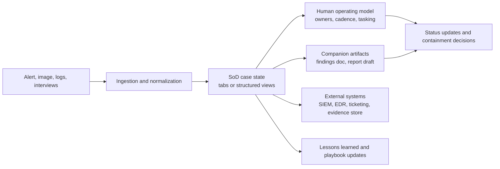
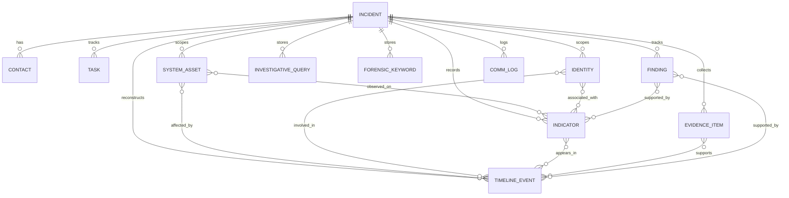
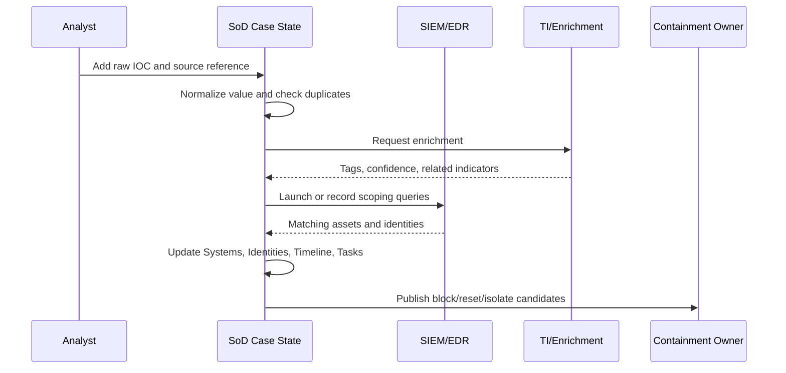

# Spreadsheet of Doom (SoD): Architecture and Operating Model for Spreadsheet-Centric DFIR Case Coordination

## Reading Guide

Labels used below: **Direct evidence** = stated or shown by sources; **Common practice** = recurring practitioner behavior consistent with sources; **Synthesis** = architectural conclusions drawn from the sources plus implementation reasoning.

## 1. Executive Summary

**Synthesis.** The “Spreadsheet of Doom” (SoD) is a spreadsheet-centric DFIR coordination pattern in which the live state of an investigation is maintained in a workbook or workbook-like grid with structured tabs for incident metadata, contacts, assets, accounts, indicators, evidence, tasks, queries, and timeline events; the same artifact also serves as the case’s shared control surface for ownership, cadence, scoping, reporting inputs, and lightweight automation.[^9][^10][^11][^12][^13]

**Direct evidence.** Practitioner sources describe this pattern as a structured, tabbed tracker used to consolidate incident timelines, systems, accounts, indicators, evidence items, and tasking, while supporting concurrent updates, reporting, and communication. TrustedSec explicitly describes a “Spreadsheet-of-Doom (SOD)” paired with a separate master findings document, and SANS/Aurora describes its tool as “the spreadsheet of Doom on steroids.” CrowdStrike publishes a public IR tracker workbook with the same structural intent, even without using the phrase in the title.[^9][^10][^11][^12][^13]

**Synthesis.** SoD exists because real incidents produce fast-moving, heterogeneous, partially trusted facts long before a clean narrative exists. It solves a coordination problem more than a storage problem: who owns what, what is known, what is merely suspected, what evidence exists, what still needs to be collected, and how the team will explain the case coherently to stakeholders. Its limits are equally clear. A spreadsheet is not a SIEM, not a chain-of-custody repository, not a long-form report, and not a high-assurance multi-tenant case platform. A developer implementing a credible SoD-like system should therefore treat the spreadsheet metaphor as a user interface and operating model over structured case state, not as a reason to avoid schema, provenance, normalization, access control, or auditability.[^1][^3][^6][^9][^10][^11][^13]

## 2. What the “Spreadsheet of Doom” Is

### Rigorous definition

**Direct evidence.** The public CrowdStrike tracker is a multi-tab incident workbook containing Investigation Notes, Contact Info, Timeline, Systems, Accounts, Host Indicators, Network Indicators, Request & Task Tracker, Evidence Tracker, Forensic Keywords, and Investigative Queries. It pre-seeds identifiers such as `HI-1`, `NI-1`, `RT-001`, `E-001`, `K-1`, and `Q-1`, and uses validation lists for several status columns. TrustedSec’s SOD content list overlaps strongly: incident summary, tasks, compromised systems, IOCs, compromised accounts, compromised email addresses, incident timeline, and key file or hash information.[^10][^11]

**Synthesis.** SoD is a case-instance coordination substrate: a structured set of analyst-friendly tabular views that captures enough normalized investigation state to support scoping, correlation, tasking, status communication, and reporting, without requiring responders to build a full platform in the middle of an incident. User-facing tabs may stay denormalized for speed, but the conceptual model still needs distinct entities for incidents, assets, identities, indicators, evidence, events, tasks, and findings.[^1][^6][^9][^10][^11]

### Why spreadsheet-based IR coordination emerged

**Direct evidence.** CrowdStrike released its tracker after encountering a client that had no method for tracking indicators or building a timeline, and because nothing simple and public was readily available. TrustedSec makes the same point operationally: once multiple analysts start producing output, centralized analysis documentation is required before the work becomes impossible to aggregate live.[^9][^11]

**Common practice.** Spreadsheet-based coordination emerged because spreadsheets are already installed, familiar, easy to share, tolerant of schema change, and fast to adapt under uncertainty. CrowdStrike explicitly recommends collaborative spreadsheet platforms and notes that repetitive copy-paste work can be automated with built-in scripting, while TrustedSec frames rapid triage around local tools and portable forensic environments.[^9][^11]

### Where it fits in the incident response lifecycle

**Direct evidence.** NIST places incident work across Detect, Respond, Recover, reporting, notification, and improvement, with many internal and external stakeholders involved.[^1]

**Synthesis.** SoD lives mostly in Detect, Respond, and Recover, but it is most valuable at the boundaries: intake into scoping, evidence into hypothesis, tasking into containment, and chronology into executive reporting. It also becomes an input to improvement because it preserves structured case state that can be reviewed after the incident.[^1][^2][^6]

### Is it a spreadsheet, a family of tabs, or a broader operating model?

**Synthesis.** It is all three: a workbook-like artifact, a family of entity-specific tabs or views, and a broader operating model for ownership, cadence, field conventions, evidence references, and handoff into reports. TrustedSec’s pairing of SOD with a master findings document makes that broader model explicit.[^11]

### Why teams still use it despite dedicated case-management tools

**Direct evidence.** CrowdStrike emphasizes simplicity, repeatability, real-time collaboration, and one-place synthesis. Aurora shows the same pattern evolved into a cross-platform application with graphs, task tracking, CSV import or export, locking, autosave, and threat-intel integrations.[^9][^12][^13]

**Synthesis.** Dedicated platforms are usually better at audit, automation, and search; SoD is usually better at zero-friction deployment, offline portability, and first-hour adaptability. That is why teams often start with SoD semantics and only later move those semantics into an app or platform.[^6][^9][^11][^12][^13]


## 3. Historical / Practitioner Context

**Direct evidence.** The term “Spreadsheet-of-Doom” appears in practitioner material rather than in standards. TrustedSec uses “Spreadsheet-of-Doom (SOD)” for centralized incident analysis documentation, and SANS/Aurora explicitly references the phrase as a known DFIR construct. By contrast, the standards and research in this source pack focus on incident response life cycles, lessons learned, timeline reconstruction, playbooks, reporting, and knowledge sharing rather than on spreadsheets as a formal case-management pattern.[^1][^2][^3][^5][^6][^11][^12][^13]

**Synthesis.** That literature gap matters. It means SoD should be treated as practitioner architecture: real, common, useful, but not standardized. The pattern sits on a maturity continuum. At one end is ad hoc coordination using chat, notes, and whatever screenshots or exports analysts happen to share. Next comes the disciplined workbook that imposes enough structure to stabilize the case. After that comes an app-assisted SoD that preserves the spreadsheet operating model while adding stronger schema, imports, locks, and visualization. Finally comes the structured case-management platform with database-backed workflow, audit, and integrations.[^6][^9][^11][^12][^13]

**Direct evidence.** TrustedSec’s “rapid triage” framing is especially important historically because it shows why spreadsheets persist even when teams aspire to something more mature. The initial response window is dominated by expedient artifact processing, parallel work, low-hanging-fruit IOC discovery, and the need to prepare centralized documentation before the analysis train accelerates. CrowdStrike’s tracker and Aurora’s tooling address the same problem from slightly different maturity points.[^9][^11][^12][^13]

**Common practice.** Spreadsheet-based coordination persists because it aligns with how many investigations actually unfold: scoping changes hourly, analysts need to pivot from one indicator to another quickly, stakeholders demand updates before the facts are complete, and clients often participate directly. In that environment, the spreadsheet’s real competitive advantage is not computation. It is negotiation speed between humans. That is why even structured-platform teams often retain spreadsheet-like views, exports, or case summaries that preserve SoD semantics.[^1][^6][^9][^11][^13]

## 4. System Goals and Non-Goals

### What SoD is good at

**Direct evidence.** CrowdStrike describes the tracker as a single place for synthesizing incident timelines, indicators, accounts, systems, contacts, evidence items, meetings, and tasks. The same source emphasizes that host and network indicators support pivoting into more data, feeding SIEM and EDR platforms, and informing perimeter blocking. The timeline is positioned as the basis of the incident narrative and as a way to answer the “5Ws and 1H” of the incident.[^9]

**Synthesis.** A well-designed SoD is good at six things: establishing live case state, coordinating multiple responders, scoping assets and identities, preserving evidence provenance references, building a defensible timeline, and feeding reporting. It is especially strong when facts are numerous, heterogeneous, and incomplete but still need to be communicated coherently.[^1][^3][^9][^10][^11]

### What SoD is bad at

**Direct evidence.** NIST treats collected incident data as evidence and recommends retaining it according to preservation procedures and data-retention policy. The event-reconstruction literature also emphasizes contamination risk, timestamp normalization problems, source heterogeneity, tool limitations, and the distinction between extracted facts and inferred events.[^1][^3]

**Synthesis.** SoD is bad at being the authoritative store for raw evidence, the execution engine for large-scale hunting, the legal chain-of-custody system, or the sole place for long-form analytic reasoning. It also degrades quickly when too many users edit it without field discipline, when timestamps are ambiguous, or when the workbook becomes the only place where critical facts exist.[^1][^3][^11]

### Capability boundaries: what belongs inside vs. outside SoD

**Synthesis.** The right boundary is simple.

- **Inside SoD:** case metadata, contacts, tasks, normalized asset and identity scope, indicator registry, evidence references, timeline events, query library, forensic keywords, findings, and communication decisions.[^9][^10][^11]
- **Outside SoD:** raw telemetry retention and search in SIEM/EDR, ticket state in ticketing systems, raw evidence files in forensic storage, long-form analytic prose in the master findings document, and reusable cross-case procedures in a knowledge base or playbook repository.[^1][^6][^11]

**Direct evidence.** TrustedSec explicitly separates SOD from the master findings document used for low-level analysis output and for daily status and final report creation. The structured playbook literature similarly argues for machine-readable playbooks, reporting, and knowledge-sharing systems that integrate with external platforms, rather than overloading one document with every function.[^5][^6][^11]

## 5. Socio-Technical Operating Model

**Direct evidence.** NIST treats communications, reporting, and stakeholder coordination as first-class parts of incident response. TrustedSec says teams should assign an incident lead, establish communication cadence, and decide whether daily status reporting or only end-of-incident reporting is required. CrowdStrike warns that the tracker only “gives back” if all team members maintain it consistently and emphasizes “tracker hygiene.”[^1][^9][^11]

### Roles and responsibilities

**Synthesis.** A credible SoD operating model usually includes an IR lead for scope and stakeholder narrative, investigators who update assets, identities, indicators, timeline rows, and queries, a forensicator for evidence intake and provenance, a threat hunter for scoping pivots, a reporting lead for findings and chronology quality, a stakeholder liaison for meetings and notifications, and a containment owner who translates scoped facts into operational actions.[^1][^9][^11]

### Communication cadence and update rules

**Common practice.** The workbook is only trustworthy when updates are routine. A minimal rhythm is continuous analyst updates, an IR-lead scrub before stakeholder updates, and an end-of-day reconciliation that resolves duplicates, empty critical fields, and unowned tasks. TrustedSec’s advice to establish cadence before analysis begins is therefore as important as the tracker itself.[^11]

**Synthesis.** Recommended rules are simple: every row has an owner or last updater; every timeline row references evidence or a query result; every task has one owner and explicit status; every scope change appears in Systems or Accounts before it appears in stakeholder reporting; facts and hypotheses stay separated; and sortable time fields are always UTC, with original timezone kept only as source metadata.[^3][^9][^10][^11]

### Tracker hygiene and companion artifacts

**Direct evidence.** CrowdStrike’s workbook encodes hygiene through separate tabs, seeded IDs, and narrow status vocabularies such as `Confirmed`, `Under Investigation`, `Suspicious`, and `Unrelated` for timeline and indicator rows. TrustedSec adds a second artifact, the master findings document, for low-level analysis output and report drafting.[^10][^11]

**Synthesis.** Good hygiene means the SoD stays the operational index rather than the dumping ground. Raw tool output belongs in analysis notes or evidence storage. Long prose belongs in findings or report drafts. The workbook should hold compact, queryable facts about source, time, status, relationship, and next action so the case remains legible under pressure and portable into later automation.[^1][^6][^11]




## 6. Canonical Data Model

**Direct evidence.** The CrowdStrike workbook demonstrates a concrete baseline schema in spreadsheet form: investigation notes, contacts, timeline, systems, accounts, host indicators, network indicators, requests, evidence, forensic keywords, and investigative queries. Several rows include `Submitted By`, `Date Added`, status, notes, and optional `ATT&CK Alignment`, which are strong hints about the provenance and reporting fields practitioners actually need. TrustedSec’s content list confirms the same core entities while adding emphasis on incident summary, compromised email addresses, and the downstream master findings document.[^10][^11]

**Synthesis.** The schema below is a normalized conceptual model inferred from the workbook exemplar, practitioner workflow, NIST incident-response requirements, and playbook/reporting research. In a spreadsheet-native implementation, these entities appear as tabs or filtered views. In an app-assisted or platform implementation, they should be first-class records with foreign keys and audit metadata.[^1][^6][^10][^11]

### 6.1 Common vs. optional tabs

**Common across most SoD implementations**

- Incident metadata or investigation notes.
- Contacts.
- Tasks or requests.
- Systems or assets.
- Accounts or identities.
- Host indicators.
- Network indicators.
- Evidence items.
- Timeline events.
- Investigative queries.
- Forensic keywords.[^9][^10][^11]

**Optional, evolved, or advanced**

- Findings or hypotheses.
- Dedicated ATT&CK or TTP mapping.
- Communications or meeting log.
- Relationship graphs and saved pivots.
- Detection-handoff view.
- Structured export view for final reporting.[^6][^9][^10][^11][^13]

### 6.2 Normalized conceptual schema



### 6.3 Entity specifications

#### Incident metadata

- **Purpose and required fields.** Case header and reporting anchor; required fields are `incident_id`, `title`, `opened_at_utc`, `incident_lead_contact_id`, `severity`, `current_phase`, `current_status`, and `summary`.[^1][^11]
- **Optional fields and key.** Client reference, bridge details, legal hold, deadlines, recovery target, confidentiality; primary key `INC-YYYY-NNNN`.
- **Relationships, validation, pivots, consumers.** Parent of all case entities; exactly one lead, enums for severity and phase, UTC timestamps; common pivots are scope delta and open deadlines; primary consumers are stakeholder updates and final reporting.

#### Contacts

- **Purpose and required fields.** Internal and external humans relevant to the case; required fields are `contact_id`, `name`, `organization`, `role`, one contact method, and `timezone`. CrowdStrike exposes this as a dedicated tab.[^10]
- **Optional fields and key.** Escalation path, working hours, privileged flag, notification scope; primary key `CTC-NNNN`.
- **Relationships, validation, pivots, consumers.** Referenced by incident metadata, tasks, approvals, and comms; validate email and timezone, usually dedupe by `(incident_id, email)`; pivots include who must join the next call and who owns blocked work; consumers are update distribution and escalation.

#### Tasks and requests

- **Purpose and required fields.** Convert questions and actions into owned work; required fields are `task_id`, `created_at_utc`, `priority`, `workstream`, `description`, `owner_contact_id`, and `status`.[^9][^10][^11]
- **Optional fields and key.** Due time, blocker, completion time, external ticket reference, linked finding or evidence; primary key `TSK-NNNN` or `RT-NNN`.
- **Relationships, validation, pivots, consumers.** May link to assets, identities, evidence, findings, or comms; closed tasks require `completed_at_utc` and no active task should be unowned; pivots are overdue containment, blocked collection, and open work by stream; consumers are standups and recovery planning.

#### Systems or assets

- **Purpose and required fields.** Represent scoped hosts, cloud resources, mailboxes, appliances, or other assets; required fields are `asset_id`, `canonical_name`, `asset_type`, `status`, `first_seen_utc`, `last_seen_utc`, and `source_ref`. CrowdStrike’s Systems tab adds role and OS because scoping and reporting depend on asset context.[^10]
- **Optional fields and key.** Hostname, FQDN, IP list, domain or tenant, OS, business function, criticality, owner, containment state; primary key `SYS-NNNN`.
- **Relationships, validation, pivots, consumers.** Linked many-to-many with indicators and events and often with evidence tasks; dedupe on normalized hostname or FQDN plus environment, keep first seen less than or equal to last seen, enumerate status; pivots are compromised assets, crown-jewel impact, and assets sharing an IOC; consumers are scope, containment, and report impact sections.

#### Accounts or identities

- **Purpose and required fields.** Capture user, service, admin, mailbox, or machine identities implicated in the case; required fields are `identity_id`, `normalized_name`, `identity_type`, `tenant_or_domain`, `status`, `first_seen_utc`, and `last_seen_utc`.[^10]
- **Optional fields and key.** SID, email, display name, privilege level, MFA state, related asset, source system; primary key `IDN-NNNN` or `AI-NNN`.
- **Relationships, validation, pivots, consumers.** Link to assets, events, indicators, and tasks; normalize UPN, SAM, mailbox, or service-principal form and distinguish attacker-created from compromised; pivots are privileged identities in scope and all activity for one identity; consumers are password resets, IAM containment, and lateral-movement analysis.

#### Host indicators

- **Purpose and required fields.** Track host-resident IOCs such as file paths, filenames, hashes, registry keys, services, mutexes, or process names; required fields are `indicator_id`, `indicator_type`, `raw_value`, `normalized_value`, `status`, and `source_ref`.[^10]
- **Optional fields and key.** Full path, SHA256, SHA1, MD5, size, purpose, ATT&CK technique, first and last seen, family tags; primary key `IND-H-NNNN` or `HI-NNN`.
- **Relationships, validation, pivots, consumers.** Link to assets, evidence, events, and findings; validate hash lengths and canonicalize paths, dedupe cautiously on normalized value plus source; pivots are all assets sharing a hash or path and all indicators clustering to one malware family; consumers are host hunting, EDR blocking, and detection engineering.

#### Network indicators

- **Purpose and required fields.** Track IPs, domains, URLs, mailbox senders, SNI, JA3 or JA4, user agents, or beacon destinations; required fields are `indicator_id`, `indicator_type`, `raw_value`, `normalized_value`, `status`, and `first_seen_utc` or `source_ref`.[^10]
- **Optional fields and key.** Last seen, enrichment tags, TI confidence, related host indicator, block recommendation, ATT&CK technique; primary key `IND-N-NNNN` or `NI-NNN`.
- **Relationships, validation, pivots, consumers.** Link to assets, identities, events, queries, and findings; lowercase domains, canonicalize URLs, parse IPs, preserve original value; pivots are first or last seen and all assets or identities tied to a network IOC; consumers are blocking, scoping, and intel enrichment.

#### Evidence items

- **Purpose and required fields.** Represent collected evidence as referenced objects, not embedded binaries; required fields are `evidence_id`, `evidence_type`, `source_system_or_person`, `received_at_utc`, `evidence_date_range`, and `storage_location`. CrowdStrike’s Evidence Tracker reflects this boundary directly.[^10]
- **Optional fields and key.** Collector, transfer method, file hash, chain-of-custody reference, size, retention class, privilege flag, parser status; primary key `EVD-NNNN` or `E-NNN`.
- **Relationships, validation, pivots, consumers.** Referenced by events, tasks, findings, and scoped entities; `storage_location` must resolve to an actual repository object and file evidence should carry a hash when available; pivots are what evidence supports a claim and what collections are still missing; consumers are forensics, audit, and report appendices.[^1]

#### Timeline events

- **Purpose and required fields.** Reconstruct ordered incident activity; required fields are `event_id`, `event_time_utc`, `time_precision`, `event_type`, `summary`, `source_ref`, and `status_or_confidence`. CrowdStrike’s Timeline tab and the forensics literature both show why chronology is central and why extracted facts must be distinguished from inferred events.[^3][^10]
- **Optional fields and key.** Asset, identity, indicator, evidence, ATT&CK technique, size, hash, details, raw timestamp, original timezone; primary key `EVT-NNNN`.
- **Relationships, validation, pivots, consumers.** Links many-to-many with assets, identities, indicators, evidence, and findings; require UTC for sorting, one fact per row, mandatory source reference, and explicit marking of inferred rows; pivots are earliest compromise, lateral movement chain, and pre or post-containment activity; consumers are the incident narrative, scoping, and recovery validation.

#### Investigative queries

- **Purpose and required fields.** Preserve exact hunting or scoping queries used in SIEM, EDR, mail, IAM, or forensic tools; required fields are `query_id`, `platform`, `purpose`, `query_text`, and `created_by_contact_id`.[^10]
- **Optional fields and key.** Time range, parameters, last run time, result count, saved-search URL, linked indicator or finding; primary key `QRY-NNNN` or `Q-NNN`.
- **Relationships, validation, pivots, consumers.** Can link to indicators, assets, identities, evidence, and findings; preserve query text verbatim, never store secrets, and require purpose to explain the scoping question; pivots are rerunning all queries tied to a new IOC and comparing variants; consumers are repeatability, hunting, and control improvement.

#### Forensic keywords

- **Purpose and required fields.** Capture small, incident-specific keyword sets used during artifact searches, malware triage, registry parsing, or string scans; required fields are `keyword_id`, `pattern`, and `reason`.[^10]
- **Optional fields and key.** Regex flag, encoding, case sensitivity, family tag, source analyst; primary key `KEY-NNNN` or `K-NNN`.
- **Relationships, validation, pivots, consumers.** Can link to queries, evidence, findings, or indicators; distinguish literal from regex and document escaping and case sensitivity; pivots are which keywords worked and what should be rescanned after a new pattern emerges; consumers are forensic triage and malware analysis.

#### Findings and hypotheses

- **Purpose and required fields.** Separate analytic conclusions from raw facts; required fields are `finding_id`, `statement`, `state`, `confidence`, and `owner_contact_id`. This entity is optional in a workbook-native SoD but strongly recommended once the case grows.[^3][^11]
- **Optional fields and key.** Supporting refs, contradictory refs, impact, recommendation, report section, decision date; primary key `FND-NNNN`.
- **Relationships, validation, pivots, consumers.** Supported by events, indicators, evidence, assets, and identities; use explicit states such as `open`, `confirmed`, or `rejected` and require evidence references; pivots are unresolved high-impact hypotheses and evidence gaps; consumers are status reports, final reporting, legal review, and lessons learned.

#### ATT&CK or TTP mapping

- **Purpose and required fields.** Provide normalized technique mapping when per-row ATT&CK fields are not enough; required fields are `ttp_map_id`, `object_ref`, `technique_id`, and `mapping_basis`. CrowdStrike shows that mapping often starts as a field-level annotation.[^10]
- **Optional fields and key.** Tactic, sub-technique, confidence, procedure example; primary key `TTP-NNNN`.
- **Relationships, validation, pivots, consumers.** Links to indicators, events, assets, findings, or queries; enforce ATT&CK syntax and do not treat ATT&CK mapping as actor attribution; pivots are observed techniques and uncovered detections; consumers are reporting, purple teaming, and coverage analysis.

#### Communications or meeting log

- **Purpose and required fields.** Track stakeholder meetings, approvals, decision points, and notifications; required fields are `comm_id`, `timestamp_utc`, `channel_or_meeting`, `participants`, `summary`, and `decision_or_action`. CrowdStrike often places some of this in Investigation Notes instead of a dedicated tab.[^9][^10][^11]
- **Optional fields and key.** Privilege tag, next update due, linked task or finding, notification scope; primary key `COM-NNNN`.
- **Relationships, validation, pivots, consumers.** Links to contacts, tasks, incident metadata, and findings; decisions should reference an owner or linked task and privileged notes should be tagged; pivots are who approved containment and what notifications were sent; consumers are governance, reporting, and after-action review.

### 6.4 Example schema snippets

```sql
CREATE TABLE system_asset (
  asset_id TEXT PRIMARY KEY,
  incident_id TEXT NOT NULL REFERENCES incident(incident_id),
  canonical_name TEXT NOT NULL,
  asset_type TEXT NOT NULL,
  hostname TEXT,
  fqdn TEXT,
  tenant_or_domain TEXT,
  ip_addresses_json TEXT NOT NULL DEFAULT '[]',
  operating_system TEXT,
  business_function TEXT,
  criticality TEXT,
  status TEXT NOT NULL,
  first_seen_utc TIMESTAMPTZ,
  last_seen_utc TIMESTAMPTZ,
  owner_identity_id TEXT,
  source_ref TEXT NOT NULL,
  notes TEXT,
  created_by TEXT NOT NULL,
  created_at_utc TIMESTAMPTZ NOT NULL,
  updated_at_utc TIMESTAMPTZ NOT NULL
);

CREATE TABLE indicator (
  indicator_id TEXT PRIMARY KEY,
  incident_id TEXT NOT NULL REFERENCES incident(incident_id),
  indicator_family TEXT NOT NULL,   -- host or network
  indicator_type TEXT NOT NULL,     -- sha256, domain, ip, path, url, etc.
  raw_value TEXT NOT NULL,
  normalized_value TEXT NOT NULL,
  status TEXT NOT NULL,
  first_seen_utc TIMESTAMPTZ,
  last_seen_utc TIMESTAMPTZ,
  source_ref TEXT NOT NULL,
  attack_technique_id TEXT,
  confidence SMALLINT CHECK (confidence BETWEEN 0 AND 100),
  notes TEXT,
  created_by TEXT NOT NULL,
  created_at_utc TIMESTAMPTZ NOT NULL
);

CREATE TABLE timeline_event (
  event_id TEXT PRIMARY KEY,
  incident_id TEXT NOT NULL REFERENCES incident(incident_id),
  event_time_utc TIMESTAMPTZ NOT NULL,
  original_timestamp TEXT,
  original_timezone TEXT,
  time_precision TEXT NOT NULL,     -- exact, minute, hour, day, inferred
  event_type TEXT NOT NULL,
  summary TEXT NOT NULL,
  details TEXT,
  source_ref TEXT NOT NULL,
  status_or_confidence TEXT NOT NULL,
  attack_technique_id TEXT,
  created_by TEXT NOT NULL,
  created_at_utc TIMESTAMPTZ NOT NULL,
  updated_at_utc TIMESTAMPTZ NOT NULL
);
```


## 7. Architecture

**Synthesis.** A developer should think of SoD architecture as four layers: ingestion, normalization and enrichment, case-state storage, and analyst-facing views. The spreadsheet is only one possible view over the case-state layer. The core question is how much structure can be added without breaking analyst speed.[^6][^9][^12][^13]

### 7.1 Storage layer patterns

**Synthesis.** Four storage patterns recur in practice.

- **Single XLSX or shared workbook.** Fastest to launch and easiest to hand to any team.[^9][^10]
- **Workbook plus scripts.** Same artifact, but with scripted imports, cleanup, enrichment, or exports. CrowdStrike explicitly points to this path.[^9]
- **Local app wrapping a workbook.** A desktop wrapper can preserve workbook semantics while adding richer validation and views; Aurora illustrates the general pattern.[^12][^13]
- **Database-backed app preserving SoD semantics.** The workbook becomes a view or export while the system of record moves into structured storage with audit and APIs.[^5][^6]

### 7.2 Ingestion, normalization, and enrichment

**Manual entry.** Interviews, ad hoc observations, and stakeholder decisions always require human capture, so manual entry must stay cheap.[^9][^10][^11]

**CSV and export ingestion.** A credible SoD implementation needs importers for SIEM, EDR, mail, identity, and forensic exports, plus explicit column mapping into canonical entities.[^9][^12][^13]

**Normalization and deduplication.** Normalize timestamps to UTC, preserve original time and timezone as source metadata, normalize indicator strings, and deduplicate cautiously with explainable composite keys. The timeline literature shows why silent collapse of near-duplicates is dangerous.[^3]

**Enrichment and correlation.** Enrichment should be asynchronous and non-destructive: add tags, confidence, and pivots, but do not overwrite observed values. Core correlations are asset to indicator, identity to asset, event to evidence, and finding to supporting rows.[^12][^13]

### 7.3 Timeline construction, visualization, and reporting

**Direct evidence.** CrowdStrike treats the timeline as the narrative backbone and recommends ISO 8601 plus UTC for sortable time. Aurora adds graphical timelines and graph views once the underlying events are structured.[^9][^12][^13]

**Synthesis.** Timeline construction should be a pipeline: raw observations become normalized events, events link to assets, identities, indicators, and evidence, and the reporting layer derives summaries such as earliest compromise, lateral movement path, containment window, and residual risk. Visualization is useful only after normalization.[^3][^9][^13]

**Reporting and summary generation.** The SoD should expose two outputs: operational summaries for “what changed and what is blocked,” and structured exports for findings and final reporting. TrustedSec’s separation of SOD from the master findings document is the practical design cue.[^1][^11]

**Optional future-state automation.** Retrieval-augmented or LLM-assisted timeline summarization can help after normalization, but it is an augmentation layer over evidence-linked events, not a substitute for provenance or human review.[^8]

### 7.4 Search, versioning, concurrency, and integrity

**Direct evidence.** CrowdStrike recommends cloud collaboration partly to reduce versioning problems, and Aurora adds lock and autosave concepts. The literature in this source pack does not define a standard spreadsheet-native concurrency algorithm, which is itself instructive.[^9][^12][^13]

**Synthesis.** Pure spreadsheets rely on human-optimistic coordination, append-oriented editing, narrow vocabularies, and milestone snapshots. App-assisted SoD should add structured storage, record-level conflict warnings, autosave, and explicit save points. Full platforms should add transactional storage, row history, RBAC, audit events, APIs, and cross-case search.[^5][^6][^9][^10][^12][^13]

**Evidence integrity.** In every architecture, raw evidence belongs outside the SoD. The SoD stores references, hashes, provenance, collection state, and analytic conclusions derived from evidence.[^1]

### 7.5 Access control, backup, portability, and trade-offs

**Direct evidence.** The playbook-assistance literature treats confidentiality, reporting, integration, and versioning as explicit requirements. TrustedSec’s rapid-triage framing and Aurora’s desktop model reflect the reality that some incident work is local and sometimes disconnected.[^6][^11][^12]

**Synthesis.** Apply least privilege to the case file or store, keep durable snapshots in both human-readable and machine-readable form, support offline read access at minimum, and provide sanitized export paths for sensitive cases.[^1][^6]

**Synthesis.** The trade-offs are straightforward: pure spreadsheet-native SoD wins on speed and portability but loses on schema, audit, and scale; app-assisted SoD is usually the best balance because it preserves grid-based analyst workflows while adding structure and automation; full structured platforms win on concurrency, RBAC, audit, and portfolio analytics but can lose first-hour adaptability unless they deliberately preserve SoD-like capture views.[^5][^6][^9][^10][^11][^12][^13]


## 8. Core Workflows

**Direct evidence.** NIST organizes incident work around detecting, responding, recovering, reporting, and learning. TrustedSec adds a practical rhythm of incident lead assignment, communication planning, centralized analysis documentation, daily status, and final reporting. CrowdStrike’s tracker content maps naturally onto those phases via its tabs for timeline, systems, accounts, indicators, tasks, evidence, and notes.[^1][^9][^10][^11]

### 8.1 Incident intake and setup

**NIST mapping.** Detect into early Respond.[^1] **Trigger.** Alert, escalation, retainer activation, or client report. **Actors.** IR lead, coordinator, stakeholder liaison. **Inputs.** Initial alert, case request, bridge details, points of contact. **Outputs.** Incident record, contact list, cadence, initial tasks, notes. **Entities touched.** Incident metadata, contacts, tasks, communications or notes. **Quality risks.** Missing lead assignment, ambiguous severity, no UTC baseline, and no agreed status vocabulary.[^11]

### 8.2 Identification and scoping

**NIST mapping.** Detect and Respond.[^1] **Trigger.** Triage suggests a real incident rather than a false positive. **Actors.** Investigators, hunters, IR lead. **Inputs.** Alerts, early query results, forensic triage observations, user reports. **Outputs.** Candidate assets and identities, initial hypotheses, severity update, scoping queries. **Entities touched.** Systems, identities, timeline, investigative queries, findings or notes. **Quality risks.** Confusing suspicion with confirmation, duplicate assets, and scope expansion not captured in the tracker.[^9][^11]

### 8.3 IOC capture and enrichment

**NIST mapping.** Detect and Respond.[^1] **Trigger.** Discovery of a suspicious hash, path, IP, domain, URL, mailbox, account artifact, or pattern. **Actors.** Investigator, threat-intel analyst, hunter. **Inputs.** Telemetry, disk or memory artifacts, email artifacts, CTI context. **Outputs.** Normalized indicator record, enrichment tags, linked assets, rerun queries, block candidates. **Entities touched.** Host indicators, network indicators, systems, identities, investigative queries, timeline. **Quality risks.** Poor normalization, duplicate indicators, over-trusting threat-intel verdicts, and failure to preserve the original observed value.[^3][^12][^13]



### 8.4 Asset and account scoping

**NIST mapping.** Respond.[^1] **Trigger.** New indicator, event cluster, privileged identity, or compromised mailbox suggests broader scope. **Actors.** Hunters, investigators, identity specialist, IR lead. **Inputs.** Query results, IAM logs, mail traces, endpoint telemetry, asset inventory context. **Outputs.** Expanded or reduced in-scope assets and identities and proposed containment targets. **Entities touched.** Systems, identities, indicators, timeline, tasks. **Quality risks.** Alias collisions, stale asset metadata, missing tenant context, and failing to distinguish accessed from confirmed compromised.[^10]

### 8.5 Evidence collection tracking

**NIST mapping.** Respond.[^1] **Trigger.** Decision to collect disk, memory, logs, mail exports, cloud audit logs, firewall logs, PCAP, or interviews. **Actors.** Forensicator, IR lead, client or system owner. **Inputs.** Collection request, legal or policy constraints, acquisition outputs. **Outputs.** Evidence record, storage location, hash or chain reference, task status, timeline note. **Entities touched.** Evidence items, tasks, timeline, communications. **Quality risks.** Missing provenance, poor storage naming, untracked collections, and evidence described only in chat or email.[^1][^10]

### 8.6 Timeline building and refinement

**NIST mapping.** Detect, Respond, and Recover.[^1] **Trigger.** Any new fact that changes sequence, causality, or first and last seen windows. **Actors.** Investigators, forensicator, reporting lead. **Inputs.** Normalized events from telemetry, evidence, interviews, and tool output. **Outputs.** Ordered chronology, pivot points, confidence gaps, pre- and post-containment views. **Entities touched.** Timeline, evidence, systems, identities, indicators, findings. **Quality risks.** Timezone mistakes, inferred events entered as facts, duplicate rows, and sorting on unnormalized text timestamps.[^3][^9][^10]

### 8.7 Task and request management

**NIST mapping.** Respond.[^1] **Trigger.** Analytic question, stakeholder ask, collection need, or containment action. **Actors.** IR lead, analysts, client stakeholders. **Inputs.** Findings gaps, stakeholder requirements, dependency blockers. **Outputs.** Assigned work, due dates, blockers, completion state. **Entities touched.** Tasks, contacts, communications, findings. **Quality risks.** Orphan tasks, stale statuses, and decisions captured in meetings but never converted into owned work.[^9][^11]

### 8.8 Containment, eradication, and recovery support

**NIST mapping.** Respond and Recover.[^1] **Trigger.** Sufficient confidence to act or verify action. **Actors.** IR lead, containment owner, IT operations, client contact. **Inputs.** Scoped assets and identities, indicators, evidence-backed findings. **Outputs.** Isolation, blocking, resets, rebuilds, restore validation, and residual-risk tasks. **Entities touched.** Systems, identities, indicators, tasks, timeline, communications, findings. **Quality risks.** Acting on unconfirmed data, failing to log the exact decision and approval, and losing the mapping between action and evidence basis.[^1][^11]

### 8.9 Daily status reporting

**NIST mapping.** Respond.[^1] **Trigger.** Planned cadence or stakeholder request. **Actors.** IR lead, reporting lead, liaison. **Inputs.** Current SoD state, master findings document, unresolved questions, task board. **Outputs.** Executive update, delta since last report, active risks, next actions. **Entities touched.** Incident metadata, findings, tasks, timeline, contacts, communications. **Quality risks.** Report text drifting from tracker state, inconsistent counts, and uncertainty presented as fact.[^11]

### 8.10 Final reporting

**NIST mapping.** Recover plus improvement planning.[^1] **Trigger.** Scope is stable enough to narrate what happened and what must change. **Actors.** Reporting lead, incident lead, legal, executive stakeholders. **Inputs.** Curated timeline, findings, evidence references, scope lists, task outcomes. **Outputs.** Final report with narrative, impact, root cause, evidence basis, and recommendations. **Entities touched.** Timeline, findings, evidence, systems, identities, indicators, communications. **Quality risks.** Missing provenance for claims, contradictory rows never reconciled, and findings that cannot be traced back to evidence or timeline rows.[^1][^3][^11]

### 8.11 Lessons learned and post-incident review

**NIST mapping.** Identify Improvement and Govern.[^1] **Trigger.** Containment and recovery stabilize or close. **Actors.** Response team, service owners, engineering, leadership. **Inputs.** Final report, communications log, unresolved tasks, missed detections, near misses. **Outputs.** Improvement actions, playbook updates, knowledge-base entries, detection backlog, sanitized sharing outputs. **Entities touched.** Findings, tasks, communications, external knowledge base or playbook system. **Quality risks.** Superficial retrospectives, no owners for improvements, and no translation of case knowledge into reusable artifacts.[^2][^4][^5][^6][^7]


## 9. Failure Modes and Limits

**Direct evidence.** Several failure modes are visible directly in the sources. CrowdStrike highlights update discipline and UTC or ISO timestamping because collaboration and sorting break without them. The timeline-reconstruction literature documents timestamp ambiguity, interpretation bias, source conflicts, and tooling limits. The playbook literature adds confidentiality, integration, reporting, and versioning pressures once teams move toward more formalized operations.[^3][^6][^9][^10]

**Synthesis.** In practice, SoD breaks down in predictable ways.

- Human error produces duplicate or contradictory rows, copied-but-not-updated timestamps, and status fields that mix fact, confidence, and workflow state.
- Schema drift occurs when a case evolves faster than the workbook and analysts start inventing ad hoc columns or encoding structure inside free text.
- Inconsistent terminology causes “compromised,” “accessed,” “under investigation,” and “suspicious” to be used interchangeably across tabs, destroying reliable filtering.
- Weak provenance means findings cannot be traced back to source rows or evidence references.
- Weak access control turns the workbook into an accidental disclosure risk.
- Collaboration conflicts cause silent overwrites or the offloading of important facts into chat because editing feels unsafe.
- Reporting friction appears when the workbook holds facts but not analytic conclusions, or when long-form narrative is written directly into grid cells.
- Scale pain appears once the team needs multi-case search, portfolio metrics, or durable APIs for automation.[^1][^3][^6][^11]

**Synthesis.** “Good enough” SoD usage looks more disciplined than sophisticated. There is one case lead, explicit status vocabularies, UTC time conventions, unique row identifiers, evidence references on material claims, daily reconciliation, snapshots at major milestones, and clear separation between tracker, raw evidence, and report prose. Many teams can respond effectively for years with only that level of maturity.[^9][^10][^11]

**Synthesis.** Augment the SoD when repeated manual imports, concurrent analysts, or reporting demands start to dominate effort. Replace it with a structured case platform when you need strong audit trails, row-level RBAC, many-user concurrency, cross-case analytics, formal workflow automation, or regulated reporting at scale. The spreadsheet metaphor can survive as a view, but the file should no longer be the system of record.[^5][^6][^12][^13]

## 10. Design Recommendations

### 10.1 Minimum viable workbook or view structure

**Synthesis.** For a spreadsheet-native implementation, the minimum credible workbook is eight mandatory tabs plus four recommended tabs.

- **Mandatory:** Incident, Contacts, Tasks, Systems, Identities, Indicators, Evidence, Timeline.
- **Recommended:** Investigative Queries, Forensic Keywords, Findings, Communications.
- **Compatibility note.** To mirror public DFIR exemplars more closely, split Indicators into Host Indicators and Network Indicators, and let Incident include Investigation Notes.[^10][^11]

### 10.2 Mandatory fields and naming conventions

**Synthesis.** Every operational row should carry `incident_id`, entity `id`, `created_at_utc`, `created_by`, `status`, `source_ref` or `reason`, and `notes`. Recommended ID families are `INC`, `SYS`, `IDN`, `IND-H`, `IND-N`, `EVD`, `EVT`, `TSK`, `FND`, `QRY`, `KEY`, and `COM`, all with fixed-width numeric suffixes. Never recycle identifiers. CrowdStrike’s seeded IDs show why this matters in practice.[^10]

### 10.3 Validation rules

**Synthesis.** Enumerate status fields separately for assets, identities, tasks, indicators, and findings; force UTC in sortable timestamp fields; validate hash length, IP syntax, domain normalization, and ATT&CK technique format; prevent empty owners on active tasks and empty source references on timeline rows; forbid merged cells and free-text multi-values inside data regions; and keep workflow state separate from analytic confidence.[^3][^10]

### 10.4 Evidence and timeline conventions

**Synthesis.** Evidence references should be short, stable, and machine-joinable, for example `EVD-004#artifact=Security.evtx#record=12345`. Timeline rows should be one fact per row, carry one sortable UTC field plus original timestamp metadata, include explicit `time_precision`, and keep unsupported conclusions out of the summary field.[^3]

### 10.5 Ownership, hygiene, and governance

**Synthesis.** The IR lead owns incident metadata and stakeholder narrative consistency, the reporting lead owns findings quality, the forensicator owns evidence completeness, and every active task has exactly one owner. End each shift or day with a scrub of orphaned rows, duplicate entities, stale statuses, and missing references. Classify case data, snapshot before major decisions and report milestones, log external exports, and define closure criteria before closure pressure arrives.[^1][^2][^6][^9][^11]

### 10.6 Migration roadmap

**Synthesis.** The sensible progression is: ad hoc spreadsheet, disciplined workbook, app-assisted SoD, then structured platform. The disciplined workbook adds IDs, validation, UTC conventions, evidence references, and a findings companion artifact. The app-assisted layer moves canonical data into structured storage while keeping spreadsheet-like views and adding imports, enrichment, faceted pivots, autosave, and snapshot exports. The structured platform adds transactional storage, full audit, RBAC, APIs, cross-case search, and workflow automation.[^5][^6][^12][^13]

**Synthesis.** The recommended baseline from this report is app-assisted SoD. It preserves the spreadsheet’s coordination advantages while removing the worst weaknesses around schema drift, import friction, versioning, and auditability. Teams that need zero-friction deployment can still begin with a disciplined workbook if they adopt these field and governance rules from day one.[^10][^11][^12][^13]


## 11. Conclusion

**Synthesis.** The architectural essence of the Spreadsheet of Doom is not “a spreadsheet full of notes.” It is a case-state system that turns a chaotic incident into structured, shared, continually updated operational truth. Its power comes from combining tabular simplicity with strong human routines: named owners, explicit status vocabularies, evidence references, UTC timelines, and companion artifacts for findings and reporting. Its weakness is exactly the same simplicity when the surrounding discipline is absent.

**Synthesis.** Despite its limitations, SoD remains effective because it optimizes for the first problem most incident teams actually have: coordinated sense-making under uncertainty. The recommended baseline for new implementation is a structured, app-assisted SoD that preserves workbook semantics and exports, but uses explicit schema, enrichment, versioning, and access control behind the scenes. That design keeps the socio-technical strengths of the pattern while making it durable enough for modern DFIR work.[^1][^6][^10][^11][^12][^13]

## 12. Annotated Bibliography

- **NIST SP 800-61 Rev. 3** [standard]. Normative anchor for phases, roles, communications, evidence retention, recovery, and improvement.
- **Patterson, Nurse, and Franqueira (2023)** [academic]. Supports the lessons-learned and organizational-learning parts of the operating model.
- **Breitinger, Studiawan, and Hargreaves (2025)** [academic]. Key source for timeline terminology, timestamp ambiguity, and reconstruction quality.
- **Guerra et al. (2023)** [academic]. Useful for thinking about incident-resolution knowledge reuse after a case closes.
- **Akbari Gurabi et al. (2022), SASP** [academic]. Informs the transition from case-local coordination to sharable, machine-readable playbooks.
- **Akbari Gurabi et al. (2024)** [academic]. Strongest source in the pack for requirements around reporting, automation, versioning, confidentiality, and integrations.
- **Shaked et al. (2023)** [academic]. Helps connect technical case facts to operational response decisions.
- **Loumachi, Ghanem, and Ferrag (2025)** [academic]. Optional future-state source for timeline-analysis augmentation, not a baseline design anchor.
- **CrowdStrike IR Tracker blog post** [vendor]. Provides the clearest public rationale for a tabbed IR tracker and its collaboration model.
- **CrowdStrike IR Tracker XLSX template** [vendor]. Most concrete source for tab names, column choices, seeded IDs, and validation patterns.
- **TrustedSec Rapid Triage Part 1** [practitioner]. Clearest direct description of SOD as a socio-technical DFIR pattern paired with a master findings document.
- **SANS Aurora IR page** [vendor]. Shows how the spreadsheet pattern evolves into a dedicated application while preserving SoD semantics.
- **Aurora Incident Response README** [repo]. Used only as an implementation exemplar for app-assisted features such as imports, locks, autosave, visualizations, and integrations.


## Sources

[^1]: Alexander Nelson, Sanjay Rekhi, Murugiah Souppaya, and Karen Scarfone, *Incident Response Recommendations and Considerations for Cybersecurity Risk Management: A CSF 2.0 Community Profile*, NIST SP 800-61 Rev. 3 (2025), https://doi.org/10.6028/NIST.SP.800-61r3.

[^2]: Clare M. Patterson, Jason R. C. Nurse, and Virginia N. L. Franqueira, “Learning from cyber security incidents: A systematic review and future research agenda,” *Computers & Security* 132 (2023): 103309, https://doi.org/10.1016/j.cose.2023.103309.

[^3]: Frank Breitinger, Hudan Studiawan, and Chris Hargreaves, “SoK: Timeline based event reconstruction for digital forensics: Terminology, methodology, and current challenges,” *Forensic Science International: Digital Investigation* 53 (2025): 301932, https://doi.org/10.1016/j.fsidi.2025.301932.

[^4]: Patrick Andrei Caron Guerra et al., “An Artificial Intelligence Framework for the Representation and Reuse of Cybersecurity Incident Resolution Knowledge,” in *Proceedings of the 13th Latin-American Symposium on Dependable and Secure Computing* (LADC 2023), https://doi.org/10.1145/3615366.3615369.

[^5]: Mehdi Akbari Gurabi et al., “SASP: a Semantic web-based Approach for management of Sharable cybersecurity Playbooks,” in *Proceedings of the 17th International Conference on Availability, Reliability and Security* (ARES 2022), https://doi.org/10.1145/3538969.3544478.

[^6]: Mehdi Akbari Gurabi et al., “Requirements for Playbook-Assisted Cyber Incident Response, Reporting and Automation,” *Digital Threats: Research and Practice* 5, no. 3 (2024): Article 34, https://doi.org/10.1145/3688810.

[^7]: Avi Shaked et al., “Operations-informed incident response playbooks,” *Computers & Security* 134 (2023): 103454, https://doi.org/10.1016/j.cose.2023.103454.

[^8]: Fatma Yasmine Loumachi, Mohamed Chahine Ghanem, and Mohamed Amine Ferrag, “Advancing Cyber Incident Timeline Analysis Through Retrieval-Augmented Generation and Large Language Models,” *Computers* 14, no. 2 (2025): 67, https://doi.org/10.3390/computers14020067.

[^9]: Paul Pratley and Mark Goudie, “CrowdStrike Services Offers Incident Response Tracker for the DFIR Community,” CrowdStrike blog, January 11, 2022, https://www.crowdstrike.com/en-us/blog/crowdstrike-releases-digital-forensics-and-incident-response-tracker/.

[^10]: CrowdStrike, *Incident Response Tracker Template* (XLSX), 2022, https://www.crowdstrike.com/wp-content/uploads/2022/01/CrowdStrike-Incident-Response-Tracker-Template.xlsx. The workbook was inspected locally to confirm sheet names, headers, seeded IDs, and validation lists.

[^11]: Justin Vaicaro, “Incident Response Rapid Triage: A DFIR Warrior’s Guide (Part 1 – Process Overview and Preparation),” TrustedSec blog, April 18, 2023, https://trustedsec.com/blog/incident-response-rapid-triage-a-dfir-warriors-guide-part-1-process-overview-and-preparation.

[^12]: SANS Institute, “Aurora IR,” tool page, last updated June 4, 2025, https://www.sans.org/tools/aurora-ir.

[^13]: Mathias Fuchs, “Aurora Incident Response,” GitHub repository README, https://github.com/cyb3rfox/Aurora-Incident-Response.
