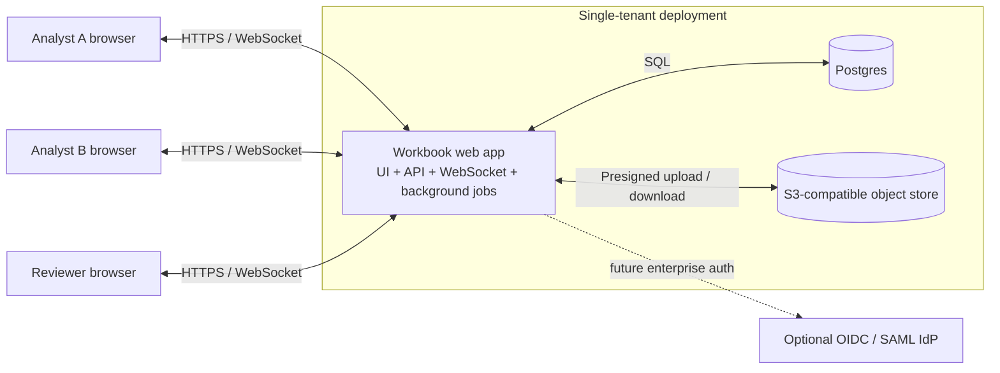
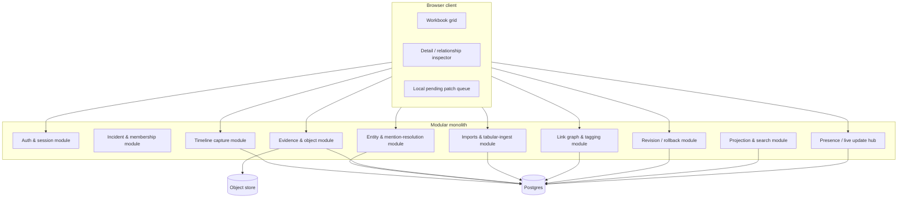

# Appendix B: Architecture Diagrams and Explanatory Source Extract

This appendix is **non-normative**.

It preserves the architecture-oriented explanatory material, diagrams, tables, and rationale from the exploratory source artifact.

## 4. Recommended architecture

### Primary recommendation

Use a **single web application container** (UI + API + WebSocket hub + background jobs) with **Postgres** and **S3-compatible object storage** as separate services. This is a modular monolith, not a distributed platform.

### System context diagram

### Container/component diagram

### Major components

| Component                   | Concrete responsibility                                                                                |
| --------------------------- | ------------------------------------------------------------------------------------------------------ |
| Browser client              | Virtualized grid, keyboard navigation, paste handling, inspector, evidence preview, presence UI        |
| Auth module                 | Local accounts, sessions, MFA, provider mapping for future OIDC/SAML                                   |
| Timeline module             | Rapid row creation, inline edits, rough capture storage                                                |
| Entity module               | Host/identity records, aliases, unresolved mentions, resolution workflows                              |
| Evidence module             | Evidence lifecycle, upload finalization, object metadata, previews, linking evidence to records        |
| Imports & tabular-ingest module | CSV/XLSX adaptation, workbook inspection, preview/header mapping, provenance capture, compatibility shims, and background import apply |
| Link graph & tagging        | Typed relationships and lightweight labels                                                             |
| Revision module             | Change sets, mutation-entry history, row-centric revisions, rollback                                   |
| Projection & search         | Build `*_grid_projection` tables and search vectors for sheet-like views                               |
| Reference data module       | Reference-pack manifests, type/icon registries, framework mappings, integrity verification             |
| Reporting & snapshot module | Immutable incident snapshots, canonical export-model generation, self-contained report/render pipeline |
| Collaboration hub           | WebSocket presence and live row updates                                                                |

### Preferred architecture pattern

A **modular monolith** is the right fit. This problem’s complexity is in mutation semantics, projections, and UX; microservices would add operational and debugging cost without helping the hardest problem. A single codebase with clear module boundaries is easier to deploy in a flyaway kit, easier to reason about during incident work, and easier to ship with deterministic versions.

### Module boundaries

I would define internal module boundaries as:

- `auth`
- `incidents`
- `timeline`
- `entities`
- `evidence`
- `imports`
- `links`
- `revisions`
- `projections`
- `reference_data`
- `reporting`
- `collaboration`

These are internal packages/modules with explicit service interfaces, not separate deployables.

The split worth making explicit is that clipboard interaction stays on the core workbook hot path, while file-based import sits behind a dedicated `imports` module. Clipboard, CSV, and XLSX adapters can still normalize into the same canonical `TabularSource` and shared mapping engine, but only the imports module should absorb parser drift, workbook-shape heuristics, preview/header mapping, and other spreadsheet-compatibility maintenance.

A bounded import contract is more realistic than “Excel support” in the abstract. The first file-based onboarding path should focus on CSV and selected-sheet or selected-region XLSX import, preserve provenance and unknown columns, treat formulas as inert input, and warn, downgrade, or reject unsupported workbook features instead of leaking those semantics into the core workbook modules.

### Storage choices

- **Postgres** stores all structured records, metadata, links, revisions, tags, saved views, projections, reference-pack manifests, and snapshot metadata.
- **S3-compatible object storage** stores binary evidence and optional rendered export artifacts. In flyaway/on-prem, use **MinIO**. In cloud, use native S3/GCS/Azure Blob behind the same abstraction.
- **Reference packs** such as ATT&CK/D3FEND/VERIS mappings, host/evidence type registries, and other optional vocabularies version separately from incident records. Their manifests and integrity metadata belong in Postgres; pack payloads may live on local disk or object storage behind the same abstraction.
- Do **not** store large binary evidence in Postgres. It bloats backups, complicates restore times, and makes portability worse.

### Reference packs, type registries, and view contracts

- Incident records, evidence envelopes, revisions, saved views, and report snapshots are **incident data**.
- Framework mappings, type/icon registries, evidence vocabularies, and optional enrichment datasets are **reference packs** that version independently of incidents.
- Each built-in sheet or system view is declared by a **`view_schema`** contract that names the source record types, computed columns, required reference packs, default sort key, filter semantics, and write-back rules.
- The core workbook must remain usable when optional reference packs are absent. Missing packs may disable overlays or show degraded labels, but they must not block capture or editing.
- Pack activation and updates must verify checksum and, when available, signature or trusted-source metadata before use.

### Backup, restore, portability, failure modes

- **Backups**: Postgres base backup + WAL archiving; object-store bucket snapshot/versioning.
- **Restore**: restore Postgres, restore blob store, then rebuild projection tables. Projection tables are disposable caches.
- **Portability**: export/import of a whole incident should be possible as a manifest + NDJSON/CSV + referenced blobs archive.
- **Failure modes**:
  - App container down: sessions drop, no data loss.
  - Postgres down: system unavailable.
  - Object store down: rows remain editable, but evidence upload/download fails.
  - Projection corruption: rebuild from source tables; source of truth remains intact.

### Projections for grid-like views

Do **not** use Postgres materialized views for hot workbook screens. Their refresh semantics are too coarse for row-by-row collaborative editing. Use **projection tables** such as:

- `timeline_grid_projection`
- `host_grid_projection`
- `identity_grid_projection`
- `artifact_grid_projection`
- `evidence_grid_projection`
- `indicator_grid_projection` over canonical indicator records, with observation-derived counts and lifecycle summaries

Each projection table is **one row per primary record**, denormalized for sheet use. For the Indicators system view, the primary record is the canonical indicator, not the source artifact or observation row. The app updates affected projection rows in the same transaction as the source write. Every projection row exposed to the client must carry the stable `record_id` and `row_version` used for optimistic writes; the client must not infer identity from row position or displayed values. If needed, a rebuild command can regenerate the projections.

### Report and presentation export direction

Reports and presentation artifacts should be treated as a **subsystem**, not as direct ad hoc reads from live workbook tables. The system should capture a `snapshot_at`, materialize a canonical export model such as `incident_report_model.json`, and render derivative outputs like Markdown reports, Mermaid diagram sources, Slidev decks, and HTML reports from that immutable view.

UI visualizations, report sections, framework rollups, and future exports should consume the same canonical derivation/query layer or an explicitly versioned snapshot of it. That keeps filtering, counts, and inclusion semantics consistent across interactive and exported surfaces, provides stable exported identifiers and ordering, and creates a clean place to apply redaction rules. It also leaves room for operator-facing reenactment surfaces, such as Asciinema-style terminal walkthroughs generated from selected command-line evidence, while maintaining a clear distinction between source evidence and generated presentation material.

Generated report artifacts must be **self-contained**: they cannot depend on remote JS, CSS, or font assets at render time. Report builds, snapshot generation, and heavy presentation rendering should run as background jobs so live grid editing remains responsive.

### Long-running operations and background jobs

Lookups, imports, reference-pack refreshes, snapshot generation, report builds, and evidence processing should run as background jobs with progress, cancellation, retry-safe status, and non-blocking UI behavior. Grid editing and row creation must remain responsive while those jobs run.
