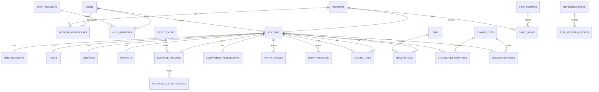

# Appendix C: Schema Reference and DDL Source Extract

This appendix is **non-normative**.

It preserves the schema-oriented source extract, including ER diagram, concrete DDL sketch, and indexing notes.

## 7. Postgres schema proposal

### ER diagram



### Key tables

The central modeling decision is a **`records` envelope table**. Every user-visible object gets one row there. That costs an extra join but buys strong generic linking, tagging, revisions, and consistent UI routing. Built-in view behavior should live in `view_schemas` and reference-pack tables, not in visible headers or tab names.

### Additional schema requirements for mention/stub provenance

The schema sketch needs a few explicit contract fields beyond the high-level tables named above:

- `entity_mentions` MUST store `source_field_key`, `origin_kind`, and `origin_locator`, plus resolution metadata such as `resolved_at`, `resolved_by_user_id`, and `resolution_method`.
- Host and identity records MUST store `entity_origin` and structured provenance, including an optional seed mention reference when the entity was created from a mention.
- `view_schemas.writeback_contract` and import mappings MUST declare `entity_binding_mode` per entity-bearing field.
- Repeated mentions MUST remain separate rows; repeated entity-origin inputs MAY upsert the same entity when exact-match rules select a unique active target.

### Additional schema requirements for rollback granularity

A conformant history schema needs a mutation log in addition to row-snapshot revisions.

- `change_sets` remain the attribution unit for actor, source, reason, and transaction grouping.
- A `change_set_mutations`-style table or equivalent MUST record reversible entries at mutation-target granularity and order them deterministically within the parent `change_set`.
- Mutation targets MUST include row-field edits, `record_links`, `record_tags`, `entity_mentions`, evidence associations, and merge/repoint fan-out.
- Stable mutation target identities MUST use a canonical target-kind-specific serialization. Composite targets MUST serialize deterministically, for example `record_tag:<record_id>:<tag_id>`.
- `record_revisions` MAY retain `before_json` / `after_json` row snapshots for audit and whole-row restore, but they MUST NOT be the sole rollback substrate.

```sql
CREATE EXTENSION IF NOT EXISTS pgcrypto;
CREATE EXTENSION IF NOT EXISTS citext;
CREATE EXTENSION IF NOT EXISTS pg_trgm;

CREATE TABLE users (
    id uuid PRIMARY KEY DEFAULT gen_random_uuid(),
    email citext NOT NULL UNIQUE,
    display_name text NOT NULL,
    password_hash text NOT NULL,
    mfa_required boolean NOT NULL DEFAULT true,
    totp_secret_enc bytea,
    webauthn_credentials jsonb NOT NULL DEFAULT '[]'::jsonb,
    is_active boolean NOT NULL DEFAULT true,
    created_at timestamptz NOT NULL DEFAULT now(),
    last_login_at timestamptz
);

CREATE TABLE auth_providers (
    id uuid PRIMARY KEY DEFAULT gen_random_uuid(),
    provider_key text NOT NULL UNIQUE,
    provider_type text NOT NULL CHECK (provider_type IN ('local','oidc','saml')),
    display_name text NOT NULL,
    config_json jsonb NOT NULL DEFAULT '{}'::jsonb,
    is_enabled boolean NOT NULL DEFAULT true
);

CREATE TABLE auth_identities (
    id uuid PRIMARY KEY DEFAULT gen_random_uuid(),
    user_id uuid NOT NULL REFERENCES users(id) ON DELETE CASCADE,
    provider_id uuid NOT NULL REFERENCES auth_providers(id),
    provider_subject text NOT NULL,
    username citext,
    created_at timestamptz NOT NULL DEFAULT now(),
    last_auth_at timestamptz,
    UNIQUE (provider_id, provider_subject)
);

CREATE TABLE incidents (
    id uuid PRIMARY KEY DEFAULT gen_random_uuid(),
    incident_key text NOT NULL UNIQUE,
    title text NOT NULL,
    description text,
    status text NOT NULL DEFAULT 'active',
    severity text,
    created_by_user_id uuid NOT NULL REFERENCES users(id),
    created_at timestamptz NOT NULL DEFAULT now(),
    closed_at timestamptz
);

CREATE TABLE incident_memberships (
    incident_id uuid NOT NULL REFERENCES incidents(id) ON DELETE CASCADE,
    user_id uuid NOT NULL REFERENCES users(id) ON DELETE CASCADE,
    role text NOT NULL CHECK (role IN ('viewer','editor','reviewer','admin')),
    joined_at timestamptz NOT NULL DEFAULT now(),
    PRIMARY KEY (incident_id, user_id)
);

CREATE TABLE reference_packs (
    pack_key text NOT NULL,
    version text NOT NULL,
    pack_kind text NOT NULL CHECK (
        pack_kind IN ('framework','type_registry','enrichment','view_contract')
    ),
    source_uri text,
    integrity_sha256 text,
    signature_json jsonb NOT NULL DEFAULT '{}'::jsonb,
    status text NOT NULL DEFAULT 'available' CHECK (
        status IN ('available','disabled','failed','missing')
    ),
    installed_at timestamptz NOT NULL DEFAULT now(),
    metadata jsonb NOT NULL DEFAULT '{}'::jsonb,
    PRIMARY KEY (pack_key, version)
);

CREATE TABLE type_registry_entries (
    registry_key text NOT NULL,
    type_key text NOT NULL,
    display_label text NOT NULL,
    category text,
    icon_key text,
    sort_order integer NOT NULL DEFAULT 0,
    pack_key text,
    pack_version text,
    is_local_override boolean NOT NULL DEFAULT false,
    config_json jsonb NOT NULL DEFAULT '{}'::jsonb,
    PRIMARY KEY (registry_key, type_key),
    FOREIGN KEY (pack_key, pack_version)
        REFERENCES reference_packs(pack_key, version)
);

CREATE TABLE view_schemas (
    id text PRIMARY KEY,
    sheet_type text NOT NULL,
    source_record_types text[] NOT NULL,
    base_projection text NOT NULL,
    computed_columns jsonb NOT NULL DEFAULT '[]'::jsonb,
    required_reference_pack_keys text[] NOT NULL DEFAULT '{}'::text[],
    default_sort_key text NOT NULL,
    default_sort_direction text NOT NULL DEFAULT 'asc' CHECK (
        default_sort_direction IN ('asc','desc')
    ),
    filter_contract jsonb NOT NULL DEFAULT '{}'::jsonb,
    writeback_contract jsonb NOT NULL DEFAULT '{}'::jsonb,
    metadata jsonb NOT NULL DEFAULT '{}'::jsonb
);

CREATE TABLE records (
    id uuid PRIMARY KEY DEFAULT gen_random_uuid(),
    incident_id uuid NOT NULL REFERENCES incidents(id) ON DELETE CASCADE,
    record_type text NOT NULL CHECK (
        record_type IN ('timeline_event','host','identity','artifact','evidence','assessment')
    ),
    created_at timestamptz NOT NULL DEFAULT now(),
    created_by_user_id uuid NOT NULL REFERENCES users(id),
    updated_at timestamptz NOT NULL DEFAULT now(),
    updated_by_user_id uuid NOT NULL REFERENCES users(id),
    row_version bigint NOT NULL DEFAULT 1,
    deleted_at timestamptz,
    deleted_by_user_id uuid REFERENCES users(id)
);

CREATE INDEX idx_records_incident_type
    ON records (incident_id, record_type)
    WHERE deleted_at IS NULL;
```

```sql
CREATE TABLE timeline_events (
    record_id uuid PRIMARY KEY REFERENCES records(id) ON DELETE CASCADE,
    incident_id uuid NOT NULL REFERENCES incidents(id) ON DELETE CASCADE,
    event_seq bigint GENERATED ALWAYS AS IDENTITY,
    occurred_at timestamptz,
    recorded_at timestamptz NOT NULL DEFAULT now(),
    summary text,
    details text,
    source_text text,
    capture_state text NOT NULL DEFAULT 'rough' CHECK (
        capture_state IN ('rough','enriched','reviewed','superseded')
    ),
    confidence smallint CHECK (confidence BETWEEN 0 AND 100),
    raw_capture jsonb NOT NULL DEFAULT '{}'::jsonb,
    custom_attrs jsonb NOT NULL DEFAULT '{}'::jsonb
);

CREATE INDEX idx_timeline_events_incident_occurred
    ON timeline_events (incident_id, occurred_at NULLS LAST, event_seq);
CREATE INDEX idx_timeline_events_incident_recorded
    ON timeline_events (incident_id, recorded_at DESC);

CREATE TABLE hosts (
    record_id uuid PRIMARY KEY REFERENCES records(id) ON DELETE CASCADE,
    incident_id uuid NOT NULL REFERENCES incidents(id) ON DELETE CASCADE,
    display_name text NOT NULL,
    hostname citext,
    fqdn citext,
    asset_id text,
    host_type_key text NOT NULL DEFAULT 'host',
    aad_device_id uuid,
    os_platform text,
    host_state text NOT NULL DEFAULT 'stub' CHECK (
        host_state IN ('stub','canonical','merged','retired')
    ),
    merged_into_record_id uuid REFERENCES records(id),
    custom_attrs jsonb NOT NULL DEFAULT '{}'::jsonb
);

CREATE UNIQUE INDEX uq_hosts_incident_hostname
    ON hosts (incident_id, lower(hostname::text))
    WHERE hostname IS NOT NULL AND merged_into_record_id IS NULL;

CREATE TABLE identities (
    record_id uuid PRIMARY KEY REFERENCES records(id) ON DELETE CASCADE,
    incident_id uuid NOT NULL REFERENCES incidents(id) ON DELETE CASCADE,
    display_name text NOT NULL,
    upn citext,
    sam_account_name citext,
    email citext,
    aad_object_id uuid,
    sid text,
    identity_type text NOT NULL DEFAULT 'user' CHECK (
        identity_type IN ('user','service','shared','external')
    ),
    identity_state text NOT NULL DEFAULT 'stub' CHECK (
        identity_state IN ('stub','canonical','merged','disabled')
    ),
    merged_into_record_id uuid REFERENCES records(id),
    custom_attrs jsonb NOT NULL DEFAULT '{}'::jsonb
);

CREATE UNIQUE INDEX uq_identities_incident_upn
    ON identities (incident_id, lower(upn::text))
    WHERE upn IS NOT NULL AND merged_into_record_id IS NULL;

CREATE TABLE entity_aliases (
    id uuid PRIMARY KEY DEFAULT gen_random_uuid(),
    incident_id uuid NOT NULL REFERENCES incidents(id) ON DELETE CASCADE,
    record_id uuid NOT NULL REFERENCES records(id) ON DELETE CASCADE,
    alias_type text NOT NULL,
    alias_text citext NOT NULL,
    created_at timestamptz NOT NULL DEFAULT now(),
    UNIQUE (record_id, alias_text)
);

CREATE INDEX idx_entity_aliases_incident_alias_trgm
    ON entity_aliases USING gin (lower(alias_text::text) gin_trgm_ops);

CREATE TABLE artifacts (
    record_id uuid PRIMARY KEY REFERENCES records(id) ON DELETE CASCADE,
    incident_id uuid NOT NULL REFERENCES incidents(id) ON DELETE CASCADE,
    artifact_type text NOT NULL CHECK (
        artifact_type IN ('note','query','ioc','excerpt','export','other')
    ),
    title text,
    content_text text,
    metadata jsonb NOT NULL DEFAULT '{}'::jsonb,
    content_tsv tsvector GENERATED ALWAYS AS (
        setweight(to_tsvector('simple', coalesce(title,'')), 'A') ||
        setweight(to_tsvector('simple', coalesce(content_text,'')), 'B')
    ) STORED
);

CREATE INDEX idx_artifacts_search
    ON artifacts USING gin (content_tsv);
```

```sql
CREATE TABLE object_blobs (
    id uuid PRIMARY KEY DEFAULT gen_random_uuid(),
    storage_backend text NOT NULL CHECK (storage_backend IN ('s3','filesystem')),
    bucket_name text NOT NULL,
    object_key text NOT NULL UNIQUE,
    original_filename text NOT NULL,
    content_type text NOT NULL,
    size_bytes bigint NOT NULL,
    sha256 text,
    upload_state text NOT NULL DEFAULT 'pending' CHECK (
        upload_state IN ('pending','available','failed','quarantined')
    ),
    created_at timestamptz NOT NULL DEFAULT now(),
    created_by_user_id uuid NOT NULL REFERENCES users(id)
);

CREATE TABLE evidence_records (
    record_id uuid PRIMARY KEY REFERENCES records(id) ON DELETE CASCADE,
    incident_id uuid NOT NULL REFERENCES incidents(id) ON DELETE CASCADE,
    object_blob_id uuid REFERENCES object_blobs(id),
    title text,
    evidence_type_key text NOT NULL DEFAULT 'other',
    description text,
    lifecycle_state text NOT NULL DEFAULT 'requested' CHECK (
        lifecycle_state IN (
            'requested','pending_receipt','received','available','quarantined','released'
        )
    ),
    requester_user_id uuid REFERENCES users(id),
    collector_user_id uuid REFERENCES users(id),
    requested_at timestamptz NOT NULL DEFAULT now(),
    received_at timestamptz,
    available_at timestamptz,
    released_at timestamptz,
    storage_location text,
    metadata jsonb NOT NULL DEFAULT '{}'::jsonb
);

CREATE INDEX idx_evidence_incident_type
    ON evidence_records (incident_id, evidence_type_key);

CREATE TABLE evidence_custody_events (
    id uuid PRIMARY KEY DEFAULT gen_random_uuid(),
    incident_id uuid NOT NULL REFERENCES incidents(id) ON DELETE CASCADE,
    evidence_record_id uuid NOT NULL REFERENCES evidence_records(record_id) ON DELETE CASCADE,
    custody_event_type text NOT NULL CHECK (
        custody_event_type IN (
            'requested','received','made_available','transferred','quarantined','released'
        )
    ),
    actor_user_id uuid REFERENCES users(id),
    occurred_at timestamptz NOT NULL DEFAULT now(),
    location_text text,
    note text,
    metadata jsonb NOT NULL DEFAULT '{}'::jsonb
);

CREATE INDEX idx_evidence_custody_events_record_time
    ON evidence_custody_events (evidence_record_id, occurred_at DESC);

CREATE TABLE compromise_assessments (
    record_id uuid PRIMARY KEY REFERENCES records(id) ON DELETE CASCADE,
    incident_id uuid NOT NULL REFERENCES incidents(id) ON DELETE CASCADE,
    subject_record_id uuid NOT NULL REFERENCES records(id) ON DELETE CASCADE,
    subject_type text NOT NULL CHECK (subject_type IN ('host','identity')),
    assessment_state text NOT NULL CHECK (
        assessment_state IN ('unknown','suspected','confirmed','contained','cleared')
    ),
    confidence smallint CHECK (confidence BETWEEN 0 AND 100),
    rationale text,
    supporting_record_id uuid REFERENCES records(id),
    assessed_at timestamptz NOT NULL DEFAULT now(),
    supersedes_record_id uuid REFERENCES records(id),
    metadata jsonb NOT NULL DEFAULT '{}'::jsonb
);

CREATE INDEX idx_compromise_assessments_subject
    ON compromise_assessments (incident_id, subject_record_id, assessed_at DESC);

CREATE TABLE entity_mentions (
    id uuid PRIMARY KEY DEFAULT gen_random_uuid(),
    incident_id uuid NOT NULL REFERENCES incidents(id) ON DELETE CASCADE,
    source_record_id uuid NOT NULL REFERENCES records(id) ON DELETE CASCADE,
    entity_type text NOT NULL CHECK (entity_type IN ('host','identity','artifact')),
    raw_text text NOT NULL,
    normalized_text text GENERATED ALWAYS AS (
        lower(regexp_replace(raw_text, '\s+', ' ', 'g'))
    ) STORED,
    ordinal int NOT NULL DEFAULT 0,
    resolution_status text NOT NULL DEFAULT 'unresolved' CHECK (
        resolution_status IN ('unresolved','resolved','dismissed')
    ),
    resolved_record_id uuid REFERENCES records(id),
    confidence smallint CHECK (confidence BETWEEN 0 AND 100),
    created_by_user_id uuid NOT NULL REFERENCES users(id),
    updated_by_user_id uuid NOT NULL REFERENCES users(id),
    created_at timestamptz NOT NULL DEFAULT now(),
    updated_at timestamptz NOT NULL DEFAULT now(),
    row_version bigint NOT NULL DEFAULT 1,
    deleted_at timestamptz
);

CREATE INDEX idx_mentions_source
    ON entity_mentions (source_record_id)
    WHERE deleted_at IS NULL;

CREATE INDEX idx_mentions_resolved
    ON entity_mentions (incident_id, entity_type, resolution_status, resolved_record_id)
    WHERE deleted_at IS NULL;

CREATE INDEX idx_mentions_raw_trgm
    ON entity_mentions USING gin (normalized_text gin_trgm_ops)
    WHERE deleted_at IS NULL;
```

```sql
CREATE TABLE record_links (
    id uuid PRIMARY KEY DEFAULT gen_random_uuid(),
    incident_id uuid NOT NULL REFERENCES incidents(id) ON DELETE CASCADE,
    src_record_id uuid NOT NULL REFERENCES records(id) ON DELETE CASCADE,
    dst_record_id uuid NOT NULL REFERENCES records(id) ON DELETE CASCADE,
    link_type text NOT NULL,
    provenance text NOT NULL DEFAULT 'manual' CHECK (
        provenance IN ('manual','auto_match','import','rollback','system')
    ),
    confidence smallint CHECK (confidence BETWEEN 0 AND 100),
    note text,
    created_by_user_id uuid NOT NULL REFERENCES users(id),
    created_at timestamptz NOT NULL DEFAULT now(),
    deleted_at timestamptz,
    deleted_by_user_id uuid REFERENCES users(id),
    CHECK (src_record_id <> dst_record_id)
);

CREATE UNIQUE INDEX uq_active_links
    ON record_links (incident_id, src_record_id, dst_record_id, link_type)
    WHERE deleted_at IS NULL;

CREATE INDEX idx_links_src
    ON record_links (incident_id, src_record_id, link_type)
    WHERE deleted_at IS NULL;

CREATE INDEX idx_links_dst
    ON record_links (incident_id, dst_record_id, link_type)
    WHERE deleted_at IS NULL;

CREATE TABLE tags (
    id uuid PRIMARY KEY DEFAULT gen_random_uuid(),
    incident_id uuid NOT NULL REFERENCES incidents(id) ON DELETE CASCADE,
    name citext NOT NULL,
    created_by_user_id uuid NOT NULL REFERENCES users(id),
    created_at timestamptz NOT NULL DEFAULT now(),
    UNIQUE (incident_id, name)
);

CREATE TABLE record_tags (
    incident_id uuid NOT NULL REFERENCES incidents(id) ON DELETE CASCADE,
    record_id uuid NOT NULL REFERENCES records(id) ON DELETE CASCADE,
    tag_id uuid NOT NULL REFERENCES tags(id) ON DELETE CASCADE,
    created_by_user_id uuid NOT NULL REFERENCES users(id),
    created_at timestamptz NOT NULL DEFAULT now(),
    PRIMARY KEY (record_id, tag_id)
);

CREATE TABLE change_sets (
    id uuid PRIMARY KEY DEFAULT gen_random_uuid(),
    incident_id uuid NOT NULL REFERENCES incidents(id) ON DELETE CASCADE,
    actor_user_id uuid NOT NULL REFERENCES users(id),
    reason text,
    source text NOT NULL DEFAULT 'ui',
    client_txn_id uuid,
    created_at timestamptz NOT NULL DEFAULT now()
);

CREATE TABLE change_set_mutations (
    id bigserial PRIMARY KEY,
    incident_id uuid NOT NULL REFERENCES incidents(id) ON DELETE CASCADE,
    change_set_id uuid NOT NULL REFERENCES change_sets(id) ON DELETE CASCADE,
    sequence_no integer NOT NULL,
    target_kind text NOT NULL CHECK (
        target_kind IN (
            'record_field',
            'record_link',
            'record_tag',
            'entity_mention',
            'evidence_association',
            'merge_repoint'
        )
    ),
    target_id text NOT NULL,
    parent_record_id uuid REFERENCES records(id) ON DELETE CASCADE,
    field_key text,
    operation text NOT NULL CHECK (
        operation IN (
            'insert','update','soft_delete','restore','resolve','dismiss',
            'attach','detach','repoint','rollback'
        )
    ),
    before_version_id text,
    after_version_id text,
    before_json jsonb,
    after_json jsonb,
    patch_json jsonb NOT NULL DEFAULT '{}'::jsonb,
    created_at timestamptz NOT NULL DEFAULT now(),
    UNIQUE (change_set_id, sequence_no)
);

CREATE INDEX idx_change_set_mutations_parent_record
    ON change_set_mutations (parent_record_id, change_set_id, sequence_no);

CREATE INDEX idx_change_set_mutations_change_set
    ON change_set_mutations (change_set_id, sequence_no);

CREATE TABLE record_revisions (
    id bigserial PRIMARY KEY,
    incident_id uuid NOT NULL REFERENCES incidents(id) ON DELETE CASCADE,
    record_id uuid NOT NULL REFERENCES records(id) ON DELETE CASCADE,
    record_type text NOT NULL,
    change_set_id uuid NOT NULL REFERENCES change_sets(id) ON DELETE CASCADE,
    revision_no bigint NOT NULL,
    operation text NOT NULL CHECK (
        operation IN ('insert','update','soft_delete','restore','rollback')
    ),
    before_json jsonb,
    after_json jsonb,
    patch_json jsonb NOT NULL DEFAULT '{}'::jsonb,
    changed_at timestamptz NOT NULL DEFAULT now(),
    UNIQUE (record_id, revision_no)
);

CREATE INDEX idx_record_revisions_record
    ON record_revisions (record_id, revision_no DESC);

CREATE INDEX idx_record_revisions_incident_time
    ON record_revisions (incident_id, changed_at DESC);

CREATE TABLE saved_views (
    id uuid PRIMARY KEY DEFAULT gen_random_uuid(),
    incident_id uuid NOT NULL REFERENCES incidents(id) ON DELETE CASCADE,
    owner_user_id uuid REFERENCES users(id),
    view_scope text NOT NULL CHECK (view_scope IN ('private','shared','system')),
    sheet_type text NOT NULL CHECK (
        sheet_type IN ('timeline','hosts','identities','artifacts','evidence','notes','system')
    ),
    view_schema_id text NOT NULL REFERENCES view_schemas(id),
    name text NOT NULL,
    layout_json jsonb NOT NULL,
    is_default boolean NOT NULL DEFAULT false,
    created_at timestamptz NOT NULL DEFAULT now(),
    updated_at timestamptz NOT NULL DEFAULT now()
);
```

```sql
CREATE TABLE timeline_grid_projection (
    record_id uuid PRIMARY KEY REFERENCES records(id) ON DELETE CASCADE,
    incident_id uuid NOT NULL REFERENCES incidents(id) ON DELETE CASCADE,
    event_seq bigint NOT NULL,
    occurred_at timestamptz,
    recorded_at timestamptz NOT NULL,
    sort_ts timestamptz NOT NULL,
    summary text,
    details_excerpt text,
    capture_state text NOT NULL,
    host_labels text[] NOT NULL DEFAULT '{}'::text[],
    unresolved_host_tokens text[] NOT NULL DEFAULT '{}'::text[],
    identity_labels text[] NOT NULL DEFAULT '{}'::text[],
    unresolved_identity_tokens text[] NOT NULL DEFAULT '{}'::text[],
    artifact_labels text[] NOT NULL DEFAULT '{}'::text[],
    evidence_count integer NOT NULL DEFAULT 0,
    tag_names text[] NOT NULL DEFAULT '{}'::text[],
    author_display text,
    last_editor_display text,
    row_version bigint NOT NULL,
    search_tsv tsvector
);

CREATE INDEX idx_timeline_grid_sort
    ON timeline_grid_projection (incident_id, sort_ts DESC, event_seq DESC);

CREATE INDEX idx_timeline_grid_state
    ON timeline_grid_projection (incident_id, capture_state);

CREATE INDEX idx_timeline_grid_search
    ON timeline_grid_projection USING gin (search_tsv);

CREATE INDEX idx_timeline_grid_tags_gin
    ON timeline_grid_projection USING gin (tag_names);

CREATE TABLE indicator_grid_projection (
    source_record_id uuid PRIMARY KEY REFERENCES records(id) ON DELETE CASCADE,
    incident_id uuid NOT NULL REFERENCES incidents(id) ON DELETE CASCADE,
    indicator_type text NOT NULL,
    indicator_value text NOT NULL,
    normalized_value text,
    defanged_value text,
    hash_algorithm text,
    hash_value text,
    stix_pattern text,
    linked_event_count integer NOT NULL DEFAULT 0,
    linked_evidence_count integer NOT NULL DEFAULT 0,
    row_version bigint NOT NULL,
    search_tsv tsvector
);

CREATE INDEX idx_indicator_grid_lookup
    ON indicator_grid_projection (incident_id, indicator_type, normalized_value);

CREATE INDEX idx_indicator_grid_search
    ON indicator_grid_projection USING gin (search_tsv);
```

### Indexing strategy

- **Filtering / sorting**: b-tree on `(incident_id, occurred_at)`, `(incident_id, recorded_at)`, `(incident_id, capture_state)`, `(incident_id, record_type)`.
- **Full-text search**: GIN on `tsvector` using the **`simple`** text search config, not English, because IR tokens like hostnames, hashes, UPNs, and account names do not stem well.
- **Lookup by linked entities**: composite indexes on `record_links` source and destination columns.
- **Fuzzy matching**: `pg_trgm` on alias text and unresolved mention text.
- **Array containment** on projection tables: GIN for tags and denormalized label arrays when useful.

### Soft delete vs hard delete

- User-facing records are **soft-deleted** via `records.deleted_at`.
- Links are soft-deletable.
- Revisions are append-only and never deleted in normal operation.
- Blobs can be **hard-deleted** only when their owning evidence record is purged by an explicit admin workflow or retention policy.

### Rollback, lineage, revision history

Every mutation creates a `change_set`. Storage MUST be authoritative at `change_set` plus mutation-target granularity, not at row-snapshot granularity alone. `record_revisions` remain useful row-centric snapshot history for audit and fast restore, but they MUST NOT be the sole rollback substrate.

#### Storage history granularity

For each committed action, the system MUST create one immutable `change_set` and one or more reversible mutation entries. Each mutation entry MUST be queryable together with the parent change set's actor, timestamp, source, and reason, and it MUST record:

- target kind and stable target id,
- operation kind,
- deterministic ordering within the `change_set`,
- pre-change and post-change version identifiers,
- either `before_value` / `after_value` or an equivalent reversible patch.

Mutation targets MUST include, at minimum:

- scalar/document fields on first-class records,
- `record_links`,
- `record_tags`,
- `entity_mentions` lifecycle changes, including resolve, dismiss, and restore,
- evidence association changes, including evidence-record linkage,
- merge/repoint fan-out caused by entity merge or restore.

The history model MUST preserve enough detail to reconstruct both the full row snapshot at any revision and the exact field/link/mention/tag/evidence delta introduced by a `change_set`. Row snapshots such as `before_json` / `after_json` SHOULD be retained for audit and fast restore, but they MUST NOT be the only rollback substrate. Projection tables MUST NOT be authoritative history; they remain derived state only.

This yields a deliberate split: attribution unit = `change_set`; rollback unit = mutation entry or whole `change_set`; primary reviewer lens = row.

For entity merges specifically, active mention resolutions and active links should never continue to point at a merged-away record. The merge change set MUST repoint those live references to the survivor, preserve the losing record for audit/history, and emit enough revision detail to reconstruct both the pre-merge graph and the post-merge graph.

### Postgres-native features worth using

- **JSONB** for low-frequency enrichment and view config.
- **GIN + `pg_trgm`** for alias and mention matching.
- **`citext`** for case-insensitive identifiers.
- **`tsvector`** for search over timeline and artifact content.
- **TOASTed JSONB snapshots** in `record_revisions` for fast row restore and audit diffs.
