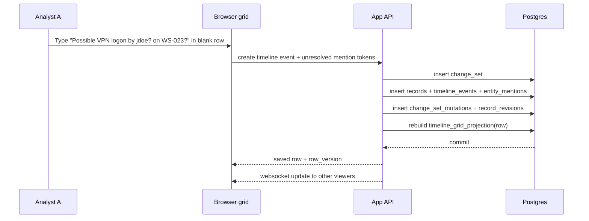
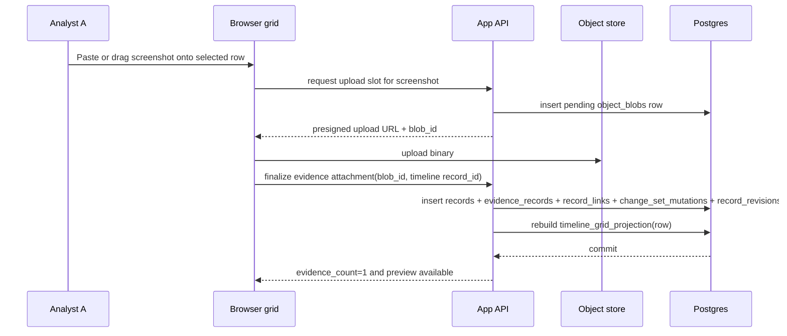
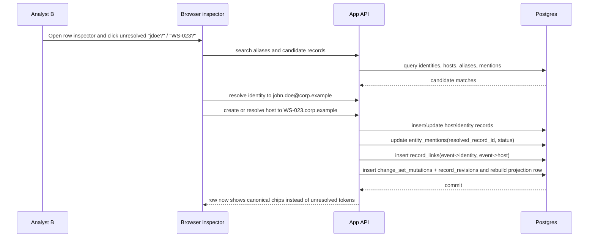
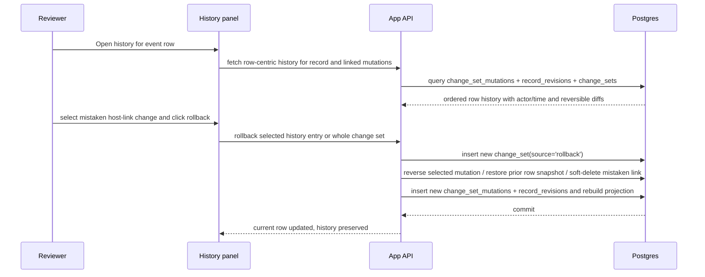

# Appendix D: Workflow and UI Illustrations Source Extract

This appendix is **non-normative**.

It preserves the workflow sequence diagrams, UI mockups, and explanatory interaction notes from the exploratory source artifact.

## 8. Record lifecycle and IR workflow model

### Lifecycle

A record typically moves through:

**rough capture → enriched → linked → reviewed → superseded / rolled back**

The important point is that the rough capture remains recoverable. Normalization adds structure; it does not erase the original analyst input.

### 1. Rapid creation of a timeline event



Concrete scenario: Analyst A creates a row with a nullable `occurred_at`, summary text, and raw mention tokens `jdoe?` and `WS-023?`. The system does **not** block on missing canonical identity/host.

### 2. Attachment of a screenshot or other evidence object



Important design choice: upload is **two-step** so incomplete uploads do not leave fake evidence attached. Abandoned pending blobs are cleaned up later. The same evidence model also supports requested-but-not-yet-received evidence: an evidence record can be created in `requested` or `pending_receipt` state with no blob, then later advanced to `received` or `available` as custody events and uploads occur.

### 3. Later linkage of the event to canonical host and identity records



This is the core progressive-structuring workflow. The timeline row stays fast to create, but later becomes relationally useful.

### 4. Review, version inspection, and rollback of a mistaken edit



#### Reviewer UI rollback granularity

The reviewer UI MUST remain row-centric, but it MUST NOT be limited to whole-row restore. In MVP, the history panel MUST show actor, timestamp, operation, and a diff summary expanded to changed field/link/mention/tag/evidence-entry units.

The reviewer UI MUST allow rollback of a single logical history entry when that entry maps to one reversible mutation target, including one scalar field edit, one link add/remove, one tag add/remove, one mention resolve/dismiss/restore, one auto-resolution or auto-match, or one evidence attach/detach association. The UI MUST also expose whole-row restore and whole-change-set rollback as secondary actions for multi-target or destructive changes.

Arbitrary user-selected subsets of fields from historical snapshots are not required in MVP. Rollback remains a new attributed action by the reviewer, not a hidden database revert.

### Bulk paste/import from existing spreadsheet or clipboard

- **Clipboard paste is day-one functionality.**\
  Pasting TSV/CSV into the timeline sheet should create/update multiple rows starting from the selected cell.
- Known columns map directly.
- Unknown columns are stored into `raw_capture.import_columns`.
- Host/identity text from pasted cells follows the same `entity_binding_mode` contract as interactive edits: `mention_origin` fields create unresolved `entity_mentions`; `entity_origin` fields create or upsert host/identity records.
- Repeated identical mention values across different source rows remain separate mention rows with distinct source locators.
- The entire paste is one visible `change_set`, with ordered mutation entries and one row revision per affected record.

For **full XLSX import**, use the same mapping engine. The initial import assistant should prioritize sheets or regions that map to timeline, systems/hosts, accounts/identities, indicators, evidence tracker, and VERIS-like summaries when present. Unknown columns should land in `raw_capture` or `custom_attrs`, not be dropped. Mapping contracts, not sheet labels alone, decide whether a source column is `mention_origin` or `entity_origin`. It can still be a thin import assistant rather than a heavyweight ETL feature. Full XLSX import MUST NOT auto-resolve host/account aliases; imported tokens remain unresolved mentions until an analyst resolves them explicitly.

### Auto-resolution policy for typed host/account strings

This revision resolves the MVP policy for alias auto-resolution.

The system MAY auto-resolve a typed host or identity token to an existing alias only in interactive mention-capture flows, and only when `auto_resolution_confidence = 100`.

`auto_resolution_confidence = 100` applies only when all of the following are true:

- the edited cell determines the expected entity type (`Hosts` => `host`, `Identities` => `identity`) and candidate matching is limited to that type within the same incident;
- the token matches exactly one existing alias after deterministic normalization limited to case-folding plus whitespace collapse;
- the raw token contains no explicit uncertainty marker such as `?`, `~`, `maybe`, or `prob`;
- the target record is not soft-deleted, merged, retired, or disabled;
- no competing candidate record remains after normalization.

Anything below `100` MAY drive ranking or suggestions, but MUST NOT create or update `record_links`, set `entity_mentions.resolved_record_id`, or otherwise mutate resolution state without explicit analyst selection.

To preserve raw analyst input, auto-resolution MUST still insert an `entity_mentions` row for the typed token with `resolution_status='resolved'` and `resolved_record_id` set to the chosen record. The corresponding `record_links` row MUST use `provenance='auto_match'` and `confidence=100`.

Auto-resolution MAY occur only in:

- inline commit of a Timeline `Hosts` or `Identities` cell;
- interactive clipboard paste into those same relationship cells, where the resulting auto-resolutions are part of the same visible `change_set`.

Auto-resolution MUST NOT occur in:

- the inspector's explicit resolve flow;
- Hosts/Identities alias-edit cells;
- merge/dedupe workflows;
- full XLSX import;
- background jobs or async enrichment/cleanup;
- any workflow that would create a new canonical host/identity or edit alias rows without explicit analyst confirmation.

The UI MUST NOT silently auto-resolve. When auto-resolution occurs, the current sheet MUST show an immediate non-modal disclosure on the same surface that includes the raw token, the canonical target, the matched alias text, and direct `Undo` and `Review` actions. For batch paste, the disclosure MUST also include the number of tokens auto-resolved in that visible change set. The resolved chip or cell MUST remain inspectably marked as auto-resolved, and row history MUST preserve the raw token, matched alias text, `confidence=100`, and mutation source.

`Undo` from the immediate disclosure MUST restore the raw unresolved token, remove the auto-created link, and preserve focus and scroll position. After the immediate disclosure expires, the user MUST still be able to choose `Revert to unresolved` from the chip context or row history in no more than two actions. That later correction is a new attributed revision; it MUST NOT rewrite history.

### Unknown or ambiguous fields

Unknown values must remain valid:

- `occurred_at` may be null.
- summary may be null if another field or attachment exists.
- host/account text may remain unresolved.
- confidence can be left unset.
- details may be plain text without structure.

### End-to-end attribution

Every step above writes the actor’s `user_id` into:

- current record envelope,
- `change_sets.actor_user_id`,
- `record_revisions`,
- link and tag creation metadata,
- object blob and evidence metadata.


## 9. UI concepts focused on preserving the spreadsheet feel

The UI should feel like a **workbook**, but the sheets are **saved views over projections**, not separate storage silos. The built-in tabs are intentionally few: Timeline, Hosts, Identities, Evidence, and Notes. Additional surfaces such as Indicators, Assessments, ATT&CK, or VERIS should start as contract-backed system views over those projections or related overlay projections. They only become first-class tabs if usage justifies it.

### UI concept 1: Primary workbook-style timeline view

```text
+------------------------------------------------------------------------------------------------------------------+
| Incident IR-2026-017 | Timeline* | Hosts | Identities | Evidence | Notes | [Search / filter] | A  B  R        |
+------------------------------------------------------------------------------------------------------------------+
| View: [Capture order v]  Sort: [Time v]  Group: [None v]  Filters: [Unresolved] [Has evidence] [Tag: rough]    |
+----+----------+-------------------------------+------------------+------------------+------+-----------+---------+
| #  | Time     | Summary                       | Hosts            | Identities       | Evd. | Tags      | Edited  |
+----+----------+-------------------------------+------------------+------------------+------+-----------+---------+
| 81 | 09:14?   | Possible VPN logon ...        | WS-023?          | jdoe?            | 1    | rough     | B 2m    |
|    |          | screenshot attached           |                  |                  |      |           |         |
| 82 |          | [type here…]                  |                  |                  |      |           |         |
+----+----------+-------------------------------+------------------+------------------+------+-----------+---------+
| Status: Saved | Analyst B is on row 81 | Enter=new row | Tab=next cell | Ctrl+V=paste | Space=preview |
+------------------------------------------------------------------------------------------------------------------+
```

#### Screen regions

- **Top bar**: incident identity, workbook tabs, search, presence avatars.
- **View bar**: saved view selector, sort, group, filter chips.
- **Grid**: primary work surface.
- **Status bar**: save/conflict state and keyboard hints.
- **Inspector drawer**: collapsible on the right, not shown above.

#### Inline editing behavior

- Selecting a cell and typing edits it immediately.
- Enter commits and moves vertically; Tab commits and moves horizontally.
- Typing in the blank row creates a real record as soon as there is one non-empty value.
- Cells with relationship semantics still accept raw typing; they do not force picker-first interaction.

#### Keyboard-first interactions

- Arrow keys move selection.
- Enter/Shift+Enter navigate rows.
- `Ctrl+V` pastes multi-cell blocks.
- `Ctrl+K` opens quick link/resolve for the current cell.
- `Space` previews linked evidence for the selected row.
- `Alt+H` opens history for the selected row.

#### Copy/paste and bulk editing

- Paste TSV/CSV directly from Excel into the visible grid.
- If the paste range exceeds existing rows, new rows are created automatically.
- Fill-down and multi-row tag assignment are supported from the selection model.
- Bulk edits are mutation batches, not hidden macros.

#### Sorting / filtering / grouping

- Column header click sorts.
- Filter chips apply without leaving the sheet.
- Timeline grouping is a presentation-only transform over the current filtered result set. It MUST NOT create, delete, or mutate source records, projection rows, links, or tags.
- Timeline sheets MUST support `Group: None` plus exactly one active grouping key in MVP. The active key MUST be stored as a stable contract value in `saved_views.layout_json.group_by_key`, not as a visible label.
- Allowed grouping keys for timeline sheets are:
  - `timeline.occurred_day` derived from `occurred_at` at day granularity
  - `timeline.recorded_day` derived from `recorded_at` at day granularity
  - `timeline.capture_state`
  - `timeline.has_evidence` where `evidence_count > 0`
  - `timeline.has_unresolved_mentions` where at least one `entity_mentions` row for the source record has `resolution_status='unresolved'`
- Grouping keys MUST be scalar, contract-backed values. Free-text columns and multi-valued relationship cells such as Hosts, Identities, and Tags are not eligible grouping keys in timeline sheets.
- Group order MUST be deterministic:
  - `timeline.occurred_day` and `timeline.recorded_day` sort by bucket value descending, with null buckets last
  - `timeline.capture_state` sorts `rough`, `enriched`, `reviewed`, `superseded`
  - `timeline.has_evidence` and `timeline.has_unresolved_mentions` sort `true` then `false`
  - the current row sort applies unchanged within each group
- The outline affordance for grouped timeline sheets is limited to one derived group-header level with these operations: `expand group`, `collapse group`, `expand all`, `collapse all`, and `ungroup` via `Group: None`.
- Group headers are derived UI rows only. They MUST NOT have a `record_id`, MUST NOT accept inline edits or paste targets, MUST NOT appear in exports or revision history, and MUST NOT become mutation targets.
- Sorting and filtering apply to underlying rows first; grouping is computed second. Edits, conflicts, autosave, and rollback remain row-based and target only underlying records by `record_id` and `base_row_version`.
- A row MAY move between visible groups only when an edit changes the grouped field value. Dragging a row between groups MUST NOT be a write path.
- Transient expand/collapse state SHOULD remain client-local and MUST NOT be broadcast as collaborative state. Saved views MAY persist the default grouping key, but not another user’s live open/closed state.
- Timeline grouping non-goals:
  - manual row-range grouping or ungrouping
  - nested outline depth greater than `1`
  - subtotal, summary, or spacer rows inserted into the grid
  - pivot-style aggregation or chart-like rollups inside the timeline sheet
  - grouping by formulas, ad hoc expressions, or visible labels
  - merged cells, indent-based hierarchy, or parent/child tree rows
- Views are saveable and shareable within the incident.

#### Quick-add patterns

- Blank trailing row.
- Keyboard shortcut for new row.
- Paste image from clipboard onto selected row to create or attach evidence.
- Typing into Hosts/Identities cells creates unresolved mentions if nothing matches.

#### Creating and surfacing links

Linked entities surface as chips in cells:

- **resolved canonical link**: plain chip; auto-resolved links add an inspectable auto-match marker
- **unresolved mention**: dotted/outlined chip with raw text
- **ambiguous**: warning badge on chip

When an inline edit or interactive paste auto-resolves a token, the sheet shows a same-surface non-modal disclosure with `Undo` and `Review`.

That lets the grid display relational state without making the user think about join tables.

#### Evidence access without breaking flow

The Evidence column shows a count and preview affordance. Clicking or pressing Space opens a bottom or side preview, not a separate page. Screenshot attachment is drag/drop or clipboard-paste onto the current row.

#### Authorship and version history with low friction

- Row `Edited` column shows last editor and relative time.
- Cell hover can show “last changed by B at 10:14”.
- Full history lives in the inspector, one keypress away.

#### Multi-user presence

Presence is ambient:

- sheet-level avatars in header,
- row-level badge in gutter,
- same-cell indicator when relevant.

No locking banners for normal work.

#### What should feel like Excel vs intentionally differ

**Should feel like Excel:**

- tabular grid
- direct typing
- paste
- fill-down
- keyboard navigation
- flexible sorting/filtering

**Should intentionally differ:**

- relationship cells render chips, not raw comma-separated strings forever
- evidence is attached objects, not file paths in cells
- history is built-in
- formulas/macros/merged cells are not part of the model

#### How denormalized timeline views are composed

The timeline sheet reads from `timeline_grid_projection`. The grid does not query raw joins on every paint.

| Timeline column | Read from projection                           | Write-back behavior                                                                                                                                                                                      |
| --------------- | ---------------------------------------------- | -------------------------------------------------------------------------------------------------------------------------------------------------------------------------------------------------------- |
| Time            | `occurred_at`                                  | update `timeline_events.occurred_at`                                                                                                                                                                     |
| Summary         | `summary`                                      | update `timeline_events.summary/details`                                                                                                                                                                 |
| Hosts           | `host_labels + unresolved_host_tokens`         | interactive unique exact normalized alias match → insert resolved `entity_mentions` + create `record_links` (`provenance='auto_match'`, `confidence=100`); otherwise insert unresolved `entity_mentions` |
| Identities      | `identity_labels + unresolved_identity_tokens` | interactive unique exact normalized alias match → insert resolved `entity_mentions` + create `record_links` (`provenance='auto_match'`, `confidence=100`); otherwise insert unresolved `entity_mentions` |
| Evidence        | `evidence_count`                               | create `object_blob` + `evidence_record` + `record_link`                                                                                                                                                 |
| Tags            | `tag_names`                                    | upsert `tags` + `record_tags`                                                                                                                                                                            |

That is the critical design mechanism: **denormalized reads, intent-aware writes**. The same rule applies to every system view and export surface: reads may be denormalized, but write-back and derivation semantics come from explicit contracts, not visible labels.

Each visible grid row must stay bound to `record_id` and `row_version` from the projection even when the user sorts, filters, or groups the sheet. The visible row number is presentation only; it is never a mutation target.

### UI concept 2: Entity/evidence workbook view

```text
+------------------------------------------------------------------------------------------------------------------+
| Incident IR-2026-017 | Timeline | Hosts* | Identities | Evidence | Notes                                       |
+------------------------------------------------------------------------------------------------------------------+
| View: [All hosts v]  Filters: [State: stub] [Linked events > 0] [Has unresolved aliases]                       |
+----+------------------------+-------------------------+------------+---------------+----------+----------------+
| #  | Host                   | Aliases                 | State      | Linked Events | Evidence | Last Updated   |
+----+------------------------+-------------------------+------------+---------------+----------+----------------+
| 14 | WS-023.corp.example    | WS-023 ; ws023         | canonical  | 7             | 3        | B 2m           |
| 15 | WS-023?                | observed from row 81   | stub       | 1             | 0        | A 15m          |
+----+------------------------+-------------------------+------------+---------------+----------+----------------+
| Split toggle: [Hosts] [Identities] [Evidence]                                                             [>]   |
+------------------------------------------------------------------------------------------------------------------+
```

#### Screen regions and tab model

This is still workbook-shaped. The “Hosts”, “Identities”, and “Evidence” tabs are peer sheets, each backed by its own projection table.

- Hosts sheet → `host_grid_projection`
- Identities sheet → `identity_grid_projection`
- Evidence sheet → `evidence_grid_projection`
- Notes sheet → `artifact_grid_projection WHERE artifact_type='note'`
- Indicators, Assessments, ATT&CK, or VERIS views → contract-backed system views keyed by `view_schema_id`, reusing these projections or dedicated overlay projections as needed

#### Inline editing behavior

- Canonical fields like `display_name`, `hostname`, `upn`, `title` are inline-editable.
- Alias cells behave like chip editors: type to add alias, Backspace to remove alias.
- Relationship-derived columns such as `Linked Events` are read-only and clickable.

#### Keyboard, paste, and bulk editing

- Paste a column of hostnames directly into Hosts.
- Pasting into the aliases column creates alias rows.
- Multi-row state changes (`stub -> canonical`) can be applied to selection.
- Bulk merge is **not** a grid action in MVP; it belongs in the inspector because it is destructive.

#### Sorting/filtering/grouping

- Sort by linked event count, last updated, or state.
- Filter to stub records needing cleanup.
- Saved views like “Unresolved hosts” or “High-value identities” matter more here than arbitrary sheets.

#### Quick-add patterns

- Create stub host/identity directly from pasted names.
- Convert unresolved mentions into a selected host/identity from within the inspector without leaving the current grid context.
- Evidence sheet allows drag/drop upload directly into the sheet as well as attachment from a row.

#### Links and evidence surfacing

Clicking `Linked Events` filters the Timeline sheet to the related rows rather than taking the user to a separate module. Evidence counts and previews are available inline.

#### Authorship, history, and presence

Same model as Timeline: last editor column, history in inspector, row presence in gutter.

#### Excel-like vs deliberate differences

This should feel like a workbook tab with sortable rows. It should **not** feel like a CMDB or identity management tool. The deliberate difference from Excel is that a host row is a canonical record with aliases and links, not just a text string on a tab.

#### How denormalized entity/evidence views are composed

`host_grid_projection` can aggregate:

- canonical host fields from `hosts`
- aliases from `entity_aliases`
- linked event counts from `record_links`
- evidence counts from `record_links` to evidence records
- tag names and last editor from `records` / `record_tags`

The grid remains denormalized; writes still go back to source tables. Type chips, icons, and evidence labels should resolve through registry keys such as `host_type_key` and `evidence_type_key`, not hard-coded display strings.

### UI concept 3: Detail / relationship inspector

```text
+-------------------------------- Inspector: Timeline row #81 --------------------------------+
| Summary                                                                 [History] [Links]    |
| Possible VPN logon by jdoe? on WS-023?                                                  A   |
|---------------------------------------------------------------------------------------------|
| Tabs: [Details] [Relationships] [Evidence] [History]                                       |
|                                                                                             |
| Relationships                                                                               |
|   Hosts                                                                                     |
|   - WS-023?                    [Resolve] [Create host] [Dismiss]                            |
|   - WS-032.corp.example        linked by B 2m ago                                           |
|                                                                                             |
|   Identities                                                                                |
|   - jdoe?                      [Resolve] [Create identity]                                  |
|   - john.doe@corp.example      linked by B 2m ago                                           |
|                                                                                             |
| Evidence                                                                                    |
|   [signin.png thumbnail]  screenshot  184 KB  uploaded by A 15m ago                         |
|   [Open preview] [Download]                                                                 |
|                                                                                             |
| History                                                                                     |
|   Rev 5  Reviewer 10:22  Rolled back host link WS-032 -> unresolved                         |
|   Rev 4  B        10:18  Linked WS-032.corp.example                                         |
|   Rev 3  B        10:17  Linked john.doe@corp.example                                       |
|   Rev 2  A        10:03  Attached signin.png                                                |
|   Rev 1  A        10:02  Created event                                                      |
+---------------------------------------------------------------------------------------------+
```

#### Screen regions

- Header with current record identity and quick tabs.
- Body tabs for details, relationships, evidence, history.
- Actions stay in-panel; the main grid remains visible.

#### Inline editing and linking

The inspector is where deeper structure happens:

- resolve unresolved mentions,
- create stub/canonical host or identity,
- add notes/artifacts,
- inspect linked evidence,
- run rollback.

This is enrichment, not primary capture.

#### Keyboard-first behavior

- `Ctrl+K` opens relationship resolution anchored to the current chip.
- `Esc` closes the inspector and returns focus to the previous cell.
- Arrow navigation in the grid updates the inspector contents live if pinned.

#### Copy/paste and bulk actions

The inspector is not the main paste target, but it should support copying hashes, filenames, aliases, and structured details. Bulk resolution actions can be launched from selected rows but executed here.

#### How links are created and surfaced

The inspector shows both:

- **raw mention lineage** (“A typed `WS-023?` at row creation”), and
- **current canonical links**.

That distinction is important. It prevents later cleanup from erasing what was actually observed during the incident.

#### Authorship, version history, rollback

The history tab is the reviewer’s primary tool. It shows:

- actor,
- timestamp,
- operation,
- diff summary expanded to changed field/link/mention/tag/evidence-entry units,
- rollback actions for a single logical history entry, whole-row restore, and whole-change-set rollback.

Arbitrary user-selected subsets of fields from historical snapshots are not required in MVP. Rollback should create a new revision; history remains intact.

#### Multi-user presence and modal avoidance

If another analyst is editing the same record, the inspector shows that inline, but does not lock them out. This panel should be a drawer, not a blocking modal.

#### Why this does not become a rigid case-management app

Because the inspector is optional for common work. Analysts can live in the grid for most of the incident and only open the inspector when they need structure, history, or relationship cleanup.

#### Why this does not become an uncontrolled spreadsheet clone

Because structure lives underneath the sheet:

- mentions are first-class,
- links are typed,
- evidence is attached objects,
- history is immutable,
- tabs are views over source records, not independent data islands.
